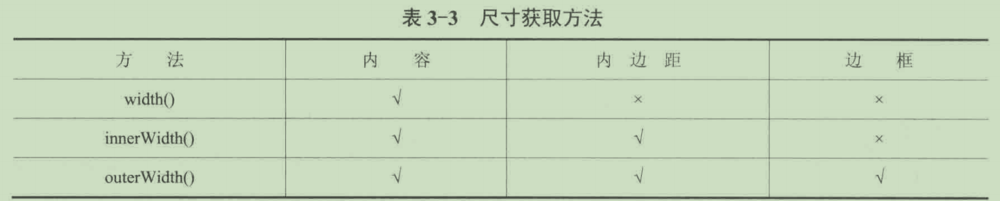

# 3.10 jQuery

## 【真题387】下列选项中，能通过jQuery的方式获得代码中单选框选中值的是

```
<input type="radio" name="gender" value="1" />
<input type="radio" name="gender" value="2" />
```

A. $(":\radio:checked").val()
B. $(":radio").val()
C. S("[name=gender]:checked").val()
D. $("[name=gender]"').val()

- 答案:AC。
- :radio选择器能匹配单选框元素,
-  :checked选择器能匹配处于选中状态的元素，
- 方括号内的选择器能够匹配name属性为“gender”的元素，
  - 也就是两个单选框，

## 【真题388】 jQuery有哪些特色?

- 答案:
- jQuery是一套JavaScript类库。
- 它具有如下特色:
- (1）强大的兼容处理,
  - 它修复了浏览器之间的差异。
- (2）简洁的链式语法，
  - 结合函数式编程技巧
    - 就能用少量的代码完成一系列功能。
- (3）花式元素操作法，
  - 可对文档中的元素进行查找、读写属性、控制样式、注册事件等操作。
- (4）一套实用的工具，
  - 可实现 Ajax、动画、浏览器嗅探、函数式编程等功能。
- (5）良好的可扩展性，
  - 吸引了众多开发者为其设计插件，
  - 从而建立起了成熟的生态圈。

## 【真题389】在iOuery中有哪些方法可以删除元素?

- 答案:
- 有4个方法可以用来从文档中删除元素，
  - unwrap()、
  - empty()、
  - detach()
  - remove()。
- unwrap()可删除目标元素的父元素;
- empty()用于删除目标元素的所有子元素
  - (包括子元素中的内容、
  - 注册的事件
  - 关联的数据);
- detach()和remove()都用于删除目标元素，
  - 前者不会删除目标元素上注册的事件和关联的数据，
  - 后者会一并删除。

## 【真题390】在下面的代码中，使用jQuery类库的方法读取元素的尺寸，

其中result1的值为 px,

result2的值为 px,

result3的值为 pX。

```
<style>
    #container {
        width: 100px;
        height: 100px;
        padding: 10px;
        border: 1px solid #000;
    }
</style>
<div id="container"></div>
<script>
    let $container = $("#container");
    let result1 = $container.width();
    let result2 = $container.innerWidth();
    var result3 = $container.outerWidth();
</script>
```

- 答案:100、120、122。
- 上面代码中的3个 jQuery方法都能获取元素的宽度，
  - 但它们的计算方式不同，
- 具体如表3-3所列,打勾表示包含，打叉表示不包含。



## 【真题391】如何用jQuery 来创建插件?

- 答案:
- 当创建一个jQuery插件时，
  - 本质上是在扩展jQuery类库。
- 开发 jQuery插件
  - 只要在$.fn （jQuery对象的原型）上分配一个插件名，
  - 再指向一个新的函数，
- 用即时函数（IIFE)把jQuery 映射成美元符号($)。
  - 避免$与其它JavaScript类库发生冲突，
  - 隔离插件中的变量，
    - 防止它们污染其他作用域，
- 具体写法如下所示。

```
(function ($) {
    $.fn.customPlugin = function () {

    };
})(jQuery);

//调用插件
$("#container").customPlugin();
```

## 【真题392】 jQuery UI是什么?

- 答案:
- jQuery只提供了DOM、CSS、事件处理和 Ajax等底层功能。
- jQuery UI在jQuery类库的基础上，
  - 提供了一套用户界面组件，
    - 例如日期选择器、对话框、进度条等;
  - 内置了常用的交互，
    - 例如拖曳、排序、改变大小等;
  - 添加了一些新的动画效果，
    - 例如颜色变换、隐藏、显示等。

## 【真题393】 jQuery中被誉为工厂函数的是

A. ready()
B. jQuery()
C．$()
D. function()

- 答案:BC。
- jQuery的工厂函数是jQuery()，
  - 而该函数还有一个别名，
    - 也就是“$”，
    - 用一个美元符号来代替函数名称。

## 【真题394】 jQuery 包含的选择器有

A．属性选择器
B.表单选择器
C.ID选择器
D．类选择器

- 答案:ABCD。
- 传统的CSS选择器
  - （例如ACD 中的选择器)，
- 独有的选择器，
  - 过滤选择器
  - 表单选择器

## 【真题395】用jOuery的多种方式获取选择框中选中项的value属性值。

```
<select id="name">
  <option value="1">strick</option>
  <option value="2">jane</option>
  <option value="3">freedom</option>
  <option value="4">kevin</option>
</select>

```

- 答案:有3种获取方式，
- 第一种是直接调用val()方法;
- 第二种是使用选择器:selected;
- 第三种是借助Select元素的selectedIndex属性查找选中项，
  - 再读取它的value属性，
- 具体如下所示。

```
$("#name").val(); // 第一种
$("#name").find("option:selected").val(); // 第二种

let index = $("#name").get(0).selectedIndex; // 第三种
$("#name").find("option:eq(" + index + ")").val();
```

## 【真题396】 在jQuery中，能遍历同辈节点的方法是

A. siblings()
B.closest()
C. children
D. next()

- 答案:AD。
- 同辈节点就是HTML文档中的兄弟元素。
-  siblings()能选取匹配的兄弟元素;
- closest()能选取最先匹配的祖先元素;
- children()能选取匹配的子元素;
- next()能选取后一个匹配的兄弟元素。

## 【真题397】 Zepto和 jQuery有哪些区别?

- 答案:
- Zepto和jQuery都是跨浏览器、专注底层操作的JavaScript库，
- 但两者之间有很多的区别，如下所列:
- (1）Zepto 比 jQuery 轻量，
  - 相当于jQuery 的精简版本。
- (2）Zepto最初定位的是移动端，
  - jQuery是桌面端
- (3) jQuery支持更多的选择器，
  - 像常用的:seleced、:checked等选择器，
  - Zepto都不支持。
- (4)jQuery包含更多的方法，
  - 像innerWidth()、outerWidth()等常用方法，
  - 在Zepto中都没有提供。