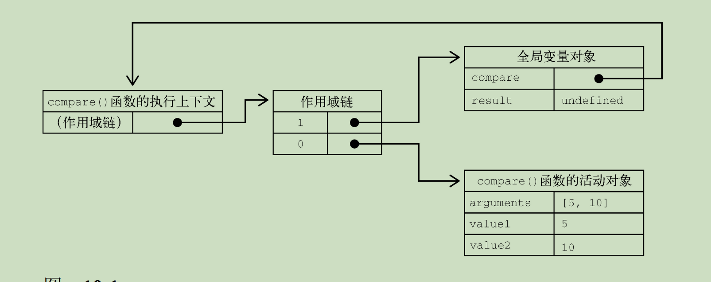
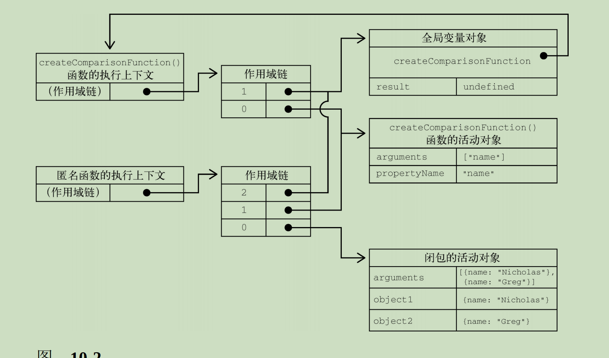

# 第 **10** 章 函数

- 本章内容

  - 函数表达式、函数声明、箭头函数 

  - 默认参数及扩展操作符 

  - 使用函数实现递归 

  - 使用闭包实现私有变量 
- 函数实际上是什么数据类型？
  - 对象
- 每个函数都是什么类型的实例？
  - Function类型
- Function是否有属性和方法？
  - 有
    - 跟其他引用类型一样。

- 因为函数是对象，所以函数名是什么？
  - 指向函数对象的指针，
  - 而且不一定与函数本身紧密绑定。
- 函数通常以什么方式定义？
  - 函数声明的方式

```
function sum (num1, num2) { 
	return num1 + num2;
}
```

- 函数定义最后是否有加分号？
  - 没有
- 另一种定义函数的语法是什么？
  - 函数表达式
- 函数表达式与函数声明是否是等价的？
  - 是

```
let sum = function(num1, num2) { 
	return num1 + num2; 
};
```

- 为什么function关键字后面没有名称？
  - 因为不需要。
    - 这个函数可以通过变量sum来引用
- 为什么这里的函数末尾是有分号的？
  - 因为与任何变量初始化语句一样。 
- 还有一种定义函数的方式，叫作什么？
  - “箭头函数”

```
let sum = (num1, num2) => {
	return num1 + num2; 
};
```

- 最后一种定义函数的方式是使用什么构造函数？
  - Function构造函数。
- 这个构造函数接收什么参数？ 
  - 任意多个字符串参数，
  - 最后一个参数始终会被当成函数体，
  - 而之前的参数都是新函数的参数。

```
let sum = new Function("num1", "num2", "return num1 + num2"); // 不推荐
```

- 为什么不推荐使用这种语法来定义函数？
  - 因为这段代码会被解释两次：
    - 第一次是将它当作常规ECMAScript代码，
    - 第二次是解释传给构造函数的字符串。
  - 这显然会影响性能。
- 这几种实例化函数对象的方式之间是否存在差别？
  - 是
  - 存在微妙但重要的差别

## **10.1** 箭头函数 

- ECMAScript 6新增了使用什么语法定义函数表达式的能力？

  - 胖箭头（=>）语法

- 箭头函数实例化的函数对象与

  正式的函数表达式创建的函数对象行为有什么区别？

  - 相同的

- 任何可以使用函数表达式的地方，是否都可以使用箭头函数？

  - 是

```
let arrowSum = (a, b) => { 
	return a + b; 
};
let functionExpressionSum = function(a, b) { 
	return a + b; 
};
console.log(arrowSum(5, 8)); // 13 console.log(functionExpressionSum(5, 8)); // 13
```

-  箭头函数简洁的语法非常适合什么场景？
  - 嵌入函数的场景

```
let ints = [1, 2, 3]; console.log(ints.map(function(i) { 
	return i + 1; 
})); // [2, 3, 4]

console.log(ints.map((i) => { 
	return i + 1 
})); // [2, 3, 4]
```

-  如果只有一个参数，那是否可以不用括号？
  - 可以
- 只有什么的情况下，才需要使用括号？
  - 没有参数
  - 多个参数 

```
// 以下两种写法都有效 
let double = (x) => { 
	return 2 * x; 
};
let triple = x => { 
	return 3 * x; 
};
// 没有参数需要括号 
let getRandom = () => { 
	return Math.random();
};
// 多个参数需要括号 
let sum = (a, b) => { 
	return a + b; 
};
// 无效的写法： 
let multiply = a, b => { 
	return a * b; 
};
```

- 箭头函数是否可以不用大括号？
  - 可以
  - 但这样会改变函数的行为。
- 使用大括号就说明什么？
  - 包含“函数体”，
    - 可以在一个函数中包含多条语句，
    - 跟常规的函数一样。
- 如果不使用大括号，那么箭头后面能有几行代码？
  - 一行代码
- 省略大括号会隐式返回什么？
  - 这行代码的值

```
// 以下两种写法都有效，而且返回相应的值 
let double = (x) => { 
	return 2 * x; 
};
let triple = (x) => 3 * x; 

// 可以赋值 
let value = {}; 

let setName = (x) => x.name = "Matt"; 

setName(value); 

console.log(value.name); // "Matt"

// 无效的写法： 
let multiply = (a, b) => return a * b;
```

- 箭头函数不能使用什么？
  - arguments
  - super
  - new.target
- 箭头函是否能用作构造函数？
  - 不能
- 箭头函数是否有prototype属性？
  - 没有

## **10.2** 函数名

- 函数名是否跟

  包含对象指针的变量 

  具有相同的行为？

  - 是
  - 因为函数名就是指向函数的指针

- 一个函数是否可以有多个名称？
  - 可以

```
function sum(num1, num2) {
	return num1 + num2; 
}
console.log(sum(10, 10)); // 20 

let anotherSum = sum; 
console.log(anotherSum(10, 10)); // 20 

sum = null;
console.log(anotherSum(10, 10)); // 20
```

- 使用不带括号的函数名会访问什么？

  - 函数指针，
  - 而不会执行函数。

- anotherSum和sum是否指向同一个函数？

  - 是

- ECMAScript 6的所有函数对象都会暴露一个什么属性？

  - 一个只读的name属性，

- name属性保存什么？ 

  - 一个函数标识符，
    - 一个字符串化的变量名。

- 如果函数没有名称，name属性会显示什么？

  - 空字符串

- 如果它是使用Function构造函数创建的

  则name属性会标识成什么？

  - "anonymous"

```
function foo() {} 
let bar = function() {}; 
let baz = () => {};

console.log(foo.name); // foo 
console.log(bar.name); // bar 
console.log(baz.name); // baz 

console.log((() => {}).name); //（空字符串）

console.log((new Function()).name); // anonymous
```

- 如果函数是一个获取函数、设置函数、使用bind()实例化，

  那么name属性会保存什么？

  - 标识符前面会加上一个前缀：

```
function foo() {}

console.log(foo.bind(null).name); // bound foo 

let dog = { 
	years: 1, 
	get age() { 
		return this.years; 
	},
	set age(newAge) { 
		this.years = newAge; 
	}
}

let propertyDescriptor = Object.getOwnPropertyDescriptor(dog, 'age'); 

console.log(propertyDescriptor.get.name); // get age

console.log(propertyDescriptor.set.name); // set age
```

## **10.3** 理解参数

- ECMAScript函数是否关心传入的参数个数？

  - 不关心

- ECMAScript函数是否关心这些参数的数据类型？

  - 不关心

- 定义函数时要接收两个参数，

  是否意味着调用时就传两个参数？

  - 否

- 如果传一个、三个，甚至一个也不传参数，解释器是否会报错？
  - 不会 

- 为什么会这样？

  - 因为ECMAScript函数的参数在内部表现为一个数组。

  - 函数被调用时总会接收一个数组，

    但函数并不关心这个数组中包含什么。

    - 如果数组中什么也没有，那没问题；
    - 如果数组的元素超出了要求，那也没问题。

- 在使用function关键字定义（非箭头）函数时，

  可以在函数内部访问什么对象，

  从中取得传进来的每个参数值？

  - arguments对象

- arguments对象是一个什么对象？
  - 类数组对象
    - （但不是Array的实例）
  
- 可以使用什么语法访问arguments对象的元素？
  - 中括号语法
    - （第一个参数是arguments[0]，
    - 第二个参数是arguments[1]）。

```
function sayHi(name, message) { 
	console.log("Hello " + name + ", " + message);
}
```

- 可以通过什么取得name参数值？
  - arguments[0]
- 是否可以把函数重写成不声明参数？
  - 可以

```
function sayHi() { 
	console.log("Hello " + arguments[0] + ", " + arguments[1]); 
}
```

- ECMAScript函数的参数是否是必须写出来的？

  - 不是

- 在ECMAScript中的命名参数是否会创建

  让之后的调用

  必须匹配的函数签名？为什么？

  - 不会
  - 因为根本不存在验证命名参数的机制。

- 如何确定传进来多少个参数？

  - 可以访问arguments.length属性。 

```
function howManyArgs() { 	
	console.log(arguments.length);
}
howManyArgs("string", 45); // 2 
howManyArgs(); // 0 
howManyArgs(12); // 1
```

```
function doAdd() { 
	if (arguments.length === 1) { 
		console.log(arguments[0] + 10); 
	} else if (arguments.length === 2) { 
		console.log(arguments[0] + arguments[1]); 
	}
}
doAdd(10); // 20 
doAdd(30, 20); // 50
```

- arguments对象是否可以跟命名参数一起使用？
  - 可以

```
function doAdd(num1, num2) { 
	if (arguments.length === 1) { 
		console.log(num1 + 10); 
	} else if (arguments.length === 2) { 
		console.log(arguments[0] + num2); 
	}
}
```

- arguments的值是否会与对应的命名参数同步？
  - 是

```
function doAdd(num1, num2) {
	arguments[1] = 10;
    console.log(arguments[0] + num2); 
}
```

- num2是否也会修改值？

  - 会
  - 因为arguments对象的值会自动同步到对应的命名参数，
  - 因此两者的值都是10。

- num2和arguments[1]是否访问同一个内存地址？

  - 不是
  - 它们在内存中是分开的，只不过会保持同步而已。

- 如果只传了一个参数，然后把arguments[1]设置为某个值，

  那么 这个值是否会反映到第二个命名参数？

  - 不会

  - 因为arguments对象的长度是根据

    传入的参数个数确定的

    - 而非定义函数时给出的命名参数个数

- 对于命名参数而言，

  如果调用函数时没有传这个参数，

  那么它的值就是什么？

  - undefined

  - 类似于定义了变量而没有初始化。

- 严格模式下，arguments[1]赋值是否会影响num2的值？

  - 不会

- 严格模式下，在函数中尝试重写arguments对象会发生什么？

  - 导致语法错误。（代码也不会执行。） 

### 箭头函数中的参数 

- 如果函数是使用箭头语法定义的，

  那么传给函数的参数是否能使用arguments关键字访问？

  - 不能

  - 只能通过定义的命名参数访问。

```
function foo() { 
	console.log(arguments[0]);
}

foo(5); // 5 

let bar = () => { 
	console.log(arguments[0]);
};

bar(5);
// ReferenceError: arguments is not defined
```

- 如何把arguments对象提供给箭头函数？
  - 在包装函数中实现

```
function foo() { 

	let bar = () => { 
		console.log(arguments[0]); // 5
	};
	
	bar();
}

foo(5);
```

- 注意 ECMAScript中的所有参数都怎么传递的？
  - 按值传递的
- 是否可能按引用传递参数？
  - 不可能
- 如果把对象作为参数传递，那么传递的值是什么？
  - 这个对象的引用。

## **10.4** 没有重载

- 什么是签名？
  - （接收参数的类型和数量）
- ECMAScript函数是否有签名？为什么？
  - 没有
  - 因为参数是由包含零个或多个值的数组表示的。
- ECMAScript函数是否有重载？为什么？
  - 没有
  - 没有函数签名，自然也就没有重载。 

- 如果在ECMAScript中定义了两个同名函数，

  则会发生什么？

  - 后定义的会覆盖先定义的。 

```
function addSomeNumber(num) { 
	return num + 100; 
}
function addSomeNumber(num) { 
	return num + 200; 
}
let result = addSomeNumber(100); // 300
```

```
let addSomeNumber = function(num) { 
	return num + 100; 
};
addSomeNumber = function(num) {
	return num + 200; 
};
let result = addSomeNumber(100); // 300
```

- 如何模拟函数重载？

  - 可以通过检查参数的类型和数量，

  - 然后分别执行不同的逻辑

## **10.5** 默认参数值 

- ECMAScript 6之后是否支持显式定义默认参数？
  - 是
- 如何为参数赋一个默认值？
  - 只要在函数定义中的参数后面用=就可以

```
function makeKing(name = 'Henry') {
	return `King ${name} VIII`; 
}
console.log(makeKing('Louis')); // 'King Louis VIII' console.log(makeKing()); // 'King Henry VIII'
```

- 给参数传undefined相当于什么？
  - 没有传值，
  - 不过这样可以利用多个独立的默认值： 

```
function makeKing(name = 'Henry', numerals = 'VIII') { 
	return `King ${name} ${numerals}`; 
}
console.log(makeKing()); // 'King Henry VIII' console.log(makeKing('Louis')); // 'King Louis VIII' console.log(makeKing(undefined, 'VI')); // 'King Henry VI'
```

- 在使用默认参数时，

  arguments对象的值是否会反映参数的默认值？

  - 不反映

- arguments对象只反映什么参数？

  - 传给函数的参数。

- 修改命名参数是否会影响arguments对象？

  - 不会

- arguments对象始终以值为准？

  - 调用函数时传入的值

```
function makeKing(name = 'Henry') { 
	name = 'Louis'; 
	return `King ${arguments[0]}`; 
}
console.log(makeKing()); // 'King undefined' console.log(makeKing('Louis')); // 'King Louis'
```

- 默认参数值是否只能使用原始值或对象类型？

  - 不限于
    - 也可以使用调用函数返回的值：
  

```
let romanNumerals = ['I', 'II', 'III', 'IV', 'V', 'VI']; 

let ordinality = 0; 

function getNumerals() { 
	// 每次调用后递增 
	return romanNumerals[ordinality++];
}

function makeKing(name = 'Henry', 
numerals = getNumerals()) { 
	return `King ${name} ${numerals}`; 
}	

console.log(makeKing()); // 'King Henry I' 

console.log(makeKing('Louis', 'XVI')); // 'King Louis XVI' 

console.log(makeKing()); // 'King Henry II' 

console.log(makeKing()); // 'King Henry III'
```

- 函数的默认参数只有在什么时候才会求值？

  - 函数被调用时

- 函数的默认参数是否会在函数定义时求值？

  - 不会

- 计算默认值的函数只有在什么时候才会被调用？

  - 调用函数

    但未传相应参数时

- 箭头函数是否可以使用默认参数？

  - 可以

- 箭头函数在使用默认参数并且只有一个参数时，

  是否可以省略括号？

  - 不可以 

```
let makeKing = (name = 'Henry') => `King ${name}`; 

console.log(makeKing()); // King Henry
```

### 默认参数作用域与暂时性死区 

- 函数参数是否是在某个作用域中求值的？

  - 是

- 在求值默认参数时是否可以定义对象？

  - 可以

- 是否可以动态调用函数？

  - 可以

- 给多个参数定义默认值

  实际上跟使用什么关键字一样？

  - let关键字顺序声明变量

```
function makeKing(name = 'Henry', numerals = 'VIII') { 
	return `King ${name} ${numerals}`; 
}
console.log(makeKing()); // King Henry VIII
```

- 这里的默认参数会按照什么顺序依次被初始化？
  - 定义它们的顺序

```
function makeKing() { 
	let name = 'Henry'; 
	let numerals = 'VIII';
    return `King ${name} ${numerals}`; 
}
```

- 后定义默认值的参数是否可以引用先定义的参数？
  - 可以
  - 因为参数是按顺序初始化的

```
function makeKing(name = 'Henry', numerals = name) { 	return `King ${name} ${numerals}`; 
}
console.log(makeKing()); // King Henry Henry
```

- 参数初始化顺序遵循什么规则？
  - “暂时性死区”
- 什么是“暂时性死区”？
  - 即前面定义的参数不能引用后面定义的。

```
// 调用时不传第一个参数会报错
function makeKing(name = numerals, numerals = 'VIII') { 
	return `King ${name} ${numerals}`;
}
```

- 参数存在于自己的作用域中，它们是否能引用函数体的作用域？
  - 不能

```
// 调用时不传第二个参数会报错
function makeKing(name = 'Henry', numerals = defaultNumeral) { 
	let defaultNumeral = 'VIII'; 
	return `King ${name} ${numerals}`; 
}
```

## **10.6** 参数扩展与收集 

- ECMAScript 6新增了扩展操作符，

  使用它可以做什么？

  - 操作和组合集合数据

- 扩展操作符最有用的场景就是什么？
  - 函数定义中的参数列表
- 扩展操作符充分利用这门语言的什么特点？
  - 弱类型
  - 参数长度可变
- 扩展操作符可以用于什么？
  - 调用函数时传参
  - 定义函数参数。

### **10.6.1** 扩展参数

- 假设有如下函数定义，它会将所有传入的参数累加起来： 

```
let values = [1, 2, 3, 4]; 
function getSum() { 
	let sum = 0; 
	for (let i = 0; i < arguments.length; ++i) {
    	sum += arguments[i]; 
    }
    return sum; 
}
```

- 对可迭代对象应用扩展操作符，

  并将其作为一个参数传入，会发生什么？

  - 将可迭代对象拆分，

  - 并将迭代返回的每个值单独传入。 

```
console.log(getSum(...values)); // 10
```

- 在对数组使用扩展操作符传参的时候，

  是否可以在其前面或后面再传其他的值？

  为什么？

  - 可以，
  - 因为数组的长度已知

```
console.log(getSum(-1, ...values)); // 9 console.log(getSum(...values, 5)); // 15 console.log(getSum(-1, ...values, 5)); // 14 console.log(getSum(...values, ...[5,6,7])); // 28
```

```
let values = [1,2,3,4] 
function countArguments() { 
	console.log(arguments.length); 
}
countArguments(-1, ...values); // 5 countArguments(...values, 5); // 5 countArguments(-1, ...values, 5); // 6 countArguments(...values, ...[5,6,7]); // 7
```

- 在普通函数和箭头函数中是否可以将扩展操作符用于命名参数？
  - 可以
- 是否可以同时使用默认参数和扩展操作符？
  - 可以

```
function getProduct(a, b, c = 1) { 
	return a * b * c;
}
let getSum = (a, b, c = 0) => {
	return a + b + c; 
}
console.log(getProduct(...[1,2])); // 2 console.log(getProduct(...[1,2,3])); // 6 console.log(getProduct(...[1,2,3,4])); // 6 

console.log(getSum(...[0,1])); // 1 console.log(getSum(...[0,1,2])); // 3 console.log(getSum(...[0,1,2,3])); // 3
```

### **10.6.2** 收集参数

- 如何把不同长度的独立参数组合为一个数组？
  - 使用扩展操作符

```
function getSum(...values) {
	// 顺序累加values中的所有值
    // 初始值的总和为0 
    return values.reduce((x, y) => x + y, 0);
}
console.log(getSum(1,2,3)); // 6
```

- 收集参数的前面如果还有命名参数，则会怎么处理？
  - 只会收集其余的参数；
- 如果没有传入，则会得到一个什么？
  - 空数组。
- 为什么只能把收集参数作为最后一个参数？
  - 因为收集参数的结果可变，所以 

```
// 不可以 
function getProduct(...values, lastValue) {}

// 可以
function ignoreFirst(firstValue, ...values) { 
	console.log(values);
}
ignoreFirst(); // [] 
ignoreFirst(1); // []
ignoreFirst(1,2); // [2] 
ignoreFirst(1,2,3); // [2, 3]
```

- 箭头函数是否支持arguments对象？
  - 不支持
- 箭头函数是否支持收集参数的定义方式？
  - 支持
- 箭头函数如何实现与使用arguments一样的逻辑？

```
let getSum = (...values) => { 
	return values.reduce((x, y) => x + y, 0); 
}
console.log(getSum(1,2,3)); // 6
```

- 使用收集参数是否影响arguments对象？
  - 不影响
- arguments反映什么参数？
  - 调用时传给函数的参数

```
function getSum(...values) { 	

	console.log(arguments.length); // 3 	
    
	console.log(arguments); // [1, 2, 3] 
	
	console.log(values); // [1, 2, 3]
}
console.log(getSum(1,2,3))
```

## **10.7** 函数声明与函数表达式

- 函数声明在什么时候生成函数定义？
  - 在任何代码执行之前
- 函数表达式在什么时候生成函数定义？
  - 代码执行到它那一行

```
// 没问题
console.log(sum(10, 10));

function sum(num1, num2) {
 	return num1 + num2;
}
```

- 为什么以上代码可以正常运行？

  - 因为函数声明会在任何代码执行之前

    先被读取

  - 并添加到执行上下文。

- 这个过程叫作什么？

  - 函数声明提升

- 在执行代码时，JavaScript引擎会怎么处理函数声明？

  - 先执行一遍扫描
  - 把发现的函数声明提升到源代码树的顶部。

- 如果函数定义出现在调用它们的代码之后，引擎会怎么做？

  - 把函数声明提升到顶部

- 如果把前面代码中的函数声明改为等价的函数表达式，

  那么执行的时候就会发生什么？

  - 出错

```
// 会出错
console.log(sum(10, 10));

let sum = function(num1, num2) {
 	return num1 + num2;
};
```

- 代码如果没有执行到函数表达式那一行，

  那么执行上下文中是否有函数的定义？

  - 没有

- 这并是否是因为使用let而导致的？
  - 不是

- 使用var关键字是否会碰到同样的问题？
  - 会

```
console.log(sum(10, 10));

var sum = function(num1, num2) {
 	return num1 + num2;
}
```

- 在使用函数表达式初始化变量时，是否可以给函数一个名称？
  - 可以

```
let sum = function sum() {}
```

## **10.8** 函数作为值

- 函数是否可以用在任何可以使用变量的地方？
  - 可以
  - 因为函数名在ECMAScript中就是变量
- 是否可以把函数作为参数传给另一个函数？
  - 可以
- 是否可以在一个函数中返回另一个函数？
  - 可以

```
function callSomeFunction(someFunction, someArgument) {
	return someFunction(someArgument); 
}
```

- 任何函数都可以像下面这样作为参数传递： 

```
function add10(num) {
	return num + 10;
}

let result1 = callSomeFunction(add10, 10);

console.log(result1); // 20 

function getGreeting(name) {
	return "Hello, " + name; 
}

let result2 = callSomeFunction(getGreeting, "Nicholas"); 

console.log(result2); // "Hello, Nicholas"
```

- 如果是访问函数而不是调用函数，那必须做什么？

  - 不带括号

- 如果有一个包含对象的数组，

  如何按照任意对象属性对数组进行排序？ 

  - 定义一个函数接收两个参数：
    - 两个要比较的值

  - 定义一个根据属性名创建的函数 

```
function createComparisonFunction(propertyName) {

    return function (object1, object2) {

        let value1 = object1[propertyName];

        let value2 = object2[propertyName];

        if (value1 < value2) {
            return -1;
            
        } else if (value1 > value2) {
            return 1;
            
        } else {
            return 0;
        }
    };
}
```

- 如何使用这个函数？

```
let data = [{
    name: "Zachary",
    age: 28
}, {
    name: "Nicholas",
    age: 29
}];

data.sort(createComparisonFunction("name"));

console.log(data[0].name); // Nicholas 

data.sort(createComparisonFunction("age"));

console.log(data[0].name); // Zachary
```

- 默认情况下，sort()方法要对这两个对象执行什么？
  - 执行toString()，
  - 然后再决定它们的顺序，

## **10.9** 函数内部 

- 在ECMAScript 5中，函数内部存在哪两个特殊的对象？
  - arguments
  - this
- ECMAScript 6函数内部又新增了什么属性？
  - new.target 属性

### **10.9.1** **arguments**

- arguments对象是一个什么？
  - 类数组对象
- arguments对象包含什么？
  - 调用函数时传入的所有参数。
- arguments对象只有怎么定义函数时才会有？
  - 以function关键字定义的

- arguments对象主要用于什么？
  - 包含函数参数 

- arguments对象的callee属性是什么？
  - 一个指向arguments对象所在函数的指针

```
function factorial(num) {
    if (num <= 1) {
        return 1;
    } else {
        return num * factorial(num - 1);
    }
}
```

- 这个函数要正确执行就必须保证什么？
  - 函数名是factorial
- 这导致了什么问题？
  - 紧密耦合

- 如何让函数逻辑与函数名解耦？
  - 使用arguments.callee

```
function factorial(num) {
    if (num <= 1) {
        return 1;
    } else {
        return num * arguments.callee(num - 1);
    }
}
```

- 使用arguments.callee的好处是什么？
  - 无论函数叫什么名称，都可以引用正确的函数。

```
let trueFactorial = factorial;

factorial = function () {
    return 0;
};

console.log(trueFactorial(5)); // 120 

console.log(factorial(5)); // 0
```

- 如果不使用arguments.callee，

  那么像上面这样调用trueFactorial()就会返回什么？

  - 0

### **10.9.2** **this** 

- 在标准函数中，this引用的是什么？

  - 把函数当成方法调用的上下文对象

- 如果内部函数没有使用箭头函数定义，

  则this引用的是什么？

  - 执行函数的上下文。

- 如果在全局函数中调用，则this等于什么？

  - 在非严格模式下window
  - 在严格模式下undefined

- 如果作为某个对象的方法调用，则this等于什么？

  - 这个对象

- 匿名函数this是否会绑定到某个对象

  - 不会
    - 非严格模式下this会指向window，

    - 在严格模式下this是undefined。

```
window.color = 'red';

let o = {
    color: 'blue'
};

function sayColor() {
    console.log(this.color);
}

sayColor(); // 'red'

o.sayColor = sayColor; 

o.sayColor(); // 'blue'
```

- 这个this引用哪个对象必须到什么时候才能确定？
  - 函数被调用时
- this值在代码执行的过程中是否可能会变？
  - 是
- 在箭头函数中，this引用的是什么？
  - 定义箭头函数的上下文。

```
window.color = 'red';

let o = {
    color: 'blue'
};

let sayColor = () => console.log(this.color);

sayColor(); // 'red'

o.sayColor = sayColor; 

o.sayColor(); // 'red'
```

- 在对sayColor()的两次调用中，

  为什么this引用的都是window对象，

  - 因为箭头函数是在window上下文中定义的：

-  箭头函数中的this会保留什么上下文？
  - 定义该函数时的上下文

```
function King() {
	 
    this.royaltyName = 'Henry';
    
    // this引用King的实例
    setTimeout(() => 
    	console.log(this.royaltyName), 1000);
}

function Queen() {
	
    this.royaltyName = 'Elizabeth'; 
    
    // this引用window对象 
    setTimeout(function () {
        console.log(this.royaltyName);
    }, 1000);
}

new King(); // Henry 
new Queen(); // undefined
```

### **10.9.3** **caller** 

- ECMAScript 5也会给函数对象上添加一个什么属性？
  - caller
- caller属性引用的是什么？
  - 调用当前函数的函数，
  - 如果是在全局作用域中调用的则为null

```
function outer() {
    inner();
}

function inner() {
    console.log(inner.caller);
}
outer();
```

- 以上代码会显示什么？
  - outer()函数的源代码。
- inner.caller指向什么？
  - outer()
- 如何降低耦合度？
  - 通过arguments.callee.caller来引用同样的值：

```
function outer() {
    inner();
}

function inner() {
    console.log(arguments.callee.caller);
}
outer();
```

- ECMAScript 5访问arguments.callee会发生什么？
  - 在严格模式下
    - 报错
  - 在非严格模式下
    - 始终是undefined
- 为什么？
  - 为了分清arguments.caller和函数的caller
- 严格模式下是否能给函数的caller属性赋值？
  - 不能

### **10.9.4** **new.target**

- ECMAScript中的函数可以作为什么实例化一个新对象？
  - 构造函数
- 如何检测函数是否使用new关键字调用？
  - 使用new.target属性
- 如果函数是正常调用的，则new.target的值是什么？
  - undefined
- 如果是使用new关键字调用的，则new.target将引用什么？
  - 被调用的构造函数

```
function King() {
    if (!new.target) {
        throw 'King must be instantiated using "new"'
    }
    
    console.log('King instantiated using "new"');
}

new King(); // King instantiated using "new" 

King(); 
// Error: King must be instantiated using "new"
```

## **10.10** 函数属性与方法

- 每个函数都有哪两个属性？
  - length
    - 保存函数定义的命名参数的个数，
  - prototype
    - 保存引用类型所有实例方法

```
function sayName(name) {
    console.log(name);
}

function sum(num1, num2) {
    return num1 + num2;
}

function sayHi() {
    console.log("hi");
}
console.log(sayName.length); // 1
console.log(sum.length); // 2 
console.log(sayHi.length); // 0
```

- toString()、valueOf()等方法实际上都保存在哪里？
  - prototype
    - 由所有实例共享。
- 在ECMAScript 5中，prototype属性是否可枚举？
  - 不可枚举
- 使用for-in循环是否会返回prototype属性？
  - 不会

- 函数有哪两个方法？

  - apply()
  - call()

- apply()和call()方法都会以什么值来调用函数？

  - 指定的this值

- apply()和call()方法会设置什么值？

  - 调用函数时

    函数体内this对象的值

- apply()方法接收哪两个参数？

  - 函数内this的值
  - 一个参数数组。

- apply()方法第二个参数可以是什么？

  - Array的实例
  - arguments对象

```
function sum(num1, num2) {
	return num1 + num2; 
}
function callSum1(num1, num2) {
	// 传入arguments对象
    return sum.apply(this, arguments); 
}

function callSum2(num1, num2) {
	// 传入数组 
    return sum.apply(this, [num1, num2]); 
}
console.log(callSum1(10, 10)); // 20
console.log(callSum2(10, 10)); // 20
```

- 在严格模式下，调用函数时如果没有指定上下文对象， 

  则this值是否会指向window？

  - 不会
    - undefined

- 在严格模式下，

  除非使用apply()或call()把函数指定给一个对象，

  否则this的值会变成什么？

  - undefined 

- call()方法第一个参数是什么值？
  - this
  
- call()方法剩下的要传给被调用函数的参数则是怎么传递的？ 
  - 逐个传递的。

```
function sum(num1, num2) {
    return num1 + num2;
}

function callSum(num1, num2) {
    return sum.call(this, num1, num2);
}
console.log(callSum(10, 10)); // 20
```

- 如果想直接传arguments对象或者一个数组，

  那就用什么方法？

  - apply()
  - 否则，就用call()。

- apply()和call()真正强大的地方是什么？

  - 控制函数调用上下文

    即函数体内this值的能力

```
window.color = 'red';

let o = {
    color: 'blue'
};

function sayColor() {
    console.log(this.color);
}

sayColor(); // red 

sayColor.call(this); // red

sayColor.call(window); // red

sayColor.call(o); // blue
```

- 使用call()或apply()的好处是什么？
  - 可以将任意对象设置为任意函数的作用域，
- bind()方法会执行什么操作？
  - 会创建一个新的函数实例，
  - 其this值会被绑定到传给bind()的对象。

```
window.color = 'red';

var o = {
    color: 'blue'
};

function sayColor() {
    console.log(this.color);
}

let objectSayColor = sayColor.bind(o);

objectSayColor(); // blue
```

- 对函数而言，

  继承的方法toLocaleString()和toString()始终返回什么？

  - 函数的代码
  - 返回代码的具体格式因浏览器而异。
    - 有的返回源代码，包含注释
    - 有的只返回代码的内部形式，会删除注释，
    - 代码可能被解释器修改过

- 是否能在重要功能中

  依赖toLocaleString()和toString()方法返回的值？

  - 不能
  - 因为浏览器差异

- 继承的方法valueOf()返回什么？

  - 函数本身

## **10.11** 函数表达式 

- 定义函数有哪两种方式？
  - 函数声明
  - 函数表达式

```
function functionName(arg0, arg1, arg2) {
     // 函数体
}
```

- 函数声明的关键特点是什么？
  - 提升
- 函数声明是否可以出现在调用它的代码之后？
  - 可以

```
sayHi();

function sayHi() {
    console.log("Hi!");
}
```

- 为什么这个例子不会抛出错误？
  - 因为JavaScript引擎会先读取函数声明，
  - 然后再执行代码 

```
let functionName = function (arg0, arg1, arg2) {
    // 函数体 
};
```

- 这样创建的函数叫作什么？

  - 匿名函数

- 未赋值给其他变量的匿名函数的name属性是什么？
  - 空字符串。 

- 函数表达式需要先做什么再使用？
  - 赋值

```
sayHi(); // Error! function doesn't exist yet 

let sayHi = function () {
    console.log("Hi!");
}
```

```
// 千万别这样做！

if (condition) {

    function sayHi() {
    
        console.log('Hi!');
    }
} else {

    function sayHi() {
    
        console.log('Yo!');
    }
}
```

- 这种写法在ECAMScript中是否是有效的语法？
  - 不是
- 浏览器纠正这个问题的方式是否一致？
  - 不一致
    - 多数浏览器会忽略condition直接返回第二个声明。
    - Firefox会在condition为true时返回第一个声明。
  - 这种写法很危险，不要使用。
- 如何修改上面的函数？

```
// 没问题

let sayHi;

if (condition) {

    sayHi = function () {
        console.log("Hi!");
    };
} else {

    sayHi = function () {
        console.log("Yo!");
    };
}
```

- 创建函数并赋值给变量的能力可以用于什么?
  - 在一个函数中把另一个函数当作值返回

```
function createComparisonFunction(propertyName) {

    return function (object1, object2) {
    
        let value1 = object1[propertyName];
        
        let value2 = object2[propertyName];
        
        if (value1 < value2) {
            return -1;
        } else if (value1 > value2) {
            return 1;
        } else {
            return 0;
        }
    };
}
```

- 任何时候， 

  只要函数被当作值来使用，它就是一个什么？

  - 函数表达式

## **10.12** 递归

- 递归函数通常的形式是什么？
  - 一个函数通过名称调用自己

```
function factorial(num) {
    if (num <= 1) {
        return 1;
    } else {
        return num * factorial(num - 1);
    }
}
```

- 如果把这个函数赋值给其他变量，是否会出问题？
  - 会

```
let anotherFactorial = factorial;
factorial = null;
console.log(anotherFactorial(4)); // 报错
```

- 如何避免这个问题？
  - 在写递归函数时使用arguments.callee

- arguments.callee是什么？
  - 一个指向当前函数的指针

```
function factorial(num) {
    if (num <= 1) {
        return 1;
    } else {
        return num * arguments.callee(num - 1);
    }
}
```

- 在编写递归函数时，什么是引用当前函数的首选？
  - arguments.callee
- 在严格模式下运行的代码是否能访问arguments.callee？
  - 不能
- 严格模式下，使用什么可以达到目的？
  - 命名函数表达式

```
const factorial = (function f(num) {
    if (num <= 1) {
        return 1;
    } else {
        return num * f(num - 1);
    }
});
```

- 这个模式在严格模式和非严格模式下是否都可以使用？
  - 可以

## **10.13** 尾调用优化

- ECMAScript 6规范新增了一项内存管理优化机制，

  让JavaScript引擎在满足条件时可以重用栈帧。

- 重用栈帧这项优化非常适合什么？
  - “尾调用”
    - 即外部函数的返回值是一个内部函数的返回值

```
function outerFunction() {
    return innerFunction(); // 尾调用 
}
```

- 在ES6优化之前，执行这个例子会在内存中发生什么操作？ 

  - (1) 执行到outerFunction函数体，
    - 第一个栈帧被推到栈上。 
  - (2) 执行outerFunction函数体，
    - 到return语句。
    - 计算返回值必须先计算innerFunction。 
  - (3) 执行到innerFunction函数体，
    - 第二个栈帧被推到栈上。 
  - (4) 执行innerFunction函数体，
    - 计算其返回值。 
  - (5) 将返回值传回outerFunction，

    - 然后outerFunction再返回值。 
  - (6) 将栈帧弹出栈外。 

- 在ES6优化之后，执行这个例子会在内存中发生什么操作？ 

  - (1) 执行到outerFunction函数体，

    - 第一个栈帧被推到栈上。 

  - (2) 执行outerFunction函数体，

    - 到达return语句。

    - 为求值返回语句，必须先求值innerFunction。 

  - (3) 引擎发现把第一个栈帧弹出栈外也没问题，

    - 因为innerFunction的返回值

      也是outerFunction的返回值。 

  - (4) 弹出outerFunction的栈帧。 

  - (5) 执行到innerFunction函数体，

    - 栈帧被推到栈上。

  - (6) 执行innerFunction函数体，

    - 计算其返回值。 

  - (7) 将innerFunction的栈帧弹出栈外。 

- 第一种情况下每多调用一次嵌套函数，就会多执行什么？
  - 多增加一个栈帧。 

- 第二种情况下无论调用多少次嵌套函数，都有几个栈帧？

  - 只有一个栈帧。

- ES6尾调用优化的关键是什么？

  - 如果函数的逻辑允许基于尾调用将其销毁

    - 则引擎就会那么做。 

- 现在有没有办法测试尾调用优化是否起作用？
  - 没有办法

### **10.13.1** 尾调用优化的条件

- 尾调用优化的条件是什么？

  - 确定外部栈帧没有必要存在
- 涉及的条件有哪些？ 

  - 代码在严格模式下执行
  - 外部函数的返回值
    - 是对尾调用函数的调用
  - 尾调用函数返回后
    - 不需要执行额外的逻辑
  - 尾调用函数不是
    - 引用外部函数作用域中自由变量的闭包

```
"use strict";

// 无优化：尾调用没有返回
function outerFunction() {
    innerFunction();
}

// 无优化：尾调用没有直接返回 
function outerFunction() {
    let innerFunctionResult = innerFunction();
    return innerFunctionResult;
}

// 无优化：尾调用返回后必须转型为字符串
function outerFunction() {
    return innerFunction().toString();
}

// 无优化：尾调用是一个闭包
function outerFunction() {
    let foo = 'bar';

    function innerFunction() {
        return foo;
    }
    return innerFunction();
}
```

- 下面是几个符合尾调用优化条件的例子： 

```
"use strict";

// 有优化：栈帧销毁前执行参数计算
function outerFunction(a, b) {
    return innerFunction(a + b);
}

// 有优化：初始返回值不涉及栈帧 
function outerFunction(a, b) {
    if (a < b) {
        return a;
    }
    return innerFunction(a + b);
}
// 有优化：两个内部函数都在尾部 
function outerFunction(condition) {
    return condition ? innerFunctionA() : innerFunctionB();
}
```

- 引擎是否区分
  
  尾调用中调用的是
  
  函数自身还是其他函数？
  
  - 不区分
  
- 这个优化在什么场景下的效果是最明显的？为什么？
  - 递归
  - 因为递归代码最容易在栈内存中产生大量栈帧

-  为什么要求严格模式？

  - 因为在非严格模式下函数调用中

    - 允许使用f.arguments和f.caller，

      - 而它们都会引用外部函数的栈帧。
    
      - 这意味着不能应用优化了。

### **10.13.2** 尾调用优化的代码 

- 下面是一个通过递归计算斐波纳契数列的函数： 

```
function fib(n) {
    if (n < 2) {
        return n;
    }
    return fib(n - 1) + fib(n - 2);
}
console.log(fib(0)); // 0 
console.log(fib(1)); // 1 
console.log(fib(2)); // 1 
console.log(fib(3)); // 2 
console.log(fib(4)); // 3 
console.log(fib(5)); // 5
console.log(fib(6)); // 8
```

- 为什么这个函数不符合尾调用优化的条件？
  - 因为返回语句中有一个相加的操作
- 如何将其重构为满足优化条件的形式？
  - 使用两个嵌套的函数，
    - 外部函数作为基础框架，
    - 内部函数执行递归

```
"use strict"; 

// 基础框架 
function fib(n) {
    return fibImpl(0, 1, n);
} 

// 执行递归 
function fibImpl(a, b, n) {
    if (n === 0) {
        return a;
    }
    return fibImpl(b, a + b, n - 1);
}
```

## **10.14** 闭包 

- 闭包指的是什么？
  - 那些引用了
    - 另一个函数作用域中变量的函数，
- 闭包通常是在什么中实现的？
  - 嵌套函数

```
function createComparisonFunction(propertyName) {

    return function (object1, object2) {
    
        let value1 = object1[propertyName];
        
        let value2 = object2[propertyName];
        
        if (value1 < value2) {
            return -1;
        } else if (value1 > value2) {
            return 1;
        } else {
            return 0;
        }
    };
}
```

- 在调用一个函数时，会创建什么？
  - 创建一 个执行上下文，
  - 创建一个作用域链。
- 这个函数的活动对象用什么初始化？
  - arguments
  - 其他命名参数
- 外部函数的活动对象是内部函数作用域链上的第几个对象？
  - 第二个
- 在函数执行时，要怎么查找变量？
  - 沿着作用域链查找

```
function compare(value1, value2) {

    if (value1 < value2) {
    
        return -1;
    } else if (value1 > value2) {
    
        return 1;
    } else {
    
        return 0;
    }
}

let result = compare(5, 10);
```



- 函数执行时，每个执行上下文中都有什么？
  - 包含变量的对象。
  
- 全局上下文中包含变量的对象叫什么？
  - 变量对象
  
- 变量对象是否会在代码执行期间始终存在？
  - 是
  
- 函数局部上下文中包含变量的对象叫什么？
  - 活动对象
  
- 活动对象只在什么期间存在？
  - 函数执行
  
- compare()函数执行上下文的作用域链中
  
  有哪两个变量对象？
  
  - 局部活动对象
  - 全局变量对象
  
- 作用域链是什么？
  - 包含指针的列表
  
- 作用域链每个指针分别指向一个什么？
  - 变量对象
  - 活动对象

- 函数执行完毕后，什么对象会被销毁？

  - 局部活动对象

- 在一个函数内部定义的函数

  会把什么添加到自己的作用域链中？

  - 包含函数的活动对象

```
let compare = createComparisonFunction('name');

let result = compare({
    name: 'Nicholas'
}, {
    name: 'Matt'
})
```



- createComparisonFunction()的活动对象

  能否在它执行完毕后被销毁？为什么？

  - 不能

  - 因为匿名函数的作用域链中仍然有对它的引用。

- 在createComparisonFunction()执行完毕后，

  它的活动对象什么时候才会被销毁？

  - 匿名函数被销毁后 

```
// 创建比较函数 

let compareNames = createComparisonFunction('name');

// 调用函数
let result = compareNames({
    name: 'Nicholas'
}, {
    name: 'Matt'
});

// 解除对函数的引用，这样就可以释放内存了
compareNames = null;
```

- 把compareNames设置为等于null会发生什么？
  - 解除对匿名函数的引用
- 为什么闭包比其他函数更占用内存？
  - 因为闭包会保留它们包含函数的作用域，
- 过度使用闭包可能导致什么？
  - 内存过度占用

### **10.14.1** **this**对象 

- 如果内部函数没有使用箭头函数定义，

  则this对象等于什么？

  - 执行函数的上下文。

- 如果在全局函数中调用，则this等于什么？
  - 在非严格模式下window
  - 在严格模式下undefined
  
- 如果作为某个对象的方法调用，则this等于什么？

  - 这个对象

- 匿名函数this是否会等于某个对象

  - 不会
    - 非严格模式下this会指向window，

    - 在严格模式下this是undefined。

```
window.identity = 'The Window';

let object = {
    identity: 'My Object',
    getIdentityFunc() {
        return function () {
            return this.identity;
        };
    }
};

console.log(object.getIdentityFunc()()); 
// 'The Window'
```

- 每个函数被调用时

  都会自动创建哪两个特殊变量？

  - this
  - arguments

```
window.identity = 'The Window';

let object = {
    identity: 'My Object',
    
    getIdentityFunc() {
    
        let that = this;
        
        return function () {
        
            return that.identity;
        };
    }
};

console.log(object.getIdentityFunc()()); 
// 'My Object'
```

- this和arguments是否能直接在内部函数中访问的？
  - 不能
  
- 如何访问包含作用域中的arguments对象？
  - 需要将其引用先保存到
  
    闭包能访问的另一个变量中。 

```
window.identity = 'The Window';

let object = {

    identity: 'My Object',
    
    getIdentity() {
    
        return this.identity;
    }
};
```

- 以下是几种调用object.getIdentity()的方式及返回值： 

```
object.getIdentity(); // 'My Object' 

(object.getIdentity)(); // 'My Object' 

(object.getIdentity = object.getIdentity)(); 
// 'The Window'
```

- object.getIdentity和(object.getIdentity)是否是相等的？
  - 是
- 第三行为什么this值返回的是"The Window"？
  - 因为赋值表达式的值是函数本身，

### **10.14.2** 内存泄漏

- 在某些版本的IE中，

  把HTML元素保存在某个闭包的作用域中，

  该元素是否能被销毁？

  - 不能

```
function assignHandler() {

    let element = document.getElementById('someElement');
    
    element.onclick = () => 	
    	console.log(element.id);
}
```

- 这个事件处理程序创建了一个什么引用？
  - 循环引用
  
- 匿名函数引用着assignHandler()的活动对象，

  会有什么问题？

  - 阻止了对element的引用计数归零

- 只要这个匿名函数存在，element的引用计数就会怎么样？
  - 至少等于1
  - 内存不会被回收
  
- 如何避免这种情况？

```
function assignHandler() {

    let element = document.getElementById('someElement');
    
    let id = element.id;
    
    element.onclick = () => console.log(id);
    
    element = null;
}
```

- 上述代码是如何消除循环引用？

  - 闭包引用一个变量id
  - 而不是element
    - 即没有直接引用COM对象

- 包含函数的活动对象上是否有这个COM对象的引用？

  - 是

- 如何解除了对这个COM对象的引用？
  - 把element设置为null

## **10.15** 立即调用的函数表达式 

- 立即调用的匿名函数又被称作什么？

  - 立即调用的函数表达式IIFE

- IIFE是否会被解释为函数表达式？

  - 会

  - 由于被包含在括号中。

- 紧跟在第一组括号后面的第二组括号会执行什么操作？

  - 立即调用前面的函数表达式

```
(function () { 
	// 块级作用域 
})();
```

- 使用IIFE可以做什么？
  - 模拟块级作用域
    - 即在一个函数表达式内部声明变量
    - 然后立即调用这个函数。
    - 执行完后释放内部变量内存

```
// IIFE
(function () {
    for (var i = 0; i < count; i++) {
        console.log(i);
    }
})();
console.log(i); // 抛出错误
```

- 在IIFE内部定义的变量，在外部是否能访问到？
  - 不能

- 在ECMAScript 5.1及以前，如何防止变量定义外泄，
  - 使用 IIFE
- 使用 IIFE 是否会导致闭包相关的内存问题？
  - 不会
  - 因为不存在对这个匿名函数的引用。

- 在ECMAScript 6以后，

  块级作用域中的变量是否还需IIFE实现隔离？

  - 不需要

```
// 内嵌块级作用域 
{
    let i;
    for (i = 0; i < count; i++) {
        console.log(i);
    }
}
console.log(i); // 抛出错误

// 循环的块级作用域 
for (let i = 0; i < count; i++) {
    console.log(i);
}
console.log(i); // 抛出错误
```

- IIFE可以用来做什么？
  - 锁定参数值

```
let divs = document.querySelectorAll('div');

// 达不到目的！ 
for (var i = 0; i < divs.length; ++i) {

    divs[i].addEventListener('click', function () {
        console.log(i);
    });
}
```

- 变量i是否会被限制在for循环的块级作用域内？
  - 不会
- 在执行单击处理程序时，迭代变量的值是什么？
  - 循环结束时的最终值，
    - 即元素的个数。 
  
- 以前，如何实现点击第几个\<div>就显示相应的索引值？
  - 使用IIFE来执行一个函数表达式，
  - 传入每次循环的当前索引，
  - 从而“锁定”点击时应该显示的索引值： 

```
let divs = document.querySelectorAll('div');

for (var i = 0; i < divs.length; ++i) {

    divs[i].addEventListener('click', (function (frozenCounter) {
    
        return function () {
        
            console.log(frozenCounter);
        };
        
    })(i));
}
```

- 使用ECMAScript块级作用域变量，

```
let divs = document.querySelectorAll('div');

for (let i = 0; i < divs.length; ++i) {

    divs[i].addEventListener('click', function () {
        console.log(i);
    });
}
```

- 使用let，循环就会为每个循环创建什么？
  - 独立的变量
  - 让每个单击处理程序都能引用特定的索引。 

- 如果把变量声明拿到for循环外部，是否同样实现？
  - 否

```
let divs = document.querySelectorAll('div'); 

// 达不到目的！

let i;

for (i = 0; i < divs.length; ++i) {

    divs[i].addEventListener('click', function () {
        console.log(i);
    });
}
```

## **10.16** 私有变量

- 严格来讲，JavaScript是否有私有成员的概念？
  - 没有
  - 所有对象属性都公有的。
- 是否有私有变量的概念？
  - 有
- 任何定义在哪里的变量，都可以认为是私有的？
  - 函数中
  - 块中
  - 因为在外部无法访问内部的变量。
- 私有变量包括什么？
  - 函数参数、
  - 局部变量，
  - 函数内部定义的其他函数

```
function add(num1, num2) {
    let sum = num1 + num2;
    return sum;
}
```

- 函数add()有哪几个私有变量？

  - num1、
  - num2
  - sum

- 这几个变量只能在哪里使用？

  - 函数内部使用

- 这几个变量能不能在函数外部访问？

  - 不能

- 如果这个函数中创建了一个闭包，

  则这个闭包能否访问其外部的这3个变量？

  - 能
  - 通过其作用域链

- 特权方法是什么？
  - 能够访问函数私有变量（及私有函数）的公有方法。
- 在对象上有哪两种方式创建特权方法？
  - 构造函数
  - 原型

```
function MyObject() {

    // 私有变量和私有函数
    
    let privateVariable = 10;

    function privateFunction() {
    
        return false;
    }
    
    // 特权方法
    
    this.publicMethod = function () {
    
        privateVariable++;
        
        return privateFunction();
    };
}
```

- 这个模式是把所有私有变量和私有函数都定义在哪里？

  - 构造函数中

- 为什么这样做可行？

  - 因为特权方法是一个闭包，

    它能够访问构造函数中定义的所有变量和函数

```
function Person(name) {

    this.getName = function () {
        return name;
    };
    
    this.setName = function (value) {
        name = value;
    };
    
}

let person = new Person('Nicholas');

console.log(person.getName()); // 'Nicholas' 

person.setName('Greg');

console.log(person.getName()); // 'Greg'
```

-  这段代码中的构造函数定义了哪两个特权方法？
  - getName()和setName()。 
- 每个方法是否都可以构造函数外部调用？
  - 可以
- 两个方法都是能够通过作用域链访问name的什么？
  - 闭包。
- 私有变量name对每个Person实例而言是否是独一无二的？
  - 是
  - 因为每次调用构造函数都会重新创建一套变量和方法。
- 这样有什么问题？
  - 必须通过构造函数来实现这种隔离。
- 构造函数模式的缺点是什么？
  - 每个实例都会重新创建一遍新方法。
- 如何避免这个问题？
  - 使用静态私有变量实现特权方法

### **10.16.1** 静态私有变量

- 特权方法也可以通过使用什么来实现？
  - 原型

```
(function () { 
	// 私有变量和私有函数
	
    let privateVariable = 10;

    function privateFunction() {
        return false;
    }
    
    // 构造函数 
    
    MyObject = function () {};
    
    // 公有和特权方法
    
    MyObject.prototype.publicMethod = function () {
        privateVariable++;
        
        return privateFunction();
    };
})();
```

- 在公有方法定义在哪里？
  - 在构造函数的原型上
- 这个模式定义的构造函数是否有使用函数声明？为什么？
  - 没有
    - 函数声明会创建内部函数，
      - 在这里并不是必需的。
- 为什么这里声明MyObject并没有使用任何关键字？
  - 因为不使用关键字声明的变量会创建在全局作用域中，
  - MyObject变成了全局变量，
  - 可以在这个私有作用域外部被访问。
- 在严格模式下给未声明的变量赋值会发生什么？
  - 导致错误
- 这个模式与前一个模式的主要区别就是什么？
  - 私有变量和私有函数是由实例共享的。
  - 特权方法是由实例共享的。
- 特权方法作为一个闭包，始终引用着什么？
  - 包含它的作用域

```
(function () {
    let name = '';
    
    Person = function (value) {
        name = value;
    };
    
    Person.prototype.getName = function () {
        return name;
    };
    
    Person.prototype.setName = function (value) {
        name = value;
    };
})();

let person1 = new Person('Nicholas');

console.log(person1.getName()); // 'Nicholas'

person1.setName('Matt');

console.log(person1.getName()); // 'Matt' 

let person2 = new Person('Michael');

console.log(person1.getName()); // 'Michael' 

console.log(person2.getName()); // 'Michael'
```

- 使用这种模式，name变成了什么变量？

  - 静态变量
    - 可供所有实例使用。

- 在任何实例上调用setName()修改这个变量

  是否会影响其他实例？

  - 会

- 使用闭包和私有变量会导致什么？
  - 作用域链变长
- 作用域链越长， 则查找变量会有什么问题？
  - 查找变量所需的时间也越多

### **10.16.2** 模块模式

- 单例对象是什么？
  - 只有一个实例的对象

- JavaScript是通过什么来创建单例对象的？
  - 对象字面量

```
let singleton = {

    name: value,
    
    method() { 
    	// 方法的代码
    }
};
```

- 模块模式是在什么的基础上加以扩展？
  - 单例对象
- 单例对象通过什么来关联私有变量和特权方法？
  - 作用域链
- 模块模式的样板代码如下：

```
let singleton = function () {

    // 私有变量和私有函数 
    
    let privateVariable = 10;

    function privateFunction() {
        return false;
    }
    
    // 特权/公有方法和属性
    
    return {
    
        publicProperty: true,
        
        publicMethod() {
        
            privateVariable++;
            
            return privateFunction();
        }
    };
}()
```

- 本质上，对象字面量定义了什么？

  - 单例对象的公共接口。

- 如果单例对象需要进行某种初始化，

  并且需要访问私有变量时， 

  那就可以采用什么模式？

  - 模块模式

```
let application = function () {

    // 私有变量和私有函数 
    
    let components = new Array();
    
    // 初始化 
    
    components.push(new BaseComponent());
    
    // 公共接口 
    
    return {
    
        getComponentCount() {
        
            return components.length;
        },
        
        registerComponent(component) {
        
            if (typeof component == 'object') {
            
                components.push(component);
            }
        }
    };
}();
```

### **10.16.3** 模块增强模式 

- 另一个利用模块模式的做法是什么？
  - 在返回对象之前
  - 先对其进行增强。
- 这适合什么场景？ 
  - 单例对象需要是某个特定类型的实例，
  - 给它添加额外属性或方法的场景。

```
let singleton = function () {

    // 私有变量和私有函数 
    
    let privateVariable = 10;

    function privateFunction() {
        return false;
    }
    
    // 创建对象
    
    let object = new CustomType();
    
    // 添加特权/公有属性和方法 
    
    object.publicProperty = true;
    
    object.publicMethod = function () {
    
        privateVariable++;
        
        return privateFunction();
    };
    
    // 返回对象
    return object;
}();
```

```
let application = function () {

    // 私有变量和私有函数
    
    let components = new Array();
    
    // 初始化
    
    components.push(new BaseComponent());
    
    // 创建局部变量保存实例 
    
    let app = new BaseComponent();
    
    // 公共接口
    
    app.getComponentCount = function () {
    
        return components.length;
    };
    
    app.registerComponent = function (component) {
        if (typeof component == "object") {
        
            components.push(component);
        }
    };
    
    // 返回实例
    
    return app;
}();
```

- 跟之前例子的主要区别在于什么？
  - 这里创建了一个名为app的变量
  - 其中保存了BaseComponent组件的实例。

## **10.17** 小结

- 函数表达式与函数声明是什么区别？

  - 函数声明要求函数名称，

  - 函数表达式并不需要。

- 没有名称的函数表达式被称为什么？
  - 匿名函数

- arguments对象，以及ES6新增的扩展操作符

  可以实现什么？

  - 可以实现函数定义和调用的完全动态化。

- JavaScript引擎可以优化什么函数？
  - 符合尾调用条件的函数
    - 以节省栈空间 

- 闭包的作用域链中包含什么？

  - 包含自己的一个变量对象
  - 包含函数的变量对象

  - 直到全局上下文的变量对象 

- 函数作用域及其中的所有变量在函数执行完毕后

  都会被怎么处理？

  - 都会被销毁

- 函数可以在创建之后立即调用

  执行其中代码之后

  却不留下对函数的引用 

- 立即调用的函数表达式

  如果不在包含作用域中将返回值赋给一个变量，

  则会发生什么？

  - 其包含的所有变量都会被销毁。 

- JavaScript可以使用什么实现公共方法？

  访问位于包含作用域中定义的变量。

  - 闭包 

- 可以访问私有变量的公共方法叫作什么？
  - 特权方法。 

- 特权方法可以使用什么模式通过自定义类型中实现？
  - 构造函数
  - 原型模式

- 可以使用什么模式在单例对象上实现？
  - 模块模式
  - 模块增强模式

