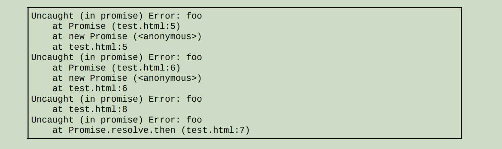

# 第 **11** 章 期约与异步函数

- 本章内容

  - 异步编程 

  - 期约

  - 异步函数 

## **11.1** 异步编程

- 在JavaScript是什么模型？
  - 单线程事件循环

- 异步行为是为了什么？
  - 优化因计算量大而时间长的操作

### **11.1.1** 同步与异步 

- 同步行为对应内存中怎么执行的处理器指令？
  - 顺序执行的
- 同步行为每条指令都会严格按照什么顺序来执行？
  - 出现的顺序

```
let x = 3;
x = x + 4;
```

- 在程序执行的每一步，都可以推断出什么？
  - 程序的状态
- 后面的指令总是在什么时候执行？
  - 前面的指令完成后

-  异步行为中什么实体可以触发代码执行？

  - 当前进程外部的实体

- 为什么异步操作是必要的？

  - 因为强制进程等待一个长时间的操作是不可行的

    （同步操作则必须要等）

```
let x = 3;
setTimeout(() => x = x + 4, 1000);
```

- 但这一次执行线程是否知道x值何时会改变？
  - 不知道
  - 因为这取决于回调何时从消息队列出列并执行。 

- 但第二个指令块（加操作及赋值操作）是由系统计时器触发的，

  这会生成什么？

  - 一个入队执行的中断

### **11.1.2** 以往的异步编程模式  

- 在早期的JavaScript中，只支持什么来表明异步操作完成？
  - 定义回调函数
- 常见的问题是什么？
  - 串联多个异步操作
    - 深度嵌套的回调函数（俗称“回调地狱”）

```
function double(value) {
    setTimeout(() => setTimeout(console.log, 0, value * 2), 1000);
}
double(3); // 6（大约1000毫秒之后）
```

- setTimeout可以定义一个什么样的回调函数？

  - 在指定时间之后会被调度执行

- 1000毫秒之后，

  JavaScript运行时会执行什么操作？

  - 会把回调函数推到自己的消息队列上去
  - 等待执行
  
- 推到队列之后，回调什么时候出列是否可见？

  - 不可见

- double()函数在setTimeout成功调度异步操作之后

  会执行什么操作？

  - 立即退出

#### \01. 异步返回值

- 假设setTimeout操作会返回一个有用的值，

  如何把这个值传给需要它的地方？

  - 给异步操作提供一个回调

  - 这个回调中包含

    要使用异步返回值

    的代码

    

```
function double(value, callback) {
    setTimeout(() => callback(value * 2), 1000);
}
double(3, (x) => console.log(`I was given: ${x}`)); // I was given: 6（大约1000毫秒之后）
```

- 这里的setTimeout调用告诉JavaScript什么？
  - 运行时在1000毫秒之后
    - 把一个函数推到消息队列上。
  - 这个函数会由运行时负责异步调度执行。

####  \02. 失败处理

- 成功回调和失败回调： 

```
function double(value, success, failure) {
    setTimeout(() => {
        try {
            if (typeof value !== 'number') {
                throw 'Must provide number as first argument';
            }
            success(2 * value);
        } catch (e) {
            failure(e);
        }
    }, 1000);
}

const successCallback = (x) => 
	console.log(`Success: ${x}`);

const failureCallback = (e) =>
	console.log(`Failure: ${e}`);
	
double(3, successCallback, failureCallback);

double('b', successCallback, failureCallback);

// Success: 6（大约1000毫秒之后）
 // Failure: Must provide number as first argument（大约1000毫秒之后）
```

- 为什么这种模式已经不可取了？
  - 因为必须在初始化异步操作时定义回调。 

- 异步函数的返回值只在短时间内存在

  - 只有预备好将这个短时间内存在的值

    作为参数的回调才能接收到它

#### \03. 嵌套异步回调 

- 如果异步返值又依赖另一个异步返回值，需要怎么做？
  - 嵌套回调

```
function double(value, success, failure) {
    setTimeout(() => {
        try {
            if (typeof value !== 'number') {
               
               throw 'Must provide number as first argument';
            }
            
            success(2 * value);
            
        } catch (e) {
        
            failure(e);
        }
    }, 1000);
}

const successCallback = (x) => {
    double(x, (y) => 
    	console.log(`Success: ${y}`));
};

const failureCallback = (e) =>
	console.log(`Failure: ${e}`);
	
double(3, successCallback, failureCallback); 

// Success: 12（大约1000毫秒之后
```

## **11.2** 期约

### **11.2.1 Promises/A+**规范 

- ECMAScript 6增加了对Promises/A+规范的完善支持，
  - 即Promise类型。 

- 什么是主导性的异步编程机制？
  - Promise
- 是否所有现代浏览器都支持ES6期约？
  - 是

### **11.2.2** 期约基础 

- Promise，可以通过什么来实例化？
  - new操作符 

- 创建新期约时需要传入什么作为参数？
  - 执行器

```
let p = new Promise(() => {});
setTimeout(console.log, 0, p); // Promise <pending>
```

- 如果不提供执行器函数，就会执行什么操作？
  - 抛出SyntaxError。 

#### \01. 期约状态机

- 在把一个期约实例传给console.log()时，控制台输出

  表明该实例处于什么状态？

  - 待定

- 期约是一个有什么的对象？

  - 有状态的

- 期约可能处于哪3种状态之一 ？

  - 待定（pending） 

  - 兑现（fulfilled）
    - 也称为“解决”（resolved） 

  - 拒绝（rejected）

- 待定（pending）是期约的什么状态？

  - 最初始状态

- 在待定状态下，期约可以落定（settled）为什么状态？

  - 代表成功的兑现（fulfilled）状态，
  - 代表失败的拒绝（rejected）状态。

- 无论落定为哪种状态是否可逆？

  - 不可逆

- 只要从待定转换为兑现或拒绝，期约的状态是否再改变？

  - 不再改变

- 是否能保证期约必然会脱离待定状态？

  - 不能

- 组织合理的代码应该怎么做？

  - 无论期约解决（resolve）还是拒绝（reject）

    还是永远处于待定（pending）状态，

  - 都应该具有恰当的行为。 

- 期约的状态是私有的还是公有的？

  - 私有的

- 是否能直接通过JavaScript检测到期约的状态？

  - 不能 

  - 为了避免根据读取到的期约状态，

    以同步方式处理期约对象。

- 期约的状态是否能被外部JavaScript代码修改？
  - 不能
- 为什么期约故意将异步行为封装起来？
  - 为了隔离外部的同步代码。 

#### \02. 解决值、拒绝理由及期约用例 

- 期约主要有哪两大用途？
  - 抽象地表示一个异步操作。
  - 异步操作生成某个值
- 期约的状态代表什么？
  - 期约是否完成
- “待定”表示什么？
  - 尚未开始
  - 或正在执行中
- “兑现”表示什么？
  - 已经成功完成
- “拒绝”表示什么？
  - 没有成功完成。 

- 期约封装的异步操作是否会生成某个值？
  - 会
- 程序期待期约状态改变时可以做什么？
  - 访问异步操作生成的值。
- 如果期约被拒绝，程序就会期待期约状态改变时可以做什么？
  - 拿到拒绝的理由。
- 每个期约只要状态切换为兑现，就会有一个什么？
  - 私有的内部值（value）
- 每个期约只要状态切换为拒绝，就会有一个什么？
  - 私有的内部理由（reason）
- 无论是值还是理由，都是什么引用？
  - 包含原始值或对象的
  - 不可修改的
- 二者是否可选？
  - 可选
- 默认值是什么？
  - undefined
- 在什么时候执行的异步代码始终会收到这个值或理由？
  - 期约到达某个落定状态

#### \03. 通过执行函数控制期约状态

- 为什么期约的状态只能在内部进行操作？
  - 因为期约的状态是私有的

- 内部操作在哪里完成？ 
  - 期约的执行器函数中
- 执行器函数主要有哪两项职责？
  - 初始化期约的异步行为
  - 控制状态的最终转换
- 执行器函数怎么实现控制期约状态的转换？
  - 通过调用它的两个函数参数
- 执行器函数的两个参数通常都命名为什么？
  - resolve()
  - reject()
- 调用resolve()会执行什么操作？
  - 把状态切换为兑现，
- 调用reject()会执行什么操作？
  - 把状态切换为拒绝
  - 抛出错误

```
let p1 = new Promise((resolve, reject) =>
	resolve());
	
setTimeout(console.log, 0, p1); 
// Promise <resolved>

let p2 = new Promise((resolve, reject) => reject());

setTimeout(console.log, 0, p2);
// Promise <rejected>
// Uncaught error (in promise)
```

- 在前面的例子中，是否有异步操作？

  - 没有

  - 因为在初始化期约时，

    执行器函数已经改变了每个期约的状态。

- 执行器函数是同步还是异步执行的？
  - 同步执行
  - 因为执行器函数是期约的初始化程序。

```
new Promise(() => setTimeout(console.log, 0, 'executor'));

setTimeout(console.log, 0, 'promise initialized'); 

// executor 
// promise initialized
```

- 如何推迟切换状态？
  - 添加setTimeout

```
let p = new Promise((resolve, reject) => 
	setTimeout(resolve, 1000));
	
// 在console.log打印期约实例的时候，还不会执行超时回调（即resolve()） 

setTimeout(console.log, 0, p); 
// Promise <pending>
```

- 状态转换可否撤销？
  - 不可以
    - 无论resolve()和reject()中的哪个被调用
- 继续修改状态会执行什么操作？
  - 静默失败

```
let p = new Promise((resolve, reject) => {
    resolve();
    reject(); // 没有效果 
});
setTimeout(console.log, 0, p); 
// Promise <resolved>
```

- 如何避免期约卡在待定状态？

  - 添加一个定时退出功能。

    - 通过setTimeout设置一个10秒钟后

      会拒绝期约的回调

```
let p = new Promise((resolve, reject) => {

    setTimeout(reject, 10000); 
    // 10秒后调用reject()

    // 执行函数的逻辑 
});

setTimeout(console.log, 0, p); 
// Promise <pending> 

setTimeout(console.log, 11000, p); 
// 11秒后再检查状态

// (After 10 seconds) Uncaught error
// (After 11 seconds) Promise <rejected>
```

- 如果执行器中的代码在超时之前已经解决或拒绝，

  那么超时回调再尝试拒绝会发生什么？

  - 静默失败

#### \04. **Promise.resolve()**  

- 期约是否一开始就必须处于待定状态？
  - 不是
- 如何实例化一个解决的期约？
  - 调用Promise.resolve()静态方法
- 下面两个期约实例实际上是一样的：

```
let p1 = new Promise((resolve, reject) => 
	resolve());
	
let p2 = Promise.resolve();
```

- 这个解决的期约的值对应着什么？
  - 传给Promise.resolve()的第一个参数。 
- 使用这个静态方法，可以对一个值做什么？
  - 把任何值都转换为一个期约

```
let p1 = new Promise((resolve, reject) => 
	resolve());
	
let p2 = Promise.resolve();

setTimeout(console.log, 0, Promise.resolve());
// Promise <resolved>: undefined 

setTimeout(console.log, 0, Promise.resolve(3)); 
// Promise <resolved>: 3

// 多余的参数会忽略 
setTimeout(console.log, 0, Promise.resolve(4, 5, 6));
// Promise <resolved>: 4
```

- 对这个静态方法而言，

  如果传入的参数本身是一个期约，

  那它的行为就类似于什么？

  - 一个空包装。

- Promise.resolve()是一个什么方法？
  - 幂等方法

```
let p = Promise.resolve(7);

setTimeout(console.log, 0, p === Promise.resolve(p)); // true 

setTimeout(console.log, 0, p === Promise.resolve(Promise.resolve(p))); // true
```

- 这个幂等性是否会保留传入期约的状态？
  - 会

```
let p = new Promise(() => {});

setTimeout(console.log, 0, p); 
// Promise <pending>

setTimeout(console.log, 0, Promise.resolve(p));
// Promise <pending>

setTimeout(console.log, 0, p === Promise.resolve(p)); // true
```

-  这个静态方法是否能够包装非期约值？
  - 能
    - 包括错误对象，
    - 并将其转换为解决的期约。

```
let p = Promise.resolve(new Error('foo')); 

setTimeout(console.log, 0, p); 
// Promise <resolved>: Error: foo
```

#### \05. **Promise.reject()**

- Promise.reject()会实例化一个什么？
  - 拒绝的期约
  - 并抛出一个异步错误
- 这个错误能否通过try/catch捕获？
  - 不能
  - 只能通过拒绝处理程序捕获
- 下面的两个期约实例实际上是一样的

```
let p1 = new Promise((resolve, reject) => reject());

let p2 = Promise.reject();
```

- 这个拒绝的期约的理由是什么？
  - 传给Promise.reject()的第一个参数

- 这个参数是否会传给后续的拒绝处理程序？
  - 会

```
let p = Promise.reject(3); 

setTimeout(console.log, 0, p);
// Promise <rejected>: 3 

p.then(null, (e) => setTimeout(console.log, 0, e));
// 3
```

- 如果给Promise.reject()传一个期约对象，

  则这个期约会成为什么？

  - 它返回的拒绝期约的理由

```
setTimeout(console.log, 0, Promise.reject(Promise.resolve())); 
// Promise <rejected>: Promise <resolved>
```

#### \06. 同步**/**异步执行的二元性 

- 两种模式下抛出错误的情形：

```
try {
    throw new Error('foo');
} catch (e) {
    console.log(e); // Error: foo
}

try {
    Promise.reject(new Error('bar'));
} catch (e) {
    console.log(e);
}
// Uncaught (in promise) Error: bar
```

- 第一个try/catch是否抛出并捕获了错误？
  - 是
- 第二个try/catch抛出错误是否有捕获到？
  - 没有
- 代码中是同步还是异步创建了一个拒绝的期约实例？
  - 同步
- 这个实例是否抛出了包含拒绝理由的错误？
  - 是
- 为什么这里的同步代码try/catch没有捕获期约抛出的错误？
  - 因为它没有通过异步模式捕获错误。
- 期约真正的异步特性是什么？
  - 是同步对象
    - （在同步执行模式中使用）
  - 是异步执行模式的媒介

- 在前面的例子中，

  拒绝期约的错误有没有抛到执行同步代码的线程里？

  - 没有

- 拒绝期约的错误是通过什么处理的？

  - 通过浏览器异步消息队列

- try/catch块能不能捕获该错误？

  - 不能

- 代码一旦开始以异步模式执行，

  则唯一与之交互的方式是什么？

  - 使用异步结构
    - 期约的方法

### **11.2.3** 期约的实例方法

- 期约实例的方法是什么的桥梁？
  - 连接外部同步代码与内部异步代码之间
- 这些方法可以做什么？
  - 访问异步操作返回的数据
  - 处理期约成功和失败的结果
  - 连续对期约求值
  - 添加只有期约进入终止状态时才会执行的代码。 

#### \01. 实现**Thenable**接口

- 在ECMAScript暴露的异步结构中，

  任何对象都有一个什么方法？

  - then()

- then()方法被认为实现了什么接口？
  - Thenable接口

```
class MyThenable { 
	then() {}
}
```

- ECMAScript的Promise类型实现了什么接口？
  - Thenable

#### \02. **Promise.prototype.then()** 

- Promise.prototype.then()是做什么的主要方法？
  - 为期约实例添加处理程序
- then()方法接收什么参数？
  - 最多两个参数，
    - 都是可选的
  - onResolved处理程序
  - onRejected处理程序
- 如果提供then()方法，则会在什么时候执行？ 
  - 会在期约分别进入“兑现”和“拒绝”状态时执行。

```
function onResolved(id) {
    setTimeout(console.log, 0, id, 'resolved');
}

function onRejected(id) {
    setTimeout(console.log, 0, id, 'rejected');
}

let p1 = new Promise((resolve, reject) => 	
	setTimeout(resolve, 3000));
	
let p2 = new Promise((resolve, reject) => 
	setTimeout(reject, 3000));
	
p1.then(() => onResolved('p1'), () => 
	onRejected('p1'));
	
p2.then(() => onResolved('p2'), () => 
	onRejected('p2'));
	
//（3秒后）
// p1 resolved 
// p2 rejected
```

- onResolved、onRejected处理程序是否互斥？
  - 是
  - 因为期约只能转换为最终状态一次

- 传给then()的任何非函数类型的参数都会被怎么处理？
  - 静默忽略
- 如何只提供onRejected参数？
  - 在onResolved参数的位置上传入undefined

```
function onResolved(id) {
    setTimeout(console.log, 0, id, 'resolved');
}

function onRejected(id) {
    setTimeout(console.log, 0, id, 'rejected');
}

let p1 = new Promise((resolve, reject) => setTimeout(resolve, 3000))

let p2 = new Promise((resolve, reject) => setTimeout(reject, 3000));

// 非函数处理程序会被静默忽略，不推荐 

p1.then('gobbeltygook');

// 不传onResolved处理程序的规范写法

p2.then(null, () => onRejected('p2'));
// p2 rejected（3秒后）
```

- Promise.prototype.then()方法返回什么？
  - 一个新的期约实例 

```
let p1 = new Promise(() => {});

let p2 = p1.then();

setTimeout(console.log, 0, p1); 
// Promise <pending> 

setTimeout(console.log, 0, p2); 
// Promise <pending>

setTimeout(console.log, 0, p1 === p2); 
// false
```

- 这个新期约实例基于什么构建？
  - onResovled处理程序的返回值

- 该处理程序的返回值怎么生成新期约？
  - 会通过Promise.resolve()函数包装
- 如果没有提供这个处理程序，则会执行什么操作？
  - Promise.resolve()包装上一个期约解决之后的值。 
- 如果没有显式的返回语句，则会执行什么操作？
  - Promise.resolve()会包装默认的返回值undefined。

```
let p1 = Promise.resolve('foo');

// 若调用then()时不传处理程序，则原样向后传
let p2 = p1.then();

setTimeout(console.log, 0, p2);
// Promise <resolved>: foo

// 这些都一样 
let p3 = p1.then(() => undefined);
let p4 = p1.then(() => {});
let p5 = p1.then(() => Promise.resolve());

setTimeout(console.log, 0, p3); 
// Promise <resolved>: undefined 

setTimeout(console.log, 0, p4); 
// Promise <resolved>: undefined 

setTimeout(console.log, 0, p5); 
// Promise <resolved>: undefined
```

- 如果有显式的返回值，则会执行什么操作？
  - Promise.resolve()会包装这个返回值

```
// 这些都一样 
let p6 = p1.then(() => 'bar');

let p7 = p1.then(() => Promise.resolve('bar'));

setTimeout(console.log, 0, p6);
// Promise <resolved>: bar 

setTimeout(console.log, 0, p7);
// Promise <resolved>: bar

// Promise.resolve()保留返回的期约 
let p8 = p1.then(() => new Promise(() => { }));

let p9 = p1.then(() => Promise.reject());
// Uncaught (in promise): undefined 

setTimeout(console.log, 0, p8);
// Promise <pending> 

setTimeout(console.log, 0, p9);
 // Promise <rejected>: undefined
```

- 抛出异常会返回什么？
  - 拒绝的期约： 

```
let p10 = p1.then(() => {
    throw 'baz';
});
// Uncaught (in promise) baz 

setTimeout(console.log, 0, p10);
// Promise <rejected> baz
```

- 返回错误值是否会触发拒绝行为？
  - 不会
- 返回错误值会执行什么操作？
  - 把错误对象包装在一个解决的期约中： 

```
let p11 = p1.then(() => Error('qux'));

setTimeout(console.log, 0, p11);
// Promise <resolved>: Error: qux
```

- onRejected处理程序返回的值会被什么包装？
  - Promise.resolve()
- onRejected处理程序的任务是什么？
  - 捕获异步错误

- onRejected处理程序在捕获错误后是否会抛出异常？
  - 不会
- onRejected处理程序在捕获错误后应该返回什么？ 
  - 一个解决期约。 

```
let p1 = Promise.reject('foo');

// 调用then()时不传处理程序则原样向后传 
let p2 = p1.then();
// Uncaught (in promise) foo 

setTimeout(console.log, 0, p2);
// Promise <rejected>: foo

// 这些都一样 
let p3 = p1.then(null, () => undefined);
let p4 = p1.then(null, () => {});
let p5 = p1.then(null, () => Promise.resolve());

setTimeout(console.log, 0, p3);
// Promise <resolved>: undefined 

setTimeout(console.log, 0, p4);
// Promise <resolved>: undefined 

setTimeout(console.log, 0, p5);
// Promise <resolved>: undefined

// 这些都一样 
let p6 = p1.then(null, () => 'bar');
let p7 = p1.then(null, () => Promise.resolve('bar'));

setTimeout(console.log, 0, p6);
// Promise <resolved>: bar 

setTimeout(console.log, 0, p7);
// Promise <resolved>: bar

// Promise.resolve()保留返回的期约 
let p8 = p1.then(null, () => new Promise(() => { }));

let p9 = p1.then(null, () => Promise.reject());
// Uncaught (in promise): undefined 

setTimeout(console.log, 0, p8);
// Promise <pending> 

setTimeout(console.log, 0, p9);
// Promise <rejected>: undefined 

let p10 = p1.then(null, () => { throw 'baz'; });
// Uncaught (in promise) baz 

setTimeout(console.log, 0, p10);
// Promise <rejected>: baz 

let p11 = p1.then(null, () => Error('qux'));

setTimeout(console.log, 0, p11);
// Promise <resolved>: Error: qux
```

#### \03. **Promise.prototype.catch()** 

- Promise.prototype.catch()方法用于什么？
  - 给期约添加拒绝处理程序

- 这个方法接收什么参数？
  - onRejected处理程序

- 调用它就相当于调用什么？
  - Promise.prototype.then(null, onRejected)。 

```
let p = Promise.reject();

let onRejected = function (e) {
    setTimeout(console.log, 0, 'rejected');
};

// 这两种添加拒绝处理程序的方式是一样的：
p.then(null, onRejected); // rejected 

p.catch(onRejected); // rejected
```

- Promise.prototype.catch()返回一个什么？
  - 新的期约实例：

```
let p1 = new Promise(() => { });

let p2 = p1.catch();

setTimeout(console.log, 0, p1); // Promise <pending>

setTimeout(console.log, 0, p2); // Promise <pending> 

setTimeout(console.log, 0, p1 === p2); // false
```

- 在返回新期约实例方面，

  Promise.prototype.catch()的行为 

  与Promise.prototype.then()的onRejected处理程序

  是一样的。 

#### \04. **Promise.prototype.finally()** 

- Promise.prototype.finally()方法用于什么？

  - 给期约添加onFinally处理程序

- 这个处理程序在什么时候会执行？

  - 期约转换为解决或拒绝状态时

- 这 个方法可以避免什么？

  - onResolved和onRejected处理程序中出现冗余代码 

- onFinally处理程序是否知道期约的状态

  是解决还是拒绝？

  - 不知道

- onFinally方法主要用于添加什么代码？

  - 添加清理代码。 

```
let p1 = Promise.resolve();

let p2 = Promise.reject();

let onFinally = function () {
    setTimeout(console.log, 0, 'Finally!')
}

p1.finally(onFinally); // Finally 

p2.finally(onFinally); // Finally
```

- Promise.prototype.finally()方法返回什么？
  - 一个新的期约实例

```
let p1 = new Promise(() => { });

let p2 = p1.finally();

setTimeout(console.log, 0, p1); 
// Promise <pending> 

setTimeout(console.log, 0, p2); 
// Promise <pending> 

setTimeout(console.log, 0, p1 === p2); // false
```

- onFinally被设计为一个什么方法？
  - 状态无关方法
- 在大多数情况下，onFinally将表现为什么传递？
  - 父期约的传递
- 对于已解决状态和被拒绝状态都是如此。

```
let p1 = Promise.resolve('foo'); // 这里都会原样后传

let p2 = p1.finally();

let p3 = p1.finally(() => undefined);

let p4 = p1.finally(() => { });

let p5 = p1.finally(() => Promise.resolve());

let p6 = p1.finally(() => 'bar');

let p7 = p1.finally(() => Promise.resolve('bar'));

let p8 = p1.finally(() => Error('qux'));

setTimeout(console.log, 0, p2);
// Promise <resolved>: foo 

setTimeout(console.log, 0, p3);
// Promise <resolved>: foo 

setTimeout(console.log, 0, p4);
// Promise <resolved>: foo 

setTimeout(console.log, 0, p5);
// Promise <resolved>: foo 

setTimeout(console.log, 0, p6);
// Promise <resolved>: foo 

setTimeout(console.log, 0, p7);
// Promise <resolved>: foo 

setTimeout(console.log, 0, p8);
// Promise <resolved>: foo
```

- 如果返回的是一个待定的期约，

  或者onFinally处理程序抛出了错误

  （显式抛出或返回了一个拒绝期约），

  则会返回什么？

  - 相应的期约

    （待定或拒绝）

```
// Promise.resolve()保留返回的期约 

let p9 = p1.finally(() => new Promise(() => { }));

let p10 = p1.finally(() => Promise.reject());
// Uncaught (in promise): undefined 

setTimeout(console.log, 0, p9);
// Promise <pending> 

setTimeout(console.log, 0, p10);
// Promise <rejected>: undefined 

let p11 = p1.finally(() => { throw 'baz'; });
// Uncaught (in promise) baz 

setTimeout(console.log, 0, p11);
 // Promise <rejected>: baz
```

- 只要期约一解决，新期约会执行什么操作？
  - 会原样后传初始的期约

```
let p1 = Promise.resolve('foo'); // 忽略解决的值 

let p2 = p1.finally(() =>
    new Promise((resolve, reject) =>
        setTimeout(() => resolve('bar'), 100)));

setTimeout(console.log, 0, p2);
// Promise <pending> 

setTimeout(() => setTimeout(console.log, 0, p2), 200);
// 200毫秒后：
// Promise <resolved>: foo
```

#### \05. 非重入期约方法

- 当期约进入落定状态时，

  与该状态相关的处理程序会被怎么处理？

  - 排期，
  - 而非立即执行。

- 跟在添加这个处理程序的代码之后的同步代码

  一定会在处理程序之前还是之后执行？

  - 在处理程序之前

- 如果期约一开始就是与附加处理程序关联的状态，

  执行顺序是否也是这样的？

  - 是

- 这个特性由JavaScript运行时保证，被称为什么特性？
  - 非重入特性

```
// 创建解决的期约 
let p = Promise.resolve();

// 添加解决处理程序
// 直觉上，这个处理程序会等期约一解决就执行 
p.then(() => console.log('onResolved handler'));

// 同步输出，证明then()已经返回 
console.log('then() returns');

// 实际的输出：
// then() returns
// onResolved handler
```

- 在这个例子中，

  在一个解决期约上调用then()会执行什么操作？

  - 把onResolved处理程序推进消息队列。

- 但这个处理程序在什么之前不会执行？

  - 当前线程上的同步代码执行完成前

- 跟在then()后面的同步代码是否先于处理程序执行？

  - 是

- 如果添加处理程序后，同步代码才改变期约状态，

  那么处理程序会基于该状态变化表现出什么特性？

  - 非重入特性

- 如果先添加了onResolved处理程序，

  再同步调用resolve()，

  处理程序是否会进入同步线程执行？

  - 不会

```
let synchronousResolve;

// 创建一个期约并将解决函数保存在一个局部变量中
let p = new Promise((resolve) => {

    synchronousResolve = function () {

        console.log('1: invoking resolve()');

        resolve();

        console.log('2: resolve() returns');
    };
});

p.then(() => console.log('4: then() handler executes'));

synchronousResolve();

console.log('3: synchronousResolve() returns');

// 实际的输出：
// 1: invoking resolve()
// 2: resolve() returns
// 3: synchronousResolve() returns
// 4: then() handler executes
```

- 非重入适用于什么程序？
  - onResolved/onRejected处理程序、
  - catch()处理程序 
  - finally()处理程序。

- 这些处理程序都是否只能异步执行？
  - 是

```
let p1 = Promise.resolve();

p1.then(() => console.log('p1.then() onResolved'));

console.log('p1.then() returns');

let p2 = Promise.reject();

p2.then(null, () => console.log('p2.then() onRejected'));

console.log('p2.then() returns');

let p3 = Promise.reject();

p3.catch(() => console.log('p3.catch() onRejected'));

console.log('p3.catch() returns');

let p4 = Promise.resolve();

p4.finally(() => console.log('p4.finally() onFinally'));

console.log('p4.finally() returns');

// p1.then() returns
// p2.then() returns 
// p3.catch() returns 
// p4.finally() returns 

// p1.then() onResolved 
// p2.then() onRejected 
// p3.catch() onRejected 
// p4.finally() onFinally
```

#### \06. 邻近处理程序的执行顺序 

- 如果给期约添加了多个处理程序，

  当期约状态变化时，

  相关处理程序会按照什么顺序依次执行?

  - 添加顺序

```
let p1 = Promise.resolve();

let p2 = Promise.reject();

p1.then(() => setTimeout(console.log, 0, 1));

p1.then(() => setTimeout(console.log, 0, 2));

// 1
// 2 

p2.then(null, () => setTimeout(console.log, 0, 3));

p2.then(null, () => setTimeout(console.log, 0, 4));

// 3
// 4 

p2.catch(() => setTimeout(console.log, 0, 5));

p2.catch(() => setTimeout(console.log, 0, 6));

// 5
// 6 

p1.finally(() => setTimeout(console.log, 0, 7));

p1.finally(() => setTimeout(console.log, 0, 8));

// 7
// 8
```

#### \07. 传递解决值和拒绝理由 

- 到了落定状态后，期约会提供什么给相关状态的处理程序？
  - 其解决值（如果兑现）
  - 或其拒绝理由（如果拒绝）
- 拿到返回值后，就可以做什么？
  - 进一步对这个值进行操作。

```
let p1 = new Promise((resolve, reject) => resolve('foo'));

p1.then((value) => console.log(value)); // foo 

let p2 = new Promise((resolve, reject) => reject('bar'));

p2.catch((reason) => console.log(reason)); // bar
```

- Promise.resolve()和Promise.reject()在被调用时

  会接收什么？

  - 解决值和拒绝理由

- 它们返回的期约会做什么？

  - 把参数传给onResolved或onRejected处理程序： 

```
let p1 = Promise.resolve('foo');

p1.then((value) => console.log(value)); // foo

let p2 = Promise.reject('bar');

p2.catch((reason) => console.log(reason)); // bar
```

#### \08. 拒绝期约与拒绝错误处理

- 拒绝期约代表一种什么程序状态？ 
  - 即需要中断或者特殊处理。

- 在期约的执行函数或处理程序中抛出错误会导致什么？
  - 拒绝
- 对应的错误对象会成为什么？
  - 拒绝的理由
- 因此以下这些期约都会以一个错误对象为由被拒绝：

```
let p1 = new Promise((resolve, reject) =>
    reject(Error('foo')));

let p2 = new Promise((resolve, reject) => {
    throw Error('foo');
});

let p3 = Promise.resolve().then(() => {
    throw Error('foo');
});

let p4 = Promise.reject(Error('foo'));

setTimeout(console.log, 0, p1);
// Promise <rejected>: Error: foo 

setTimeout(console.log, 0, p2);
// Promise <rejected>: Error:foo 

setTimeout(console.log, 0, p3);
// Promise <rejected>: Error: foo 

setTimeout(console.log, 0, p4);
// Promise <rejected>: Error: foo

// 也会抛出4个未捕获错误
```

- 期约是否可以以任何理由拒绝？

  - 可以
    - 包括undefined，

- 为什么最好统一使用错误对象为理由拒绝？

  - 因为创建错误对象

    可以让浏览器捕获错误对象中的栈追踪信息，

    - 而这些信息对调试是非常关键的。

- 前面例子中抛出的4个错误的栈追踪信息如下： 



- 所有错误都是什么样的？

  - 异步抛出
  - 且未处理的

- 通过错误对象捕获的栈追踪信息展示了什么？

  - 错误发生的路径。

- 为什么Promise.resolve().then()的错误最后才出现？

  - 因为它需要在运行时消息队列中添加处理程序；

    - 在最终抛出未捕获错误之前

      它还会创建另一个期约。 

- 正常情况下，

  在通过throw()关键字抛出错误时，

  JavaScript运行时的错误处理机制会怎么做？ 

  - 停止执行抛出错误之后的任何指令

```
throw Error('foo'); 

console.log('bar'); // 这一行不会执行 

// Uncaught Error: foo
```

- 在期约中抛出错误时，

  是否会阻止运行时继续执行同步指令？

  - 不会

  - 因为错误是从消息队列中异步抛出的

```
Promise.reject(Error('foo')); 

console.log('bar'); 

// bar
// Uncaught (in promise) Error: foo
```

- 异步错误只能通过什么程序捕获？
  - 异步的onRejected处理程序 

```
// 正确 
Promise.reject(Error('foo')).catch((e) => {}); 

// 不正确 
try { 
	Promise.reject(Error('foo')); 
} catch(e) {}
```

- 这是否包括捕获执行函数中的错误？

  - 不包括

- 在解决或拒绝期约之前，

  是否可以使用try/catch在执行函数中捕获错误？

  - 可以

```
let p = new Promise((resolve, reject) => { 
	try { 
		throw Error('foo');
    } catch(e) {} 
    
    resolve('bar'); 
});

setTimeout(console.log, 0, p); 

// Promise <resolved>: bar
```

- then()和catch()的onRejected处理程序

  在语义上相当于什么？

  - try/catch。 

- onRejected和try/catch的出发点都是什么？

  - 捕获错误之后将其隔离，
  - 同时不影响正常逻辑执行

- onRejected处理程序的任务是什么？

  - 在捕获异步错误之后

    返回一个解决的期约。

- 下面的例子中对比了同步错误处理与异步错误处理：

```
console.log('begin synchronous execution');
try {
    throw Error('foo');
} catch (e) {
    console.log('caught error', e);
}
console.log('continue synchronous execution');

// begin synchronous execution
// caught error Error: foo
// continue synchronous execution 

new Promise((resolve, reject) => {
    console.log('begin asynchronous execution');
    
    reject(Error('bar'));
}).catch((e) => {
    console.log('caught error', e);
}).then(() => {
    console.log('continue asynchronous execution');
});

// begin asynchronous execution
// caught error Error: bar
// continue asynchronous execution
```

### **11.2.4** 期约连锁与期约合成

- 多个期约组合可以通过哪两种方式实现？
  - 期约连锁
    - 一个期约接一个期约地拼接
  - 期约合成
    - 将多个期约组合为一个期约。 

#### \01. 期约连锁

- 为什么可以期约连锁？

  - 因为每个期约实例的方法（then()、catch()、finally()）

    都会返回一个新的期约对象，

  - 这个新期约有自己的实例方法。

- 什么可以构成所谓的“期约连锁”？

  - 连缀方法调用

```
let p = new Promise((resolve, reject) => {
    console.log('first');
    resolve();
});
p.then(() => console.log('second'))
    .then(() => console.log('third'))
    .then(() => console.log('fourth'));
// first
// second
// third
// fourth
```

- 分别使用4个同步函数也可以做到： 

```
(() => console.log('first'))();
(() => console.log('second'))();
(() => console.log('third'))();
(() => console.log('fourth'))();
```

- 什么是串行化异步任务？
  - 每个执行器都返回一个期约实例
  - 让每个后续期约都等待之前的期约
- 让每个期约在一定时间后解决： 

```
let p1 = new Promise((resolve, reject) => {
    console.log('p1 executor');
    setTimeout(resolve, 1000);
});

p1.then(() => new Promise((resolve, reject) => {
    console.log('p2 executor');
    setTimeout(resolve, 1000);
})).then(() => new Promise((resolve, reject) => {
    console.log('p3 executor');
    setTimeout(resolve, 1000);
})).then(() => new Promise((resolve, reject) => {
    console.log('p4 executor');
    setTimeout(resolve, 1000);
}));
// p1 executor（1秒后）
// p2 executor（2秒后）
// p3 executor（3秒后）
// p4 executor（4秒后）
```

- 把生成期约的代码提取到一个工厂函数中

```
function delayedResolve(str) {
    return new Promise((resolve, reject) => {
        console.log(str);
        setTimeout(resolve, 1000);
    });
}
delayedResolve('p1 executor')
    .then(() => delayedResolve('p2 executor'))
    .then(() => delayedResolve('p3 executor'))
    .then(() => delayedResolve('p4 executor'))
// p1 executor（1秒后） 
// p2 executor（2秒后）
// p3 executor（3秒后） 
// p4 executor（4秒后）
```

- 每个后续的处理程序都会等待前一个期约解决，

  然后做什么？

  - 实例化一个新期约并返回它 

- 这种结构可以解决什么难题？
  -  依赖回调的难题

- 假如这种情况下不使用期约：

```
function delayedExecute(str, callback = null) {
    setTimeout(() => {
        console.log(str);
        callback && callback();
    }, 1000)
}
delayedExecute('p1 callback', () => {
    delayedExecute('p2 callback', () => {
        delayedExecute('p3 callback', () => {
            delayedExecute('p4 callback');
        });
    });
});
// p1 callback（1秒后）
// p2 callback（2秒后）
// p3 callback（3秒后）
// p4 callback（4秒后）
```

- 为什么then()、catch()和finally()串联这些方法很直观？
  - 因为都返回期约
- 下面的例子同时使用这3个实例方法： 

```
let p = new Promise((resolve, reject) => {
    console.log('initial promise rejects');
    reject();
});
p.catch(() => console.log('reject handler'))
    .then(() => console.log('resolve handler'))
    .finally(() => console.log('finally handler'));
// initial promise rejects
// reject handler
// resolve handler
// finally handler
```

#### \02. 期约图 

- 因为一个期约可以有任意多个处理程序，

  所以期约连锁可以构建什么结构？

  - 有向非循环图

- 每个期约都是图中的一个什么？
  - 节点
- 使用实例方法添加的处理程序是图中的什么？
  - 有向顶点
- 因为图中的每个节点是否会等待前一个节点落定？
  - 会
- 图的方向表示什么？
  - 期约的解决或拒绝顺序。 

- 下面的例子展示了一种期约有向图，也就是二叉树： 

```
// A
// / \
// B C
// /\ /\
// D E F G 
let A = new Promise((resolve, reject) => {
    console.log('A');
    resolve();
});
let B = A.then(() => console.log('B'));
let C = A.then(() => console.log('C'));
B.then(() => console.log('D'));
B.then(() => console.log('E'));
C.then(() => console.log('F'));
C.then(() => console.log('G'));
// A
// B
// C
// D
// E 
// F 
// G
```

- 日志的输出语句是对二叉树的什么遍历？
  - 层序遍历

- 期约的处理程序是按照什么顺序执行的？
  - 它们添加的顺序

- 由于期约的处理程序是先添加到哪里，然后才逐个执行?
  - 消息队列
    - 因此构成了层序遍历。 

- 根节点是否一定唯一？
  - 不一定
- 多个期约是否可以组合成一个期约？
  - 可以
- 什么是体现期约连锁可能性的最准确表达？
  - 有向非循环图

#### \03. **Promise.all()**和**Promise.race()**

- Promise类提供哪两个

  将多个期约实例组合成一个期约的静态方法？

  - Promise.all()
  - Promise.race()

- 合成后期约的行为取决于什么？

  - 内部期约的行为

##### **Promise.all()** 

- Promise.all()静态方法创建的期约会在什么时候解决？
  - 一组期约全部解决之后再解决

- Promise.all()接收什么参数？
  - 一个可迭代对象，
- 返回什么？
  - 一个新期约

```
let p1 = Promise.all([Promise.resolve(), Promise.resolve()]);

// 可迭代对象中的元素会通过Promise.resolve()转换为期约 
let p2 = Promise.all([3, 4]);

// 空的可迭代对象等价于Promise.resolve() 
let p3 = Promise.all([]);

// 无效的语法 
let p4 = Promise.all();
// TypeError: cannot read Symbol.iterator of undefined

```

- 合成的期约会在什么时候解决？
  - 只会在每个包含的期约都解决之后

```
let p = Promise.all([
	Promise.resolve(),
	new Promise((resolve, reject) => setTimeout(resolve, 1000)),
]);

setTimeout(console.log, 0, p);
// Promise <pending>

p.then(() => setTimeout(console.log, 0, 'all() resolved!'));
 // all() resolved!（大约1秒后）

```

- 如果至少有一个包含的期约待定，

  则合成的期约的状态是什么？

  - 待定

- 如果有一个包含的期约拒绝，

  则合成的期约的状态是什么？

  - 拒绝

```
// 永远待定
let p1 = Promise.all([new Promise(() => {})]);

setTimeout(console.log, 0, p1);
// Promise <pending>

// 一次拒绝会导致最终期约拒绝
let p2 = Promise.all([Promise.resolve(), Promise.reject(), Promise.resolve()]);

setTimeout(console.log, 0, p2);
// Promise <rejected>
// Uncaught (in promise) undefined

```

- 如果所有期约都成功解决，

  则合成期约的解决值是什么？

  - 所有包含期约解决值的数组
    - 按照迭代器顺序

```
let p = Promise.all([
	Promise.resolve(3),
	Promise.resolve(),
	Promise.resolve(4),
]);
p.then((values) => setTimeout(console.log, 0, values));
// [3, undefined, 4]

```

- 如果有期约拒绝，

  则合成期约的拒绝理由是什么？

  - 第一个拒绝的期约的理由

- 之后再拒绝的期约是否会影响最终期约的拒绝理由？
  - 不会
- 是否影响所有包含期约正常的拒绝操作？
  - 不影响
- 合成的期约会怎么处理所有包含期约的拒绝操作？
  - 静默处理

```
// 虽然只有第一个期约的拒绝理由会进入
// 拒绝处理程序，第二个期约的拒绝也
// 会被静默处理，不会有错误跑掉

let p = Promise.all([
	Promise.reject(3),
	new Promise((resolve, reject) => setTimeout(reject, 1000)),
]);

p.catch((reason) => setTimeout(console.log, 0, reason));
// 3
// 没有未处理的错误

```

##### **Promise.race()**

- Promise.race()静态方法返回什么？
  - 一个包装期约
  - 是一组集合中最先解决或拒绝的期约的镜像
- 这个方法接收什么参数？
  - 一个可迭代对象， 

- 返回什么？
  - 一个新期约：

```
let p1 = Promise.race([
    Promise.resolve(), Promise.resolve()]);

// 可迭代对象中的元素会通过Promise.resolve()转换为期约 
let p2 = Promise.race([3, 4]);

// 空的可迭代对象等价于new Promise(() => {}) 
let p3 = Promise.race([]);

// 无效的语法 
let p4 = Promise.race();
// TypeError: cannot read Symbol.iterator of undefined
```

- Promise.race()是否会对解决或拒绝的期约区别对待？

  - 不会

- Promise.race()就会包装谁的解决值或拒绝理由

  并返回新期约？

  - 第一个落定的期约
    - 无论是解决还是拒绝

```
// 解决先发生，超时后的拒绝被忽略
let p1 = Promise.race([
	Promise.resolve(3),
	new Promise((resolve, reject) => setTimeout(reject, 1000)),
]);

setTimeout(console.log, 0, p1);
// Promise <resolved>: 3

// 拒绝先发生，超时后的解决被忽略
let p2 = Promise.race([
	Promise.reject(4),
	new Promise((resolve, reject) => setTimeout(resolve, 1000)),
]);

setTimeout(console.log, 0, p2);
// Promise <rejected>: 4

// 迭代顺序决定了落定顺序
let p3 = Promise.race([
	Promise.resolve(5),
	Promise.resolve(6),
	Promise.resolve(7),
]);

setTimeout(console.log, 0, p3);
// Promise <resolved>: 5

```

- 谁的理由会成为拒绝合成期约的理由？
  - 第一个落定的拒绝期约
- 之后再拒绝的期约是否影响最终期约的拒绝理由？
  - 不影响
- 这是否影响所有包含期约正常的拒绝操作？
  - 不影响

- 合成的期约会怎么处理所有包含期约的拒绝操作？
  - 静默处理

```
// 虽然只有第一个期约的拒绝理由会进入
// 拒绝处理程序，第二个期约的拒绝也
// 会被静默处理，不会有错误跑掉

let p = Promise.race([
	Promise.reject(3),
	new Promise((resolve, reject) => setTimeout(reject, 1000)),
]);

p.catch((reason) => setTimeout(console.log, 0, reason));
// 3
// 没有未处理的错误

```

#### \04. 串行期约合成

- 期约的主要特性？

  - 异步产生值
  - 并将其传给处理程序

- 期约的基本功能是基于什么来串联期约？

  - 后续期约使用

    之前期约的返回值

```
function addTwo(x) {
	return x + 2;
}
function addThree(x) {
	return x + 3;
}
function addFive(x) {
	return x + 5;
}
function addTen(x) {
	return addFive(addTwo(addThree(x)));
}
console.log(addTen(7)); // 17

```

- 上面代码有3个函数基于一个值合成为一个函数。

- 多个期约是否可以消费一个值，并返回一个结果？
  - 可以

```
function addTwo(x) {
	return x + 2;
}
function addThree(x) {
	return x + 3;
}
function addFive(x) {
	return x + 5;
}
function addTen(x) {
	return Promise.resolve(x).then(addTwo).then(addThree).then(addFive);
}
addTen(8).then(console.log); // 18

```

- 使用Array.prototype.reduce()可以写成更简洁的形式： 

```
function addTwo(x) {
	return x + 2;
}
function addThree(x) {
	return x + 3;
}
function addFive(x) {
	return x + 5;
}
function addTen(x) {
	return [addTwo, addThree, addFive].reduce(
		(promise, fn) => promise.then(fn),
		Promise.resolve(x)
	);
}
addTen(8).then(console.log); // 18

```

```
function addTwo(x) {
	return x + 2;
}
function addThree(x) {
	return x + 3;
}
function addFive(x) {
	return x + 5;
}
function compose(...fns) {
	return (x) =>
		fns.reduce((promise, fn) => promise.then(fn), Promise.resolve(x));
}
let addTen = compose(addTwo, addThree, addFive);

addTen(8).then(console.log);// 18

```

### **11.2.5** 期约扩展 

#### \01. 期约取消 

- 如何实现取消期约的功能？
  - 在现有实现基础上提供一种临时性的封装
- “取消令牌”生成的令牌实例提供的接口可以做什么？
  - 取消期约
  - 提供了一个期约的实例，
    - 用来触发取消后的操作
    - 并求值取消状态。

- CancelToken类的一个基本实例： 

```
class CancelToken {
	constructor(cancelFn) {
		this.promise = new Promise((resolve, reject) => {
			cancelFn(resolve);
		});
	}
}

```

- 这个类包装了一个期约，做了什么？
  - 把解决方法暴露给了cancelFn参数。

- 外部代码就可以向构造函数中传入什么？
  - 一个函数
    - 控制什么情况下可以取消期约
- 是否可以给这里的期约添加处理程序以取消期约？
  - 可以
  - 因为这里期约是令牌类的公共成员

- 这个类如何使用？

```
<button id="start">Start</button>

<button id="cancel">Cancel</button>
```

```
class CancelToken {
	constructor(cancelFn) {
		this.promise = new Promise((resolve, reject) => {
			cancelFn(() => {
				setTimeout(console.log, 0, "delay cancelled");
				resolve();
			});
		});
	}
}
const startButton = document.querySelector("#start");

const cancelButton = document.querySelector("#cancel");

function cancellableDelayedResolve(delay) {

	setTimeout(console.log, 0, "set delay");
	
	return new Promise((resolve, reject) => {
	
		const id = setTimeout(() => {
			setTimeout(console.log, 0, "delayed resolve");
			resolve();
		}, delay);
		
		const cancelToken = new CancelToken((cancelCallback) =>			cancelButton.addEventListener("click", cancelCallback));
		
		cancelToken.promise.then(() => clearTimeout(id));
	});
}
startButton.addEventListener("click", () => 	
	cancellableDelayedResolve(1000));

```

- 每次单击“Start”按钮都会执行什么操作？
  - 开始计时，
  - 并实例化一个新的CancelToken的实例。
- “Cancel”按钮一旦被点击，就会触发什么？
  - 令牌实例中的期约解决
- 解决之后，会发生什么？
  - 单击“Start”按钮设置的超时也会被取消 

#### \02. 期约进度通知

- ECMAScript 6期约是否支持进度追踪？
  - 不支持
- 如何实现进度追踪？
  - 扩展Promise类，
  - 为它添加notify()方法

```
class TrackablePromise extends Promise {
	constructor(executor) {
		const notifyHandlers = [];
		super((resolve, reject) => {
			return executor(resolve, reject, (status) => {
				notifyHandlers.map((handler) => handler(status));
			});
		});
		this.notifyHandlers = notifyHandlers;
	}
	notify(notifyHandler) {
		this.notifyHandlers.push(notifyHandler);
		return this;
	}
}

```

- 如何使用notify函数来实例化一个期约： 

```
let p = new TrackablePromise((resolve, reject, notify) => {
	function countdown(x) {
		if (x > 0) {
			notify(`${20 * x}% remaining`);
			setTimeout(() => countdown(x - 1), 1000);
		} else {
			resolve();
		}
	}
	countdown(5);
});
```

- 这个期约会执行什么操作？
  - 连续5次递归地设置1000毫秒的超时。

- 每个超时回调都会执行什么操作？
  - 调用notify()并传入状态值。

```
let p = new TrackablePromise((resolve, reject, notify) => {
	function countdown(x) {
		if (x > 0) {
			notify(`${20 * x}% remaining`);
			setTimeout(() => countdown(x - 1), 1000);
		} else {
			resolve();
		}
	}
	countdown(5);
});

p.notify((x) => setTimeout(console.log, 0, "progress:", x));

p.then(() => setTimeout(console.log, 0, "completed"));

// （约1秒后）80% remaining
// （约2秒后）60% remaining
// （约3秒后）40% remaining
// （约4秒后）20% remaining
// （约5秒后）completed

```

- notify()函数是否可以连缀调用，

  连续添加处理程序？

  - 可以
  - 因为notify()函数会返回期约

- 多个处理程序会执行什么操作？

  - 针对收到的每条消息分别执行一遍

```
p.notify((x) => setTimeout(console.log, 0, "a:", x)).notify((x) =>
	setTimeout(console.log, 0, "b:", x)
);

p.then(() => setTimeout(console.log, 0, "completed"));

// （约1秒后） a: 80% remaining
// （约1秒后） b: 80% remaining

// （约2秒后） a: 60% remaining
// （约2秒后） b: 60% remaining

// （约3秒后） a: 40% remaining
// （约3秒后） b: 40% remaining

// （约4秒后） a: 20% remaining
// （约4秒后） b: 20% remaining

// （约5秒后） completed

```

- 为什么ES6不支持取消期约和进度通知？
  - 因为会导致期约连锁和期约合成过度复杂化

## **11.3** 异步函数

- 异步函数，也称为什么？
  - “async/await”（语法关键字），
- ES6期约模式在ECMAScript函数中的应用是什么？
  - 异步函数
- async/await是什么时候新增的？
  - ES8规范
- 这个特性能够做什么？
  - 让以同步方式写的代码能够异步执行。

```
let p = new Promise((resolve, reject) => setTimeout(resolve, 1000, 3));

```

- 这个期约在1000毫秒之后解决为数值3。
- 程序中的其他代码如何在这个值可用时访问它？
  - 则需要写一个解决处理程序：

```
let p = new Promise((resolve, reject) => setTimeout(resolve, 1000, 3));

p.then((x) => console.log(x)); // 3

```

- 为什么这其实是很不方便的？
  - 因为其他代码都必须塞到期约处理程序中。
- 可以把处理程序定义为一个函数： 

```
function handler(x) {
	console.log(x);
}

let p = new Promise((resolve, reject) => setTimeout(resolve, 1000, 3));

p.then(handler); // 3

```

- 为什么这个改进其实也不大？

  - 因为任何需要访问这个期约所产生值的代码

    都需要以处理程序的形式来接收这个值

    - 代码照样还是要放到处理程序里

### **11.3.1** 异步函数 

- ES8的async/await旨在解决什么问题？
  - 利用异步结构组织代码的问题

#### \01. **async** 

- async关键字用于什么？
  - 声明异步函数。
- async关键字可以用在哪里？
  - 函数声明
  - 函数表达式
  - 箭头函数
  - 方法

```
async function foo() {}

let bar = async function () {};

let baz = async () => {};

class Qux {
	async qux() {}
}

```

- 使用async关键字可以让函数具有什么特征？

  - 异步

- 总体上其代码是同步还是异步求值的？

  - 同步

- 在参数或闭包方面，

  异步函数是否具有普通JavaScript函数的正常行为？

  - 是

```
async function foo() {
	console.log(1);
}

foo();

console.log(2); 
// 1 
// 2

```

- 异步函数如果使用return关键字返回了值

  这个值会被怎么处理？

  - Promise.resolve()包装成一个期约对象

- 异步函数始终返回什么？
  - 期约对象
- 在函数外部调用这个函数可以得到什么？
  - 它返回的期约

```
async function foo() {
	console.log(1);
	return 3;
}
// 给返回的期约添加一个解决处理程序
foo().then(console.log);
console.log(2);
// 1
// 2
// 3

```

- 直接返回一个期约对象也是一样的： 

```
async function foo() {
	console.log(1);
	return Promise.resolve(3);
}
// 给返回的期约添加一个解决处理程序 
foo().then(console.log);
console.log(2);

// 1
// 2
// 3

```

- 异步函数的返回值期待什么值？

  - 一个实现thenable接口的对象
    - 但常规的值也可以。

- 如果返回的是实现thenable接口的对象，

  则这个对象可以由什么“解包”？

  - 提供给then()的处理程序

- 如果返回的不是实现thenable接口的对象

  则返回值就被当作什么？

  - 已经解决的期约

```
// 返回一个原始值
async function foo () {
    return 'foo';
}

foo().then(console.log); // foo

// 返回一个没有实现thenable接口的对象
async function bar () {
    return ['bar'];
}

bar().then(console.log); // ['bar']

// 返回一个实现了thenable接口的非期约对象
async function baz () {
    const thenable = {
        then (callback) { callback('baz'); }
    };
    return thenable;
}

baz().then(console.log); // baz

// 返回一个期约 
async function qux () {
    return Promise.resolve('qux');
}

qux().then(console.log); // qux

```

- 在异步函数中抛出错误会返回什么？
  - 拒绝的期约

```
async function foo() {
	console.log(1);
	throw 3;
}

// 给返回的期约添加一个拒绝处理程序
foo().catch(console.log);

console.log(2);

// 1
// 2
// 3

```

- 拒绝期约的错误是否会被异步函数捕获？
  - 不会

```
async function foo() {
	console.log(1);
	Promise.reject(3);
}

// Attach a rejected handler to the returned promise 
foo().catch(console.log);

console.log(2);

// 1
// 2
// Uncaught (in promise): 3

```

#### \02. **await**

- 因为异步函数主要针对什么任务？
  - 不会马上完成的任务
- 使用await关键字可以做什么？
  - 暂停异步函数代码的执行
  - 等待期约解决

```
let p = new Promise((resolve, reject) => setTimeout(resolve, 1000, 3));

p.then((x) => console.log(x)); // 3

```

-  使用async/await

```
async function foo() {
	let p = new Promise((resolve, reject) => setTimeout(resolve, 1000, 3));
	
	console.log(await p);
}

foo(); // 3

```

- await关键字会怎么处理异步函数后面的代码？
  - 暂停执行
    - 让出JavaScript运行时的执行线程

- await关键字怎么处理对象的值？
  - “解包”
- 然后将这个值传给谁？
  - 表达式
    - 再异步恢复异步函数的执行

- await关键字的用法与JavaScript的什么操作一样？
  - 一元操作
- await是否可以单独使用？
  - 可以
- await是否可以在表达式中使用？
  - 可以

```
// 异步打印"foo"
async function foo() {
	console.log(await Promise.resolve("foo"));
}
foo(); // foo

// 异步打印"bar"
async function bar() {
	return await Promise.resolve("bar");
}

bar().then(console.log); // bar

// 1000毫秒后异步打印"baz"
async function baz() {
	await new Promise((resolve, reject) => setTimeout(resolve, 1000));
	console.log("baz");
}

baz(); // baz（1000毫秒后）

```

- await关键字期待什么？

  - 一个实现thenable接口的对象，
  - 但常规的值也可以。

- 如果是实现thenable接口的对象，

  则这个对象被怎么处理？

  - 可以由await来“解包”。

- 如果不是，则这个值就被当作什么？
  - 已经解决的期约。

```
// 等待一个原始值
async function foo() {
	console.log(await "foo");
}
foo(); // foo

// 等待一个没有实现thenable接口的对象
async function bar() {
	console.log(await ["bar"]);
}
bar(); // ['bar']

// 等待一个实现了thenable接口的非期约对象
async function baz() {
	const thenable = {
		then(callback) {
			callback("baz");
		},
	};
	console.log(await thenable);
}
baz(); // baz

// 等待一个期约 async
function qux() {
	console.log(await Promise.resolve("qux"));
}
qux(); // qux

```

- 等待会抛出错误的同步操作，会返回什么？
  - 拒绝的期约： 

```
async function foo() {
	console.log(1);
	await (() => {
		throw 3;
	})();
}
// 给返回的期约添加一个拒绝处理程序
foo().catch(console.log);

console.log(2);
// 1
// 2
// 3

```

- 单独的Promise.reject()是否会被异步函数捕获？
  - 不会
    - 而会抛出未捕获错误。
- 对拒绝的期约使用await则会发生什么？
  - 释放（unwrap）错误值（将拒绝期约返回）： 

```
async function foo() {
	console.log(1);
	await Promise.reject(3);
	console.log(4); // 这行代码不会执行
}

// 给返回的期约添加一个拒绝处理程序
foo().catch(console.log);

console.log(2);

// 1
// 2
// 3

```

#### \03. **await**的限制 

- await关键字必须在哪里使用？
  - 异步函数中
  - 不能在顶级上下文如\<script>标签或模块中使用

```
async function foo() {
	console.log(await Promise.resolve(3));
}
foo(); // 3

// 立即调用的异步函数表达式
(async function () {
	console.log(await Promise.resolve(3));
})(); // 3

```

- 异步函数的特质是否会扩展到嵌套函数？
  - 不会
- 在同步函数内部使用await会发生什么？
  - 抛出SyntaxError。 

```
// 不允许：await出现在了箭头函数中
function foo() {
	const syncFn = () => {
		return await Promise.resolve("foo");
	};
	console.log(syncFn());
}

// 不允许：await出现在了同步函数声明中
function bar() {
	function syncFn() {
		return await Promise.resolve("bar");
	}
	console.log(syncFn());
}

// 不允许：await出现在了同步函数表达式中
function baz() {
	const syncFn = function () {
		return await Promise.resolve("baz");
	};
	console.log(syncFn());
}

// 不允许：IIFE使用同步函数表达式或箭头函数
function qux() {
	(function () {
		console.log(await Promise.resolve("qux"));
	})();
	(() => console.log(await Promise.resolve("qux")))();
}

```

### **11.3.2** 停止和恢复执行

- 下面的例子中按顺序调用了3个函数，

  它们的输出结果顺序是什么？

  - 是相反的：

```
async function foo() {
	console.log(await Promise.resolve("foo"));
}
async function bar() {
	console.log(await "bar");
}
async function baz() {
	console.log("baz");
}
foo();
bar();
baz();

// baz
// bar
// foo

```

- async/await中真正起作用的是什么？

  - await

- 异步函数如果不包含await关键字， 

  其执行基本上跟普通函数没有什么区别

```
async function foo() {
	console.log(2);
}
console.log(1);
foo();
console.log(3); // 1 // 2 // 3

```

- JavaScript运行时在碰到await关键字时，

  会执行什么操作？

  - 记录在哪里暂停执行。 

- 等到await右边的值可用了，

  JavaScript运行时会执行什么操作?

  - 向消息队列中推送一个任务，
  - 这个任务会恢复异步函数的执行。

- ru给await后面跟着一个立即可用的值，

  函数的其余部分是否会被异步求值？

  - 会

```
async function foo() {
	console.log(2);
	await null;
	console.log(4);
}
console.log(1);
foo();
console.log(3);
// 1 // 2 // 3 // 4

```

- 运行时的工作过程是什么？

  - (1) 打印1； 

  - (2) 调用异步函数foo()； 

  - (3)（在foo()中）打印2； 

  - (4)（在foo()中）await关键字暂停执行，
    - 为立即可用的值null向消息队列中添加一个任务； 

  - (5) foo()退出；

  - (6) 打印3； 

  - (7) 同步线程的代码执行完毕； 

  - (8) JavaScript运行时从消息队列中取出任务，
    - 恢复异步函数执行； 

  - (9)（在foo()中）恢复执行，
    - await取得null值（这里并没有使用）； 

  - (10)（在foo()中）打印4； 

  - (11) foo()返回。 

- 如果await后面是一个期约时，

  为了执行异步函数，会执行什么操作？

  - 有两个任务被添加到消息队列
  - 并被异步求值。

```
async function foo() {
	console.log(2);
	console.log(await Promise.resolve(8));
	console.log(9);
}
async function bar() {
	console.log(4);
	console.log(await 6);
	console.log(7);
}
console.log(1);
foo();
console.log(3);
bar();
console.log(5);
// 1 // 2 // 3 // 4 // 5 // 6 // 7 // 8 // 9

```

### **11.3.3** 异步函数策略

#### \01. 实现**sleep()** 

- 一个简单的箭头函数就可以实现sleep()

```
async function sleep(delay) {
	return new Promise((resolve) => setTimeout(resolve, delay));
}
async function foo() {
	const t0 = Date.now();
	await sleep(1500); // 暂停约1500毫秒
	console.log(Date.now() - t0);
}
foo(); // 1502

```

