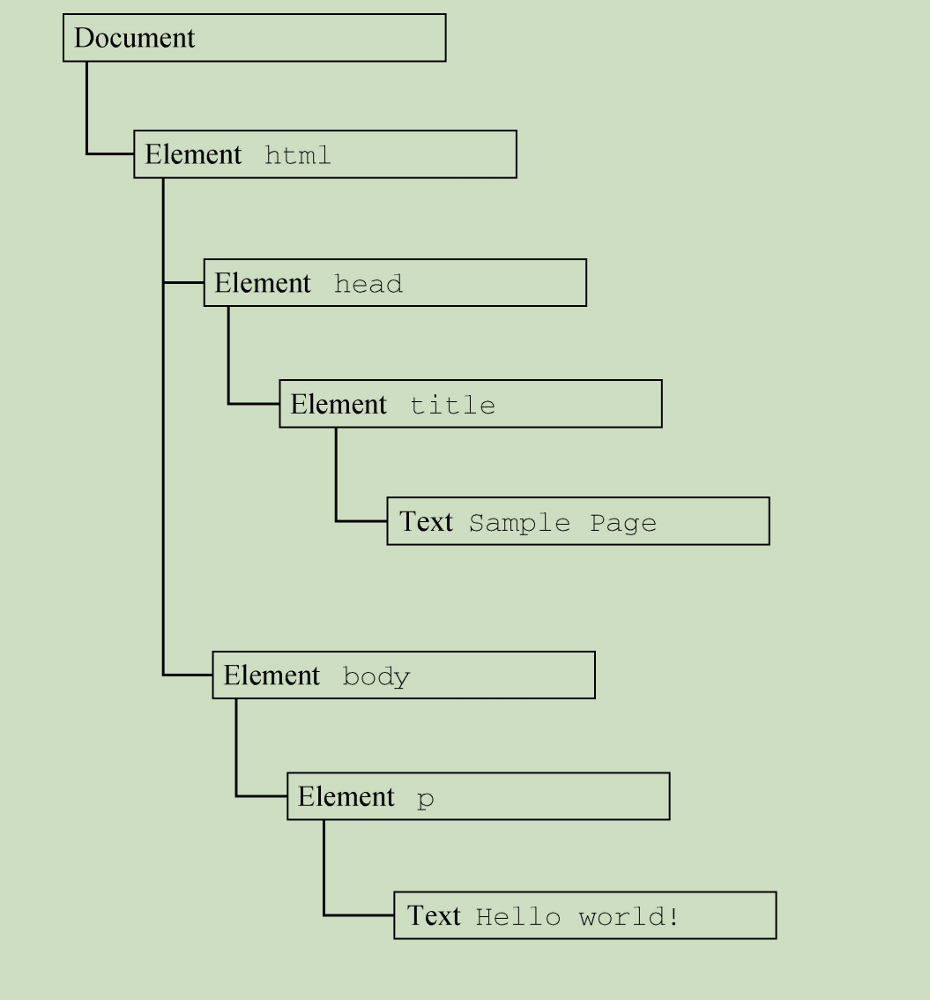
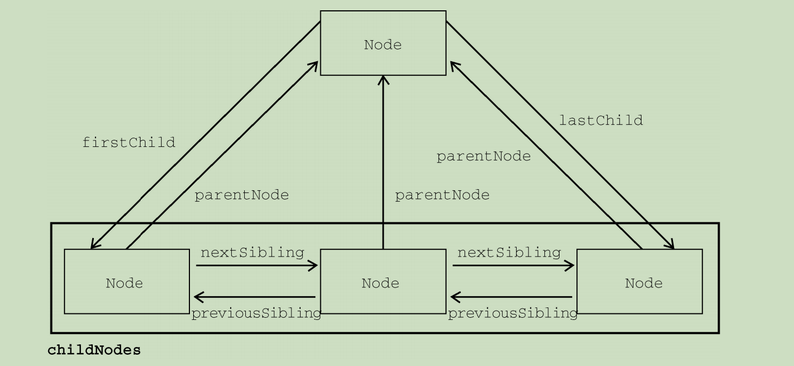
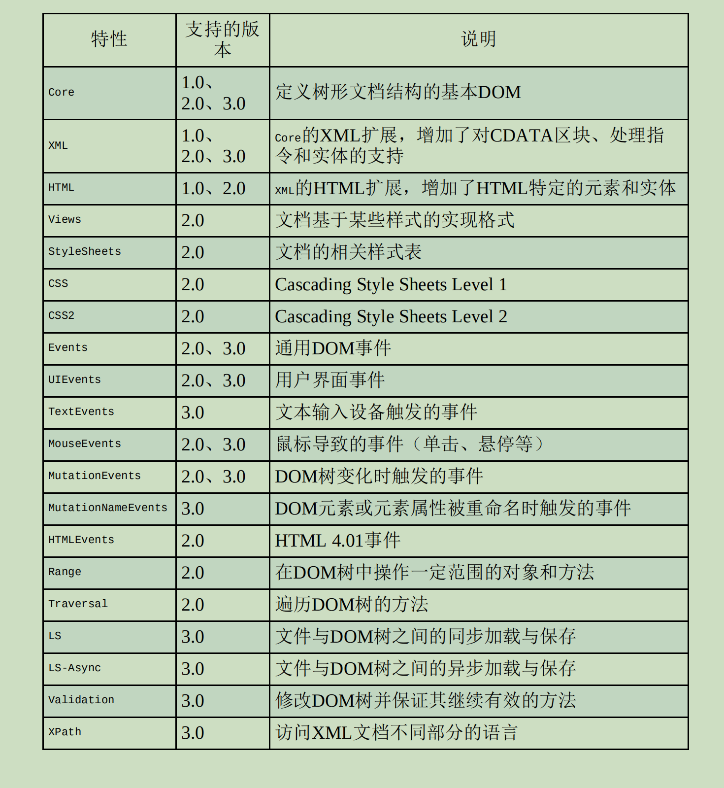
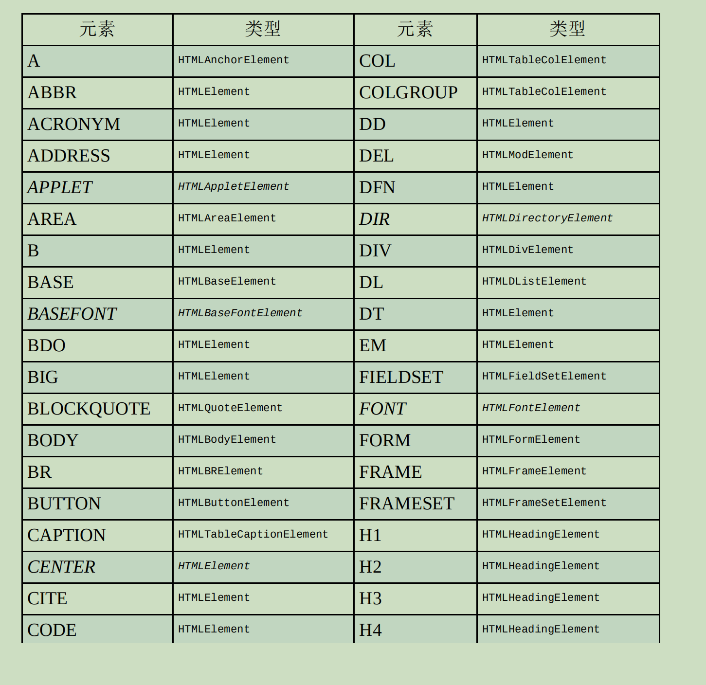
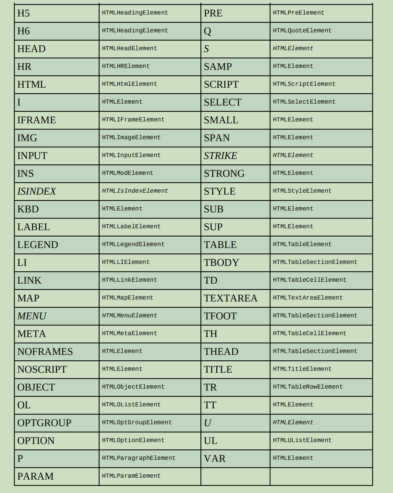

# 第 **14** 章 **DOM** 

- 本章内容

  - 理解文档对象模型（DOM）的构成 

  - 节点类型 

  - 浏览器兼容性 

  - MutationObserver接口 

- 文档对象模型（DOM，Document Object Model）

  是谁的接口？

  - HTML和XML文档的编程接口。

- DOM表示什么文档？

  - 由多层节点构成的

- 通过DOM可以做什么？

  - 添加、删除和修改页面的各个部分。

## **14.1** 节点层级 

- 任何HTML或XML文档都可以用DOM表示为一个什么结构？
  - 由节点构成的层级结构。

```
<html>
  <head>
    <title>Sample Page</title>
  </head>
  <body>
    <p>Hello World!</p>
  </body>
</html>

```

- 如果表示为层级结构，



- document节点表示什么？
  - 每个文档的根节点。
- 根节点的唯一子节点是什么元素？
  - \<html>文档元素（documentElement）。
- 文档元素是文档哪一层的元素？
  - 最外层

- 所有其他元素都存在于什么元素之内？
  - 文档元素
- 每个文档可以有几个文档元素？
  - 只能有一个
- 在HTML页面中，文档元素始终是什么？
  - \<html>元素。
- 在XML文档中，文档元素可以是什么？
  - 任何元素

- HTML中的每段标记都可以表示为什么？
  - 一个节点。
- 元素节点表示什么？
  - HTML元素
- 属性节点表示什么？
  - 属性
- 文档类型节点表示什么？
  - 文档类型

- 注释节点表示什么？
  - 注释
- DOM中总共有多少种节点类型？
  - 12种
- 这些节点类型都继承哪种基本类型？
  - Node类型

### **14.1.1** **Node**类型

- Node接口在JavaScript中被实现为什么？
  - Node类型，
- 哪些浏览器可以直接访问Node类型？
  - 在除IE之外的浏览器可以
- 在JavaScript中，所有节点类型都继承什么类型？
  - Node
- 是否所有类型都共享相同的基本属性和方法？
  - 是 

- 每个节点都有什么属性？

  - nodeType

- nodeType属性表示什么？

  - 该节点的类型

- 节点类型由什么表示？

  - 12个数值常量

  - Node.ELEMENT_NODE（1） 

    Node.ATTRIBUTE_NODE（2） 

    Node.TEXT_NODE（3） 

    Node.CDATA_SECTION_NODE（4） 

    Node.ENTITY_REFERENCE_NODE（5） 

    Node.ENTITY_NODE（6） 

    Node.PROCESSING_INSTRUCTION_NODE（7） 

    Node.COMMENT_NODE（8） 

    Node.DOCUMENT_NODE（9） 

    Node.DOCUMENT_TYPE_NODE（10） 

    Node.DOCUMENT_FRAGMENT_NODE（11） 

    Node.NOTATION__NODE（12） 

- 如何确定节点类型？
  - 与这些常量比较

```
//someNode是一个元素节点。
if (someNode.nodeType == Node.ELEMENT_NODE) {
    alert("Node is an element.");
}

```

- 浏览器是否支持所有节点类型？
  - 否
- 开发者最常用到的是哪些类型？
  - 元素节点
  - 文本节点

#### \01. **nodeName**与**nodeValue** 

- nodeName与nodeValue保存着什么？
  - 有关节点的信息。
- 这两个属性的值完全取决于什么？
  - 节点类型
- 在使用这两个属性前，最好先做什么？
  - 检测节点类型

```
if (someNode.nodeType == 1) {
    value = someNode.nodeName; // 会显示元素的标签名
}
```

- 在这个例子中，先检查了什么？
  - 节点是不是元素
- 对元素而言，nodeName等于什么？
  - 元素的标签名
- 对元素而言，nodeValue等于什么？
  - null

#### \02. 节点关系 

- 节点关系可以形容为什么关系？
  - 家族关系，
  - 相当于把文档树比作家谱。
- 在HTML中，\<body>元素是\<html>元素的什么？
  - 子元素
- \<html>元素是\<body>元素的什么？
  - 父元素
- \<head>元素是\<body>元素的什么？
  - 同胞元素
  - 因为它们有共同的父元素\<html>。 

- 是否每个节点都有一个childNodes属性？
  - 是
- childNodes属性包含什么？
  - NodeList对象
- NodeList是一个什么？
  - 类数组对象，
- NodeList用于什么？
  - 存储可以按位置存取的有序节点。
- NodeList是不是Array的实例？
  - 不是
- NodeList是否可以使用中括号访问它的值？
  - 可以
- NodeList是否有length属性？
  - 有
- NodeList是一个对什么的查询？
  - DOM结构

- DOM结构的变化是否会在NodeList中反映出来？

  - 是

- NodeList是实时的活动对象

  还是是第一次访问时所获得内容的快照？

  - 实时的活动对象

- 如何访问NodeList中的元素？
  - 使用中括号
  - 使用item()方法

```
let firstChild = someNode.childNodes[0];
let secondChild = someNode.childNodes.item(1);
let count = someNode.childNodes.length;
```

- 多数开发者倾向于使用什么？
  - 中括号
  - 因为它是一个类数组对象。
- length属性表示什么？ 
  - 那一时刻NodeList中节点的数量。
- 如何把NodeList对象转换为数组？
  - 使用Array.prototype.slice()
  - ES6的Array.from()静态方法

```
let arrayOfNodes = Array.prototype.slice.call(someNode.childNodes,0);
```

```
let arrayOfNodes = Array.from(someNode.childNodes);
```

- 是否每个节点都有一个parentNode属性？

  - 是

- parentNode指向什么？

  - 父元素

- childNodes中的所有节点是否都有同一个父元素？

  - 是

- childNodes列表中的每个节点

  都是同一列表中其他节点的什么？

  - 同胞节点

- 如何在childNodes列表的节点间导航？

  - previousSibling
  - nextSibling

- childNodes列表中

  第一个节点的previousSibling属性是什么？

  - null，

- childNodes列表中

  最后一个节点的nextSibling属性是什么？

  - null

```
if (someNode.nextSibling === null) {
    alert("Last node in the parent's childNodes list.");
} else if (someNode.previousSibling === null) {
    alert("First node in the parent's childNodes list.");
}
```

- 如果childNodes中只有一个节点，

  则它的previousSibling和nextSibling属性是什么？

  - 都是null。

- firstChild指向什么？
  - childNodes中第一个子节点
- lastChild指向什么？
  - childNodes中最后一个子节点
- someNode.firstChild的值等于什么？
  - someNode.childNodes[0]， 

- someNode.lastChild的值等于什么？ 
  - someNode.childNodes[someNode.childNodes.length-1]。

- 如果只有一个子节点，则firstChild和lastChild指向什么？
  - 同一个节点。
- 如果没有子节点，则firstChild和lastChild什么？
  - 都是null



- hasChildNodes()返回true则说明什么？
  - 节点有一个或多个子节点。

- ownerDocument属性是什么？ 

  - 一个指向

    代表整个文档的

    文档节点的指针。

- 所有节点都被谁所拥有？

  - 创建它们的文档

- 一个节点是否可能同时存在于两个或者多个文档中？
  - 不可能
- ownerDocument属性为什么提供了便利？
  - 迅速访问文档节点
    - 因为无需在文档结构中逐层上溯了。 

- 是否所有节点都有子节点？
  - 否

#### \03. 操纵节点

- 所有关系指针是否只读的？
  - 是
- appendChild()用于什么？
  - 在childNodes列表末尾添加节点。
- 添加新节点会更新什么？
  - 相关的关系指针，
    - 包括父节点和之前的最后一个子节点。
- appendChild()方法返回什么？
  - 新添加的节点

```
let returnedNode = someNode.appendChild(newNode);
alert(returnedNode == newNode); // true 
alert(someNode.lastChild == newNode); // true
```

- 如果把文档中已经存在的节点传给appendChild()，

  则这个节点会执行什么操作？ 

  - 从之前的位置被转移到新位置。

- 一个节点是否会在文档中同时出现在两个地方？

  - 不会

- 如果调用appendChild()传入父元素的第一个子节点，

  则这个节点会成为什么？

  - 父元素的最后一个子节点

```
// 假设someNode有多个子节点 
let returnedNode = someNode.appendChild(someNode.firstChild);
alert(returnedNode == someNode.firstChild); // false
alert(returnedNode == someNode.lastChild); // true
```

- 如果想把节点放到childNodes中的特定位置而不是末尾，

  则可以使用什么方法？

  - insertBefore()

- insertBefore()方法接收哪两个参数？

  - 要插入的节点
  - 参照节点

- 调用insertBefore()方法后，

  要插入的节点会变成参照节点的什么？

  - 前一个同胞节点，
  - 并被返回。

- 如果参照节点是null，

  则insertBefore()的效果是什么？

  - 与appendChild()效果相同

```
// 作为最后一个子节点插入
returnedNode = someNode.insertBefore(newNode, null);
alert(newNode == someNode.lastChild); // true

// 作为新的第一个子节点插入 
returnedNode = someNode.insertBefore(newNode, someNode.firstChild);
alert(returnedNode == newNode); // true 
alert(newNode == someNode.firstChild); // true

// 插入最后一个子节点前面 
returnedNode = someNode.insertBefore(newNode, someNode.lastChild);
alert(newNode == someNode.childNodes[someNode.childNodes.length - 2]); // true
```

- appendChild()和insertBefore()在插入节点时

  是否会删除任何已有节点？

  - 不会

- replaceChild()方法接收哪两个参数？
  - 要插入的节点
  - 要替换的节点
- 要替换的节点会被怎么处理？
  - 返回
  - 从文档树中移除
  - 要插入的节点会取而代之。

```
// 替换第一个子节点 
let returnedNode = someNode.replaceChild(newNode, someNode.firstChild);

// 替换最后一个子节点 
returnedNode = someNode.replaceChild(newNode, someNode.lastChild);
```

- 使用replaceChild()插入一个节点后，

  所有关系指针都会执行什么操作？

  - 从被替换的节点复制过来。

- 被替换的节点从技术上说被什么所拥有？

  - 同一个文档 

- 文档中是否有被替换的节点的位置？

  - 没有

- 要移除节点可以使用什么方法？

  - removeChild()

- removeChild()方法接收哪一个参数？

  - 要移除的节点

- 移除的节点会怎么处理？

  - 返回

```
// 删除第一个子节点 
let formerFirstChild = someNode.removeChild(someNode.firstChild); 

// 删除最后一个子节点 
let formerLastChild = someNode.removeChild(someNode.lastChild);
```

- 通过removeChild()被移除的节点

  从技术上说是否被同一个文档所拥有？

  - 是

- 文档中是否有被移除的节点的位置？
  - 没有

- 使用这四个方法之前必须先做什么？
  - 取得父节点（使用前面介绍的parentNode属性）。 

- 是否所有节点类型都有子节点？

  - 不是

- 如果在不支持子节点的节点上调用这些方法，

  则会导致什么？

  - 抛出错误。

#### \04. 其他方法

- cloneNode()，会返回什么？ 

  - 与调用它的节点一样的节点。

- cloneNode()方法接收一个什么参数？

  - 布尔值

- cloneNode()方法的参数表示什么？

  - 是否深复制

- 在传入true参数时，会进行什么复制？

  - 深复制

- 深复制是什么？

  - 复制节点及其整个子DOM树。

- 如果传入false，则只会复制什么？

  - 调用该方法的节点。

- 复制返回的节点属于什么?

  - 文档

- 复制返回的节点尚未指定父节点， 

  称为什么节点？

  - 孤儿节点

- 如何把孤儿节点添加到文档中？
  - appendChild()
  - insertBefore()
  - replaceChild()

```
<ul>
  <li>item 1</li>
  <li>item 2</li>
  <li>item 3</li>
</ul>
 
```

- 如果myList保存着对这个\<ul>元素的引用，

  则下列代码展示了使用cloneNode()方法的两种方式：

```
let deepList = myList.cloneNode(true);
alert(deepList.childNodes.length); // 3（IE9之前的版本）或7（其他浏览器） 

let shallowList = myList.cloneNode(false); 
alert(shallowList.childNodes.length); // 0
```

- deepList有什么？

  - 3个列表项，

- 每个列表项又各自包含什么？

  - 文本。

- 变量shallowList则保存着什么？

  - myList的浅副本
    - 因此没有子节点。

- deepList.childNodes.length的值会因什么而不同？

  - 浏览器对空格的处理方式

- IE9之前的版本是否会为空格创建节点？

  - 不会

- cloneNode()方法是否会复制

  DOM节点的JavaScript属性？

  - 不会
    - 比如事件处理程序。

- 这个方法只复制什么属性？

  - HTML属性
  - 子节点（可选）

- 推荐在复制前先做什么？
  - 删除事件处理程序。 

- normalize()的任务是什么？
  - 处理文档子树中的文本节点。
- 调用normalize()方法会检测什么？
  - 这个节点的所有后代，
- 如果发现空文本节点，则执行什么操作？ 
  - 将其删除；
- 如果两个同胞节点是相邻的，则执行什么操作？
  - 将其合并为一个文本节点。

### **14.1.2** **Document**类型 

- Document类型是JavaScript中表示什么的类型？

  - 文档节点

- 在浏览器中，文档对象document是什么的实例？

  - HTMLDocument

- HTMLDocument继承什么？

  - Document

- HTMLDocument表示什么？ 

  - 整个HTML页面

- document是谁的属性？

  - window对象

- document是否是一个全局对象？

  - 是

- Document类型的节点有哪些特征？

  - nodeType等于9； 

    nodeName值为"#document"； 

    nodeValue值为null； 

    parentNode值为null； 

    ownerDocument值为null； 

    子节点可以是DocumentType（最多一个）、

    Element（最多一 

    个）、

    ProcessingInstruction

    Comment类型。 

- Document类型可以表示什么？
  - HTML页面
  - 其他XML文档，
- 如何取得document对象？
  - 通过HTMLDocument的实例
- document对象可用于什么？
  - 获取页面的信息
  - 操纵页面外观和底层结构。

#### \01. 文档子节点 

- DOM规范规定Document节点的子节点可以是什么？
  - DocumentType
  - Element
  - ProcessingInstruction
  - Comment
- document.documentElement属性指向什么?
  - HTML页面中的\<html>元素。
- document.childNodes中是否有<html>元素？
  - 有

```
<html>
  <body></body>
</html>

```

- \<html>元素可以通过什么访问？
  - documentElement属性
  - childNodes列表

```
let html = document.documentElement; // 取得对<html>的引用 

alert(html === document.childNodes[0]); // true

alert(html === document.firstChild); // true
```

- document.body属性指向什么？
  - \<body>元素。

```
let body = document.body; // 取得对<body>的引用
```

- 是否所有主流浏览器都支持

  document.documentElement和document.body?

  - 是

- DocumentType是谁的子节点？

  - Document类型

- \<!doctype>标签是什么？

  - 文档中独立的部分

- \<!doctype>的信息可以通过什么属性来访问？

  - document.doctype

- \<html>元素外面的注释是否是文档的子节点？
  - 是 
- \<html>元素外面的注释的类型是什么？
  - Comment
- \<html>元素外面的注释是否一定能被识别？
  - 不一定
    - 浏览器实现不同，

```
<!-- 第一条注释 -->
<html>
  <body></body>
</html>
<!-- 第二条注释 -->

```

- 这个页面有哪些子节点？

  - 注释
  - \<html>元素
  - 注释

- document.childNodes应该包含几项？

  - 3

- appendChild()、removeChild()和replaceChild()方法

  一般是否会用在document对象上？

  - 不会

- 文档类型是否是只读的？

  - 是

- 文档类型只能有几个Element类型的子节点？

  - 只能有一个
    - \<html>

#### \02. 文档信息

- document.title包含什么？
  - \<title>元素中的文本

- \<title>元素中的文本通常显示在哪里？
  - 浏览器窗口
  - 标签页的标题栏
- 通过document.title属性可以做什么？
  - 读写页面的标题，

- 修改后的标题会反映在哪里？
  - 浏览器标题栏上。
- 修改title属性是否会改变\<title>元素？
  - 不会

```
// 读取文档标题 
let originalTitle = document.title;

// 修改文档标题
document.title = "New page title";
```

- document.URL包含什么？

  - 当前页面的完整URL

    （地址栏中的URL）

- document.domain包含什么？

  - 页面的域名，

- document.referrer包含什么？

  - 链接到当前页面的

    那个页面的URL。

- 如果当前页面没有来源，则referrer属性包含什么？
  - 空字符串。
- 所有这些信息都可以在哪里获取？
  - 请求的HTTP头部信息中

```
// 取得完整的URL 
let url = document.URL;

// 取得域名 
let domain = document.domain;

// 取得来源 
let referrer = document.referrer;
```

- URL跟什么是相关的？

  - 域名

- 如果document.URL 

  是http://www.wrox.com/WileyCDA/，

  则document.domain就是什么？ 

  - 是www.wrox.com。 

- 在这些属性中，只有什么属性是可以设置的？

  - domain

- 如果URL包含子域名如p2p.wrox.com，

  是否可以将domain设置为"wrox.com"？

  - 可以

- 不能给domain属性设置什么？
  - URL中不包含的值

```
// 页面来自p2p.wrox.com 

document.domain = "wrox.com"; // 成功
document.domain = "nczonline.net"; // 出错！
```

- 当页面中包含来自某个不同子域的窗格（\<frame>）

  或内嵌窗格（\<iframe>)时，

  设置document.domain是否有用？

  - 是

- 不同子域的页面间是否能通过JavaScript通信？

  - 不能
    - 因为跨源通信存在安全隐患

- 如何让这些页面就可以访问对方的JavaScript对象？

  - 把document.domain设置为相同的值。

- 一个加载自www.wrox.com的页面中包含一个内嵌窗格，

  其中的页面加载自p2p.wrox.com。

  这两个页面的document.domain包含不同的字符串，

  内部和外部页面是否能访问对方的JavaScript对象？

  - 不能

- 如果每个页面都把document.domain设置为wrox.com

  那这两个页面是否可以相互通信？

  - 可以

- domain属性一旦放松是否能再收紧？

  - 不能

- 把document.domain 设置为"wrox.com"之后，

  是否能设置回"p2p.wrox.com"？

  - 不能
    - 会导致错误，

```
// 页面来自p2p.wrox.com 
document.domain = "wrox.com"; // 放松，成功
document.domain = "p2p.wrox.com"; // 收紧，错误！
```

#### \03. 定位元素 

- getElementById()方法接收什么参数？
  - 要获取元素的ID，
- 如果找到了则返回什么？
  - 这个元素，
- 如果没找到则返回什么？
  - null。
- 参数ID跟什么完全匹配？
  - 元素在页面中的id属性值
- 参数ID是否区分大小写？
  - 是

```
<div id="myDiv">Some text</div>
```

```
let div = document.getElementById("myDiv");
// 取得对这个<div>元素的引用
```

- 参数大小写不匹配会返回什么？
  - null

```
let div = document.getElementById("mydiv");
// null
```

- 如果页面中存在多个具有相同ID的元素，

  则getElementById()返回什么？

  - 在文档中出现的第一个元素。

- getElementsByTagName()接收什么参数？
  - 要获取元素的标签名，
- getElementsByTagName()返回什么？
  - 包含零个或多个元素的NodeList
- getElementsByTagName()方法返回的是什么对象？
  - 一个HTMLCollection对象。
- HTMLCollection与NodeList的相似之处是什么？
  - 都是“实时”列表，

```
let images = document.getElementsByTagName("img");
```

- 如何从HTMLCollection取得特定的元素？
  - 中括号
  - item()方法
- 如何取得HTMLCollection元素的数量？
  - length属性

```
alert(images.length); // 图片数量 alert(images[0].src); // 第一张图片的src属性 alert(images.item(0).src); // 同上
```

- 如何通过标签的name属性取得某一项的引用？
  - HTMLCollection对象的namedItem()

```

```

```
let myImage = images.namedItem("myImage")
```

- 对于name属性的元素，是否可以使用中括号来获取？
  - 可以

```
let myImage = images["myImage"];
```

- 对HTMLCollection对象而言，中括号可以做什么？
  - 接收数值索引，
  - 接收字符串索引。
- 中括号在后台会执行什么操作？
  - 数值索引会调用item()，
  - 字符串索引会调用namedItem()。

- 如何取得文档中的所有元素？
  - 给getElementsByTagName()传入*

- 在JavaScript和CSS中，*一般被认为是什么？
  - 匹配一切的字符

```
let allElements = document.getElementsByTagName("*");
```

- document.getElementsByTagName()方法

  是否区分大小写？

  - 规范要求区分大小写，
  - 实际上是不区分大小写
    - 为了兼容原有HTML页 

- getElementsByName()方法返回什么？

  - 具有给定name属性的所有元素。

- getElementsByName()方法最常用于什么？

  - 单选按钮，

- 同一字段的单选按钮必须具有什么属性

  才能把正确的值发送给服务器

  - 相同的name属性

```
<fieldset>
  <legend>Which color do you prefer?</legend>
  <ul>
    <li>
      <input type="radio" value="red" name="color" id="colorRed" />
      <label for="colorRed">Red</label>
    </li>
    <li>
      <input type="radio" value="green" name="color" id="colorGreen" />
      <label for="colorGreen">Green</label>
    </li>
    <li>
      <input type="radio" value="blue" name="color" id="colorBlue" />
      <label for="colorBlue">Blue</label>
    </li>
  </ul>
</fieldset>

```

- 单选按钮的ID是为了匹配什么？
  - 对应的\<label>元素，
- name相同是为了什么？
  - 只将三个中的一个值发送给服务器

```
let radios = document.getElementsByName("color");
```

- getElementsByName()方法返回什么？ 

  - HTMLCollection

- 在所有项的name属性都一样的情况下，

  namedItem()方法会取得哪一项？

  - 第一项 

#### \04. 特殊集合

- document.anchors包含什么？
  - 文档中所有带name属性的\<a>元素。 

- document.forms包含什么？
  - 文档中所有\<form>元素 

- document.images包含什么？
  - 文档中所有\元素 

- document.links包含什么？
  - 文档中所有带href属性的\<a>元素。 

- 这些特殊集合存在于什么对象上？
  - HTMLDocument
- 内容是否会实时更新以符合当前文档的内容？
  - 会 

#### \05. **DOM**兼容性检测

- document.implementation属性是什么？
  - 一个对象，
- document.implementation提供了什么？
  - 与浏览器DOM实现相关的信息和能力。
- hasFeature()方法接收哪两个参数？
  - 特性名称
  - DOM版本

- 如果浏览器支持指定的特性和版本

  hasFeature()方法返回什么？

  - true

```
let hasXmlDom = document.implementation.hasFeature("XML", "1.0");
```

- 可以使用hasFeature()方法测试的特性及版本如下表所列



- hasFeature()的返回值是否可靠？

  - 不可靠
  - 实现不一致

- 目前这个方法已经被废弃，不再建议使用。

- 为了向后兼容，

  目前主流浏览器仍然支持这个方法，

  但无论检测什么都一律返回什么？

  - true。 

#### \06. 文档写入

- write()和writeln()方法都接收什么参数？

  - 一个字符串参数

- write()和writeln()可以做什么？

  - 将这个字符串写入网页中。

- write()写入什么？

  - 文本

- writeln()会在字符串末尾追加什么？

  - 一个换行符（\n）

- write()和writeln()方法可以用来做什么？

  - 在页面加载期间

    向页面中动态添加内容

```
<html>
  <head>
    <title>document.write() Example</title>
  </head>
  <body>
    <p>
      The current date and time is:
      <script type="text/javascript">
        document.write("<strong>" + new Date().toString() + "</strong>");
      </script>
    </p>
  </body>
</html>

```

- 这个例子会在什么过程中输出当前日期和时间？

  - 页面加载

- 这意味着会创建一个DOM元素，以后是否可以访问？

  - 可以

- 通过write()和writeln()输出的任何HTML

  都会以这种方式来处理。 

- write()和writeln()方法用于什么？

  - 动态包含外部资源
    - 如JavaScript文件

- 在包含JavaScript文件时，

  是否能直接包含字符串"\</script>"？

  - 不能

- "\</script>"字符串会被解释为什么？
  - 脚本块的结尾
- 包含"\</script>"字符串会导致什么？
  - 后面的代码不能执行

```
<html> 
	<head> 
		<title>document.write() Example</title> 	</head> 
	<body> 
		<script type="text/javascript"> 	
			document.write("<script 		
			type=\"text/javascript\" 
			src=\"file.js\">" + "</script>");
		</script>
    </body>
</html>
```

- 输出之后的"\</script>"会匹配什么？
  - 最外层的\<script>标签，
  - 导致页面中显示出");。
- 如何避免"\</script>"的问题？ 
  - 加上转义字符"\\"

```
<html>
  <head>
    <title>document.write() Example</title>
  </head>
  <body>
    <script type="text/javascript">
      document.write(
        '<script type="text/javascript" src="file.js">' + "<\/script>"
      );
    </script>
  </body>
</html>

```

- 如果是在页面加载完之后再调用document.write()，

  则输出的内容会执行什么操作？

  - 重写整个页面

```
<html>
  <head>
    <title>document.write() Example</title>
  </head>
  <body>
    <p>
      This is some content that you won't get to see because it will be
      overwritten.
    </p>
    <script type="text/javascript">
      window.onload = function () {
        document.write("Hello world!");
      };
    </script>
  </body>
</html>

```

- window.onload事件处理程序做了什么？

  - 将调用document.write()的函数

    推迟到页面加载完毕后执行。

- 字符串"Hello world!"是否会重写整个页面内容？
  - 会 

- open()用于什么？

  - 打开网页输出流。

- close()方法用于什么？

  - 关闭网页输出流。

- 在调用write()和writeln()时，

  open()方法和close()是否是必需的？

  - 不是

- 严格的XHTML文档是否支持文档写入？

  - 不支持

- 对于内容类型为application/xml+xhtml的页面，

  文档写入方法是否起作用？

  - 不起作用

- 元素是什么的实例？

  - HTMLHtmlElement

- HTMLHtmlElement继承什么？

  - HTMLElement

- HTMLElement继承什么？

  - Element

- HTML文档是否可以包含多个子节点？

  - 不可以
  - 不能多于一个

### **14.1.3** **Element**类型 

- Element类型的节点具有哪些特征？

  - nodeType等于1； 
  - nodeName值为元素的标签名； 

  - nodeValue值为null； 

  - parentNode值为Document或Element对象； 

  - 子节点是Element、Text、Comment、ProcessingInstruction、CDATASection类型

- 如何获取元素的标签名？
  - nodeName
  - tagName

```
<div id="myDiv"></div>
```

```
let div = document.getElementById("myDiv");
alert(div.tagName); // "DIV" 
alert(div.tagName == div.nodeName); // true
```

- div.tagName返回的是"DIV"还是"div"？
  - "DIV"
- 在HTML中，元素标签名怎么表示？
  - 全大写
- 在XML（包括XHTML）中，标签名怎么表示？
  - 与源代码中的大小写一致。
- 最好将标签名转换为什么形式？
  - 小写
    - 以便于比较

```
if (element.tagName == "div") { // 不要这样做，可能出错！
    // do something here
}
if (element.tagName.toLowerCase() == "div") {
    // 推荐，适用于所有文档 // 做点什么 
}
```

#### \01. **HTML**元素 

- 所有HTML元素都通过什么类型表示？

  - HTMLElement

- 所有HTML元素上都有的标准属性有哪些？

  - id，元素在文档中的唯一标识符； 

  - title，包含元素的额外信息，通常以提示条形式展示； 

  - lang，元素内容的语言代码（很少用）； 

  - dir，语言的书写方向
    - （"ltr"表示从左到右，
    - "rtl"表示从右到左
    - ，同样很少用）； 

  - className，相当于class属性，

    - 用于指定元素的CSS类

    - （因为class是ECMAScript关键字，

      所以不能直接用这个名字）。

```
<div id="myDiv" class="bd" title="Body text" lang="en" dir="ltr"></div>
```

```
let div = document.getElementById("myDiv"); alert(div.id); // "myDiv" 
alert(div.className); // "bd"
alert(div.title); // "Body text" 
alert(div.lang); // "en" 
alert(div.dir); // "ltr"
```

```
div.id = "someOtherId"; 
div.className = "ft"; 
div.title = "Some other text"; 
div.lang = "fr"; 
div.dir ="rtl";
```

- 修改id或lang对用户是否可见？
  - 不可见
- 修改title属性只会在什么时侯反映出来？
  - 鼠标移到这个元素上
- 修改dir会导致什么？
  - 页面文本立即向左或向右对齐。
- 修改className会导致什么？
  - 立即应用到新类名的CSS样式

- 所有HTML元素都是什么的实例？

  - HTMLElement或其子类型

- 下表列出了所有HTML元素及其对应的类型

  （斜体表示已经废弃的元素）





#### \02. 取得属性

- 每个元素的属性用于什么？
  - 附加信息。
- 与属性相关的DOM方法主要有什么？
  - getAttribute()
  - setAttribute()
  - removeAttribute()

```
let div = document.getElementById("myDiv");
alert(div.getAttribute("id")); // "myDiv"
alert(div.getAttribute("class")); // "bd" 
alert(div.getAttribute("title")); // "Body text" 
alert(div.getAttribute("lang")); // "en" 
alert(div.getAttribute("dir")); // "ltr"
```

- 传给getAttribute()的属性名

  与它们实际的属性名是否是一样的？

  - 是

- 如果给定的属性不存在，则getAttribute()返回什么？
  - null

- getAttribute()方法是否能取得自定义属性的值？
  - 能

```
<div id="myDiv" my_special_attribute="hello!"></div>
```

```
let value = div.getAttribute("my_special_attribute");
```

- 属性名是否区分大小写？
  - 不区分
- 自定义属性名应该怎么命名？
  - 前缀data- 
    - 以方便验证。 

- 元素的所有属性是否可以通过

  相应DOM元素对象的属性来取得？

  - 可以

- 所有公认（非自定义）的属性是否

  会被添加为DOM对象的属性？

  - 会

```
<div id="myDiv" align="left" my_special_attribute="hello"></div>
```

- 自定义属性是否会成为DOM对象的属性？
  - 不会

- 通过DOM对象访问的属性中

  有哪两个返回的值

  跟使用getAttribute()取得的值不一样？

  - style属性
  - 事件处理程序
    - 比如onclick。

- style属性用于什么？

  - 为元素设定CSS样式。

- 在使用getAttribute()访问style属性时，返回的是什么？

  - CSS字符串。

- 在通过DOM对象的属性访问style属性时，返回的是什么？

  - 一个（CSSStyleDeclaration）对象。

- DOM对象的style属性用于什么？

  - 以编程方式读写元素样式，

- 在元素上使用事件属性时，属性的值是什么？ 
  - 一段JavaScript代码。
- 如果使用getAttribute()访问事件属性，则返回什么？
  - 字符串形式的源代码。
- 通过DOM对象的属性访问事件属性时返回什么？
  - 一个JavaScript函数
  - （未指定该属性则返回null）。 

- 考虑到以上差异，

  开发者在进行DOM编程时通常会放弃使用什么？

  - getAttribute()
  - 只使用对象属性。

- getAttribute()主要用于什么？

  - 取得自定义属性的值。 

#### \03. 设置属性 

- 与getAttribute()配套的方法是什么？
  - setAttribute()

- setAttribute()方法接收什么参数？
  - 要设置的属性名
  - 属性的值
- 如果属性已经存在，则setAttribute()会执行什么操作？
  - 以指定的值替换原来的值
- 如果属性不存在，则setAttribute()会执行什么操作？
  - 以指定的值创建该属性

```
div.setAttribute("id", "someOtherId");
div.setAttribute("class", "ft");
div.setAttribute("title", "Some other text");
div.setAttribute("lang", "fr");
div.setAttribute("dir", "rtl");
```

- setAttribute()适用于什么属性？

  - HTML属性
  - 自定义属性

- 使用setAttribute()方法设置的属性名会转换成什么形式？

  - 规范为小写形式

- 直接给DOM对象的属性赋值

  是否可以设置元素属性的值？

  - 可以

```
div.id = "someOtherId";
div.align = "left";
```

- 在DOM对象上添加自定义属性，

  是否会自动让它变成元素的属性？

  - 不会

```
div.mycolor = "red";
alert(div.getAttribute("mycolor")); // null（IE除外）
```

- removeAttribute()用于什么？
  - 从元素中删除属性
- removeAttribute()执行什么操作？
  - 清除属性的值
  - 把整个属性完全从元素中去掉

```
div.removeAttribute("class");
```

#### \04. **attributes** 属性

- 唯一使用attributes属性的DOM节点类型？

  - Element类型

- attributes属性包含一个什么实例？

  - NamedNodeMap

- NamedNodeMap是什么？

  - 一个类似NodeList的“实时”集合。

- NamedNodeMap元素的每个属性都表示什么？

  - 一个Attr节点，

- NamedNodeMap对象包含哪些方法？

  - getNamedItem(*name*)，
    - 返回nodeName属性等于*name*的节点； 

  - removeNamedItem(*name*)，
    - 删除nodeName属性等于*name*的节点； 

  - setNamedItem(*node*)，
    - 向列表中添加*node*节点，
    - 以其nodeName为索引； 
  - item(*pos*)，
    - 返回索引位置*pos*处的节点

- attributes属性中的每个节点的nodeName是什么？
  - 对应属性的名字，
- nodeValue是什么？
  - 属性的值。

- 如何取得元素id属性的值？

```
let id = element.attributes.getNamedItem("id").nodeValue;
```

-  使用中括号访问属性的简写形式：

```
let id = element.attributes["id"].nodeValue;
```

- 设置属性的值，

```
element.attributes["id"].nodeValue = "someOtherId";
```

- removeNamedItem()方法用于什么？

  - 删除指定名字的属性。

- removeAttribute和removeNamedItem

  唯一的不同之处是什么？

  - removeNamedItem()返回表示被删除属性的Attr节点：

```
let oldAttr = element.attributes.removeNamedItem("id");
```

- setNamedItem()方法接收什么参数？
  - 一个属性节点
- setNamedItem方法用于做什么？
  - 给元素添加一个新属性

```
element.attributes.setNamedItem(newAttr)
```

- 开发者更喜欢使用

  getAttribute()、removeAttribute()和setAttribute()方法

- attributes属性最有用的场景是什么？
  - 需要迭代元素上所有属性的时候。 

```
function outputAttributes(element) {
    let pairs = [];
    for (let i = 0, len = element.attributes.length; i < len; ++i) {
        const attribute = element.attributes[i];
        pairs.push(`${attribute.nodeName}="${attribute.nodeValue}"`);
    }
    return pairs.join(" ");
}
```

#### \05. 创建元素 

- 如何创建新元素？
  - document.createElement()
- document.createElement()方法接收什么参数？
  - 要创建元素的标签名
- 在HTML文档中，标签名是否区分大小写？ 
  - 不区分大小写

- XML文档（包括XHTML）是否区分大小写？
  - 区分大小写 

```
let div = document.createElement("div");
```

- 使用createElement()方法创建新元素的

  同时会执行什么操作？

  - 会将其ownerDocument属性设置为document

```
div.id = "myNewDiv"; 
div.className = "box";
```

- 在新元素上设置属性是否会显示在浏览器？
  - 不会
  - 因为这个元素还没有添加到文档树
- 如何把元素添加到文档树？
  - appendChild()、
  - insertBefore()
  - replaceChild()

```
document.body.appendChild(div);
```

#### \06. 元素后代

- childNodes属性包含什么？
  - 元素所有的子节点
- 这些子节点可能是什么？
  - 其他元素、
  - 文本节点、
  - 注释
  - 处理指令。
- 不同浏览器在识别这些节点时的表现是否一致？
  - 有明显不同。

```
<ul id="myList">
  <li>Item 1</li>
  <li>Item 2</li>
  <li>Item 3</li>
</ul>

```

- \<ul>元素会包含多少个子元素？

  - 7个

    - 3个是\<li>元素

    - 4个Text节点

      （表示<li>元素周围的空格）

- 如果把元素之间的空格删掉，

  则所有浏览器都会返回多少个子节点？

  - 3

```
<ul id="myList"><li>Item 1</li><li>Item 2</li><li>Item 3</li></ul>
```

- 通常在执行某个操作之前需要做什么？
  - 先检测节点的nodeType

```
for (let i = 0, len = element.childNodes.length; i < len; ++i) {
    if (element.childNodes[i].nodeType == 1) {
        // 执行某个操作 
    }
}
```

- 如何取得某个元素的子节点和其他后代节点？

  - 用元素的getElementsByTagName()方法。

- 在元素上调用getElementsByTagName()方法

  与在文档上调用有什么区别？

  - 搜索范围限制在当前元素之内
    - 只会返回当前元素的后代。

```
let ul = document.getElementById("myList");
let items = ul.getElementsByTagName("li");
```

- 如果ul包含更多层级，则会返回什么？ 
  - 所有层级中的\<li>元素