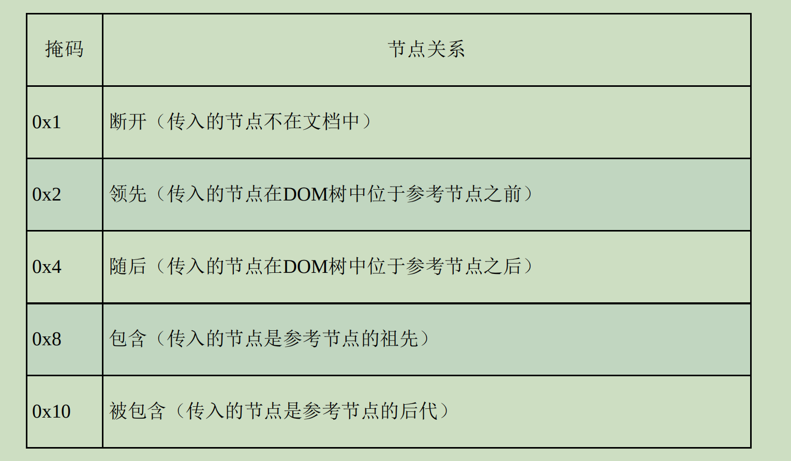

# 第 **15** 章 **DOM**扩展 

- 本章内容

  - 理解Selectors API 

  - 使用HTML5 DOM扩展

## **15.1 Selectors API**

- jQuery如何获取元素引用？
  - 以CSS选择符查询DOM
- Selectors API Level 1的核心是哪两个方法？
  - querySelector()
  - querySelectorAll()
- 什么类型的实例上会暴露这两个方法？
  - Document
  - Element

### **15.1.1** **querySelector()**

- querySelector()方法接收什么参数？
  - CSS选择符，
- querySelector()方法返回什么？
  - 匹配该模式的第一个后代元素，
  - 如果没有匹配项则返回null

```
// 取得<body>元素 
let body = document.querySelector("body");

// 取得ID为"myDiv"的元素
let myDiv = document.querySelector("#myDiv");

// 取得类名为"selected"的第一个元素 
let selected = document.querySelector(".selected");

// 取得类名为"button"的图片
let img = document.body.querySelector("img.button");

```

- 在Document上使用querySelector()方法时，

  会从哪里开始搜索？

  - 文档元素

- 在Element上使用querySelector()方法时，

  则只会在哪里查询？

  - 从当前元素的后代中  

- 如果选择符有语法错误或碰到不支持的选择符，

  则querySelector()方法会返回什么？

  - 抛出错误

### **15.1.2** **querySelectorAll()** 

- querySelectorAll()方法返回什么？
  - 所有匹配的节点
    - 一个NodeList的静态实例

- NodeList的静态实例是
  - 一个静态的“快照”，
  - 而非“实时”的查询。
- 如果没有匹配项，则返回什么？
  - 空的NodeList实例

- querySelectorAll()也可以什么类型上使用？ 
  - Document
  - DocumentFragment
  - Element

```
// 取得ID为"myDiv"的<div>元素中的所有<em>元素 
let ems = document.getElementById("myDiv").querySelectorAll("em");

// 取得所有类名中包含"selected"的元素
let selecteds = document.querySelectorAll(".selected");

// 取得所有是<p>元素子元素的<strong>元素 
let strongs = document.querySelectorAll("p strong");

```

- NodeList对象如何取得个别元素？
  - for-of循环
  - item()方法
  - 中括号

```
let strongElements = document.querySelectorAll("p strong");

// 以下3个循环的效果一样
for (let strong of strongElements) {
	strong.className = "important";
}

for (let i = 0; i < strongElements.length; ++i) {
	strongElements.item(i).className = "important";
}

for (let i = 0; i < strongElements.length; ++i) {
	strongElements[i].className = "important";
}

```

- 如果选择符有语法错误或碰到不支持的选择符，

  则querySelectorAll()方法会返回什么？

  - 抛出错误。

### **15.1.3** **matches()**

- matches()方法接收什么参数？
  - 一个CSS选择符
- 如果元素匹配则该选择符返回什么？
  - true，
  - 否则返回false

```
if (document.body.matches("body.page1")) {
	// true
}
```

## **15.2** 元素遍历

- Element Traversal API为DOM元素添加了哪5个属性？

  - childElementCount，
    - 返回子元素数量（不包含文本节点和注释）； 

  - firstElementChild，
    - 指向第一个Element类型的子元素

  - lastElementChild，
    - 指向最后一个Element类型的子元素

  - previousElementSibling，
    - 指向前一个Element类型的同胞元素  

  - nextElementSibling，
    - 指向后一个Element类型的同胞元素 

- 过去要以跨浏览器方式遍历特定元素的所有子元素

```
let parentElement = document.getElementById('parent');

let currentChildNode = parentElement.firstChild;

// 没有子元素，firstChild返回null，跳过循环
while (currentChildNode) {
	if (currentChildNode.nodeType === 1) {
		// 如果有元素节点，则做相应处理 
		processChild(currentChildNode);
	}
	
	if (currentChildNode === parentElement.lastChild) {
		break;
	}
	
	currentChildNode = currentChildNode.nextSibling;
}
```

- 使用Element Traversal属性之后，以上代码可以简化如下：

```
let parentElement = document.getElementById('parent');

let currentChildElement = parentElement.firstElementChild;

// 没有子元素，firstElementChild返回null，跳过循环 
while (currentChildElement) {

	// 这就是元素节点，做相应处理 
	processChild(currentChildElement);
	
	if (currentChildElement === parentElement.lastElementChild) {
		break;
	}
	
	currentChildElement = currentChildElement.nextElementSibling;
}
```

## **15.3 HTML5**

### **15.3.1 CSS**类扩展 

#### \01. **getElementsByClassName()** 

- getElementsByClassName()方法接收什么参数？
  - 包含一个或多个类名的字符串，
- getElementsByClassName返回什么？
  - 类名中包含相应类的元素的NodeList。
- 如果提供了多个类名，是否要按顺序？
  - 不用

```
// 取得所有类名中包含"username"和"current"元素
// 这两个类名的顺序无关紧要 
let allCurrentUsernames = document.getElementsByClassName("username current");

// 取得ID为"myDiv"的元素子树中所有包含"selected"类的元素 
let selected = document.getElementById("myDiv").getElementsByClassName("selected")
```

- 在特定元素上调用getElementsByClassName()

  则返回什么？

  - 该元素后代中匹配的元素

#### \02. **classList**属性 

- className是一个字符串，

  所以每次操作之后都需要怎么做才能生效？

  - 重新设置这个值

```
<div class="bd user disabled">...</div>
```

```
// 要删除"user"类 
let targetClass = "user";

// 把类名拆成数组 
let classNames = div.className.split(/\s+/);

// 找到要删除类名的索引 
let idx = classNames.indexOf(targetClass);

// 如果有则删除 
if (idx > -1) {
	classNames.splice(i, 1);
}

// 重新设置类名 
div.className = classNames.join(" ")
```

- classList是一个什么类型的实例？

  - DOMTokenList的实例。

- 如何知道DOMTokenList包含多少项？

  - length属性

- 如何取得DOMTokenList个别的元素？

  - item()
  - 中括号

- DOMTokenList还增加了以下方法。

  - add(*value*)，
    - 向类名列表中添加指定的字符串值value。
    - 如果这个值已经存在，
      - 则什么也不做。 

  - contains(*value*)，
    - 返回布尔值，
    - 表示给定的value是否存在。 

  - remove(*value*)，
    - 从类名列表中删除指定的字符串值value。 

  - toggle(*value*)，
    - 如果类名列表中已经存在指定的value，
      - 则删除；
    - 如果不存在，
      - 则添加。 

```
div.classList.remove("user");
```

```
// 删除"disabled"类
div.classList.remove("disabled");

// 添加"current"类 
div.classList.add("current");

// 切换"user"类 
div.classList.toggle("user");

// 检测类名
if (div.classList.contains("bd") && !div.classList.contains("disabled")) {
	// 执行操作
}

// 迭代类名 
for (let class of div.classList) {
	doStuff(class);
}
```

### **15.3.2** 焦点管理

- document.activeElement包含什么？
  - 当前拥有焦点的DOM元素。
- 页面加载时，如何让某个元素自动获得焦点？
  - 按Tab键
  - 代码中使用focus()方法

```
let button = document.getElementById("myButton");
button.focus();
console.log(document.activeElement === button); // true
```

- 默认情况下，document.activeElement的值是什么?
  - 在页面刚加载完之后为document.body
  - 在页面完全加载之前为null。

- document.hasFocus()方法返回什么？
  - 布尔值，
  - 表示文档是否拥有焦点： 

```
let button = document.getElementById("myButton");
button.focus();
console.log(document.hasFocus()); // true
```

### **15.3.3** **HTMLDocument**扩展

#### \01. **readyState**属性

- document.readyState属性有两个可能的值
  - loading，
    - 表示文档正在加载； 
  - complete，
    - 表示文档加载完成。

```
if (document.readyState == "complete"){
	// 执行操作 
}
```

#### \02. **compatMode**属性

- compatMode属性表示什么？

  - 浏览器当前处于什么渲染模式

  - 标准模式下"CSS1Compat"
  - 混杂模式下"BackCompat" 

```
if (document.compatMode == "CSS1Compat") {
	console.log("Standards mode");
} else {
	console.log("Quirks mode");
}
```

#### \03. **head**属性 

- document.head属性指向什么？
  - 文档的\<head>元素

```
let head = document.head;
```

### **15.3.4** 字符集属性

- characterSet属性表示什么？
  - 文档实际使用的字符集，

- 如何修改文档使用的字符集？
  - \<meta>元素
  - 响应头
  - characterSeet属性

```
console.log(document.characterSet); // "UTF-16" document.characterSet = "UTF-8";
```

### **15.3.5** 自定义数据属性 

- 如何指定非标准的属性？
  - 使用前缀data-

```
<div id="myDiv" data-appId="12345" data-myname="Nicholas"></div>
```

- 如何访问自定义数据属性？
  - dataset属性

- dataset属性是一个什么类型的实例？
  - DOMStringMap
- dataset包含什么？
  - 一组键/值对映射。 
- 元素的每个data-name属性中的什么作为键？
  - data-后面的字符串
  - data-myname、data-myName
    - myname
  - data-my-name、data-My-Name
    - myName

```
// 本例中使用的方法仅用于示范
let div = document.getElementById("myDiv");

// 取得自定义数据属性的值 
let appId = div.dataset.appId;
let myName = div.dataset.myname;

// 设置自定义数据属性的值 
div.dataset.appId = 23456;
div.dataset.myname = "Michael";

// 有"myname"吗？ 
if (div.dataset.myname) {
	console.log(`Hello, ${div.dataset.myname}`);
}
```

- 自定义数据属性非常适合什么场景？
  - 需要给元素附加某些数据，
    - 比如链接追踪和
    - 在聚合应用程序中标识页面的不同部分

### **15.3.6** 插入标记 

#### \01. **innerHTML**属性

- innerHTML属性返回什么？

  - 元素所有后代的HTML字符串，
  - 包括元素、注释和文本节点。

- 在写入innerHTML时会执行什么操作？

  - 则会根据提供的字符串值

    以新的DOM子树

    替代元素中原来包含的所有节点。 

```
<div id="content">
  <p>This is a <strong>paragraph</strong> with a list following it.</p>
  <ul>
    <li>Item 1</li>
    <li>Item 2</li>
    <li>Item 3</li>
  </ul>
</div>

```

- 对于这里的\<div>元素，

  其innerHTML属性会返回以下字符串：

```
<p>This is a <strong>paragraph</strong> with a list following it.</p>
<ul>
  <li>Item 1</li>
  <li>Item 2</li>
  <li>Item 3</li>
</ul>

```

- 每个浏览器innerHTML返回的内容是否相同？
  - 不一定

- 在写入模式下，

  赋给innerHTML属性的值会被解析为什么？

  - DOM子树

- 赋给innerHTML属性的值默认为什么？

  - HTML，

- 所有标签都会以什么方式转换为元素？

  - 浏览器处理HTML的

- 如果赋值中不包含任何HTML标签，则生成什么？

  - 一个文本节点

```
div.innerHTML = "Hello world!";
```

- 给innerHTML设置包含HTML的字符串时：

```
div.innerHTML = "Hello & welcome, <b>\"reader\"!</b>";
```

```
<div id="content">Hello &amp; welcome, <b>&quot;reader&quot;!</b></div>
```

- 设置innerHTML会导致浏览器执行什么操作？
  - 将HTML字符串解析为相应的DOM树。
- innerHTML属性返回的字符串是什么的结果？
  - 将原始字符串对应的DOM子树序列化之后

#### \02. 旧**IE**中的**innerHTML**

- 在所有现代浏览器中，

  通过innerHTML插入的\<script>标签是否会执行？

  - 不会

- 在IE8及之前，插入的\<script>元素指定了defer属性，

  且\<script>之前是“受控元素”

  是否可以执行的？

  - 可以

- “非受控元素”常见的有哪些？
  - \<script>元素
  - \<style>
  - 注释

- “非受控元素”的特点是什么？
  - 在页面上看不到它们。
- IE会把innerHTML中的什么内容都删掉？
  - 从非受控元素开始

```
// 行不通
div.innerHTML = "<script defer>console.log('hi');<\/script>";
```

- 上面整个字符串是否会被清空？
  - 会
    - 因为字符串以一个非受控元素开始
- 如何通过innerHTML添加非受控元素？
  - 在\<script>前面加上一个受控元素，

```
// 以下都可行 
div.innerHTML = "_<script defer>console.log('hi');<\/script>";

div.innerHTML = "<div>&nbsp;</div><script defer>console.log('hi');<\/script>";

div.innerHTML = "<input type=\"hidden\"><script defer>console. log('hi');<\/script>";
```

- 在\<script>前面加空\<div>是否可行？
  - 不可行
- 为什么\<div>必须包含内容？
  - 以强制创建一个文本节点。
- 第三行使用的\<input>字段是否影响页面布局？
  - 不影响
  - 因为是隐藏的
    - 因此是最理想的方案。 

- 但在IE8及之前，\<style>也被认为是非受控元素，

  所以必须前置一个受控元素：

```
div.innerHTML = "_<style type=\"text/css\">body {background-color: red; }</style>"; div.removeChild(div.firstChild);
```

#### \03. **outerHTML**属性

- 读取outerHTML属性时，会返回什么？

  - 调用它的元素（及所有后代元素）的HTML字符串。

- 写入outerHTML属性时，会执行什么？

  - 调用它的元素会被

    传入的HTML字符串生成的DOM子树取代

```
<div id="content">
  <p>This is a <strong>paragraph</strong> with a list following it.</p>
  <ul>
    <li>Item 1</li>
    <li>Item 2</li>
    <li>Item 3</li>
  </ul>
</div>

```

- 在这个\<div>元素上调用outerHTML会返回什么?
  - 相同的字符串
  - 包括\<div>本身

- 如果使用outerHTML设置HTML

```
div.outerHTML = "<p>This is a paragraph.</p>";
```

- 则会得到与执行以下脚本相同的结果： 

```
let p = document.createElement("p");

p.appendChild(document.createTextNode("This is a paragraph."));

div.parentNode.replaceChild(p, div);
```

#### \04. **insertAdjacentHTML()**与**insertAdjacentText()**

- insertAdjacentHTML()和 

  insertAdjacentText()接收什么参数？

  - 接收两个参数：
    - 要插入标记的位置
    - 要插入的HTML或文本。

- 第一个参数必须是哪些值？ 

  - "beforebegin"，
    - 插入当前元素前面，
    - 作为前一个同胞节点； 

  - "afterbegin"
    - 插入当前元素内部，
      - 作为新的子节点
      - 或放在第一个子节点前面； 

  - "beforeend"
    - 插入当前元素内部
      - 作为新的子节点
      - 或放在最后一个子节点后面； 

  - "afterend"
    - 插入当前元素后面
    - 作为下一个同胞节点

- 注意这几个值是否区分大小写？

  - 不区分

- 第二个参数会作为什么解析？

  - HTML字符串 

  - 纯文本

- 第二个参数如果是HTML字符串，

  则会在解析出错时执行什么操作？

  - 抛出错误

```
// 作为前一个同胞节点插入
element.insertAdjacentHTML("beforebegin", "<p>Hello world!</p>");
element.insertAdjacentText("beforebegin", "Hello world!");

// 作为第一个子节点插入 
element.insertAdjacentHTML("afterbegin", "<p>Hello world!</p>");
element.insertAdjacentText("afterbegin", "Hello world!");

// 作为最后一个子节点插入 
element.insertAdjacentHTML("beforeend", "<p>Hello world!</p>");
element.insertAdjacentText("beforeend", "Hello world!");

// 作为下一个同胞节点插入 
element.insertAdjacentHTML("afterend", "<p>Hello world!</p>");
element.insertAdjacentText("afterend", "Hello world!");
```

#### \05. 内存与性能问题 

- 如果被移除的子树元素中

  之前有关联的事件处理程序或其他JavaScript对象

  那它们之间的绑定关系会被怎么处理？

  - 滞留在内存中。

- 在使用innerHTML、outerHTML和 

  insertAdjacentHTML()之前，

  最好怎么做？

  - 手动删除要被替换的元素上

    关联的事件处理程序和JavaScript对象。

- 插入大量的新HTML时，

  使用innerHTML，

  和使用DOM创建节点再插入

  哪个更便捷？

  - innerHTML

    - 因为HTML解析器会解析innerHTML的值。

    - 解析器是底层代码（通常是C++代码）

      比JavaScript快得多

```
for (let value of values) {
	ul.innerHTML += '<li>${value}</li>'; // 别这样做！ 
}
```

- 为什么这段代码效率低？
  - 因为循环一次要访问两次innerHTML
    - 设置一次
    - 读取一次
- 最好怎么使用innerHTML？
  - 先构建一个独立的字符串，
  - 循环结束后再把该字符串赋值给innerHTML

```
let itemsHtml = "";

for (let value of values) {
	itemsHtml += '<li>${value}</li>';
}

ul.innerHTML = itemsHtml;
```

```
ul.innerHTML = values.map(value => '<li>${value}</li>').join('');
```

#### \06. 跨站点脚本

- 如果页面中要使用用户提供的信息，

  则是否建议使用innerHTML？

  - 不建议

  - 因为通过innerHTML可以创建元素

    并执行onclick之类的属性

- 如何在使用innerHTML时保证安全？
  - 隔离要插入的数据
  - 在插入页面前使用相关的库对数据进行转义。 

### **15.3.7** **scrollIntoView()**

- scrollIntoView()方法可以做什么？

  - 以滚动浏览器窗口或容器元素

    以包含元素进入视口

- scrollIntoView()方法接收什么参数？

  - alignToTop

    - 布尔值。 

    - true：窗口滚动后元素的顶部与视口顶部对齐。 

    - false：窗口滚动后元素的底部与视口底部对齐。 

  - scrollIntoViewOptions

    - 选项对象。 

    - behavior：定义过渡动画，

      - 可取的值为"smooth"和"auto"，

      - 默认为"auto"。 

    - block：定义垂直方向的对齐，
      - 可取的值为"start"、"center"、"end"和"nearest"
      - 默认为 "start"。 

    - inline：定义水平方向的对齐，
      - 可取的值为"start"、"center"、"end"和"nearest"，
      - 默认为"nearest"。 

- scrollIntoViewOptions不传参数等同于什么？
  - alignToTop为true。

```
// 确保元素可见 
document.forms[0].scrollIntoView();

// 同上 
document.forms[0].scrollIntoView(true);
document.forms[0].scrollIntoView({ block: 'start' });

// 尝试将元素平滑地滚入视口 
document.forms[0].scrollIntoView({ behavior: 'smooth', block: 'start' });
```

- scrollIntoView方法可以在页面上发生某个事件时

  做什么？

  - 引起用户关注。

- 怎么做也会导致浏览器将元素滚动到可见位置？

  - 把焦点设置到一个元素上

## **15.4** 专有扩展

### **15.4.1** **children**属性

- children属性是什么类型的实例？
  - HTMLCollection，
- children属性只包含什么？
  - 元素的Element类型的子节点。

```
let childCount = element.children.length;
let firstChild = element.children[0];
```

###  **15.4.2** **contains()**方法 

- contains()方法可以做什么？
  - 确定一个元素是不是另一个元素的后代
- contains()方法应该在要哪里调用？
  - 搜索的祖先元素上
- contains()方法的参数是什么？
  - 待确定的目标节点 

```
console.log(document.documentElement.contains(document.body)); // true
```

- compareDocumentPosition()方法可以做什么？
  - 确定节点间的关系。

- compareDocumentPosition()方法会返回什么？
  - 表示两个节点关系的位掩码



- 如何根据compareDocumentPosition()方法的结果

  确定参考节点是否包含传入的节点？

  - 按位与

```
let result = document.documentElement.compareDocumentPosition(document.body);

console.log(!!(result & 0x10));
```

### **15.4.3** 插入标记

#### \01. **innerText**属性

- innerText属性包含什么？
  - 元素中包含的文本内容，
  - 无论文本在子树中哪个层级。
- 在用于读取值时，innerText会按照顺序？
  - 深度优先
- innerText怎么处理文本节点的值？
  - 将子树中文本节点的值拼接起来。
- 在用于写入值时，innerText会执行什么操作？
  - 移除元素的所有后代
  - 并插入一个包含该值的文本节点

```
<div id="content">
  <p>This is a <strong>paragraph</strong> with a list following it.</p>
  <ul>
    <li>Item 1</li>
    <li>Item 2</li>
    <li>Item 3</li>
  </ul>
</div>

```

- innerText属性会返回以下字符串：

```
This is a paragraph with a list following it. 
Item 1 
Item 2 
Item 3
```

```
div.innerText = "Hello world!";
```

```
<div id="content">Hello world!</div>
```

- 设置innerText是否会怎么处理字符串中的HTML语法字符

  （小于号、大于号、引号及和号）？

  - 编码

```
div.innerText = "Hello & welcome, <b>\"reader\"!</b>";
```

```
<div id="content">Hello &amp; welcome, &lt;b&gt;&quot;reader&quot;!&lt;/b&gt;</div>
```

- 设置innerText能在容器元素中生成多少个文本节点？
  - 只能生成一个
- 如何利用innerText去除HTML标签？
  - 将innerText设置为等于innerText，
    - 此时只剩文本 

```
div.innerText = div.innerText;
```

- 取得和设置文本内容的首选方法是什么？
  - innerText

#### \02. **outerText**属性

- 利用outerText读取文本值时，outerText返回什么？
  - 与innerText同样的内容。
- outerText写入文本值时会执行什么操作？
  - 移除所有后代节点，
  - 替换整个元素。

```
div.outerText = "Hello world!";
```

```
let text = document.createTextNode("Hello world!");

div.parentNode.replaceChild(text, div);
```

- outerText是否是一个标准的属性？
  - 非标准
  - 不推荐使用

### **15.4.4** 滚动

- scrollIntoViewIfNeeded(alingCenter)会做什么？
  - 在元素不可见的情况下，
    - 将其滚动到窗口或包含窗口中，
    - 使其可见；
  - 如果已经在视口中可见，
    - 则什么也不做。
  - 如果将可选的参数alingCenter设置为true，
    - 则浏览器会将其放在视口中央。
- 哪些浏览器实现了这个方法？
  - Safari
  - Chrome
  - Opera

```
// 如果不可见，则将元素可见 document.images[0].scrollIntoViewIfNeeded();
```

- 为什么更推荐scrollIntoView()？
  - 因为所有浏览器都支持

## **15.5** 小结

- **Selectors API**

  - 基于CSS选择符

    获取DOM元素：

    - querySelector()、
    - querySelectorAll()
    - matches()。 

- **Element Traversal**

  - DOM元素的属性，

    以方便对DOM元素进行遍历。

    - 因浏览器处理元素间空格的差异而产生的。 

- **HTML5**的标准DOM扩展。
  - 标准化，
