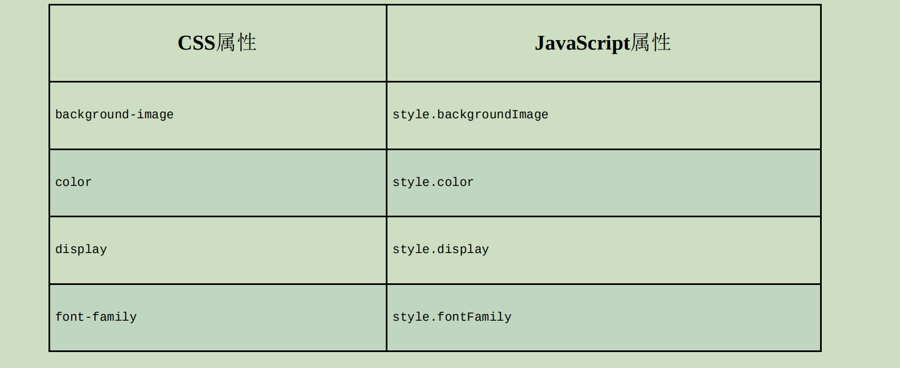
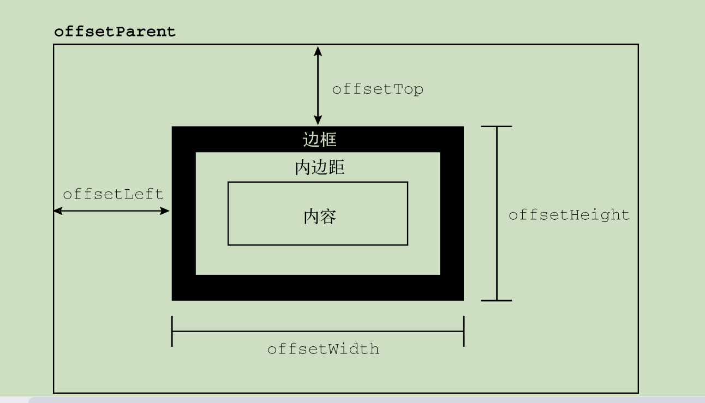
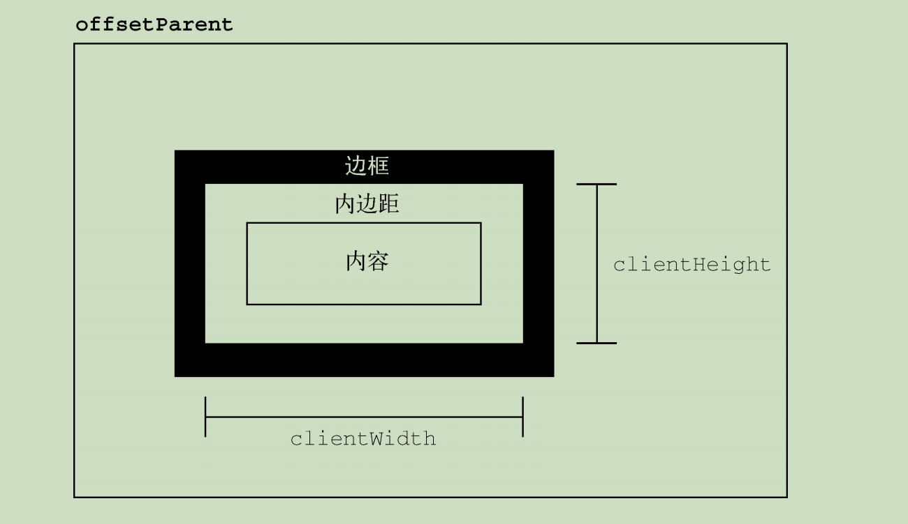
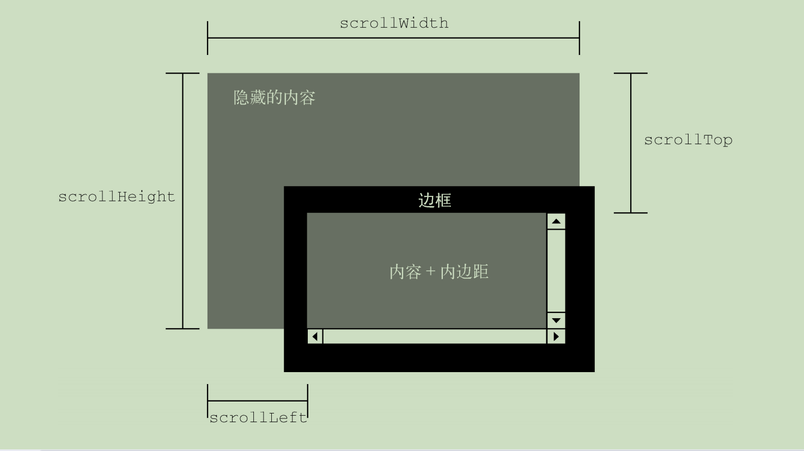
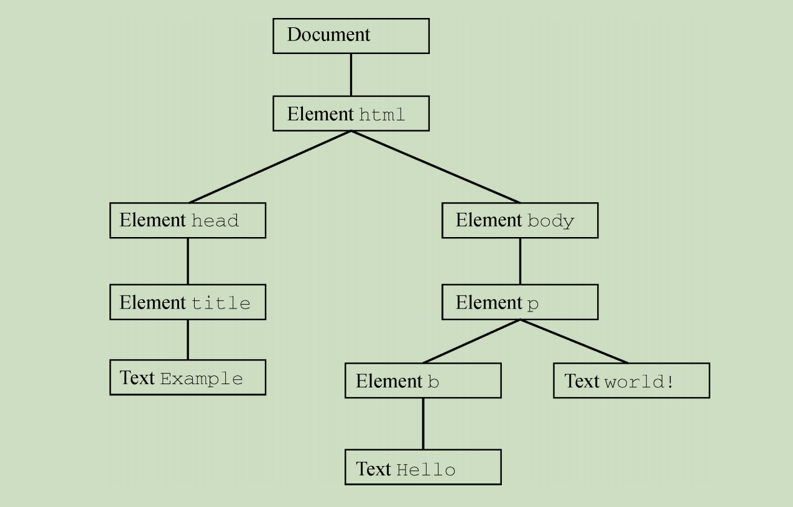
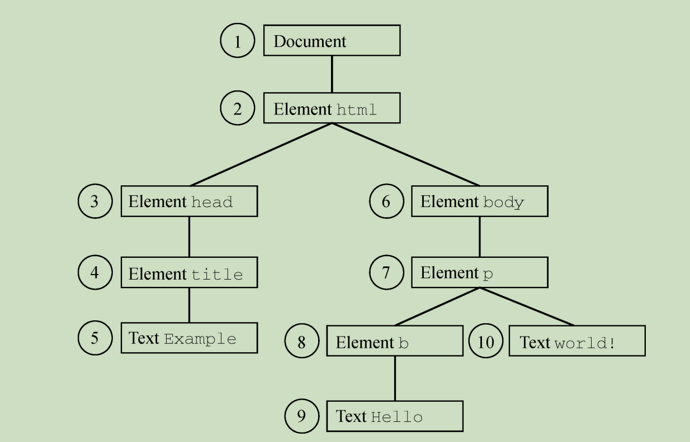
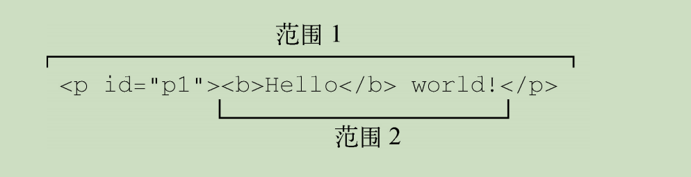

# 第 **16** 章 **DOM2**和**DOM3**

- 本章内容

  - DOM2到DOM3的变化 

  - 操作样式的DOM API 

  - DOM遍历与范围 

- **DOM Core**：

  - 在DOM1核心部分的基础上，

    为节点增加方法和属性。

- **DOM Views**：
  
  - 定义基于样式信息的不同视图。 
  
- **DOM Events**：
  
  - 定义通过事件实现DOM文档交互。 
  
- **DOM Style**：
  
  - 定义以编程方式访问和修改CSS样式的接口。 
  
- **DOM Traversal and Range**：
  
  - 新增遍历DOM文档及选择文档内容的接口。 
  
- **DOM HTML**：

  - 在DOM1 HTML部分的基础上，

    增加属性、方法和 新接口。 

- **DOM Mutation Observers**：

  - 定义基于DOM变化触发回调的接口。 

  - 这个模块是DOM4级模块，用于取代Mutation Events。 

## **16.1 DOM**的演进 

### **16.1.1 XML**命名空间 

- XML命名空间可以实现什么？

  - 在一个格式规范的文档中混用不同的XML语言，

    而不必担心元素命名冲突。

- 严格来讲，XML命名空间在哪里才支持？
  - XHTML
  - HTML并不支持
- XHTML的命名空间是什么？ 
  - "http://www.w3.org/1999/xhtml"，
- XHTML的命名空间应该包含在哪里？
  - 任何格式规范的XHTML页面的\<html>元素中

```
<html xmlns="http://www.w3.org/1999/xhtml">
  <head>
    <title>Example XHTML page</title>
  </head>
  <body>
    Hello world!
  </body>
</html>

```

- 上述例子中所有元素都默认属于XHTML命名空间。
- 如何使用xmlns给命名空间创建一个前缀？
  - 格式为“xmlns: 前缀”

```
<xhtml:html xmlns:xhtml="http://www.w3.org/1999/xhtml">
  <xhtml:head>
    <xhtml:title>Example XHTML page</xhtml:title>
  </xhtml:head>
  <xhtml:body>
    Hello world!
  </xhtml:body>
</xhtml:html>

```

- 属性是否可以加上命名空间前缀？
  - 可以

```
<xhtml:html xmlns:xhtml="http://www.w3.org/1999/xhtml">
  <xhtml:head>
    <xhtml:title>Example XHTML page</xhtml:title>
  </xhtml:head>
  <xhtml:body xhtml:class="home">
    Hello world!
  </xhtml:body>
</xhtml:html>

```

- 如果文档中只使用一种XML语言，

  那么命名空间前缀是否有必要？

  - 没必要

- 命名空间前缀什么时候有用？
  - 一个文档混合使用多种XML语言时

```
<html xmlns="http://www.w3.org/1999/xhtml">
  <head>
    <title>Example XHTML page</title>
  </head>
  <body>
    <svg
      xmlns="http://www.w3.org/2000/svg"
      version="1.1"
      viewBox="0 0 100 100"
      style="width: 100%; height: 100%"
    >
      <rect x="0" y="0" width="100" height="100" style="fill: red" />
    </svg>
  </body>
</html>

```

- 在这个例子中，\<svg>元素设置自己的命名空间，

  目的是什么？

  - 将其标识为当前文档的外来元素

  - \<svg>元素及其属性，包括它的所有后代

    都会被认为属于

    "https://www.w3.org/2000/svg"命名空间

#### \01. **Node**的变化

- 在DOM2中，Node类型包含哪些特定于命名空间的属性？ 

  - localName，
    - 不包含命名空间前缀的节点名； 

  - namespaceURI，
    - 节点的命名空间URL，如果未指定则为null； 

  - prefix，
    - 命名空间前缀，如果未指定则为null。 

- 在节点使用命名空间前缀的情况下，nodeName等于什么？

  - prefix + ":" + localName

```
<html xmlns="http://www.w3.org/1999/xhtml">
  <head>
    <title>Example XHTML page</title>
  </head>
  <body>
    <s:svg
      xmlns:s="http://www.w3.org/2000/svg"
      version="1.1"
      viewBox="0 0 100 100"
      style="width: 100%; height: 100%"
    >
      <s:rect x="0" y="0" width="100" height="100" style="fill: red" />
    </s:svg>
  </body>
</html>

```

- 其中的\<html>元素的

  - localName、tagName
    - "html"，
  - namespaceURL 
    - "http://www.w3.org/1999/xhtml"
  - prefix
    - null。

- 对于\<s:svg>元素

  - localName
    - "svg"
  - tagName
    - "s:svg"
  - namespaceURI
    - "https://www.w3.org/2000/svg"， 

  - prefix
    - "s"。

- DOM3增加了哪些与命名空间相关的方法

  - isDefaultNamespace(*namespaceURI*)，
    - 返回布尔值，
    - 表示*namespaceURI*是否为节点的默认命名空间； 

  - lookupNamespaceURI(*prefix*)，
    - 返回给定*prefix*的命名空间URI； 

  - lookupPrefix(*namespaceURI*)，
    - 返回给定*namespaceURI*的前缀。 

```
console.log(document.body.isDefaultNamespace("http://www.w3.org/1999/ xhtml")); // true

// 假设svg包含对<s:svg>元素的引用 
console.log(svg.lookupPrefix("http://www.w3.org/2000/svg")); // "s" 

console.log(svg.lookupNamespaceURI("s"));
 // "http://www.w3.org/2000/svg"
```

#### \02. **Document**的变化 

- DOM2在Document类型上新增了哪些

  命名空间特定的方法？ 

  - createElementNS(*namespaceURI*, *tagName*)，

    - 以给定的标签名*tagName*

      创建指定命名空间*namespaceURI*的一个新元素； 

  - createAttributeNS(*namespaceURI*, *attributeName*)，

    - 以给定的属性名*attributeName*

      创建指定命名空间*namespaceURI*的一个新属性； 

  - getElementsByTagNameNS(*namespaceURI*, *tagName*)，

    - 返回指定命名空间*namespaceURI*中

      所有标签名为*tagName*的元素的NodeList。 

- 使用这些方法都需要传入什么？

  - 相应的命名空间URI

    （不是命名空间前缀）

```
// 创建一个新SVG元素 
let svg = document.createElementNS("http://www.w3.org/2000/svg", "svg");

// 创建一个任意命名空间的新属性 
let att = document.createAttributeNS("http://www.somewhere.com", "random");

// 获取所有XHTML元素 
let elems = document.getElementsByTagNameNS("http://www.w3.org/1999/xhtml", "*");
```

- 这些命名空间特定的方法只在什么时候才有用？
  - 文档中包含两个或两个以上命名空间  

#### \03. **Element**的变化

- getAttributeNS(*namespaceURI*, *localName*)，

  - 取得指定命名空间*namespaceURI*中

    名为*localName*的属性； 

- getAttributeNodeNS(*namespaceURI*, *localName*)，

  - 取得指定命名空间*namespaceURI*中

    名为*localName*的属性节点； 

- getElementsByTagNameNS(*namespaceURI*, *tagName*)，

  - 取得指定命名空间*namespaceURI*中

    标签名为*tagName*的元素的NodeList； 

- hasAttributeNS(*namespaceURI*, *localName*)，

  - 返回布尔值

  - 表示元素中是否有命名空间*namespaceURI*下

    名为*localName*的属性 

- removeAttributeNS(*namespaceURI*, *localName*)，

  - 删除指定命名空间namespaceURI*中*

    名为*localName*的属性； 

- setAttributeNS(*namespaceURI*, *qualifiedName*, *value*)，

  - 设置指定命名空间*namespaceURI*中

    名为*qualifiedName*的属性为*value*； 

- setAttributeNodeNS(*attNode*)，
  - 为元素设置（添加）包含命名空间信息的属性节点*attNode*。 

#### \04. **NamedNodeMap**的变化 

- NamedNodeMap也增加了哪些处理命名空间的方法？
  - getNamedItemNS(*namespaceURI*, *localName*)
    - 取得指定命名空间*namespaceURI*中
    - 名为*localName*的项； 

- removeNamedItemNS(*namespaceURI*, *localName*)

  - 删除指定命名空间*namespaceURI*中

    名为*localName*的项 

- setNamedItemNS(*node*)
  - 为元素设置（添加）包含命名空间信息的节点。 

- 这些方法很少使用，因为通常都是使用元素来访问属性。

### **16.1.2** 其他变化

#### \01. **DocumentType**的变化 

- publicId、systemId属性表示什么？

  - 文档类型声明中有效

    但无法使用DOM1 API访问的数据

```
<!DOCTYPE HTML PUBLIC "-// W3C// DTD HTML 4.01// EN" "http://www.w3.org/TR/html4/strict.dtd">
```

- 其publicId是"-// W3C// DTD HTML 4.01// EN"，
- 而systemId是"http://www.w3.org/TR/html4/strict.dtd"。

```
console.log(document.doctype.publicId); console.log(document.doctype.systemId);
```

- 通常在网页中很少需要访问这些信息。 

- internalSubset用于什么？
  - 访问文档类型声明中可能包含的额外定义

```
<!DOCTYPE html PUBLIC "-// W3C// DTD XHTML 1.0 Strict// EN" "http://www.w3.org/TR/xhtml1/DTD/xhtml1-strict.dtd" [<!ELEMENT name (#PCDATA)>] >
```

- document.doctype.internalSubset会返回什么？

  - " \<!ELEMENT name (#PCDATA)>"。

- HTML文档中几乎不会涉及文档类型的内部子集，

  XML文档中稍微常用一些

#### \02. **Document**的变化 

- importNode()方法用于什么？

  - 从其他文档获取一个节点

    并导入到新文档，

    以便将其插入新文档

- 每个节点都有一个ownerDocument属性，表示什么？

  - 所属文档。

- 如果调用appendChild()方法时传入节点的ownerDocument不是指向当前文档，则会导致什么？

  - 发生错误。

- 调用importNode()导入其他文档的节点会返回什么？

  - 一个新节点

  - 这个新节点的ownerDocument属性是正确的。 

- importNode()方法接收什么参数？
  - 要复制的节点
  - 表示是否同时复制子树的布尔值，
- importNode()方法返回什么？
  - 适合在当前文档中使用的新节点。

```
// 导入节点及所有后代 
let newNode = document.importNode(oldNode, true); document.body.appendChild(newNode);
```

- defaultView属性是什么？
  - 指向拥有当前文档的窗口（或窗格\<frame>）的指针。

```
let parentWindow = document.defaultView || document.parentWindow;
```

- document.implementation对象两个方法：
  - createDocumentType()
  - createDocument()。
- createDocumentType()用于什么？
  - 创建DocumentType类型的新节点
- createDocumentType()接收什么参数？
  - 文档类型名称、
  - publicId
  - systemId

```
let doctype = document.implementation.createDocumentType("html", "-// W3C// DTD HTML 4.01// EN", "http://www.w3.org/TR/html4/strict.dtd");
```

- createDocumentType()只在什么时候才会用到？
  - 创建新文档
    - 因为已有文档的文档类型不可更改
- 如何创建新文档？
  - 使用createDocument()方法。
- createDocument()接收什么参数？
  - 文档元素的namespaceURI
  - 文档元素的标签名
  - 文档类型

```
let doc = document.implementation.createDocument("", "root", null);
```

- 这个空文档没有命名空间和文档类型，

  只指定了\<root>作为文档元素

- 如何创建一个XHTML文档

```
let doctype = document.implementation.createDocumentType("html", "-// W3C// DTD XHTML 1.0 Strict// EN", "http://www.w3.org/TR/xhtml1/DTD/xhtml1-strict.dtd"); 

let doc = document.implementation.createDocument("http://www.w3.org/1999/xhtml", "html", doctype);
```

- document.implamentation对象

  createHTMLDocument()方法

- createHTMLDocument()方法可以做什么？
  - 创建一个完整的HTML文档，
  - 包含\<html>、\<head>、\<title>和\<body>元素。
- createHTMLDocument()接收什么参数？
  - 新创建文档的标题（放到\<title>元素中）
- createHTMLDocument()返回什么？
  - 一个新的HTML文档。

```
let htmldoc = document.implementation.createHTMLDocument("New Doc"); 

console.log(htmldoc.title); // "New Doc" console.log(typeof htmldoc.body); // "object"
```

- createHTMLDocument()方法创建的对象是什么实例？
  - HTMLDocument类型的实例，
  - 因此包括该类型所有相关的方法和属性，
    - 包括title和body属性。 

#### \03. **Node**的变化

- isSameNode()和isEqualNode()接收什么参数？

  - 一个节点

- 如果这个节点与参考节点相同或相等，则返回什么？

  - true

- 节点相同，意味着什么？

  - 引用同一个对象

- 节点相等，意味着什么？

  - 节点类型相同，
  - 拥有相等的属性（nodeName、nodeValue等），
  - childNodes也相等 

  （即同样的位置包含相等的值）

```
let div1 = document.createElement("div");

div1.setAttribute("class", "box");

let div2 = document.createElement("div");

div2.setAttribute("class", "box");


console.log(div1.isEqualNode(div2)); // true 

console.log(div1.isSameNode(div2)); // false
```

- setUserData()方法接收什么参数？
  - 键
  - 值
  - 处理函数，
- setUserData()用于什么？
  - 给节点追加数据

- 如何把数据添加到一个节点？

```
document.body.setUserData("name", "Nicholas", function() {});
```

- 如何再取得这个信息？
  - 通过相同的键

```
let value = document.body.getUserData("name")
```

- setUserData()的处理函数会在什么时候执行？

  - 节点

    被复制、删除、重命名或导入其他文档的时候

- 处理函数接收什么参数？

  - 表示操作类型的数值
    - 1代表复制，
    - 2代表导入，
    - 3代表删除，
    - 4代表重命名
  - 数据的键、
  - 数据的值、
  - 源节点
  - 目标节点

- 处理函数删除节点时，源节点为什么？

  - null

- 除复制外，目标节点都为什么？

  - null。

```
let div = document.createElement("div");

div.setUserData("name", "Nicholas", function (operation, key, value, src, dest) {
    if (operation == 1) {
        dest.setUserData(key, value, function () {});
    }
});

let newDiv = div.cloneNode(true);

console.log(newDiv.getUserData("name")); // "Nicholas"
```

#### \04. 内嵌窗格的变化 

- 给HTMLIFrameElement（即\<iframe>，内嵌窗格）类型 

  属性contentDocument

- contentDocument属性包含什么？

  - 代表子内嵌窗格中内容的document对象的指针

```
let iframe = document.getElementById("myIframe"); let iframeDoc = iframe.contentDocument;
```

- contentDocument属性是什么的实例？
  - Document
  - 拥有所有文档属性和方法
    - 可以像使用其他HTML文档一样使用它。
- 属性contentWindow返回什么？
  - 相应窗格的window对象，
    - 这个对象上有一个document属性

- 跨源访问子内嵌窗格的document对象会有什么问题？
  - 受到安全限制

- 如果内嵌窗格中加载了不同域名（或子域名）的页面，

  或者该页面使用了不同协议，

  则访问其document对象会发生什么？

  - 抛出错误。

## **16.2** 样式 

- HTML中的样式有3种定义方式？
  - 外部样式表（通过\<link>元素）
  - 文档样式表（使用\<style>元素）
  - 元素特定样式（使用style属性）

### **16.2.1** 存取元素样式 

- style属性是什么类型的实例？

  - CSSStyleDeclaration

    - 包含通过HTML style属性

      为元素设置的所有样式信息，

    - 但不包含从文档样式和外部样式中继承来的样式。

- CSS属性名使用什么表示法？

  - 连字符
  - （如background-image）

- 在JavaScript中CSS属性必须转换为什么形式？

  - 驼峰大小写
  - （如 backgroundImage）

- 常用的CSS属性与style对象中等价属性



- 有一个CSS属性名不能直接转换？
  - float。
  - 因为float是JavaScript的保留字
  - 它在style对象中对应的属性应该是cssFloat。

```
let myDiv = document.getElementById("myDiv");

// 设置背景颜色 
myDiv.style.backgroundColor = "red";

// 修改大小
myDiv.style.width = "100px";
myDiv.style.height = "200px";

// 设置边框 
myDiv.style.border = "1px solid black";
```

- 所有尺寸是否必须包含单位？
  - 在标准模式下，必须包含单位
  - 在混杂模式下，可以把style.width设置为"20"
- 如果是在标准模式下，把style.width设置为"20"会怎么样？
  - 被忽略，
  - 因为没有单位。
- 实践中， 最好一直加上单位。 

```
<div id="myDiv" style="background-color: blue; width: 10px; height: 25px"></div>
```

 

```
console.log(myDiv.style.backgroundColor); // "blue" 

console.log(myDiv.style.width); // "10px"

console.log(myDiv.style.height); // "25px"
```

- 如果元素上没有style属性，则style对象包含什么？
  - 所有可能的CSS属性的空值。

#### \01. **DOM**样式属性和方法

- style对象属性和方法

  - cssText
    - CSS代码 

  - length
    - CSS属性数量 

  - parentRule
    - CSSRule对象

  - getPropertyCSSValue(*propertyName*)，
    - （已废弃）。 

  - getPropertyPriority(*propertyName*)，
    - 如果使用了!important
      - 则返回"important"，
    - 否则返回空字符串。 

  - getPropertyValue(*propertyName*)，
    - 返回属性的字符串值。 

  - item(*index*)，
    - 返回索引为*index*的CSS属性名。 

  - removeProperty(*propertyName*)，
    - 删除CSS属性

  - setProperty(*propertyName, value, priority*)，

    - 设置CSS属性

      - 值为value

      - priority是"important"或空字符串

- cssText属性可以做什么？
  - 存取CSS代码。
- 在读模式下，cssText返回什么？
  - CSS代码
- 在写模式下，cssText执行什么操作？
  - 重写style属性的值

```
myDiv.style.cssText = "width: 25px; height: 100px; background-color: green"; 

console.log(myDiv.style.cssText);
```

- style对象如何取得相应位置的CSS属性名？
  - 中括号
  - item()

```
for (let i = 0, len = myDiv.style.length; i < len; i++) {
    console.log(myDiv.style[i]);
    // 或者用myDiv.style.item(i)
}
```

- 如何根据属性名取得属性的值？
  - getPropertyValue()

```
let prop, value, i, len;
for (i = 0, len = myDiv.style.length; i < len; i++) {
    prop = myDiv.style[i];
    // 或者用myDiv.style.item(i) 
    
    value = myDiv.style.getPropertyValue(prop);
    console.log(`prop: ${value}`);
}
```

- getPropertyValue()方法返回什么？
  - CSS属性值的字符串表示。

- removeProperty()方法用于什么？
  - 删除CSS属性 

- 删除属性意味着会应用什么？
  - 该属性的默认样式

```
myDiv.style.removeProperty("border");
```

#### \02. 计算样式

- document.defaultView上增加了 

  getComputedStyle()方法。

- getComputedStyle()方法接收两个参数？

  - 要计算样式的元素
  - 伪元素字符串

- 如果不需要查询伪元素，则第二个参数可以传什么？

  - null

- getComputedStyle()方法返回什么？

  - 一个CSSStyleDeclaration对象
    - 包含元素的计算样式

```
<!DOCTYPE html>
<html>
  <head>
    <title>Computed Styles Example</title>
    <style type="text/css">
      #myDiv {
        background-color: blue;
        width: 100px;
        height: 200px;
      }
    </style>
  </head>
  <body>
    <div
      id="myDiv"
      style="background-color: red; border: 1px solid black"
    ></div>
  </body>
</html>

```

- 如何从div元素获取了计算样式？

```
let myDiv = document.getElementById("myDiv");

let computedStyle = document.defaultView.getComputedStyle(myDiv, null);

console.log(computedStyle.backgroundColor); // "red" 

console.log(computedStyle.width); // "100px" 

console.log(computedStyle.height); // "200px" 

console.log(computedStyle.border); // "1px solid black"（在某些浏览器中）
```

- 在所有浏览器中计算样式是否只读？
  - 是 
- 是否能修改getComputedStyle()方法返回的对象？
  - 不能
- 是否有默认值的CSS属性出现在计算样式里？
  - 是
  - 因为计算样式包含浏览器内部样式表

### **16.2.2** 操作样式表

- CSSStyleSheet类型表示什么？
  - CSS样式表，
- \<link>元素是什么类型？
  - HTMLLinkElement
- \<style>元素是什么类型？
  - HTMLStyleElement

- CSSStyleSheet类型是一个什么类型？
  - 通用样式表类型，
  - 可以表示在HTML中定义的样式表

- CSSStyleSheet类型的实例则是否只读？
  - 是

- CSSStyleSheet类型继承什么？
  - StyleSheet
- StyleSheet可用作什么？
  - 非CSS样式表的基类

- CSSStyleSheet从StyleSheet继承的属性？ 

  - disabled
    - 布尔值
    - 表示样式表是否被禁用
      - 可读写的
      - 设置为true会禁用

  - href
    - 如果使用\<link>
      - 则返回URL
    - 否则返回null。 

  - media

    - 支持的媒体类型集合

    - 如果样式表可用于所有媒体
      - 返回空列表

  - ownerNode

    - 指向拥有当前样式表的节点，

      - \<link> 

      - \<style>

    - 如果是通过@import导入
      - 则为null。

  - parentStyleSheet，
    - 如果是通过@import导入
      - 则指向导入它的样式表。 

  - title
    - ownerNode的title属性。 

  - type
    - 字符串
    - 表示样式表的类型
    - 对CSS样式表来说，就是"text/css"。

- 除了disabled，其他属性都是只读的。

- CSSStyleSheet类型还支持哪些属性和方法? 

  - cssRules
    - 样式规则集合

  - ownerRule

    - 如果是使用@import导入
      - 则指向导入规则； 

    - 否则为null。 

  - deleteRule(*index*)，
    - 删除cssRules中的规则

  - insertRule(*rule*, *index*)，
    - 向cssRules中插入规则

- document.styleSheets表示什么？
  - 可用的样式表集合。
- document.styleSheets集合的length属性保存什么？
  - 样式表的数量
  - 样式表使用中括号或item()方法获取。

```
let sheet = null;

for (let i = 0, len = document.styleSheets.length; i < len; i++) {
    
    sheet = document.styleSheets[i];
    
	console.log(sheet.href);
}

```

- 通过\<link>或\<style>元素

  是否可以获取CSSStyleSheet对象？

  - 可以

  - DOM在这两个元素上暴露了sheet属性，

    其中包含对应的CSSStyleSheet对象。 

#### \01. **CSS**规则 

- CSSRule类型表示什么？
  - 样式表中的一条规则。
- 这个类型也是一个什么类型？
  - 通用基类，
  - 很多类型都继承它，包括CSSStyleRule

- CSSStyleRule对象上可用的属性？

  - cssText
    - 整条规则的文本

  - parentRule

    - 如果这条规则被其他规则（如@media）包含
      - 则指向包含规则

    - 否则就是null 

  - parentStyleSheet
    - 包含当前规则的样式表

  - selectorText
    - 返回规则的选择符文本

  - style
    - 返回CSSStyleDeclaration对象，
    - 可以设置和获取当前规则中的样式。 

  - type
    - 数值常量
    - 表示规则类型
    - 对于样式规则，它始终为1。 

- CSSStyleRule.cssText和style.cssText的区别？
  - 是否只读 
    - CSSStyleRule.cssText只读
    - style.cssText可重写
  - 包含的内容
    - CSSStyleRule.cssText包含
      - 选择符文本
      - 样式声明
      - 大括号
    - style.cssText包含
      - 样式声明

```
div.box { 
    background-color: blue; 
    width: 100px; 
    height: 200px; 
}
```

- 下列代码可以获取它的所有信息：

```
let sheet = document.styleSheets[0];

let rules = sheet.cssRules || sheet.rules; // 取得规则集合

let rule = rules[0]; // 取得第一条规则

console.log(rule.selectorText); // "div.box" 

console.log(rule.style.cssText); // 完整的CSS代码 

console.log(rule.style.backgroundColor); // "blue" 

console.log(rule.style.width); // "100px" 

console.log(rule.style.height); // "200px"
```

- 修改规则中的样式，

```
let sheet = document.styleSheets[0];

let rules = sheet.cssRules || sheet.rules; // 取得规则集合 

let rule = rules[0]; // 取得第一条规则 

rule.style.backgroundColor = "red"

```

#### \02. 创建规则 

- 如何向样式表中添加新规则？
  - 使用insertRule()方法
- insertRule()方法接收什么参数？
  - 规则的文本
  - 插入位置

```
sheet.insertRule("body { background-color: silver }", 0); // 使用DOM方法
```

- 更好的方式是使用第14章介绍的动态样式加载技术

#### \03. 删除规则 

- 如何从样式表中删除规则？
  - deleteRule()
- deleteRule()接收什么参数？
  - 索引
- 如何删除样式表中的第一条规则？

```
sheet.deleteRule(0); // 使用DOM方法
```

### **16.2.3** 元素尺寸 

#### \01. 偏移尺寸

- 哪些属性用于取得元素的偏移尺寸？

  - offsetHeight
    - 元素在垂直方向上的像素尺寸，
    - 包括
      - 元素高度、
      - 水平滚动条高度（如果可见）
      - 上、下边框的高度 

  - offsetLeft
    - 元素左边框外侧距离

  - offsetTop
    - 元素上边框外侧距离

  - offsetWidth
    - 元素在水平方向上的像素尺寸
    - 包括
      - 它的宽度
      - 垂直滚动条宽度（如果可见）
      - 左、右边框的宽度。 

- offsetLeft和offsetTop是相对于什么的？
  - 包含元素的
- 包含元素保存在什么属性中？
  - offsetParent

- offsetParent是否一定是parentNode？

  - 不一定

- \<td>元素的offsetParent是什么？

  - 作为其祖先的\<table>元素，

  - 因为\<table>是节点层级中

    第一个提供尺寸的元素。

- 图展示了这些属性代表的不同尺寸



- 如何确定一个元素在页面中的偏移量？

  - 把它的offsetLeft和offsetTop属性

    分别与offsetParent的相同属性相加

    一直加到根元素

```
function getElementLeft(element) {
    let actualLeft = element.offsetLeft;
    
    let current = element.offsetParent;
    
    while (current !== null) {
        
        actualLeft += current.offsetLeft;
        
		current = current.offsetParent;
    }
    
	return actualLeft;
}
function getElementTop (element) {
    
    let actualTop = element.offsetTop;
    
    let current = element.offsetParent;
    
    while (current !== null) {
        
        actualTop += current.offsetTop;
        
		current = current.offsetParent;
    }
    
	return actualTop;
}

```

- 一般来说，包含在\<div>元素中所有元素

  的offsetParent是什么？

  - \<body>

  - 因此getElementleft()和getElementTop()返回的值

    与offsetLeft和offsetTop返回的值相同

- 所有这些偏移尺寸属性是否只读？
  - 是
  - 每次访问都会重新计算。

#### \02. 客户端尺寸

- 元素的客户端尺寸包含什么？
  - 元素内容
  - 内边距所占用的空间。
- 客户端尺寸只有两个相关属性？
  - clientWidth
    - 内容区宽度加左、右内边距宽度
  - clientHeight
    - 内容区高度加上、下内边距高度



- 客户端尺寸是否包含滚动条占用的空间？

  - 不包含
  - 因为客户端尺寸是元素内部的空间

- clientWidth、clientHeight属性最常用于什么？

  - 确定浏览器视口尺寸，

  - 即检测document.documentElement的

    clientWidth和clientHeight。

    - 表示视口（\<html>或\<body>元素）的尺寸。

- 客户端尺寸是否只读？
  - 是
  - 每次访问都会重新计算。

#### \03. 滚动尺寸

- 滚动尺寸提供了什么信息？
  - 元素内容滚动距离，
- \<html>是否需要代码实现滚动？
  - 不需要
- 其他元素则需要使用什么令其滚动？
  - CSS的overflow属性

- 滚动尺寸相关的属性有如下4个？

  - scrollHeight，

    - 没有滚动条出现时，

      元素内容的总高度。 

  - scrollLeft，
    - 内容区左侧隐藏的像素数，
    - 设置这个属性可以改变滚动位置。 

  - scrollTop，
    - 内容区顶部隐藏的像素数，
    - 设置这个属性可以改变滚动位置。 

  - scrollWidth，

    - 没有滚动条出现时，

      元素内容的总宽度。 



- scrollWidth和scrollHeight可以用来做什么？
  - 确定元素内容的实际尺寸。

- scrollWidth等于什么？
  - 文档内容的宽度
- clientWidth等于什么？
  - 视口的宽度

- scrollLeft和scrollTop属性可以用于什么？

  - 确定滚动的位置
  - 设置滚动位置。

- 如何检测元素是不是位于顶部，

  如果不是则把它滚动回顶部？

```
function scrollToTop(element) {
    if (element.scrollTop != 0) {
        element.scrollTop = 0;
    }
}
```

#### \04. 确定元素尺寸

- getBoundingClientRect()方法返回什么？ 
  - 一个DOMRect对象，

- DOMRect对象包含什么属性？
  - left、
  - top、
  - right、
  - bottom、
  - height
  - width


## **16.3** 遍历 

NodeIterator和TreeWalker 

- DOM遍历是对DOM结构的什么优先遍历？
  - 深度

```
<!DOCTYPE html>
<html>
  <head>
    <title>Example</title>
  </head>
  <body>
    <p><b>Hello</b> world!</p>
  </body>
</html>

```





- 到达文档末尾文本节点后， 

  遍历会在DOM树中反向回溯。

- 第一个访问的节点是什么？
  - 包含"world!"的文本节点
- 最后一个访问的节点是什么？
  - document节点本身

### **16.3.1** **NodeIterator**

- 如何创建NodeIterator类型实例？

  - document.createNodeIterator()

- document.createNodeIterator()接收什么参数？

  - root，
    - 遍历根节点 

  - whatToShow，
    - 数值代码，
    - 表示应该访问哪些节点。 

  - filter，
    - NodeFilter对象或函数，
    - 表示是否接收或跳过特定节点。 

  - entityReferenceExpansion，

    - 布尔值，

    - 表示是否扩展实体引用。

      - 这个参数在HTML文档中没有效果，

        因为实体引用永远不扩展

- whatToShow参数是一个什么？

  - 位掩码，

- whatToShow参数中属性常量有哪些？

  - NodeFilter.SHOW_ALL，
    - 所有节点。 

  - NodeFilter.SHOW_ELEMENT，
    - 元素节点。 

  - NodeFilter.SHOW_ATTRIBUTE，
    - 属性节点。
    - 由于DOM的结构，因此用不上。 

  - NodeFilter.SHOW_TEXT，
    - 文本节点。 

  - NodeFilter.SHOW_CDATA_SECTION，
    - CData区块节点。
    - 不是在HTML页面中使用的。 

  - NodeFilter.SHOW_ENTITY_REFERENCE，
    - 实体引用节点。
    - 不是在HTML页面中使用的。 

  - NodeFilter.SHOW_ENTITY，
    - 实体节点。
    - 不是在HTML页面中使用的。

  - NodeFilter.SHOW_PROCESSING_INSTRUCTION，
    - 处理指令节点。
    - 不是在HTML页面中使用的。 

  - NodeFilter.SHOW_COMMENT，
    - 注释节点。 

  - NodeFilter.SHOW_DOCUMENT，
    - 文档节点。 

  - NodeFilter.SHOW_DOCUMENT_TYPE，
    - 文档类型节点。 

  - NodeFilter.SHOW_DOCUMENT_FRAGMENT，
    - 文档片段节点。
    - 不是在HTML页面中使用的。 

  - NodeFilter.SHOW_NOTATION，
    - 记号节点。
    - 不是在HTML页面中使用的。 

- whatToShow参数如何组合多个选项？
  - 按位或

```
let whatToShow = NodeFilter.SHOW_ELEMENT | NodeFilter.SHOW_TEXT;
```

- createNodeIterator()方法的filter参数可以用来做什么？
  - 指定
    - 自定义NodeFilter对象，
    - 一个作为节点过滤器的函数。
- NodeFilter对象只有一个什么方法？
  - acceptNode()，
- 如果给定节点应该访问就返回什么？
  - NodeFilter.FILTER_ACCEPT，
  - 否则返回NodeFilter.FILTER_SKIP。
- 是否可以创建NodeFilter的实例？
  - 不可以
  - 因为NodeFilter是一个抽象类型
- 如何使用filter参数？
  - 创建包含acceptNode()的对象，
  - 然后把它传给createNodeIterator()就可以了。

- 如何定义只接收\<p>元素的节点过滤器对象?

```
let filter = {
    acceptNode(node) {
        return node.tagName.toLowerCase() == "p" ? NodeFilter.FILTER_ACCEPT : NodeFilter.FILTER_SKIP;
    }
};

let iterator = document.createNodeIterator(root, NodeFilter.SHOW_ELEMENT, filter, false);
```

- filter参数还可以是一个函数

```
let filter = function (node) {
    return node.tagName.toLowerCase() == "p" ? NodeFilter.FILTER_ACCEPT : NodeFilter.FILTER_SKIP;
};
let iterator = document.createNodeIterator(root, NodeFilter.SHOW_ELEMENT, filter, false);
```

- 如何创建一个遍历所有节点的NodeIterator？

```
let iterator = document.createNodeIterator(document, NodeFilter.SHOW_ALL, null, false);
```

- NodeIterator的两个主要方法是什么？

  - nextNode()
  - previousNode()

- nextNode()方法执行什么操作？

  - 以深度优先前进一步

- previousNode()执行什么操作？

  - 是在遍历中后退一步。

- 第一次调用nextNode()返回什么？

  - 根节点

- 当遍历到达DOM树最后一个节点时，

  nextNode()返回什么？ 

  - null。

- 调用previousNode()返回根节点后，

  再次调用会返回什么？ 

  - null

```
<div id="div1">
  <p><b>Hello</b> world!</p>
  <ul>
    <li>List item 1</li>
    <li>List item 2</li>
    <li>List item 3</li>
  </ul>
</div>

```

- 如何遍历\<div>元素内部的所有元素？

```
let div = document.getElementById("div1");

let iterator = document.createNodeIterator(div, NodeFilter.SHOW_ELEMENT, null, false);

let node = iterator.nextNode();

while (node !== null) {

    console.log(node.tagName);
    
    // 输出标签名 
    node = iterator.nextNode();
}
```

- 以上代码执行后会输出以下标签名：

```
DIV 
P
B
UL
LI
LI
LI
```

- 如何只遍历\<li>元素？
  - 传入一个过滤器

```
let div = document.getElementById("div1");

let filter = function (node) {

    return node.tagName.toLowerCase() == "li" ? NodeFilter.FILTER_ACCEPT : NodeFilter.FILTER_SKIP;
};

let iterator = document.createNodeIterator(div, NodeFilter.SHOW_ELEMENT, filter, false);

let node = iterator.nextNode();

while (node !== null) {

    console.log(node.tagName); // 输出标签名
    
    node = iterator.nextNode();
}
```

- 修改DOM结构是否会体现在遍历中？

  - 会

  - nextNode()和previousNode()

    共同维护NodeIterator对DOM结构的内部指针

### **16.3.2** **TreeWalker** 

- TreeWalker还添加了哪些

  在DOM结构中向不同方向遍历的方法？、

  - parentNode()，
    - 遍历到当前节点的父节点。 

  - firstChild()，
    - 遍历到当前节点的第一个子节点。 

  - lastChild()，
    - 遍历到当前节点的最后一个子节点。 

  - nextSibling()，
    - 遍历到当前节点的下一个同胞节点。 

  - previousSibling()，
    - 遍历到当前节点的上一个同胞节点。 

- 如何创建TreeWalker对象？
  - document.createTreeWalker()

- document.createTreeWalker()接收什么参数？
  - 作为遍历起点的根节点、
  - 要查看的节点类型、
  - 节点过滤器
  - 一个表示是否扩展实体引用的布尔值。

```
let div = document.getElementById("div1");
let filter = function (node) {
    return node.tagName.toLowerCase() == "li" ? NodeFilter.FILTER_ACCEPT : NodeFilter.FILTER_SKIP;
};

let walker = document.createTreeWalker(div, NodeFilter.SHOW_ELEMENT, filter, false);

let node = iterator.nextNode();

while (node !== null) {
    console.log(node.tagName); // 输出标签名 
    node = iterator.nextNode();
}
```

- 节点过滤器（filter）除了可以返回 

  NodeFilter.FILTER_ACCEPT和NodeFilter.FILTER_SKIP，

  还可以返回什么？ 

  - NodeFilter.FILTER_REJECT。

- NodeFilter.FILTER_REJECT表示什么？
  - 跳过该节点以及该节点的整个子树

```
let div = document.getElementById("div1");

let walker = document.createTreeWalker(div, NodeFilter.SHOW_ELEMENT, null, false);

walker.firstChild(); // 前往<p> 

walker.nextSibling(); // 前往<ul>

let node = walker.firstChild(); // 前往第一个<li> 

while (node !== null) {
    console.log(node.tagName);
    node = walker.nextSibling();
}
```

- TreeWalker类型currentNode属性，表示什么？
  - 遍历过程中上一次返回的节点

```
let node = walker.nextNode();

console.log(node === walker.currentNode); // true 

walker.currentNode = document.body; // 修改起点
```

## **16.4** 范围 

- 范围可用于什么？

  - 在文档中选择内容，

    而不用考虑节点之间的界限

### **16.4.1 DOM**范围 

- 如何创建一个DOM范围对象？
  - document.createRange()

```
let range = document.createRange();
```

- Range类型的属性？

  - startContainer，
    - 范围起点所在的节点
    - （选区中第一个子节点的父节点）。 

  - startOffset，

    - 范围起点在startContainer中的偏移量。

    - 如果startContainer是

      文本节点、注释节点、CData区块节点， 

      - 则startOffset指范围起点之前跳过的字符数；
      - 否则，表示范围中第一个节点的索引 

  - endContainer，
    - 范围终点所在的节点
    - （选区中最后一个子节点的父节点） 

  - endOffset，
    - 范围起点在startContainer中的偏移量 

  - commonAncestorContainer，

    - 以startContainer和endContainer为后代的

      最深的节点

### **16.4.2** 简单选择

- 如何通过范围选择文档中某个部分？

  - selectNode() 

  - selectNodeContents()

- selectNode() 和selectNodeContents()接收什么参数？

  - 一个节点

- selectNode() 和selectNodeContents()执行什么操作？

  - 将节点的信息

    添加到调用它的范围。

- selectNode()方法选择什么？

  - 整个节点，
  - 包括其后代节点，

- selectNodeContents()选择什么？

  - 节点的后代

```
<!DOCTYPE html>
<html>
  <body>
    <p id="p1"><b>Hello</b> world!</p>
  </body>
</html>

```

- 如何访问并创建相应的范围？

```
let range1 = document.createRange(),
    range2 = document.createRange(),
    p1 = document.getElementById("p1");
range1.selectNode(p1);
range2.selectNodeContents(p1);
```

- range1包含什么？
  - \<p>元素
  - 及其所有后代
- range2包含什么？
  - \<b>元素、
  - 文本节点"Hello"
  - 文本节点"world!"，



- setStartBefore(*refNode*)，
  - 把范围的起点设置到*refNode*之前，
  - 让*refNode*成为选区的第一个子节点。 

- setStartAfter(*refNode*)，

  - 把范围的起点设置到*refNode*之后

  - 将*refNode*排除在选区之外，
  - 让其下一个同胞节点成为选区的第一个子节点。 

- setEndBefore(*refNode*)，
  - 把范围的终点设置到*refNode*之前
  - 将*refNode*排除在选区之外、
  - 让其上一个同胞节点成为选区的最后一个子节点。
- setEndAfter(*refNode*)，
  - 把范围的终点设置到*refNode*之后，
  - 让*refNode*成为选区的最后一个子节点。

