# 第 **17** 章 事件 

- 本章内容

  - 理解事件流 

  - 使用事件处理程序 

  - 了解不同类型的事件 

- JavaScript与HTML的交互是通过什么实现的？

  - 事件

- 可以使用什么订阅事件？

  - 仅在事件发生时执行的监听器

    （也叫处理程序）

- 在传统软件工程领域，这个模型叫什么？

  - “观察者模式”，

- “观察者模式”能够做到什么的分离？

  - 页面行为与页面展示

## **17.1** 事件流

- 事件流描述了什么？
  - 页面接收事件的顺序

### **17.1.1** 事件冒泡 

- IE事件流被称为什么？

  - 事件冒泡

- 从最具体的元素（文档树中最深的节点）开始触发

  然后向上传播至没有那么具体的元素 （文档）

```
<!DOCTYPE html>
<html>
	<head>
		<title>Event Bubbling Example</title>
	</head>
	<body>
		<div id="myDiv">Click Me</div>
	</body>
</html>

```

- 在点击页面中的\<div>元素后，

  click事件会以如下顺序发生

  - (1) \<div> 
  - (2) \<body> 
  - (3) \<html> 
  - (4) document 

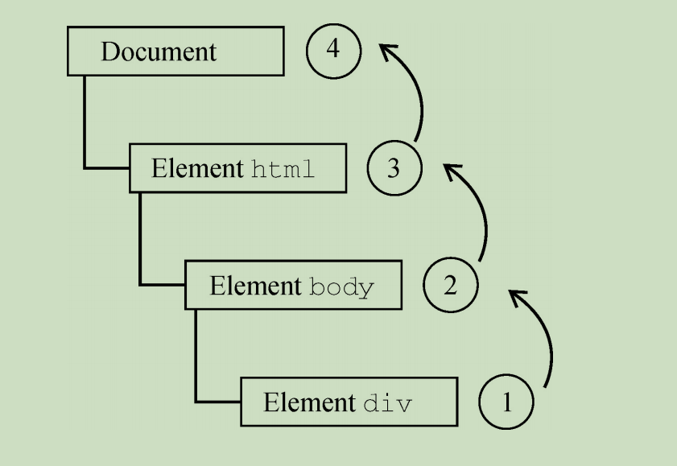

### **17.1.2** 事件捕获

- 如果前面的例子使用事件捕获，

  则点击\<div>元素会以下列顺序触发click事件

  - (1) document 

  - (2) \<html> 

  - (3) \<body> 

  - (4) \<div>

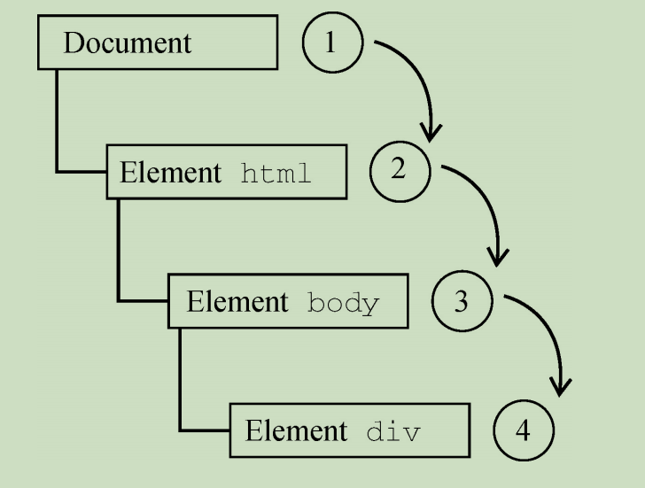

### **17.1.3 DOM**事件流 

- 事件流分为3个阶段？
  - 事件捕获
  - 到达目标
  - 事件冒泡。
- 点击\<div>元素会以的顺序触发事件

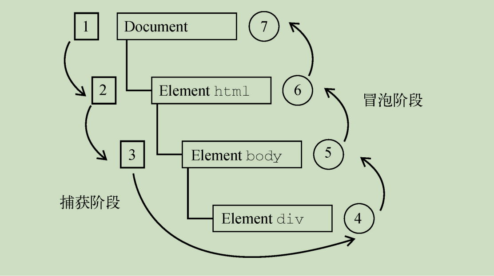

- 通常在事件处理时被认为是什么阶段的一部分？
  - 冒泡

## **17.2** 事件处理程序 

- 事件意味着什么？
  - 用户或浏览器执行的某种动作。
  - 比如，单击（click）、加载（load）、鼠标悬停（mouseover）

- 为响应事件而调用的函数被称为什么？
  - 事件处理程序（或事件监听器）

- 事件处理程序的名字以什么开头？
  - "on"
  - click事件的处理程序叫作onclick
  - load事件的处理程序叫作onload

### **17.2.1 HTML**事件处理程序 

- HTML事件处理程序属性的值必须是什么？
  - 能够执行的JavaScript代码。
- 如何实现在按钮被点击时执行某些JavaScript代码？

```
<input type="button" value="Click Me" onclick="console.log('Clicked')" />

```

- 如何在属性里使用双引号？

```
<input type="button" value="Click Me" onclick='console.log("Clicked")' />

```

- 在HTML中事件处理程序

  是否可以调用在页面其他地方定义的脚本？

  - 可以

```
<script>
	function showMessage() {
		console.log("Hello world!");
	}
</script>
<input type="button" value="Click Me" onclick="showMessage()" />

```

- 事件处理程序执行的代码可以访问什么作用域？
  - 全局作用域

- 在HTML中事件处理程序会创建什么来封装属性的值？
  - 一个函数
- 这个函数有一个特殊的局部变量？
  - event
  - 其中保存的就是event对象

```
<!-- 输出"click" --> 
<input type="button" value="Click Me" onclick="console.log(event.type)">
```

- 在这个函数中，this值相当于什么？
  - 事件的目标元素，

```
<!-- 输出"Click Me" --> 
<input type="button" value="Click Me" onclick="console.log(this.value)">
```

- document和元素自身的成员

  被当成什么变量来访问？

  - 局部

- 事件处理程序相当于如下代码

```
function func() {
	with (document) {
		with (this) {
			// 属性值
		}
	}
}

```

```
<!-- 输出"Click Me" --> 
<input type="button" value="Click Me" onclick="console.log(value)">
```

- 如果这个元素是一个表单输入框，

  则作用域链中还会包含什么？

  - 表单元素

- 事件处理程序相当于如下代码

```
function() {
    with (document) {
        with (this.form) {
            with (this) { // 属性值 
            }
        }
    }
}
```

- 事件处理程序如何访问同一表单中的其他成员？

```
<form method="post">
	<input type="text" name="username" value="" />
	<input
		type="button"
		value="Echo Username"
		onclick="console.log(username.value)"
	/>
</form>

```

- 在HTML中指定事件处理程序有什么问题？

  - 时机问题

    - 如果函数是在页面后面，

      在按钮中代码的后面定义的，

      - 那么当用户在函数被定义之前点击按钮时，就会发生错误。

  - 对事件处理程序作用域链的扩展

    在不同浏览器中可能导致不同的结果

  - HTML与JavaScript强耦合
    - 如果需要修改事件处理程序，
      - 则必须在HTML和JavaScript中修改代码。

```
<input type="button" value="Click Me" onclick="try{showMessage();}catch(ex) {}">
```

### **17.2.2 DOM0**事件处理程序 

- 每个元素都有小写的事件处理程序属性
  - 比如onclick。
- 只要把这个属性赋值为一个函数即可

```
let btn = document.getElementById("myBtn");

btn.onclick = function() {
	console.log("Clicked"); 
};
```

```
let btn = document.getElementById("myBtn"); 

btn.onclick = function () {
    console.log(this.id); // "myBtn" 
};
```

- DOM0事件处理程序是注册在事件流的什么阶段？
  - 冒泡 

- 如何移除通过DOM0方式添加的事件处理程序？
  - 将事件处理程序属性的值设置为null，

```
btn.onclick = null; // 移除事件处理程序
```

### **17.2.3 DOM2**事件处理程序

- 事件处理程序的赋值和移除？
  - addEventListener()
  - removeEventListener()。
- 接收3个参数？
  - 事件名
  - 事件处理函数
  - 一个布尔值，
    - true表示在捕获阶段调用事件处理程序，
    - false（默认值）表示在冒泡阶段调用事件处理程序

- 如何给按钮添加click事件处理程序？

```
let btn = document.getElementById("myBtn"); 

btn.addEventListener("click", () => { 

	console.log(this.id);
}, false);
```

- 使用DOM2方式的主要优势是什么？
  - 可以为同一个事件添加多个事件处理程序。

```
let btn = document.getElementById("myBtn");
btn.addEventListener(
	"click",
	() => {
		console.log(this.id);
	},
	false
);
btn.addEventListener(
	"click",
	() => {
		console.log("Hello world!");
	},
	false
);

```

- 通过addEventListener()添加的事件处理程序

  - 只能使用removeEventListener()

    并传入与添加时同样的参数来移除

- 使用addEventListener()添加的匿名函数是否能移除？
  - 不能

```
let btn = document.getElementById("myBtn");
btn.addEventListener(
	"click",
	() => {
		console.log(this.id);
	},
	false
);
// 其他代码 
btn.removeEventListener("click", function () { 
// 没有效果！
    console.log(this.id);
}, false);

```

- 传给removeEventListener()的事件处理函数

  必须与传给addEventListener()的是同一个

```
let btn = document.getElementById("myBtn");

let handler = function () {
	console.log(this.id);
};

btn.addEventListener("click", handler, false);

// 其他代码

btn.removeEventListener("click", handler, false); // 有效果！

```

- 大多数情况下，

  事件处理程序会被添加到事件流的什么阶段？

  - 冒泡

  - 因为跨浏览器兼容性好。

- 把事件处理程序注册到捕获阶段通常用于什么？

  - 在事件到达其指定目标之前拦截事件。
  - 如果不需要拦截，则不要使用事件捕获。

### **17.2.4 IE**事件处理程序 

- attachEvent()和detachEvent()接收两个参数？

  - 事件处理程序的名字
  - 事件处理函数

- 使用attachEvent()添加的事件处理程序

  会添加到什么阶段？

  - 冒泡 

- 如何使用attachEvent()给按钮添加click事件处理程序？

```
var btn = document.getElementById("myBtn");

btn.attachEvent("onclick", function () {

	console.log("Clicked");
});
```

- attachEvent()的第一个参数是"onclick"，
  - 而不是DOM的addEventListener()的"click"。

- DOM0和IE事件处理程序主要区别是什么？
  - 作用域。
  - DOM0：addEventListener()
    - this值等于目标元素。
  - IE：attachEvent()时
    - 事件处理程序是在全局作用域中，
    - 因此this等于window

```
var btn = document.getElementById("myBtn");

btn.attachEvent("onclick", function () {

	console.log(this === window); // true 
});
```

- 使用attachEvent()方法是否可以

  给一个元素添加多个事件处理程序？

  - 可以

```
var btn = document.getElementById("myBtn");

btn.attachEvent("onclick", function () {

	console.log("Clicked");
});

btn.attachEvent("onclick", function () {
	
	console.log("Hello world!");
});
```

- 使用attachEvent()添加的事件处理程序怎么移除？

  - detachEvent() 

  - 相同的参数

- 作为事件处理程序添加的匿名函数是否能够移除？

  - 不能

- 如何附加和剥离事件？

```
var btn = document.getElementById("myBtn");
var handler = function () {
	console.log("Clicked");
};
btn.attachEvent("onclick", handler);
// 其他代码 
btn.detachEvent("onclick", handler);
```

###  **17.2.5** 跨浏览器事件处理程序

- 创建addHandler()

  - 使用DOM0方式、DOM2方式、IE方式
  - 来添加事件处理程序。

- 在EventUtil对象上添加方法，

  - 以实现跨浏览器事件处理。

- addHandler()方法接收3个

  - 目标元素
  - 事件名
  - 事件处理函数

- 创建removeHandler()

  - 移除事件处理程序

  - 默认为DOM0方式

- 如何实现包含这两个方法的EventUtil对象？

```
var EventUtil = {
	addHandler: function (element, type, handler) {
		if (element.addEventListener) {
			element.addEventListener(type, handler, false);
		} else if (element.attachEvent) {
			element.attachEvent("on" + type, handler);
		} else {
			element["on" + type] = handler;
		}
	},
	removeHandler: function (element, type, handler) {
		if (element.removeEventListener) {
			element.removeEventListener(type, handler, false);
		} else if (element.detachEvent) {
			element.detachEvent("on" + type, handler);
		} else {
			element["on" + type] = null;
		}
	}
};
```

- 如何使用EventUtil对象？

```
let btn = document.getElementById("myBtn") 
let handler = function () {
	console.log("Clicked");
};
EventUtil.addHandler(btn, "click", handler);
// 其他代码 
EventUtil.removeHandler(btn, "click", handler);
```

- DOM0支持给一个事件添加几个处理程序？
  - 一个

## **17.3** 事件对象 

- 在DOM中发生事件时，

  所有相关信息都会被收集并存储在一个什么对象中？

  - event

### **17.3.1 DOM**事件对象 

- event对象是传给什么的唯一参数？
  - 事件处理程序 

- 如何使用事件对象？

```
let btn = document.getElementById("myBtn");
btn.onclick = function (event) {
	console.log(event.type); // "click"
};
btn.addEventListener("click", (event) => {
	console.log(event.type); // "click" 
}, false);
```

-  event.type属性包含什么？
  - 被触发事件的类型

- 如何在HTML属性指定的事件处理程序中使用event？

```
<input type="button" value="Click Me" onclick="console.log(event.type)">
```

- 所有事件对象都会包含公共属性和方法？

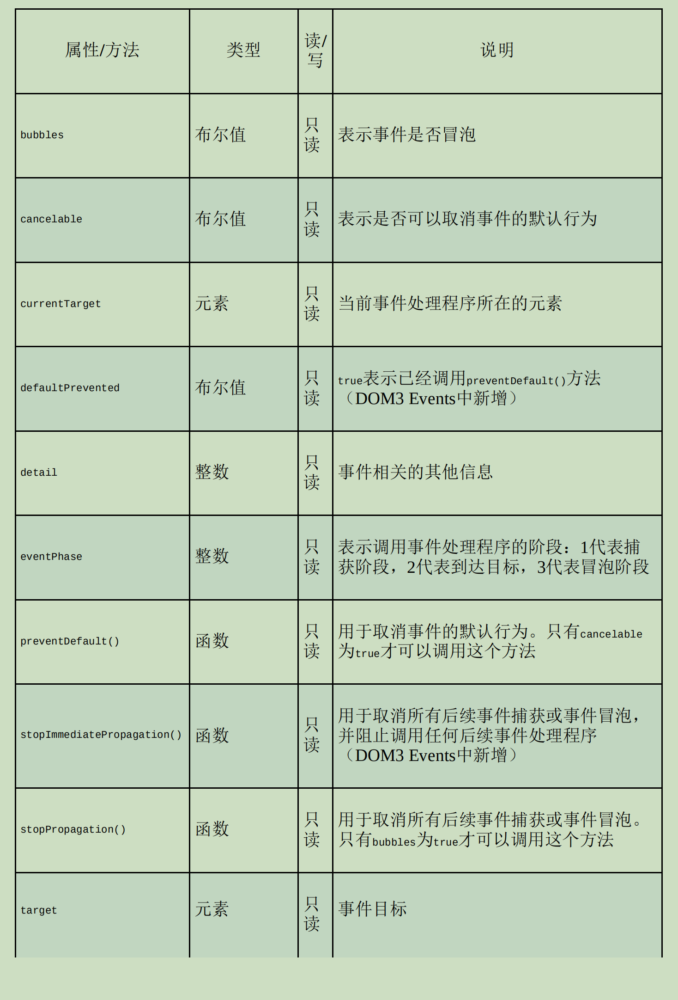

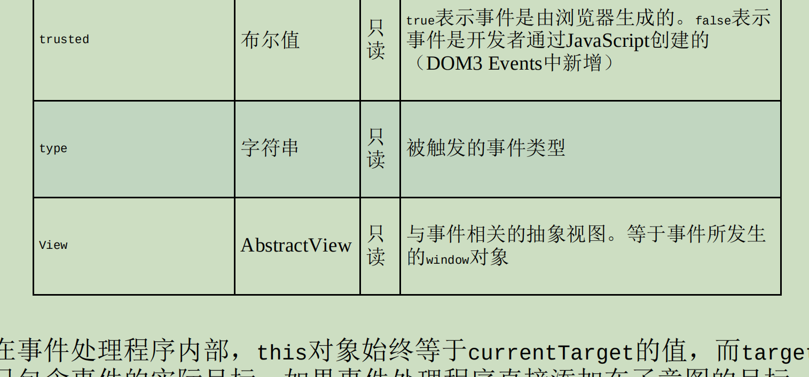

- 在事件处理程序内部，this对象始终等于什么的值？

  - currentTarget

- target包含什么？

  - 事件的实际目标

- 如果事件处理程序直接添加在了意图的目标， 

  则this、currentTarget和target的值是一样的。

```
let btn = document.getElementById("myBtn");
btn.onclick = function (event) {
	console.log(event.currentTarget === this); // true 
	console.log(event.target === this); // true 
};
```

- 在document.body上添加了单击处理程序：

```
document.body.onclick = function (event) {
	console.log(event.currentTarget === document.body); // true 
	console.log(this === document.body); // true 
	console.log(event.target === document.getElementById("myBtn")); // true
};
```

- 为什么target属性等于按钮？
  - 因为按钮是click事件真正的目标。
  - 由于按钮没有注册事件处理程序，
    - 因此click事件冒泡到document.body，

- type属性在一个处理程序处理多个事件时很有用

```
let btn = document.getElementById("myBtn");
let handler = function (event) {
	switch (event.type) {
		case "click":
			console.log("Clicked");
			break;
		case "mouseover":
			event.target.style.backgroundColor = "red";
			break;
		case "mouseout":
			event.target.style.backgroundColor = "";
			break;
	}
};
btn.onclick = handler;
btn.onmouseover = handler;
btn.onmouseout = handler;
```

- preventDefault()方法用于什么？

  - 阻止特定事件的默认动作。

  - 比如，链接的默认行为就是

    在被单击时导航到href属性指定的URL。

- 如何阻止链接的导航行为？
  - 在onclick事件处理程序中取消

```
let link = document.getElementById("myLink");
link.onclick = function (event) {
	event.preventDefault();
};
```

- 任何可以通过preventDefault()取消默认行为的事件，

  其事件对象的cancelable属性都会设置为什么？

  - true

- stopPropagation()方法用于什么？
  - 阻止事件流在DOM结构中传播，
  - 取消后续的事件捕获或冒泡。
- 如何阻止document.body上注册的事件处理程序执行？
  - 按钮的事件处理程序中调用stopPropagation()

```
let btn = document.getElementById("myBtn");
btn.onclick = function (event) {
	console.log("Clicked");
	event.stopPropagation();
};
document.body.onclick = function (event) {
	console.log("Body clicked"); // 不会执行
};
```

- eventPhase属性可用于什么？
  - 确定事件流当前所处的阶段。
  - 捕获阶段等于1
  - 到达目标等于2
  - 冒泡阶段等于3
  - 虽然“到达目标”是在冒泡阶段发生的，
    - 但eventPhase等于2

```
let btn = document.getElementById("myBtn");
btn.onclick = function (event) {
	console.log(event.eventPhase); // 2 
};
document.body.addEventListener("click", (event) => {
	console.log(event.eventPhase); // 1 
}, true);
document.body.onclick = (event) => {
	console.log(event.eventPhase); // 3 
}
```

-  event对象只在什么期间存在？
  - 事件处理程序执行
  - 一旦执行完毕，就会被销毁。 

### **17.3.2 IE**事件对象

- 使用DOM0方式指定的，

  则event对象是什么的一个属性？

  - window对象

```
var btn = document.getElementById("myBtn");
btn.onclick = function () {
	let event = window.event;
	console.log(event.type); // "click"
}
```

- 是使用attachEvent()指定的，
  - 则event对象会作为唯一的参数传给处理函数

```
var btn = document.getElementById("myBtn");
btn.attachEvent("onclick", function (event) {
	console.log(event.type); // "click"
})
```

- 使用attachEvent()时，

  event对象是否是window对象的属性？

  - 是

- 如果是使用HTML属性方式指定的事件处理程序，

  则event对象可以通过什么访问？

  - 变量event

```
<input type="button" value="Click Me" onclick="console.log(event.type)">
```

- IE事件对象公共属性和方法

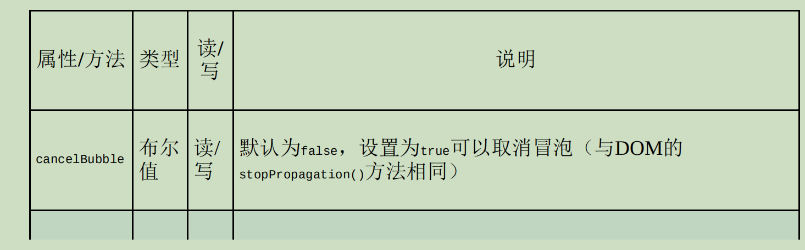

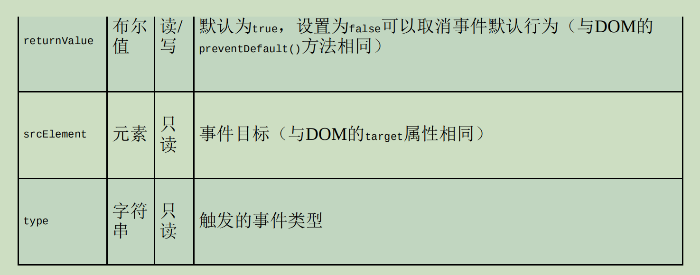

- 使用事件对象的什么属性代替this？
  - srcElement
  - 该特性是非标准的，请尽量不要在生产环境中使用它
    - 它只对老版本的IE浏览器有效。

```
var btn = document.getElementById("myBtn");
btn.onclick = function () {
	console.log(window.event.srcElement === this); // true 
};
btn.attachEvent("onclick", function (event) {
	console.log(event.srcElement === this); // false
});
```

- returnValue属性等价于DOM的什么方法？
  - preventDefault（）
  - 用于取消给定事件默认的行为。
  - returnValue设置为false

```
var link = document.getElementById("myLink");
link.onclick = function () {
	window.event.returnValue = false;
};
```

- cancelBubble属性与DOM什么方法用途一样？
  - stopPropagation()
  - 阻止事件冒泡。
- cancelBubble和stopPropagation区别？
  - cancelBubble只会取消冒泡
    - 因为IE8及更早版本不支持捕获阶段，。
  - stopPropagation()则既取消捕获也取消冒泡

```
var btn = document.getElementById("myBtn");
btn.onclick = function () {
	console.log("Clicked");
	window.event.cancelBubble = true;
};
document.body.onclick = function () {
	console.log("Body clicked");
}
```

### **17.3.3** 跨浏览器事件对象 

```
var EventUtil = {
	addHandler: function (element, type, handler) {
		// 为节省版面，删除了之前的代码
	},
	getEvent: function (event) {
		return event ? event : window.event;
	},
	getTarget: function (event) {
		return event.target || event.srcElement;
	},
	preventDefault: function (event) {
		if (event.preventDefault) {
			event.preventDefault();
		} else {
			event.returnValue = false;
		}
	},
	removeHandler: function (element, type, handler) {
		// 为节省版面，删除了之前的代码
	},
	stopPropagation: function (event) {
		if (event.stopPropagation) {
			event.stopPropagation();
		} else {
			event.cancelBubble = true;
		}
	}
};
```

- 如何使用EventUtil统一获取event对象？

```
btn.onclick = function (event) {
	event = EventUtil.getEvent(event);
};
```

- 如何使用getTarget()返回事件目标？

```
btn.onclick = function (event) {
	event = EventUtil.getEvent(event);
	let target = EventUtil.getTarget(event);
};
```

- 如何使用preventDefault()阻止事件的默认行为？

```
let link = document.getElementById("myLink");
link.onclick = function (event) {
	event = EventUtil.getEvent(event);
	EventUtil.preventDefault(event);
}
```

- 如何使用stopPropagation()停止事件流的DOM方法？

```
let btn = document.getElementById("myBtn");
btn.onclick = function (event) {
	event = EventUtil.getEvent(event);
	EventUtil.stopPropagation(event);
};
document.body.onclick = function (event) {
	console.log("Body clicked");
};
```

## **17.4** 事件类型 

- DOM3 Events定义了哪些事件类型？

  - 用户界面事件（UIEvent）：
    - 涉及与BOM交互的通用浏览器事件。 

  - 焦点事件（FocusEvent）：
    - 在元素获得和失去焦点时触发。 

  - 鼠标事件（MouseEvent）：
    - 使用鼠标在页面上执行某些操作时触发。

  - 滚轮事件（WheelEvent）：
    - 使用鼠标滚轮（或类似设备）时触发。 

  - 输入事件（InputEvent）：
    - 向文档中输入文本时触发。 

  - 键盘事件（KeyboardEvent）：
    - 使用键盘在页面上执行某些操作时触发。 

  - 合成事件（CompositionEvent）：

    - 在使用某种IME

      （Input MethodEditor，输入法编辑器）

      输入字符时触发。 

### **17.4.1** 用户界面事件

- UI事件 

  - DOMActivate：
    - 元素被用户通过鼠标或键盘操作激活时触发
      - 已经废弃。 
  - load：
    - 在window上当页面加载完成后触发，

  - unload：
    - 在window上当页面完全卸载后触发

  - abort：
    - 在\<object>元素上当相应对象加载完成前被用户提前终止下载时触发。 

  - error：
    - 在window上当JavaScript报错时触发， 

  - select：

    - 在文本框（\<input>或textarea）上

      当用户选择了一个或多个字符时触发。 

  - resize：
    - 在window或窗格上当窗口或窗格被缩放时触发。 

  - scroll：
    - 当用户滚动包含滚动条的元素时在元素上触发

#### \01. **load**事件 

- 两种方式指定load事件处理程序?
  - JavaScript方式
  - \<body>元素添加onload属性
- 尽量使用JavaScript方式。

```
window.addEventListener("load", (event) => {
	console.log("Loaded!");
});
```

```
<!DOCTYPE html>
<html>
  <head>
    <title>Load Event Example</title>
  </head>
  <body onload="console.log('Loaded!')"></body>
</html>

```

- 图片上触发load事件

```


```

```
let image = document.getElementById("myImage");
image.addEventListener("load", (event) => {
	console.log(event.target.src);
});
```

- 要在什么时候指定事件处理程序？
  - 赋值src属性前

```
window.addEventListener("load", () => {
	let image = document.createElement("img");
	image.addEventListener("load", (event) => {
		console.log(event.target.src);
	});
	document.body.appendChild(image);
	image.src = "smile.gif";
});
```

- 下载图片是否一定要把\元素添加到文档？
  - 不用
  - 设置了src属性就会立即开始下载。

- 如何使用新Image对象实现图片预加载？

```
window.addEventListener("load", () => {
	let image = new Image();
	image.addEventListener("load", (event) => {
		console.log("Image loaded!");
	});
	image.src = "smile.gif";
});
```

- 要下载JavaScript文件必须做什么？
  - 指定src属性
  - 并把\<script>元素添加到文档中。
- 因此指定事件处理程序和指定src属性的顺序不重要
- 如何给动态创建的\<script>元素指定事件处理程序?

```
window.addEventListener("load", () => {
	let script = document.createElement("script");
	script.addEventListener("load", (event) => {
		console.log("Loaded");
	});
	script.src = "example.js";
	document.body.appendChild(script);
});
```

- 如何动态检测样式表是否加载完成？

```
window.addEventListener("load", () => {
	let link = document.createElement("link");
	link.type = "text/css";
	link.rel = "stylesheet";
	link.addEventListener("load", (event) => {
		console.log("css loaded");
	});
	link.href = "example.css";
	document.getElementsByTagName("head")[0].appendChild(link);
});
```

- 要下载JavaScript文件必须做什么？
  - 指定href属性
  - 并把\<link>节点添加到文档

#### \02. **unload**事件

- unload事件会在什么时候触发？
  - 文档卸载完成后 
- unload事件一般是在什么时触发？
  - 从一个页面导航到另一个页面

- unload事件最常用于什么？
  - 清理引用，
  - 以避免内存泄漏。
- unload事件处理程序两种指定方式？
  - JavaScript方式
  - 是给\<body>元素添加onunload属性

```
window.addEventListener("unload", (event) => { console.log("Unloaded!"); });
```

```
<!DOCTYPE html>
<html>
  <head>
    <title>Unload Event Example</title>
  </head>
  <body onunload="console.log('Unloaded!')"></body>
</html>

```

- unload事件不能使用什么对象？
  - 页面加载后才有的

#### \03. **resize**事件 

- 优先使用什么方式指定？ 
  - JavaScript方式

```
window.addEventListener("resize", (event) => {
	console.log("Resized");
});
```

- 浏览器窗口在最大化和最小化时也会触发

#### \04. **scroll**事件 

- scrollLeft和scrollTop属性的变化发生在哪里？

  - 混杂模式下\<body>元素

  - 标准模式下\<html>元素上

- 如何处理这些差异？

```
window.addEventListener("scroll", (event) => {
	if (document.compatMode == "CSS1Compat") {
		console.log(document.documentElement.scrollTop);
	} else {
		console.log(document.body.scrollTop);
	}
});
```

### **17.4.2** 焦点事件 

- 焦点事件在什么时侯触发？
  - 页面元素获得或失去焦点

- 焦点事件有以下6种？

  - blur
    - 失去焦点时触发
    - 不冒泡

  - DOMFocusIn
    - 获得焦点时触发
    - 推荐focusin 

  - DOMFocusOut
    - 失去焦点时触发
    - 推荐focusout

  - focus
    - 获得焦点时触发
    - 不冒泡

  - focusin
    - 获得焦点时触发
    - focus的冒泡版

  - focusout
    - 失去焦点时触发
    - blur的通用版

- 焦点事件中的两个主要事件？
  - focus
  - blur

- 当焦点从页面中的一个元素移到另一个元素上时，

  会依次发生什么事件？

  - (1) focuscout
    - 在失去焦点的元素上触发。 

  - (2) focusin
    - 在获得焦点的元素上触发。 

  - (3) blur
    - 在失去焦点的元素上触发。 

  - (4) DOMFocusOut
    - 在失去焦点的元素上触发。 

  - (5) focus
    - 在获得焦点的元素上触发。 

  - (6) DOMFocusIn
    - 在获得焦点的元素上触发

- 哪些事件目标是失去焦点的元素？
  - blur
  - DOMFocusOut
  - focusout

- 哪些事件目标是获得焦点的元素？
  - focus
  - DOMFocusIn
  - focusin

### **17.4.3** 鼠标和滚轮事件

- DOM3 Events定义了9种鼠标事件？

  - click：
    - 单击鼠标主键（通常是左键）
    - 或按键盘回车键时触发。

  - dblclick：
    - 双击鼠标主键（通常是左键）时触发。

  -  mousedown：
    - 按下任意鼠标键时触发。
    - 不能通过键盘触发。 

  - mouseenter：

    - 光标从元素外部移到元素内部时触发。 

    - 不冒泡，
    - 不会在光标经过后代元素时触发

  - mouseleave：

    - 光标从元素内部移到元素外部时触发。 

    - 不冒泡
    - 不会在光标经过后代元素时触发

  - mousemove：
    - 光标在元素上移动时反复触发。
    - 不能通过键盘触发。 

  - mouseout：
    - 光标从一个元素移到另一个元素上时触发。
    - 移到的元素可以是原始元素的
      - 外部元素
      - 子元素
    - 不能通过键盘触发。 

  - mouseover：

    - 光标从元素外部移到元素内部时触发。 

    - 不能通过键盘触发。 

  - mouseup：
    - 释放鼠标键时触发。
    - 不能通过键盘触发

- 这4个事件永远会按照如下顺序触发？

  - (1) mousedown 

  - (2) mouseup 

  - (3) click 

  - (4) mousedown 

  - (5) mouseup 

  - (6) click 

  - (7) dblclick 

- 鼠标事件还有一个名为什么事件的子类别？
  - 滚轮

- 滚轮事件只有一个什么事件？
  - mousewheel，
  - 反映鼠标滚轮或带滚轮的类似设备上滚轮的交互

#### \01. 客户端坐标

- clientX和clientY属性表示什么？
  - 事件发生时鼠标光标在视口中的坐标
    - 所有浏览器都支持。

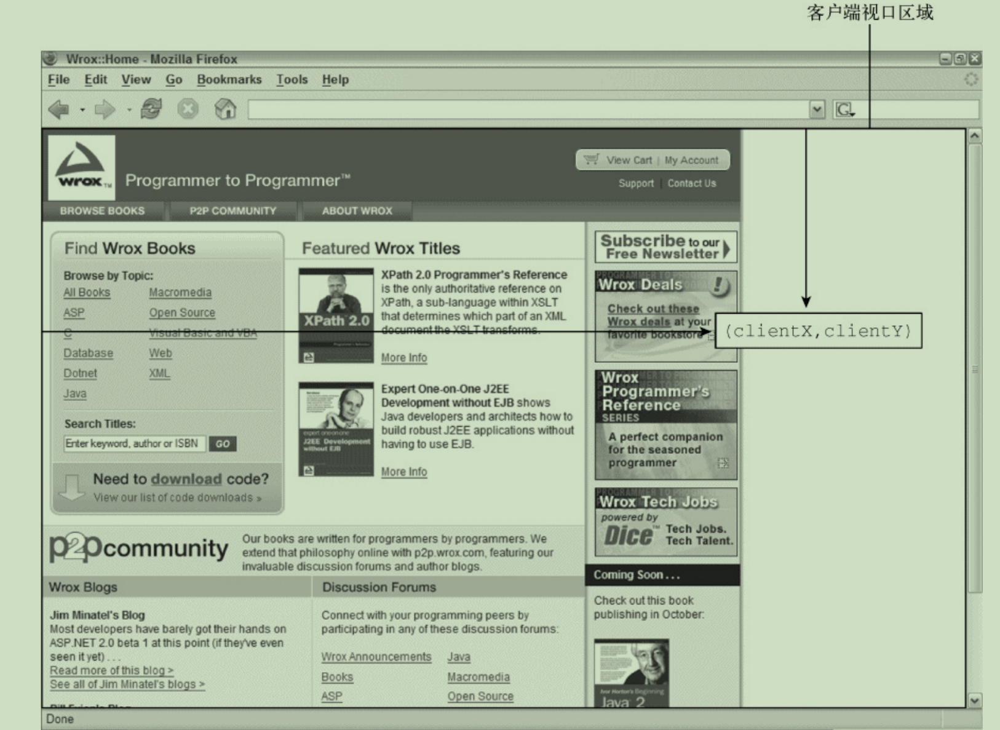

- 如何获取鼠标事件的客户端坐标？

```
let div = document.getElementById("myDiv");

div.addEventListener("click", (event) => {

	console.log(`Client coordinates: 
	${event.clientX}, ${event.clientY}`);
});

```

- 客户端坐标是否考虑页面滚动？
  - 不考虑
    - 因此客户端坐标不代表鼠标在页面上的位置。 

#### \02. 页面坐标 

- 页面坐标是什么？
  - 事件发生时鼠标光标在页面上的坐标，
- 如何获取通过页面坐标？
  - event对象的pageX和pageY
    - 光标到页面的距离

- 如何取得鼠标事件的页面坐标？

```
let div = document.getElementById("myDiv");

div.addEventListener("click", (event) => {
    
	console.log(`Page coordinates: ${event.pageX}, ${event.pageY}`);
});

```

- 在页面没有滚动时，

  pageX和pageY与clientX和clientY的值是否相同？

  - 是

- E8及更早版本没有在event对象上暴露页面坐标。

  如何计算页面坐标？

  - 通过客户端坐标和滚动信息计算

- 如何获取滚动信息？

  - scrollLeft和scrollTop属性

```
let div = document.getElementById("myDiv");

div.addEventListener("click", (event) => {

	let pageX = event.pageX,
		pageY = event.pageY;
		
	if (pageX === undefined) {
	
		pageX =
			event.clientX +
			(document.body.scrollLeft || document.documentElement.scrollLeft);
			
	}
	if (pageY === undefined) {
	
		pageY =
			event.clientY +
			(document.body.scrollTop || document.documentElement.scrollTop);
			
	}
	
	console.log(`Page coordinates: ${pageX}, ${pageY}`);
});

```

#### \03. 屏幕坐标 

- 如何获取鼠标事件的屏幕坐标？
  - event对象的screenX和screenY属性

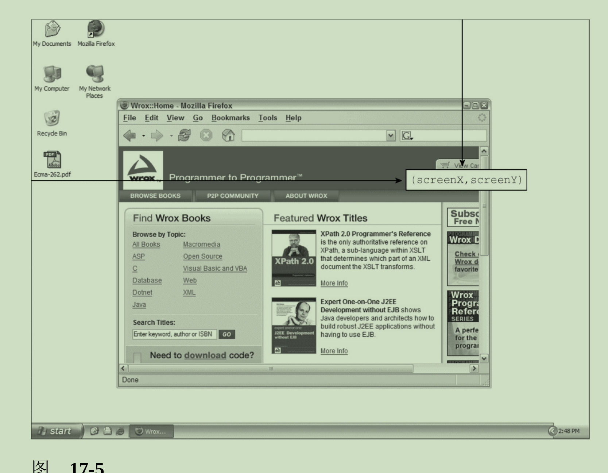

- 如何获取鼠标事件的屏幕坐标？

```
let div = document.getElementById("myDiv");

div.addEventListener("click", (event) => {
    
	console.log(`Screen coordinates: ${event.screenX}, ${event.screenY}`);
});

```

#### \04. 修饰键

- 4个属性来表示修饰键的状态？
  - shiftKey
  - ctrlKey
  - altKey
  - metaKey

- 4个属性的值是什么？
  - 修饰键被按下时true，
  - 没有被按下时false。
- 如何在click事件发生时检测每个修饰键的状态？

```
let div = document.getElementById("myDiv");

div.addEventListener("click", (event) => {

	let keys = new Array();
	
	if (event.shiftKey) {
		keys.push("shift");
	}
	
	if (event.ctrlKey) {
		keys.push("ctrl");
	}
	
	if (event.altKey) {
		keys.push("alt");
	}
	
	if (event.metaKey) {
		keys.push("meta");
	}
	
	console.log("Keys: " + keys.join(","));
});

```

#### \05. 相关元素

- 如何获取相关元素？

  - event对象relatedTarget属性

- 对mouseover事件来说，

  事件的主要目标是什么？相关元素是什么？

  - 主要目标
    - 获得光标的元素，

  - 相关元素
    - 失去光标的元素。

- 对mouseout事件来说，

  事件的主要目标是什么？

  相关元素是什么？

  - 主要目标
    - 失去光标的元素

  - 相关元素
    - 获得光标的元素

```
<!DOCTYPE html>
<html>
	<head>
		<title>Related Elements Example</title>
	</head>
	<body>
		<div
			id="myDiv"
			style="background-color: red;
            height: 100px; 
            width: 100px"
		></div>
	</body>
</html>

```

- 如果光标开始在\<div>元素上，然后从它上面移出，

  \<div>元素上会触发什么事件？

  相关元素是什么？

  - mouseout事件

  - 相关元素是\<body>元素

- \<body>元素上会触发什么事件？ 

  相关元素是什么？

  - mouseover事件

  - 相关元素是\<div>元素

- IE8及更早版本不支持relatedTarget属性

  在mouseover事件触发时，相关元素保存在什么属性？

  在mouseout事件触发时，相关元素保存在什么属性？

  - mouseover事件：fromElement属性
  - mouseout事件：toElement属性

- 如何实现通用的获取相关属性的方法？

```
var EventUtil = {
	// 其他代码
	getRelatedTarget: function (event) {
	
		if (event.relatedTarget) {
		
			return event.relatedTarget;
			
		} else if (event.toElement) {
		
			return event.toElement;
			
		} else if (event.fromElement) {
		
			return event.fromElement;
			
		} else {
		
			return null;
		}
	},
	// 其他代码
};

```

- 如何使用EventUtil.getRelatedTarget()方法?

```
let div = document.getElementById("myDiv");

div.addEventListener("mouseout", (event) => {

    let target = event.target;
    
    let relatedTarget = EventUtil.getRelatedTarget(event);
    
	console.log(`Moused out of ${target.tagName} to ${relatedTarget.tagName}`);
});

```

#### \06. 鼠标按键 

- click事件什么时候触发？

  - 只有在元素上单击鼠标主键

    （或按下键盘上的回车键）

- 对mousedown和mouseup事件来说，

  如何获取按下或释放的按键？

  - event对象button属性

- button属性定义了3个值？
  - 0表示鼠标主键
  - 1表示鼠标中键（通常也是滚轮键）
  - 2表示鼠标副键

- 鼠标主键通常是什么？
  - 左边的按键

- 鼠标副键通常是什么？
  - 右边的按键

#### \07. 额外事件信息 

- 如何获取在给定位置上发生了多少次单击？
  - event对象detail属性

- 单击相当于在同一个像素上发生了什么事件？

  - 一次mousedown
  - 紧跟一次mouseup

- detail的值从多少开始？

  - 1
  - 每次单击会加1

- 如果鼠标在mousedown和mouseup之间移动了

  则detail会发生什么变化？

  - 重置为0

#### \08. **mousewheel**事件 

- mousewheel事件会在什么时候触发？
  - 使用鼠标滚轮时
    - 包括在垂直方向上任意滚动

- 这个事件会在任何元素上触发，并冒泡到哪里？
  - IE8
    - document
  - 所有现代浏览器
    - window

- wheelDelta属性表示什么？
  - 滚轮向前滚动
    - wheelDelta每次+120
  - 滚轮向后滚动
    - wheelDelta每次–120

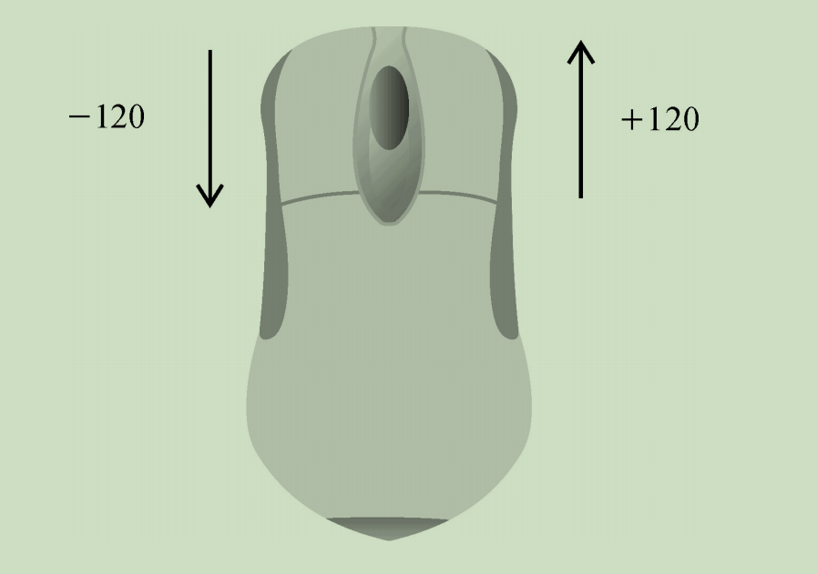

- 如何添加onmousewheel事件处理程序？

```
document.addEventListener("mousewheel", (event) => {
	console.log(event.wheelDelta);
});

```

#### \09. 触摸屏设备

- 触摸屏设备是否支持dblclick事件？
  - 不支持
    - 双击浏览器窗口可以放大，
- 单指点触屏幕上的可点击元素会触发什么事件？
  - mousemove
  - 如果操作会导致内容变化，是否会再触发其他事件？
    - 不会
  - 如果屏幕上没有变化，则会相继触发什么事件？
    - mousedown
    - mouseup
    - click
  - 点触不可点击的元素是否会触发事件？
    - 不会
  - 可点击元素是指什么？
    - 点击时有默认动作的元素（如链接）
    - 指定了onclick事件处理程序的元素。 

- mousemove事件也会触发什么事件？
  - mouseover
  - mouseout

- 双指点触屏幕并滑动导致页面滚动时会触发什么事件？
  - mousewheel
  - scroll

#### \10. 无障碍问题 

- 无障碍建议

  - 使用click事件执行代码
    - 因为屏幕阅读器无法触发mousedown事件
  - 不要使用mouseover向用户显示新选项
    - 因为屏幕阅读器无法触发mousedown事件

  - 不要使用dblclick执行重要的操作
    - 因为键盘不能触发dblclick事件

### **17.4.4** 键盘与输入事件 

- 键盘事件包含3个事件？

  - keydown，
    - 按下键盘上某个键时触发，
    - 持续按住会重复触发。

  - keypress，

    - 废弃 

    - 推荐textInput事件。 

  - keyup，
    - 释放键盘上某个键时触发。 

- 输入事件有哪些？
  - textInput
- textInput会在什么时候触发？
  - 文本被插入到文本框之前

- 当用户按下键盘上的某个字符键时，会触发哪些事件？

  - keydown
  - keypress
  - keyup

- keydown、keypress、keyup事件

  会在文本框变化之前还是之后触发？

  - 文本框变化之前
    - keydown
    - keypress
  - 文本框变化之后
    - keyup

- 如果一个字符键被按住不放，会重复触发哪些事件？

  - keydown
  - keypress

  - 直到这个键被释放。 

- 对于非字符键，在键盘上按一下这个键，

  会触发哪些事件？

  - keydown

  - keyup

- 如果按住某个非字符键不放，会重复触发什么事件？

  - keydown 
  - 直到这个键被释放，此时触发keyup事件

#### \01. 键码

- event对象的keyCode属性中会保存什么？
  - 一个键码，对应键盘上一个键。
- 对于字母和数字键，keyCode的值是什么？
  - 与小写字母和数字的ASCII编码一致
    - 比如数字7键的keyCode为55，
    - 字母A键的keyCode为65，
  - 跟是否按了Shift键无关。 
- keyCode已经弃用，用什么代替？
  - event对象code属性
- 如何使用keyCode属性？

```
let textbox = document.getElementById("myText");

textbox.addEventListener("keyup", (event) => {

	console.log(event.keyCode);
	
});

```

-  键盘上所有非字符键的键码：

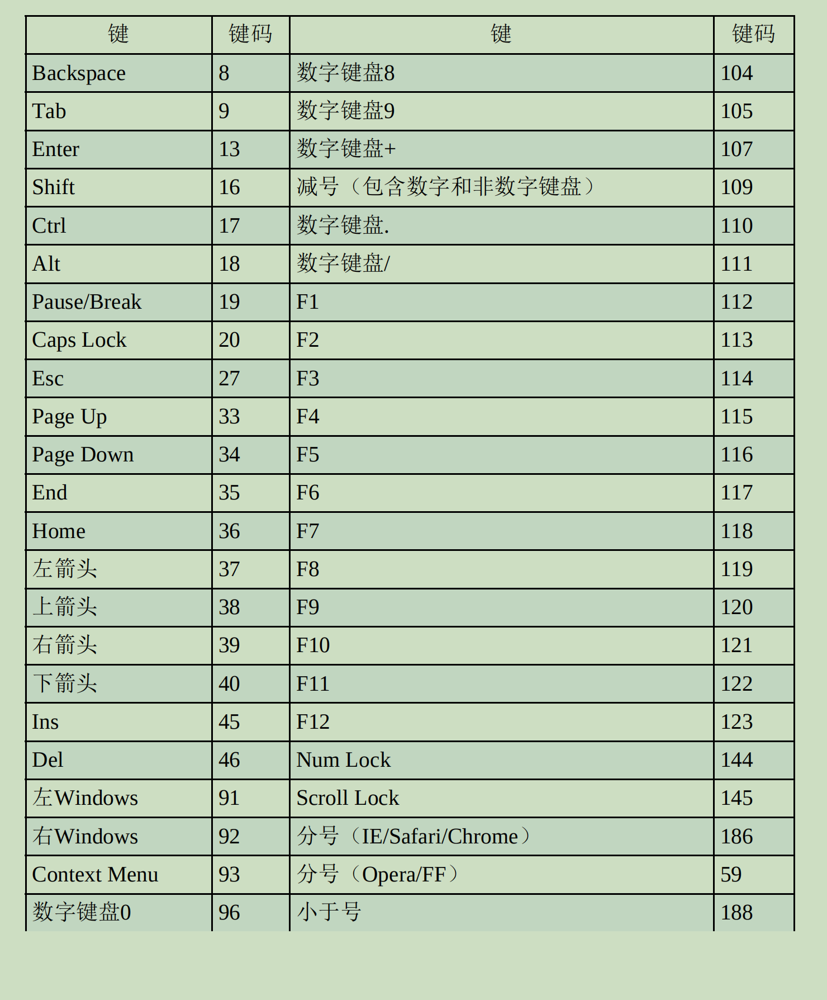

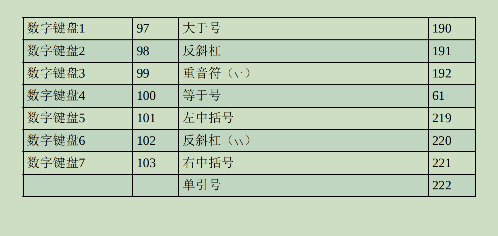

#### \02. 字符编码

- 浏览器在event对象charCode属性，

  只有在什么时候这个属性才会被设置值？

  - 发生keypress事件

- charCode属性包含什么？

  - 按键字符对应的ASCII编码

- 默认情况下，charCode属性的值是什么？
  - 0
- 在keypress事件发生时，charCode值是什么？
  - 对应按键的键码。
- 如何以跨浏览器方式获取字符编码？
  - 首先检查charCode属性是否有值，
  - 如果没有再使用keyCode

```
var EventUtil = {
	// 其他代码
	getCharCode: function (event) {
		if (typeof event.charCode == "number") {
			return event.charCode;
		} else {
			return event.keyCode;
		}
	},
	// 其他代码
};

```

- 如何使用getCharCode（）方法？

```
let textbox = document.getElementById("myText");

textbox.addEventListener("keypress", (event) => {
	console.log(EventUtil.getCharCode(event));
});

```

#### \03. **DOM3**的变化 

- DOM3 Events规范是否有规定charCode属性？

  - 没有规定

- key属性用于替代什么？

  - keyCode

  - 包含字符串。

- key属性的值是什么？

  - 按下字符键

    - 文本字符

      （如“k”或“M”）；

  - 按下非字符键

    - 键名

      （如“Shift”或“ArrowDown”）

- char属性的值是什么？

  - 按下字符键
    - 文本字符
  - 按下非字符键
    - null

- IE支持key属性但不支持char属性。

- Safari和Chrome支持keyIdentifier属性，

  在按下非字符键时返回什么？

  - 与key一样的值 

- 对于字符键，keyIdentifier返回什么？

  - 以“U+0000”形式表示

    Unicode值的字符串形式的字符编码。


```
let textbox = document.getElementById("myText");

textbox.addEventListener("keypress", (event) => {
	
	let identifier = event.key || event.keyIdentifier;
	
	if (identifier) {
		console.log(identifier);
	}
});

```

- 由于缺乏跨浏览器支持，
  - 因此不建议使用key、keyIdentifier、char。 

- event对象getModifierState()方法接收什么参数？
  - 一个字符串，表示要检测的修饰键。
    - 等于Shift、Control、Alt、AltGraph 
  - 如果给定的修饰键处于激活状态（键被按住），
    - 返回true，
    - 否则返回false：

```
let textbox = document.getElementById("myText");

textbox.addEventListener("keypress", (event) => {

	if (event.getModifierState) {
		console.log(event.getModifierState("Shift"));
	}
});
```

#### \04. **textInput**事件

- textInput的事件在什么时候触发？
  - 字符被输入到可编辑区域时

- keypress和textInput的区别是什么？
  - 触发的位置不同
    - keypress会在任何可以获得焦点的元素上触发
    - textInput只在可编辑区域上触发
  - 触发的时机不同
    - keypress对任何可能影响文本的键都会触发（包括退格键）
    - textInput只在有新字符被插入时才会触发

- event对象上data属性包含什么？
  - 要插入的字符（不是字符编码）
- 如果在按S键时没有按Shift键，data的值是什么？
  - "s"
- 在按S键时同时按Shift键，data的值是什么？
  - "S"

- 如何使用textInput事件？

```
let textbox = document.getElementById("myText");

textbox.addEventListener("textInput", (event) => {

	console.log(event.data);
});
```

- event对象inputMethod的属性表示什么？

  - 输入文本的手段。

- inputMethod可能的值有什么？

  - 0，表示浏览器不能确定是什么输入手段； 

  - 1，表示键盘； 

  - 2，表示粘贴； 

  - 3，表示拖放操作； 

  - 4，表示IME； 

  - 5，表示表单选项； 

  - 6，表示手写（如使用手写笔）； 

  - 7，表示语音； 

  - 8，表示组合方式； 

  - 9，表示脚本

#### \05. 设备上的键盘事件

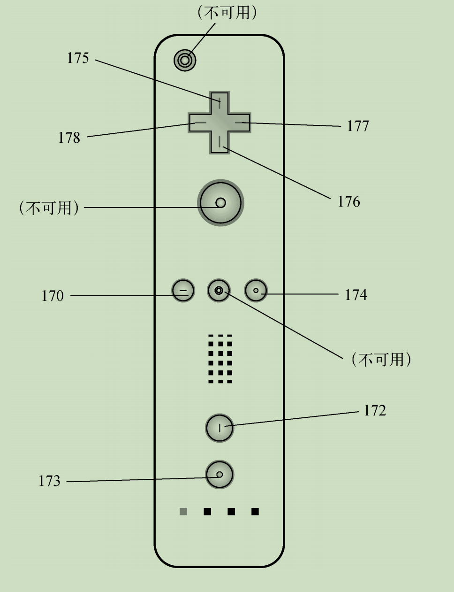

### **17.4.5** 合成事件

- 合成事件用于什么？
  - 处理使用IME输入时的复杂输入序列
- 合成事件有3种？
  - compositionstart
    - 在IME的文本合成系统打开时触发
    - 表示输入即将开始
  -  compositionupdate
    - 在新字符插入输入字段时触发
  - compositionend
    - 在IME的文本合成系统关闭时触发
    - 恢复正常键盘输入 

- 在合成事件触发时，事件目标是什么？

  - 接收文本的输入字段

- 事件属性是data的值是什么？

  - 在compositionstart事件中，

    - 包含正在编辑的文本

      （例如，已经选择了文本但还没替换） 

  - 在compositionupdate事件中，
    - 包含要插入的新字符； 

  - 在compositionend事件中，
    - 包含本次合成过程中输入的全部内容。

- 如何使用合成事件？

```
let textbox = document.getElementById("myText");

textbox.addEventListener("compositionstart", (event) => {
	console.log(event.data);
});

textbox.addEventListener("compositionupdate", (event) => {
	console.log(event.data);
});

textbox.addEventListener("compositionend", (event) => {
	console.log(event.data);
});
```

### **17.4.6** 变化事件 

- DOM2的变化事件（Mutation Events）是为了什么？
  - 在DOM发生变化时提供通知。

- 变化事件已经被废弃

  已经被什么所取代？

  - Mutation Observers

  
