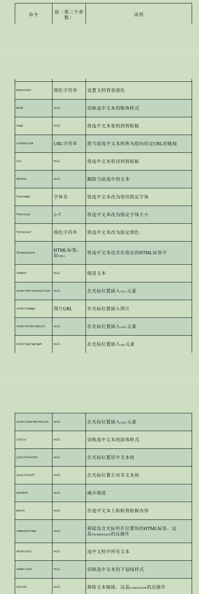

# 第 **19** 章 表单脚本

- 本章内容

  - 理解表单基础 

  - 文本框验证与交互 

  - 使用其他表单控件 

## **19.1** 表单基础 

- Web表单在HTML中以什么元素表示

  - \<form>

- 在JavaScript中则以什么类型表示？

  - HTMLFormElement

- HTMLFormElement类型继承自什么类型？

  - HTMLElement
  - 拥有与其他HTML元素一样的默认属性。

- HTMLFormElement自己的属性和方法？

  - acceptCharset：服务器可以接收的字符集，
    - 等价于HTML的accept-charset属性。 

  - action：请求的URL，
    - 等价于HTML的action属性。 

  - elements：表单中所有控件的HTMLCollection。 

  - enctype：请求的编码类型，
    - 等价于HTML的enctype属性。 

  - length：表单中控件的数量。 

  - method：HTTP请求的方法类型，
    - 通常是"get"或"post"，
    - 等价于HTML的method属性。 

  - name：表单的名字，
    - 等价于HTML的name属性。 

  - reset()：把表单字段重置为各自的默认值。 

  - submit()：提交表单。 

  - target：用于发送请求和接收响应的窗口的名字，
    - 等价于HTML的target属性。

-  如何取得对\<form>元素的引用？
  - 将表单指定一个id属性，
    - 使用getElementById()
  - 使用document.forms集合
    - 可以获取页面上所有的表单元素。
    - 使用数字索引或表单的名字来访问特定的表单

```
let form = document.getElementById("form1");
```

```
// 取得页面中的第一个表单
let firstForm = document.forms[0];

// 取得名字为"form2"的表单
let myForm = document.forms["form2"];

```

- 表单是否可以同时拥有id和name？
  - 可以
  - 而且两者可以不相同。 

### **19.1.1** 提交表单 

- 表单是通过什么方式提交的？
  - 用户点击
    - 提交按钮
    - 图片按钮
  - submit()
    - 
- 提交按钮可以使用来定义？
  - type属性为"submit"的\<input>元素
  - \<button>元素
- 图片按钮可以使用什么来定义？
  - type属性为"image"的\<input>元素
- 提交表单： 

```
<!-- 通用提交按钮 -->
<input type="submit" value="Submit Form" />

<!-- 自定义提交按钮 -->
<button type="submit">Submit Form</button>

<!-- 图片按钮 -->
<input type="image" src="graphic.gif" />

```

- 如果表单中有上述任何一个按钮，

  且焦点在表单中某个控件上

  则按什么键也可以提交表单？

  - 回车建

  - textarea控件是个例外，
    - 当焦点在它上面时，按回车键会换行。

- 没有提交按钮的表单在按回车键时是否会提交？

  - 不会

- 按回车键提交表单会在向服务器发送请求之前

  触发什么事件？

  - submit

- 如何取消提交表单？
  - 阻止submit事件的默认行为

```
let form = document.getElementById("myForm");

form.addEventListener("submit", (event) => {
	// 阻止表单提交
	event.preventDefault();
});

```

- 在什么时侯需要阻止表单提交？
  - 表单数据无效
  - 表单不应该发送到服务器

- 调用submit（）时

  表单中不存在提交按钮是否影响表单提交？

  - 不影响

```
let form = document.getElementById("myForm");

// 提交表单 
form.submit();

```

- 通过submit()提交表单时，submit事件是否会触发？
  - 不会
  - 因此在调用submit()方法前要先做数据验证。 

- 表单提交的一个最大的问题是什么？
  - 可能会提交两次表单。
- 解决提交两次表单问题主要有两种方式？
  -  在表单提交后
    - 禁用提交按钮、
  - 通过onsubmit事件处理程序
    - 取消之后的表单提交

### **19.1.2** 重置表单

- 如何重置表单？
  - 用户单击重置按钮
  - 调用reset()方法
- 重置按钮可以使用来创建？
  - type属性为"reset"的\<input>
  - \<button>元素

```
<!-- 通用重置按钮 -->
<input type="reset" value="Reset Form" />

<!-- 自定义重置按钮 -->
<button type="reset">Reset Form</button>

```

- 表单重置后，所有表单字段都会重置为什么值？

  - 页面第一次渲染时各自拥有的值。

    - 如果字段原来是空的，就会变成空的； 

    - 如果字段有默认值，则恢复为默认值。 

- 用户单击重置按钮重置表单会触发什么事件？

  - reset

  - 这个事件为取消重置提供了机会。

- 如何阻止重置表单？

```
let form = document.getElementById("myForm");

form.addEventListener("reset", (event) => {
	event.preventDefault();
});

```

- 调用reset()方法

```
let form = document.getElementById("myForm");

// 重置表单
form.reset();

```

- 调用reset()方法是否会触发reset事件？
  - 会

- 表单设计中通常是否提倡重置表单？
  - 不提倡
  - 因为重置表单经常会导致用户迷失方向，
  - 实践中几乎没有重置表单的需求。
- 一般来说，提供一个取消按钮，
  - 让用户点击返回前一个页面，
  - 而不是恢复表单中所有的值来得更直观。

### **19.1.3** 表单字段 

- 表单元素是否可以使用原生DOM方法来访问？
  - 可以
- 所有表单元素都是表单什么属性（元素集合）中
- 包含的一个值
  - elements
- elements集合是一个什么？
  - 有序列表，
  - 包含对表单中所有字段的引用，
    - 包括所有\<input>\<textarea>、\<button>、\<select>和\<fieldset> 元素。
- elements集合中的每个字段都以什么次序保存？
  - 在HTML标记中出现的
- 可以通过什么访问表单字段？
  - 索引位置
  - name属性
  - 表单属性 form["color"]

```
let form = document.getElementById("form1");

// 取得表单中的第一个字段
let field1 = form.elements[0];

// 取得表单中名为"textbox1"的字段
let field2 = form.elements["textbox1"];

// 取得字段的数量
let fieldCount = form.elements.length

```

- 如果多个表单控件使用了同一个name

  则会返回什么？

  - 包含所有同名元素的HTMLCollection

```
<form method="post" id="myForm">
	<ul>
		<li><input type="radio" name="color" value="red" />Red</li>
		<li><input type="radio" name="color" value="green" />Green</li>
		<li><input type="radio" name="color" value="blue" />Blue</li>
	</ul>
</form>

```

```
let form = document.getElementById("myForm");

let colorFields = form.elements["color"];

console.log(colorFields.length); // 3

let firstColorField = colorFields[0];

let firstFormField = form.elements[0];

console.log(firstColorField === firstFormField); // true

```

- 通过表单属性访问表单字段（form[0]、form["color"]）

  是为向后兼容旧版本浏览器而提供的，

  - 实际开发中应该使用elements。

#### \01. 表单字段的公共属性 

- disabled：布尔值，表示表单字段是否禁用。 

- form：指针，指向表单字段所属的表单。
  - 只读的。 

- name：字符串，这个字段的名字。 

- readOnly：布尔值，表示这个字段是否只读。 

- tabIndex：数值，表示这个字段在按Tab键时的切换顺序。 

- type：字符串，表示字段类型，
  - 如"checkbox"、"radio"等。 

- value：要提交给服务器的字段值。
  - 对文件输入字段来说，
    - 这个属性是只读的，
    - 仅包含计算机上某个文件的路径。

- JavaScript是否可以动态修改任何属性？
  - 可以

```
let form = document.getElementById("myForm");

let field = form.elements[0];

// 修改字段的值
field.value = "Another value";

// 检查字段所属的表单
console.log(field.form === form); // true

// 给字段设置焦点
field.focus();

// 禁用字段
field.disabled = true;

// 改变字段的类型（不推荐，但对<input>来说是可能的）
field.type = "checkbox";

```

- 点击两次提交按钮常见的解决方案是什么？
  - 第一次点击之后，禁用提交按钮。
    - 通过监听submit事件来实现

```
// 避免多次提交表单的代码 
let form = document.getElementById("myForm");

form.addEventListener("submit", (event) => {
    let target = event.target;
    
    // 取得提交按钮 
    let btn = target.elements["submit-btn"];
    
    // 禁用提交按钮
    btn.disabled = true;
});

```

- 禁用提交按钮功能是否能通过

  提交按钮添加onclick事件处理程序来实现？

  - 不能

  - 原因是不同浏览器触发事件的时机不一样。

    - 有些会在submit前触发lick
      - 这意味着表单就不会被提交了

    - 有些会在submit后触发click

- 禁用提交按钮方式是否适用于

  没有提交按钮的表单提交？

  - 不适用

  - 因为只有提交按钮才能触发submit事件

- type属性可以用于什么表单字段？
  - 除\<fieldset>之外的任何表单字段
- 对于\<input>元素，type值等于什么？
  - HTML的type属性值。
- 对于其他元素，这个type属性的值按照下表设置。


- 对于\<input>和\<button>元素，

  是否可以动态修改其type属性？

  - 可以

- \<select>元素的type属性是否是只读的?

  - 是

#### \02. 表单字段的公共方法 

- 每个表单字段都有两个公共方法？
  - focus()
  - blur()。
- focus()方法执行什么操作？
  - 把浏览器焦点设置到表单字段，
  - 这意味着该字段会变成活动字段并可以响应键盘事件。
- 文本框在获得焦点时会显示什么？
  - 在内部显示闪烁的光标，
  - 表示可以接收输入。
- focus()方法主要用来做什么？
  - 引起用户对页面中某个部分的注意。
- 如何实现在页面加载后把焦点定位到表单中第一个字段
  - 监听load事件，
  - 然后在第一个字段上调用focus()

```
window.addEventListener("load", (event) => {
	document.forms[0].elements[0].focus();
});

```

- 如果表单中第一个字段是type为"hidden"的\<input>元素，或者该字段被CSS属性display或visibility隐藏了，
  - 以上代码就会出错。

- 表单字段的autofocus属性执行什么操作？
  - 自动为带有该属性的元素设置焦点，
  - 而无须使用JavaScript

```
<input type="text" autofocus>
```

- 为了在使用autofocus时能正常工作，必须先做什么？
  - 检测元素上是否设置了该属性。
  - 如果设置了autofocus，
    - 就不再调用focus()

```
window.addEventListener("load", (event) => {
	let element = document.forms[0].elements[0];
	if (element.autofocus !== true) {
		element.focus();
		console.log("JS focus");
	}
});

```

- 所以在支持的浏览器中通过 

  JavaScript访问表单字段的autofocus属性会返回什么？

  - true
  - 在不支持的浏览器中是空字符串

- 默认情况下只能给什么元素设置焦点？

  - 表单元素

- focus()的反向操作是什么？

  - blur()，
  - 其用于从元素上移除焦点。

- 调用blur()时，焦点是否会转移到任何特定元素？

  - 不会

- 现在很少需要调用blur()

```
document.forms[0].elements[0].blur();
```

#### \03. 表单字段的公共事件

- 表单字段还支持以下3个额外的事件

  - blur：在字段失去焦点时触发。 

  - change：

    - 在\<input>和\<textarea>元素的value发生变化

      且失去焦点时触发，

    - 或者在\<select>元素中选中项发生变化时触发。 

  - focus：在字段获得焦点时触发。 

- blur和focus事件会因为什么而触发？

  - 用户手动改变字段焦点
  - 调用blur()或focus()方法

- change事件是否会因控件不同而在不同时机触发？

  - 会

- 对于\<input>和\<textarea>元素，

  change事件会在什么时候触发？

  - 字段失去焦点

  - 同时value获得焦点后发生变化

- 对于\<select>元素，change事件会在什么时候触发？
  - 用户改变了选中项时
    - 不需要控件失去焦点。

- focus和blur事件通常用于什么？

  - 以某种方式改变用户界面，

    - 以提供可见的提示或额外功能

    （例如在文本框下面显示下拉菜单）

- change事件通常用于什么？
  - 验证用户在字段中输入的内容。
    - 比如，有的文本框可能只限于接收数值。

```
let textbox = document.forms[0].elements[0];

textbox.addEventListener("focus", (event) => {
	let target = event.target;
	if (target.style.backgroundColor != "red") {
		target.style.backgroundColor = "yellow";
	}
});

textbox.addEventListener("blur", (event) => {
	let target = event.target;
	target.style.backgroundColor = /[^\d]/.test(target.value) ? "red" : "";
});

textbox.addEventListener("change", (event) => {
	let target = event.target;
	target.style.backgroundColor = /[^\d]/.test(target.value) ? "red" : "";
});

```

- blur和change事件的触发顺序不同浏览器不同

## **19.2** 文本框编程 

- 在HTML中有两种表示文本框的方式？

  - 单行使用\<input>元素，
  - 多行使用\<textarea>元素。

- 默认情况下，\<input>元素显示为什么？

  - 文本框，

- \<input>省略type属性会以什么作为默认值？

  - "text"

- \<input>通过什么属性指定文本框的宽度？

  - size
  - 这个宽度是以字符数来计量的。

- \<input>value属性用于什么？

  - 指定文本框的初始值，

- \<input>maxLength属性用于什么？

  - 指定文本框允许的最多字符数。

- 如何创建一个一次可显示25个字符，

  但最多允许显示50个字符的文本框？

```
<input type="text" size="25" maxlength="50" value="initial value">
```

- \<textarea>元素会创建什么？
  - 多行文本框。
- \<textarea>元素可以使用什么属性指定这个文本框的高度？
  - rows
  - 以字符数计量；
- \<textarea>元素以什么属性指定文本框宽度？
  - cols
- \<textarea> 的初始值必须包含在哪里？
  - \<textarea>和\</textarea>之间

```
<textarea rows="25" cols="5">initial value</textarea>
```

- \<textarea>是否能在HTML中指定最大允许的字符数？
  - 不能

- 这两种类型的文本框都会在什么属性中保存自己的内容？
  - value
  - 可以读取、设置文本模式的值

```
let textbox = document.forms[0].elements["textbox1"];

console.log(textbox.value);

textbox.value = "Some new value";

```

- 如何读写文本框的值？
  - 应该使用value属性，
  - 而不是标准DOM方法
- 不要使用setAttribute()设置\<input>元素value属性的值，
- 也不要尝试修改\<textarea>元素的第一个子节点。
- 因此在处理文本框值的时候最好不要使用DOM方法

### **19.2.1** 选择文本 

- select()用于什么？
  - 全部选中文本框中的文本。
- 调用select()方法后，焦点会在哪里？
  - 自动将焦点设置到文本框
- select()方法不接收参数，可以在任何时候调用。 

```
let textbox = document.forms[0].elements["textbox1"];

textbox.select();

```

- 如何让用户能够一次性删除所有默认内容？
  - 在文本框获得焦点时选中所有文本

```
textbox.addEventListener("focus", (event) => {
	event.target.select();
});

```

#### \01. **select**事件 

- select事件什么时候触发？
  - 选中文本框中的文本时
- 这个事件确切的触发时机因浏览器而异
- select事件会在用户选择完文本后立即触发；
- 调用select()方法是否会触发select事件？
  - 会

```
let textbox = document.forms[0].elements["textbox1"];

textbox.addEventListener("select", (event) => {
	console.log(`Text selected: ${textbox.value}`);
});

```

#### \02. 取得选中文本 

- select事件能够表明有文本被选中，

  是否能提供选中了哪些文本的信息？

  - 不能

- selectionStart和selectionEnd分别表示什么？

  - 文本选区的起点和终点

    （文本选区起点的偏移量

    和文本选区终点的偏移量）

- 如何取得文本框中选中的文本？

```
function getSelectedText(textbox) {
	return textbox.value.substring(
		textbox.selectionStart,
		textbox.selectionEnd
	);
}

```

- 老版本IE如何提取文本？

```
function getSelectedText(textbox) {
	if (typeof textbox.selectionStart == "number") {
		return textbox.value.substring(
			textbox.selectionStart,
			textbox.selectionEnd
		);
	} else if (document.selection) {
		return document.selection.createRange().text;
	}
}

```

#### \03. 部分选中文本 

- Firefox最早实现的setSelectionRange()方法 
  - 可以在所有文本框中使用。

- setSelectionRange()方法接收什么参数？
  - 要选择的第一个字符的索引
  - 停止选择的字符的索引

```
textbox.value = "Hello world!" 

// 选择所有文本
textbox.setSelectionRange(0, textbox.value.length);// "Hello world!"

// 选择前3个字符
textbox.setSelectionRange(0, 3); // "Hel"

// 选择第4~6个字符
textbox.setSelectionRange(4, 7); // "o w"
```

- 如果想看到选择，则必须做什么？
  - 在调用setSelectionRange()之前或之后
  - 给文本框设置焦点。

- IE8及更早版本如何选择文本框中的部分文本？

  - 先使用IE的createTextRange()方法创建一个范围，

  - 调用collapse()方法把范围折叠到文本框的开始。

  - moveStart()可以把范围的起点和终点

    都移动到相同的位置，

  - 给moveEnd()传入要选择的字符总数作为参数。
  - select()方法选中文本，

```
textbox.value = "Hello world!";
var range = textbox.createTextRange();

// 选择所有文本 
range.collapse(true);
range.moveStart("character", 0);
range.moveEnd("character", textbox.value.length); // "Hello world!" 
range.select();

// 选择前3个字符 
range.collapse(true);
range.moveStart("character", 0);
range.moveEnd("character", 3);
range.select(); // "Hel"

// 选择第4~6个字符 
range.collapse(true);
range.moveStart("character", 4);
range.moveEnd("character", 7);
range.select(); // "o w"
```

- 如果想要看到选中的效果，则必须做什么？
  - 让文本框获得焦点

### **19.2.2** 输入过滤

- 必须通过什么来实现这种输入过滤？
  - JavaScript

#### \01. 屏蔽字符

- 如何实现屏蔽字符？
  - 阻止keypress事件的默认行为
- 如何屏蔽所有按键的输入？

```
textbox.addEventListener("keypress", (event) => {
	event.preventDefault();
});
```

- 运行以上代码会让文本框变成什么？
  - 只读
  - 因为所有按键都被屏蔽了。
- 如何实现只屏蔽特定字符？
  - 检查事件的charCode属性
- 如何实现只允许输入数字？（跨浏览器）
  - 确保没有按下Ctrl键，

```
textbox.addEventListener("keypress", (event) => {
	if (!/\d/.test(String.fromCharCode(event.charCode)) && event.charCode > 9 && !event.ctrlKey) {
		event.preventDefault();
	}
});
```

#### \02. 处理剪贴板 

- 剪贴板相关的6个事件

  - beforecopy：复制操作发生前触发。 

  - copy：复制操作发生时触发。 

  - beforecut：剪切操作发生前触发。 

  - cut：剪切操作发生时触发。 

  - beforepaste：粘贴操作发生前触发。 

  - paste：粘贴操作发生时触发。 

- beforecopy、beforecut和beforepaste事件

  只会在什么时候触发？

  - 显示文本框的上下文菜单时
  - 但IE不仅在这种情况下触发，
    - 也会在copy、cut和paste事件之前触发。

- 通过beforecopy、beforecut和beforepaste事件

  可以做什么？

  - 向剪贴板发送或从中检索数据前

    修改数据

- 取消这些事件是否会取消剪贴板操作？

  - 不会

- 如何阻止剪贴板操作？
  - 取消copy、cut、paste事件。 

- 剪贴板上的数据可以通过什么对象来获取？

  - clipboardData

- 如何获取clipboardData对象？

  - window对象（IE）
  - event对象（Firefox、Safari和Chrome）

- 在Firefox、Safari 和Chrome中，

  为防止未经授权访问剪贴板，

  只能在什么时候访问clipboardData对象？

  - 剪贴板事件期间

- IE则在什么时候会暴露clipboardData对象？

  - 任何时候

- 为了跨浏览器兼容，

  最好只在什么时候使用clipboardData对象？

  - 剪贴板事件 期间 

- clipboardData对象上有3个方法？

  - getData()
  - setData() 

  - clearData()

- getData()方法用于什么？
  - 从剪贴板检索字符串数据，
- getData()方法接收什么参数？
  - 要检索的数据的格式。
  - IE："text"和"URL"
  - Firefox、Safari和Chrome：MIME类型， 
    - 将"text"视为等价于"text/plain"。

- setData()方法接收什么参数？
  - 第一个参数用于指定数据类型，
  - 第二个参数是要放到剪贴板上的文本。

- 如何实现跨浏览器？

```
function getClipboardText(event) {
	var clipboardData = (event.clipboardData || window.clipboardData);
	return clipboardData.getData("text");
}

function setClipboardText(event, value) {
	if (event.clipboardData) {
		return event.clipboardData.setData("text/plain", value);
	} else if (window.clipboardData) {
		return window.clipboardData.setData("text", value);
	}
}
```

- 在paste事件中，可以做什么？
  - 确定剪贴板上的文本是否无效，
    - 如果无效就取消默认行为

```
textbox.addEventListener("paste", (event) => {
	let text = getClipboardText(event);
	if (!/^\d*$/.test(text)) {
		event.preventDefault();
	}
});
```

### **19.2.3** 自动切换

- 自动切换用于什么？
  - 当前字段完成时自动切换到下一个字段。
- 对于什么样的字段是可以自动切换？
  - 要收集数据的长度已知（比如电话号码）

```
<input type="text" name="tel1" id="txtTel1" maxlength="3" />
<input type="text" name="tel2" id="txtTel2" maxlength="3" />
<input type="text" name="tel3" id="txtTel3" maxlength="4" />

```

- 如何实现在每个文本框输入到最大允许字符数时

  自动把焦点切换到下一个文本框？

```
function tabForward(event) {
	let target = event.target;
	if (target.value.length == target.maxLength) {
		let form = target.form;
		for (let i = 0, len = form.elements.length; i < len; i++) {
			if (form.elements[i] == target) {
				if (form.elements[i + 1]) {
					form.elements[i + 1].focus();
				}
				return;
			}
		}
	}
}
let inputIds = ["txtTel1", "txtTel2", "txtTel3"];
for (let id of inputIds) {
	let textbox = document.getElementById(id);
	textbox.addEventListener("keyup", tabForward);
}
let textbox1 = document.getElementById("txtTel1");
let textbox2 = document.getElementById("txtTel2");
let textbox3 = document.getElementById("txtTel3");
```

### **19.2.4 HTML5**约束验证**API**

#### \01. 必填字段

- 如何实现必填字段？
  - 给表单字段添加required属性

```
<input type="text" name="username" required>
```

- 任何带有required属性的字段都必须有值，
  - 否则无法提交表单。
- required属性适用于什么字段？
  - \<input>、\<textarea>和\<select>字段
- 如何检测表单字段是否为必填？
  -  通过JavaScript检测对应元素的required属性

```
let isUsernameRequired = document.forms[0].elements["username"].required;
```

- 如何检测浏览器是否支持required属性？

```
let isRequiredSupported = "required" in document.createElement("input");
```

#### \02. 更多输入类型 

- "email"类型确保输入的文本匹配什么？
  - 电子邮件地址
- "url"类型确保输入的文本匹配什么？
  - URL。

```
<input type="email" name="email">
<input type="url" name="homepage">
```

- 如何检测浏览器是否支持email和url新类型？
  - 可以在JavaScript中新创建一个输入元素
    - 并将其类型属性设置为"email"或"url"，
    - 然后再读取该元素的值。
  - 老版本浏览器会自动将未知类型值设置为"text"，
  - 而支持的浏览器会返回正确的值

```
let input = document.createElement("input"); input.type = "email"; 
let isEmailSupported = (input.type == "email");
```

#### \03. 数值范围

- 除了"email"和"url"，

  HTML5还定义了哪几种新的输入元素类型？

  - "number"、"range"、"datetime"、"datetime- 

  local"、"date"、"month"、"week"、"time"。

- 对上述每种数值类型，都可以指定哪些属性？
  - min属性（最小可能值）
  - max属性（最大可能值）
  - step属性（从min到max的步长值）

- 如何实现只允许输入0到100中5的倍数？

```
<input type="number" min="0" max="100" step="5" name="count">
```

- stepUp()和stepDown()接收什么参数？
  - 要从当前值加上或减去的数值。 

```
input.stepUp(); // 加1 
input.stepUp(5); // 加5
input.stepDown(); // 减1 
input.stepDown(10); // 减10
```

#### \04. 输入模式

- HTML5的pattern属性用于什么？

  - 指定一个正则表达式，

    用户输入的文本必须与之匹配。

- 如何实现只能在文本字段中输入数字？

```
<input type="text" pattern="\d+" name="count">
```

- 模式的开头和末尾分别假设有^和$。
  - 这意味着输入内容必须从头到尾都严格与模式匹配。

- 指定pattern属性是否会阻止用户输入无效内容？
  - 不会
- 如何读取模式？
  - pattern属性

```
let pattern = document.forms[0].elements["count"].pattern;
```

- 如何检测浏览器是否支持pattern属性？

```
let isPatternSupported = "pattern" in document.createElement("input");
```

#### \05. 检测有效性

- 如何检测表单中任意给定字段是否有效?
  - checkValidity()方法

- checkValidity()返回什么？
  - 如果字段值有效就会返回true，
  - 否则返回false。

- 判断字段是否有效的依据是什么？

  - 约束条件，

    - 必填字段如果没有值就会被视为无效，

    - 字段值不匹配pattern属性也会被视为无效。

```
if (document.forms[0].elements[0].checkValidity()) {
	// 字段有效，继续 
} else {
	// 字段无效 
}
```

- 如何检查整个表单是否有效？
  - 直接在表单上调用checkValidity() 
    - 方法会在所有字段都有效时返回true，
    - 有一个字段无效就会返回false：

```
if (document.forms[0].checkValidity()) {
	// 表单有效，继续 
} else {
	// 表单无效 
}
```

- validity属性会告诉我们什么？

  - 字段为什么有效或无效。

- validity属性是一个对象，包含什么？

  - 一系列返回布尔值的属性

  - customError：

    - 如果设置了setCustomValidity()就返回true， 

    - 否则返回false。

  - patternMismatch：

    - 如果字段值不匹配指定的pattern属性则返回true。 

  - rangeOverflow：
    - 如果字段值大于max的值则返回true。 

  - rangeUnderflow：
    - 如果字段值小于min的值则返回true。 

  - stepMisMatch：

    - 如果字段值与min、max和step的值不相符

      则返回true。 

  - tooLong：

    - 如果字段值的长度超过了maxlength属性指定的值

      则返回true。

  - typeMismatch：

    - 如果字段值不是"email"或"url"要求的格式

      则返回true。 

  - valid：
    - 如果其他所有属性的值都为false则返回true。 
    - 与checkValidity()的条件一致。 

  - valueMissing：
    - 如果字段是必填的但没有值则返回true。

- 如何检查表单字段的有效性？

```
if (input.validity && !input.validity.valid) {

	if (input.validity.valueMissing) {
	
		console.log("Please specify a value.")
		
	} else if (input.validity.typeMismatch) {
	
		console.log("Please enter an email address.");
	} else {
		console.log("Value is invalid.");
	}
}
```

#### \06. 禁用验证

- 如何禁止对表单进行任何验证？
  - 指定novalidate属性

```
<form method="post" action="/signup" novalidate>
	<!-- 表单元素 -->
</form>

```

- 通过JavaScript属性noValidate检索或设置，
  - 设置为true表示属性存在，
  - 设置为false表示属性不存在：

```
document.forms[0].noValidate = true; // 关闭验证
```

- 如何实现无须验证即可提交表单？
  - 给提交按钮添加formnovalidate属性

```
<form method="post" action="/foo">
  <!-- 表单元素 -->
  <input type="submit" value="Regular Submit" />
  <input
    type="submit"
    formnovalidate
    name="btnNoValidate"
    value="Non-validating Submit"
  />
</form>

```

- 如何使用JavaScript来设置formNoValidate属性？ 

```
// 关闭验证 document.forms[0].elements["btnNoValidate"].formNoValidate = true;
```

## **19.3** 选择框编程 

- 选择框是使用什么元素创建的？

  - \<select>
  - \<option>

- 选择框额外的属性和方法？

  - add(newOption, relOption)：
    - 在relOption之前向控件中添加新的\<option>。 

  - multiple：布尔值，
    - 表示是否允许多选，
    - 等价于HTML的multiple属性。 

  - options：
    - 控件中所有\<option>元素的HTMLCollection。 

  - remove(index)：
    - 移除给定位置的选项。 

  - selectedIndex：

    - 选中项基于0的索引值，
    - 如果没有选中项则为–1。 

    - 对于允许多选的列表，
      - 始终是第一个选项的索引。 

  - size：
    - 选择框中可见的行数，
    - 等价于HTML的size属性。 

- 选择框的type属性可能是什么值？

  - "select-one"
  - "select-multiple"，
  - 具体取决于multiple属性是否存在。

- 当前选中项根据哪些规则决定选择框的value属性？

  - 如果没有选中项，
    - 则选择框的值是空字符串。 

  - 如果有一个选中项，且其value属性有值，
    - 则选择框的值就是选中项value属性的值。
    - 即使value属性的值是空字符串也是如此。 

  - 如果有一个选中项，且其value属性没有指定值，
    - 则选择框的值是该项的文本内容。 

  - 如果有多个选中项，

    - 则选择框的值根据前两条规则

      取得第一个选中项的值。 

```
<select name="location" id="selLocation">
  <option value="Sunnyvale, CA">Sunnyvale</option>
  <option value="Los Angeles, CA">Los Angeles</option>
  <option value="Mountain View, CA">Mountain View</option>
  <option value="">China</option>
  <option>Australia</option>
</select>

```

- 每个\<option>元素添加了哪些属性？

  - index：
    - 选项在options集合中的索引。 

  - label：
    - 选项的标签，
    - 等价于HTML的label属性。 

  - selected：布尔值，
    - 表示是否选中了当前选项。
    - 把这个属性设置为true会选中当前选项。 

  - text：
    - 选项的文本。 

  - value：
    - 选项的值
    - 等价于HTML的value属性

- 为什么不推荐使用常规DOM功能存取\<option>元素信息？
  - 效率低

```
let selectbox = document.forms[0].elements["location"];

// 不推荐 
let text = selectbox.options[0].firstChild.nodeValue;

let value = selectbox.options[0].getAttribute("value");
```

- 如何使用特殊选项属性？

```
let selectbox = document.forms[0].elements["location"];

// 推荐 
let text = selectbox.options[0].text; // 选项文本

let value = selectbox.options[0].value; // 选项值
```

- 针对option的属性是否得到了跨浏览器的良好支持？
  - 是
- 为什么不推荐使用标准DOM技术修改\<option>元素？
  - 与表单控制实际的交互可能会因浏览器而异。

- 选择框的change事件与其他表单字段有什么区别？

  - 其他表单字段

    - 在自己的值改变后

      触发change事件，

      - 然后字段失去焦点 

  - 选择框

    - 在选中一项时

      立即触发change事件。

### **19.3.1** 选项处理 

- 对于只允许选择一项的选择框，如何获取选项？
  - 使用选择框的selectedIndex属性

```
let selectedOption = selectbox.options[selectbox.selectedIndex];
```

- 如何获取关于选项的所有信息？

```
let selectedIndex = selectbox.selectedIndex;

let selectedOption = selectbox.options[selectedIndex];

console.log(`Selected index: ${selectedIndex}\n` +

`Selected text: ${selectedOption.text}\n` + 

`Selected value: ${selectedOption.value}`);
```

- 允许多选时，设置selectedIndex会执行什么操作？
  - 移除所有选项，只选择指定的项，
- 允许多选时，获取selectedIndex会返回什么？
  - 选中的第一项的索引。 

- 如何选中选项？
  - 通过取得选项的引用
  - 并将其selected属性设置为true
- 如何选中选择框中的第一项？

```
selectbox.options[0].selected = true;
```

- 设置选项的selected属性是否会在多选时移除其他选项？
  - 不会
    - 从而可以动态选择任意多个选项。
- 修改单选框中选项的selected属性，会执行什么操作？
  - 则其他选项会被移除。
- 把selected属性设置为false对单选框是否有影响？
  - 没有 

- 通过selected属性可以确定什么？
  - 选择框中哪个选项被选中。
- 如何取得所有选中项？
  - 循环选项集合逐一检测selected属性，

```
function getSelectedOptions(selectbox) {

	let result = new Array();
	
	for (let option of selectbox.options) {
	
		if (option.selected) {
			result.push(option);
		}
	}
	
	return result;
}
```

- 如何获取选中项的信息？

```
let selectbox = document.getElementById("selLocation");

let selectedOptions = getSelectedOptions(selectbox);

let message = "";

for (let option of selectedOptions) {

	message += 'Selected index: ${option.index}\n' + 'Selected text: ${option.text}\n' + 'Selected value: ${option.value}\n'
}

console.log(message);
```

### **19.3.2** 添加选项

- 如何使用DOM方法动态创建选项并将它们添加到选择框？

```
let newOption = document.createElement("option");

newOption.appendChild(document.createTextNode("Option text"));

newOption.setAttribute("value", "Option value");

selectbox.appendChild(newOption);
```

- 如何创建新选项？

  - 使用Option构造函数

- Option构造函数接收什么参数？

  - text
  - value，可选

- 这个构造函数通常会返回什么？

  - 一个\<option>元素。

- 是否可以使用appendChild()方法

  把这样创建的选项添加到选择框？

  - 可以

```
let newOption = new Option("Option text", "Option value");

selectbox.appendChild(newOption); // 在IE8及更低版本中有问题
```

- 如何添加新选项？

  - 使用选择框的add()方法。

- 选择框的add()方法接收两个什么参数？

  - 要添加的新选项
  - 要添加到其前面的参考选项。

- 如果想在列表末尾添加选项，那么第二个参数应该是什么？

  - null

- 在跨浏览器方法中是否能只使用一个参数？

  - 不能

- 传入什么作为第二个参数

  可以保证在所有浏览器中都将选项添加到列表末尾？

  - undefined

```
let newOption = new Option("Option text", "Option value");

selectbox.add(newOption, undefined); // 最佳方案
```

- 如何实现不在最后插入新选项？
  - 使用DOM技术和insertBefore()。 

- Option构造函数是否可以只接收一个参数？
  - 可以
    - 选项的文本

### **19.3.3** 移除选项 

- 如何移除选项？
  - 使用DOM的removeChild()方法
  - 使用选择框的remove()方法
  - 直接将选项设置为等于null。

```
selectbox.removeChild(selectbox.options[0]); // 移除第一项
```

```
selectbox.remove(0); // 移除第一项
```

```
selectbox.options[0] = null; // 移除第一项
```

- 如何清除选择框的所有选项？
  - 迭代所有选项
  - 并逐一移除它们

```
function clearSelectbox(selectbox) {

	for (let option of selectbox.options) {

		selectbox.remove(0);
	}
}
```

- 因为移除第一项会自动将所有选项向前移一位，
  - 所以remove(0)就可以移除所有选项。 

### **19.3.4** 移动和重排选项 

- 如何移动选项？
  - appendChild()方法

- 如果给appendChild()方法传入文档中已有的元素，

  则该元素会执行什么操作？

  - 先从其父元素中移除，
  - 然后再插入指定位置。

- 如何实现从选择框中移除第一项并插入另一个选择框？

```
let selectbox1 = document.getElementById("selLocations1");

let selectbox2 = document.getElementById("selLocations2");

selectbox2.appendChild(selectbox1.options[0]);
```

- 移动选项和移除选项都会导致

  每个选项的index属性发生什么变化？

  - 重置。 

- 如何重排选项？
  - insertBefore()方法

- 如何将一个选项在选择框中前移一个位置？

```
let optionToMove = selectbox.options[1]; 

selectbox.insertBefore(optionToMove, selectbox.options[optionToMove.index-1]);
```

- 如何将选项向下移动一个位置？

```
let optionToMove = selectbox.options[1];

selectbox.insertBefore(optionToMove, selectbox.options[optionToMove.index + 2]);
```

## **19.4** 表单序列化 

- 表单在JavaScript中如何序列化？

  - 使用表单字段的type属性
  - 连同其name属性和value属性

- 浏览器如何确定在提交表单时要把什么发送到服务器？

  - 字段名和值
    - URL编码
    - 以和号（&）分隔。 
  - 禁用字段
    - 不会发送。 
  - 复选框或单选按钮
    - 只在被选中时才发送。 
  - 类型为"reset"或"button"的按钮
    - 不会发送。 
  - 多选字段的每个选中项都有一个值。 
  - 提交按钮
    - 通过点击提交按钮提交表单时，会发送该提交按钮；
    - 否则，不会发送提交按钮
    - 类型为"image"的\<input>元素视同提交按钮。 

  - \<select>元素

    - 值是被选中\<option>元素的value属性。

    - 如果\<option>元素没有value属性，
      - 则该值是它的文本。

- 如何实现表单序列化的代码？

```
function serialize(form) {
	let parts = [];
	let optValue;
	for (let field of form.elements) {
		switch (field.type) {
			case "select-one":
			case "select-multiple":
				if (field.name.length) {
					for (let option of field.options) {
						if (option.selected) {
							if (option.hasAttribute) {
								optValue = (option.hasAttribute("value") ? option.value : option.text);
							} else {
								optValue = (option.attributes["value"].specified ? option.value : option.text);
							}
							parts.push(encodeURIComponent(field.name) + "=" + encodeURIComponent(optValue));
					}
				}
		}
		break;
		case undefined: // 字段集
			case "file": // 文件输入
			case "submit": // 提交按钮
			case "reset": // 重置按钮
			case "button": // 自定义按钮
			break;
		case "radio": // 单选按钮
		case "checkbox": // 复选框
		if (!field.checked) {
			break;
		}
		default:
		// 不包含没有名字的表单字段
		if (field.name.length) {
			parts.push('${encodeURIComponent(field.name)}=' +
				'${encodeURIComponent(field.value)}');
		}
	}
	return parts.join("&");
}
```

-  serialize()函数返回的结果是什么格式？
  - 查询字符串

## **19.5** 富文本编辑 

- 富文本编辑基本的技术是什么？
  - 在空白HTML文件中嵌入一个iframe。
  - 通过designMode属性将这个空白文档变成可以编辑的，
    - 实际编辑的则是\<body>元素的HTML

- designMode属性可能的值?
  - "off"（默认值）
  - "on"。
- designMode属性设置为"on"时,执行什么操作？
  - 整个文档都会变成可以编辑的（显示插入光标）
    - 可以像使用文字处理程序一样编辑文本
    - 通过键盘将文本标记为粗体、斜体

- 作为iframe源的是什么？
  - 一个空白HTML页面

```
<!DOCTYPE html>
<html>
  <head>
    <title>Blank Page for Rich Text Editing</title>
  </head>
  <body></body>
</html>

```

- 为了可以编辑，必须做什么？
  - 将文档的designMode属性设置为"on"。
- designMode属性只有在什么时候才可以设置？
  - 文档完全加载之后
- 在这个包含页面内，如何在适当时机设置designMode？
  - 使用onload事件处理程序

```
<iframe name="richedit" style="height: 100px; width: 100px"></iframe>

<script>
  window.addEventListener("load", () => {
    frames["richedit"].document.designMode = "on";
  });
</script>

```

### **19.5.1** 使用**contenteditable**

- 给页面中的任何元素指定contenteditable属性

  该元素会执行什么操作？

  - 该元素会立即被用户编辑

```
<div class="editable" id="richedit" contenteditable></div>
```

- 如何切换元素的可编辑状态？
  - 通过设置contentEditable属性

```
let div = document.getElementById("richedit");

richedit.contentEditable = "true";
```

- contentEditable属性有3个可能的值？

  - "true"表示开启

  - "false"表示关闭

  - "inherit"表示继承父元素的设置

    （因为在contenteditable元素内部会创建和删除元素）

- 访问伪URL data:text/html, 

- \<html contenteditable>可以把浏览器窗口转换为什么？

  - 一个记事本。
    - 因为这样会临时创建DOM树
    - 并将整个文档变成可编辑区域

### **19.5.2** 与富文本交互 

- 与富文本编辑器交互的主要方法是什么？
  - 使用document.execCommand()。
- document.execCommand()可以接收3个参数？
  - 要执行的命令、
  - 表示浏览器是否为命令提供用户界面
    - 布尔值
  - 执行命令必需的值（如果不需要则为null）。

- 为跨浏览器兼容，第二个参数应该始终为什么？
  - false
  - 因为Firefox会在其为true时抛出错误。 

- 不同浏览器支持的命令也不一样。

  下表列出了最常用的命令。



- 这些命令可以用于什么？
  - 修改内嵌窗格（iframe）中富文本区域的外观

```
// 在内嵌窗格中切换粗体文本样式 
frames["richedit"].document.execCommand("bold", false, null);

// 在内嵌窗格中切换斜体文本样式
frames["richedit"].document.execCommand("italic", false, null);

// 在内嵌窗格中创建指向www.wrox.com的链接 
frames["richedit"].document.execCommand("createlink", false,
	"http://www.wrox.com");

// 在内嵌窗格中为内容添加<h1>标签 
frames["richedit"].document.execCommand("formatblock", false, "<h1>");
```

- 用于页面中添加了contenteditable属性的元素

```
// 切换粗体文本样式
document.execCommand("bold", false, null);

// 切换斜体文本样式
document.execCommand("italic", false, null);

// 创建指向www.wrox.com的链接 
document.execCommand("createlink", false, "http://www.wrox.com");

// 为内容添加<h1>标签 
document.execCommand("formatblock", false, "<h1>");
```

- queryCommandEnabled()方法用于什么？

  - 确定对当前选中文本或光标所在位置

    是否可以执行相关命令。

- queryCommandEnabled()方法接收一个参数？

  - 要检查的命令名。 

- queryCommandEnabled()方法返回什么？
  - 如果可编辑区可以执行该命令就返回true，
  - 否则返回false。 

```
let result = frames["richedit"].document.queryCommandEnabled("bold");
```

- queryCommandEnabled()返回true代表什么？
  - 并不代表允许执行相关命令，
  - 只代表当前选区适合执行相关命令。
- queryCommandState()用于什么？
  - 确定相关命令是否应用到了当前文本选区。
- 如何确定当前选区的文本是否为粗体？

```
let isBold = frames["richedit"].document.queryCommandState("bold");
```

- queryCommandValue()可以返回什么？

  - 执行命令时使用的值

- 如果对一段选中文本应用了值为7的"fontsize"命令，

  则如下代码会返回7：

```
let fontSize = frames["richedit"].document.queryCommandValue("fontsize");
```

### **19.5.3** 富文件选择 

- 在内嵌窗格中使用getSelection()方法，可以做什么？
  - 获得富文本编辑器的选区。

- getSelection()方法暴露在什么对象上？

  - document
  - window

- getSelection()方法返回什么？

  - 表示当前选中文本的Selection对象。

- 每个Selection对象都拥有以下属性。 

  - anchorNode：选区开始的节点。 

  - anchorOffset：

    - 在anchorNode中，

      从开头到选区开始跳过的字符数。

  - focusNode：选区结束的节点。 

  - focusOffset：focusNode中包含在选区内的字符数。 

  - isCollapsed：布尔值，
    - 表示选区起点和终点是否在同一个地方。 

  - rangeCount：选区中包含的DOM范围数量

- Selection的方法：

  - addRange(*range*)：
    - 把给定的DOM范围添加到选区。 

  - collapse(*node, offset*)：
    - 将选区折叠到给定节点中给定的文本偏移处。 

  - collapseToEnd()：
    - 将选区折叠到终点。 

  - collapseToStart()：
    - 将选区折叠到起点。 

  - containsNode(*node*)：
    - 确定给定节点是否包含在选区中。 

  - deleteFromDocument()：

    - 从文档中删除选区文本。

    - 与执行execCommand("delete", false, null)命令

      结果相同。 

  - extend(*node, offset*)：

    - 通过将focusNode和focusOffset移动到指定值

      来扩展选区。 

  - getRangeAt(*index*)：
    - 返回选区中指定索引处的DOM范围。 

  - removeAllRanges()：
    - 从选区中移除所有DOM范围。
    - 这实际上会移除选区，
      - 因为选区中至少要包含一个范围。 

  - removeRange(*range*)：
    - 从选区中移除指定的DOM范围。 

  - selectAllChildren(*node*)：
    - 清除选区并选择给定节点的所有子节点。

  - toString()：
    - 返回选区中的文本内容。 

- 操纵DOM范围可以实现

  比execCommand()更细粒度的控制，

  - 因为可以直接对选中文本的DOM内容进行操作

```
let selection = frames["richedit"].getSelection();

// 取得选中的文本 
let selectedText = selection.toString();

// 取得表示选区的范围 
let range = selection.getRangeAt(0);

// 高亮选中的文本 
let span = frames["richedit"].document.createElement("span");
span.style.backgroundColor = "yellow";
range.surroundContents(span)
```

- 会在富文本编辑器中给选中文本添加黄色高亮背景
- 实现方式是在默认选区使用DOM范围
  - 用surroundContents()方法
  - 给选中文本添加背景为黄色的\<span>标签。

## **19.6** 小结 

- 可以使用标准或非标准的方法
  - 全部或部分选择文本框中的文本。 
- 所有浏览器都采用了Firefox操作文本选区的方式，
  - 使其成为真正的标准。 
- 可以通过监听键盘事件并检测要插入的字符
  - 来控制文本框接受或不接受某些字符

- 所有浏览器都支持剪贴板相关的事件，
  - 包括copy、cut和paste。
- 剪贴板事件在不同浏览器中的实现有很大差异。 

- 在文本框只限某些字符时，
  - 可以利用剪贴板事件屏幕粘贴事件。 

- 借助DOM，操作选择框比以前方便了很多。
- 使用标准的DOM技术，
  - 可以为选择框添加或移除选项，
  - 也可以将选项从一个选择框移动到另一个选择框，
  - 或者重排选项。 


