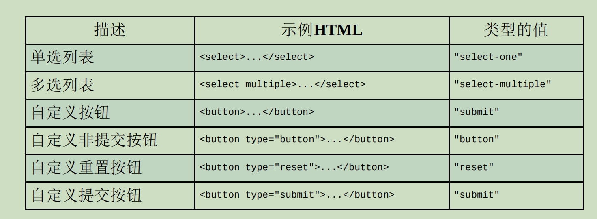

# 第 **19** 章 表单脚本

- 本章内容

  - 理解表单基础 

  - 文本框验证与交互 

  - 使用其他表单控件 

## **19.1** 表单基础 

- Web表单在HTML中以什么元素表示

  - \<form>

- 在JavaScript中则以什么类型表示？

  - HTMLFormElement

- HTMLFormElement类型继承自什么类型？

  - HTMLElement
  - 拥有与其他HTML元素一样的默认属性。

- HTMLFormElement自己的属性和方法？

  - acceptCharset：服务器可以接收的字符集，
    - 等价于HTML的accept-charset属性。 

  - action：请求的URL，
    - 等价于HTML的action属性。 

  - elements：表单中所有控件的HTMLCollection。 

  - enctype：请求的编码类型，
    - 等价于HTML的enctype属性。 

  - length：表单中控件的数量。 

  - method：HTTP请求的方法类型，
    - 通常是"get"或"post"，
    - 等价于HTML的method属性。 

  - name：表单的名字，
    - 等价于HTML的name属性。 

  - reset()：把表单字段重置为各自的默认值。 

  - submit()：提交表单。 

  - target：用于发送请求和接收响应的窗口的名字，
    - 等价于HTML的target属性。

-  如何取得对\<form>元素的引用？
  - 将表单指定一个id属性，
    - 使用getElementById()
  - 使用document.forms集合
    - 可以获取页面上所有的表单元素。
    - 使用数字索引或表单的名字来访问特定的表单

```
let form = document.getElementById("form1");
```

```
// 取得页面中的第一个表单
let firstForm = document.forms[0];

// 取得名字为"form2"的表单
let myForm = document.forms["form2"];

```

- 表单是否可以同时拥有id和name？
  - 可以
  - 而且两者可以不相同。 

### **19.1.1** 提交表单 

- 表单是通过什么方式提交的？
  - 用户点击
    - 提交按钮
    - 图片按钮
  - submit()
    - 
- 提交按钮可以使用来定义？
  - type属性为"submit"的\<input>元素
  - \<button>元素
- 图片按钮可以使用什么来定义？
  - type属性为"image"的\<input>元素
- 提交表单： 

```
<!-- 通用提交按钮 -->
<input type="submit" value="Submit Form" />

<!-- 自定义提交按钮 -->
<button type="submit">Submit Form</button>

<!-- 图片按钮 -->
<input type="image" src="graphic.gif" />

```

- 如果表单中有上述任何一个按钮，

  且焦点在表单中某个控件上

  则按什么键也可以提交表单？

  - 回车建

  - textarea控件是个例外，
    - 当焦点在它上面时，按回车键会换行。

- 没有提交按钮的表单在按回车键时是否会提交？

  - 不会

- 按回车键提交表单会在向服务器发送请求之前

  触发什么事件？

  - submit

- 如何取消提交表单？
  - 阻止submit事件的默认行为

```
let form = document.getElementById("myForm");

form.addEventListener("submit", (event) => {
	// 阻止表单提交
	event.preventDefault();
});

```

- 在什么时侯需要阻止表单提交？
  - 表单数据无效
  - 表单不应该发送到服务器

- 调用submit（）时

  表单中不存在提交按钮是否影响表单提交？

  - 不影响

```
let form = document.getElementById("myForm");

// 提交表单 
form.submit();

```

- 通过submit()提交表单时，submit事件是否会触发？
  - 不会
  - 因此在调用submit()方法前要先做数据验证。 

- 表单提交的一个最大的问题是什么？
  - 可能会提交两次表单。
- 解决提交两次表单问题主要有两种方式？
  -  在表单提交后
    - 禁用提交按钮、
  - 通过onsubmit事件处理程序
    - 取消之后的表单提交

### **19.1.2** 重置表单

- 如何重置表单？
  - 用户单击重置按钮
  - 调用reset()方法
- 重置按钮可以使用来创建？
  - type属性为"reset"的\<input>
  - \<button>元素

```
<!-- 通用重置按钮 -->
<input type="reset" value="Reset Form" />

<!-- 自定义重置按钮 -->
<button type="reset">Reset Form</button>

```

- 表单重置后，所有表单字段都会重置为什么值？

  - 页面第一次渲染时各自拥有的值。

    - 如果字段原来是空的，就会变成空的； 

    - 如果字段有默认值，则恢复为默认值。 

- 用户单击重置按钮重置表单会触发什么事件？

  - reset

  - 这个事件为取消重置提供了机会。

- 如何阻止重置表单？

```
let form = document.getElementById("myForm");

form.addEventListener("reset", (event) => {
	event.preventDefault();
});

```

- 调用reset()方法

```
let form = document.getElementById("myForm");

// 重置表单
form.reset();

```

- 调用reset()方法是否会触发reset事件？
  - 会

- 表单设计中通常是否提倡重置表单？
  - 不提倡
  - 因为重置表单经常会导致用户迷失方向，
  - 实践中几乎没有重置表单的需求。
- 一般来说，提供一个取消按钮，
  - 让用户点击返回前一个页面，
  - 而不是恢复表单中所有的值来得更直观。

### **19.1.3** 表单字段 

- 表单元素是否可以使用原生DOM方法来访问？
  - 可以
- 所有表单元素都是表单什么属性（元素集合）中
- 包含的一个值
  - elements
- elements集合是一个什么？
  - 有序列表，
  - 包含对表单中所有字段的引用，
    - 包括所有\<input>\<textarea>、\<button>、\<select>和\<fieldset> 元素。
- elements集合中的每个字段都以什么次序保存？
  - 在HTML标记中出现的
- 可以通过什么访问表单字段？
  - 索引位置
  - name属性
  - 表单属性 form["color"]

```
let form = document.getElementById("form1");

// 取得表单中的第一个字段
let field1 = form.elements[0];

// 取得表单中名为"textbox1"的字段
let field2 = form.elements["textbox1"];

// 取得字段的数量
let fieldCount = form.elements.length

```

- 如果多个表单控件使用了同一个name

  则会返回什么？

  - 包含所有同名元素的HTMLCollection

```
<form method="post" id="myForm">
	<ul>
		<li><input type="radio" name="color" value="red" />Red</li>
		<li><input type="radio" name="color" value="green" />Green</li>
		<li><input type="radio" name="color" value="blue" />Blue</li>
	</ul>
</form>

```

```
let form = document.getElementById("myForm");

let colorFields = form.elements["color"];

console.log(colorFields.length); // 3

let firstColorField = colorFields[0];

let firstFormField = form.elements[0];

console.log(firstColorField === firstFormField); // true

```

- 通过表单属性访问表单字段（form[0]、form["color"]）

  是为向后兼容旧版本浏览器而提供的，

  - 实际开发中应该使用elements。

#### \01. 表单字段的公共属性 

- disabled：布尔值，表示表单字段是否禁用。 

- form：指针，指向表单字段所属的表单。
  - 只读的。 

- name：字符串，这个字段的名字。 

- readOnly：布尔值，表示这个字段是否只读。 

- tabIndex：数值，表示这个字段在按Tab键时的切换顺序。 

- type：字符串，表示字段类型，
  - 如"checkbox"、"radio"等。 

- value：要提交给服务器的字段值。
  - 对文件输入字段来说，
    - 这个属性是只读的，
    - 仅包含计算机上某个文件的路径。

- JavaScript是否可以动态修改任何属性？
  - 可以

```
let form = document.getElementById("myForm");

let field = form.elements[0];

// 修改字段的值
field.value = "Another value";

// 检查字段所属的表单
console.log(field.form === form); // true

// 给字段设置焦点
field.focus();

// 禁用字段
field.disabled = true;

// 改变字段的类型（不推荐，但对<input>来说是可能的）
field.type = "checkbox";

```

- 点击两次提交按钮常见的解决方案是什么？
  - 第一次点击之后，禁用提交按钮。
    - 通过监听submit事件来实现

```
// 避免多次提交表单的代码 
let form = document.getElementById("myForm");

form.addEventListener("submit", (event) => {
    let target = event.target;
    
    // 取得提交按钮 
    let btn = target.elements["submit-btn"];
    
    // 禁用提交按钮
    btn.disabled = true;
});

```

- 禁用提交按钮功能是否能通过

  提交按钮添加onclick事件处理程序来实现？

  - 不能

  - 原因是不同浏览器触发事件的时机不一样。

    - 有些会在submit前触发lick
      - 这意味着表单就不会被提交了

    - 有些会在submit后触发click

- 禁用提交按钮方式是否适用于

  没有提交按钮的表单提交？

  - 不适用

  - 因为只有提交按钮才能触发submit事件

- type属性可以用于什么表单字段？
  - 除\<fieldset>之外的任何表单字段
- 对于\<input>元素，type值等于什么？
  - HTML的type属性值。
- 对于其他元素，这个type属性的值按照下表设置。



- 对于\<input>和\<button>元素，

  是否可以动态修改其type属性？

  - 可以

- \<select>元素的type属性是否是只读的?

  - 是

#### \02. 表单字段的公共方法 

- 每个表单字段都有两个公共方法？
  - focus()
  - blur()。
- focus()方法执行什么操作？
  - 把浏览器焦点设置到表单字段，
  - 这意味着该字段会变成活动字段并可以响应键盘事件。
- 文本框在获得焦点时会显示什么？
  - 在内部显示闪烁的光标，
  - 表示可以接收输入。
- focus()方法主要用来做什么？
  - 引起用户对页面中某个部分的注意。
- 如何实现在页面加载后把焦点定位到表单中第一个字段
  - 监听load事件，
  - 然后在第一个字段上调用focus()

```
window.addEventListener("load", (event) => {
	document.forms[0].elements[0].focus();
});

```

- 如果表单中第一个字段是type为"hidden"的\<input>元素，或者该字段被CSS属性display或visibility隐藏了，
  - 以上代码就会出错。

- 表单字段的autofocus属性执行什么操作？
  - 自动为带有该属性的元素设置焦点，
  - 而无须使用JavaScript

```
<input type="text" autofocus>
```

- 为了在使用autofocus时能正常工作，必须先做什么？
  - 检测元素上是否设置了该属性。
  - 如果设置了autofocus，
    - 就不再调用focus()

```
window.addEventListener("load", (event) => {
	let element = document.forms[0].elements[0];
	if (element.autofocus !== true) {
		element.focus();
		console.log("JS focus");
	}
});

```

- 所以在支持的浏览器中通过 

  JavaScript访问表单字段的autofocus属性会返回什么？

  - true
  - 在不支持的浏览器中是空字符串

- 默认情况下只能给什么元素设置焦点？

  - 表单元素

- focus()的反向操作是什么？

  - blur()，
  - 其用于从元素上移除焦点。

- 调用blur()时，焦点是否会转移到任何特定元素？

  - 不会

- 现在很少需要调用blur()

```
document.forms[0].elements[0].blur();
```

#### \03. 表单字段的公共事件

- 表单字段还支持以下3个额外的事件

  - blur：在字段失去焦点时触发。 

  - change：

    - 在\<input>和\<textarea>元素的value发生变化

      且失去焦点时触发，

    - 或者在\<select>元素中选中项发生变化时触发。 

  - focus：在字段获得焦点时触发。 

- blur和focus事件会因为什么而触发？

  - 用户手动改变字段焦点
  - 调用blur()或focus()方法

- change事件是否会因控件不同而在不同时机触发？

  - 会

- 对于\<input>和\<textarea>元素，

  change事件会在什么时候触发？

  - 字段失去焦点

  - 同时value获得焦点后发生变化

- 对于\<select>元素，change事件会在什么时候触发？
  - 用户改变了选中项时
    - 不需要控件失去焦点。

- focus和blur事件通常用于什么？

  - 以某种方式改变用户界面，

    - 以提供可见的提示或额外功能

    （例如在文本框下面显示下拉菜单）

- change事件通常用于什么？
  - 验证用户在字段中输入的内容。
    - 比如，有的文本框可能只限于接收数值。

```
let textbox = document.forms[0].elements[0];

textbox.addEventListener("focus", (event) => {
	let target = event.target;
	if (target.style.backgroundColor != "red") {
		target.style.backgroundColor = "yellow";
	}
});

textbox.addEventListener("blur", (event) => {
	let target = event.target;
	target.style.backgroundColor = /[^\d]/.test(target.value) ? "red" : "";
});

textbox.addEventListener("change", (event) => {
	let target = event.target;
	target.style.backgroundColor = /[^\d]/.test(target.value) ? "red" : "";
});

```

- blur和change事件的触发顺序不同浏览器不同

## **19.2** 文本框编程 

- 在HTML中有两种表示文本框的方式？

  - 单行使用\<input>元素，
  - 多行使用\<textarea>元素。

- 默认情况下，\<input>元素显示为什么？

  - 文本框，

- \<input>省略type属性会以什么作为默认值？

  - "text"

- \<input>通过什么属性指定文本框的宽度？

  - size
  - 这个宽度是以字符数来计量的。

- \<input>value属性用于什么？

  - 指定文本框的初始值，

- \<input>maxLength属性用于什么？

  - 指定文本框允许的最多字符数。

- 如何创建一个一次可显示25个字符，

  但最多允许显示50个字符的文本框？

```
<input type="text" size="25" maxlength="50" value="initial value">
```

- \<textarea>元素会创建什么？
  - 多行文本框。
- \<textarea>元素可以使用什么属性指定这个文本框的高度？
  - rows
  - 以字符数计量；
- \<textarea>元素以什么属性指定文本框宽度？
  - cols
- \<textarea> 的初始值必须包含在哪里？
  - \<textarea>和\</textarea>之间

```
<textarea rows="25" cols="5">initial value</textarea>
```

- \<textarea>是否能在HTML中指定最大允许的字符数？
  - 不能

- 这两种类型的文本框都会在什么属性中保存自己的内容？
  - value
  - 可以读取、设置文本模式的值

```
let textbox = document.forms[0].elements["textbox1"];

console.log(textbox.value);

textbox.value = "Some new value";

```

- 如何读写文本框的值？
  - 应该使用value属性，
  - 而不是标准DOM方法
- 不要使用setAttribute()设置\<input>元素value属性的值，
- 也不要尝试修改\<textarea>元素的第一个子节点。
- 因此在处理文本框值的时候最好不要使用DOM方法

### **19.2.1** 选择文本 

- select()用于什么？
  - 全部选中文本框中的文本。
- 调用select()方法后，焦点会在哪里？
  - 自动将焦点设置到文本框
- select()方法不接收参数，可以在任何时候调用。 

```
let textbox = document.forms[0].elements["textbox1"];

textbox.select();

```

- 如何让用户能够一次性删除所有默认内容？
  - 在文本框获得焦点时选中所有文本

```
textbox.addEventListener("focus", (event) => {
	event.target.select();
});

```

#### \01. **select**事件 

- select事件什么时候触发？
  - 选中文本框中的文本时
- 这个事件确切的触发时机因浏览器而异
- select事件会在用户选择完文本后立即触发；
- 调用select()方法是否会触发select事件？
  - 会

```
let textbox = document.forms[0].elements["textbox1"];

textbox.addEventListener("select", (event) => {
	console.log(`Text selected: ${textbox.value}`);
});

```

#### \02. 取得选中文本 

- select事件能够表明有文本被选中，

  是否能提供选中了哪些文本的信息？

  - 不能

- selectionStart和selectionEnd分别表示什么？

  - 文本选区的起点和终点

    （文本选区起点的偏移量

    和文本选区终点的偏移量）

- 如何取得文本框中选中的文本？

```
function getSelectedText(textbox) {
	return textbox.value.substring(
		textbox.selectionStart,
		textbox.selectionEnd
	);
}

```

- 老版本IE如何提取文本？

```
function getSelectedText(textbox) {
	if (typeof textbox.selectionStart == "number") {
		return textbox.value.substring(
			textbox.selectionStart,
			textbox.selectionEnd
		);
	} else if (document.selection) {
		return document.selection.createRange().text;
	}
}

```

