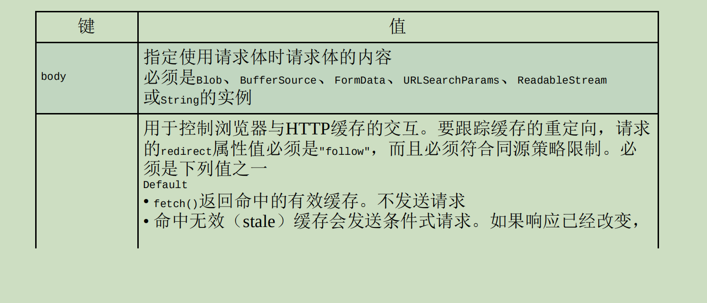
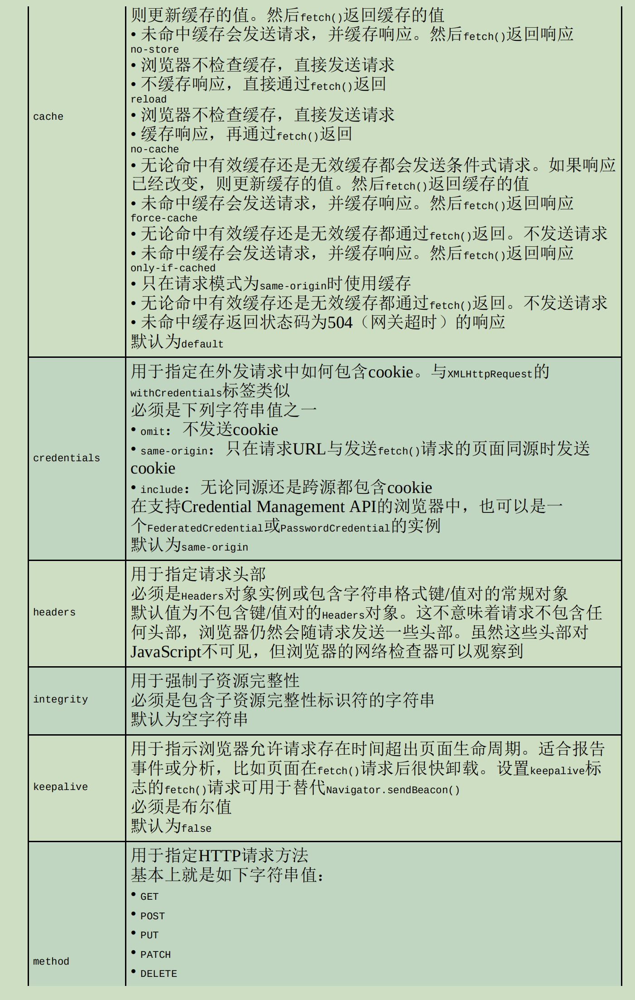
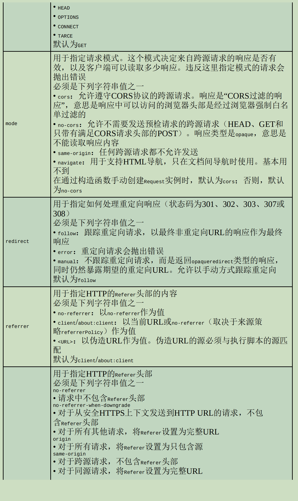
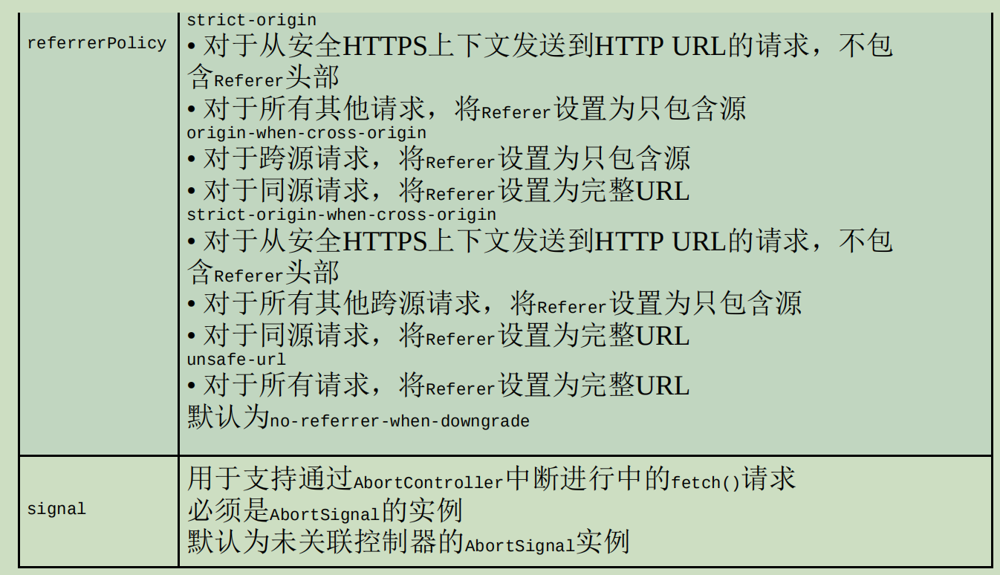
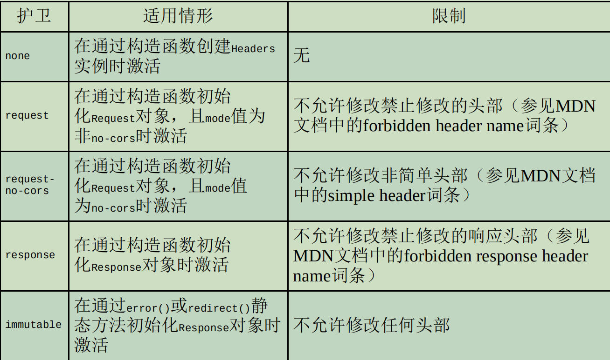
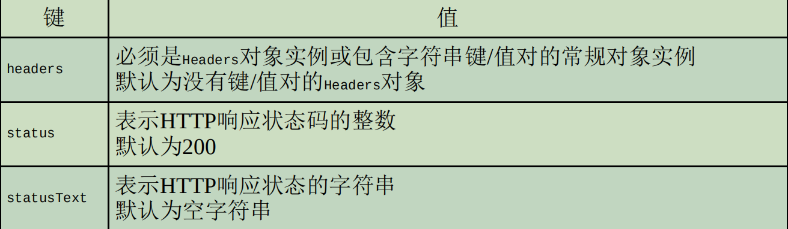
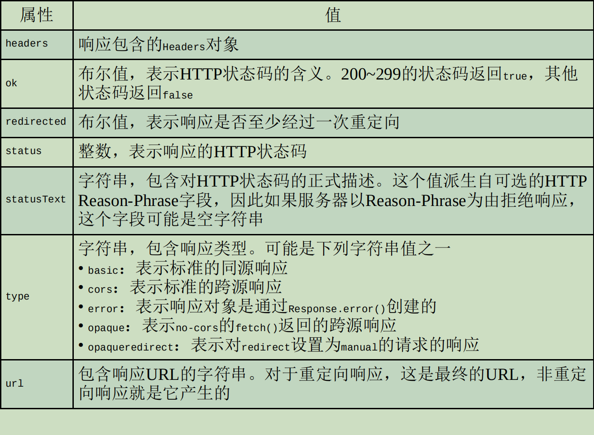

# 第 **24** 章 网络请求与远程资源

- 本章内容

  - 使用XMLHttpRequest对象 

  - 处理XMLHttpRequest事件 

  - 源域Ajax限制 

  - Fetch API 

  - Streams API 

- Ajax
  - Asynchronous JavaScript+XML，
  - 异步JavaScript加XML）

- 这个技术主要是什么？
  - 实现在不刷新页面的情况下从服务器获取数据，
  - 格式并不一定是XML。

- XMLHttpRequest，
  - 它实际上是过时Web规范的产物，
    - 应该只在旧版本浏览器中使用。
  - 实际开发中，应该尽可能使用fetch()

## **24.1** **XMLHttpRequest**对象 

```
let xhr = new XMLHttpRequest();
```

### **24.1.1** 使用**XHR** 

- 使用XHR对象首先要调用什么？
  - open()方法，
- open()方法接收3个参数？
  - 请求类型（"get"、"post"等
  - 请求URL，
  - 请求是否异步，（布尔值

```
xhr.open("get", "example.php", false);
```

- 这里的URL是相对于代码所在页面的，
  - 当然也可以使用绝对URL。
- 调用open()是否会发送请求？
  - 不会
  - 只是为发送请求做好准备。 

- 什么是同源URL？

  - 域名相同、
  - 端口相同、
  - 协议相同。

- 如果请求的URL与发送请求的页面在任何方面有所不同，

  则会发生什么？

  - 抛出安全错误

- 如何发送定义好的请求？
  - 调用send()方法

```
xhr.open("get", "example.txt", false); xhr.send(null);
```

- send()方法接收一个参数？
  - 作为请求体发送的数据。
    - 如果不需要发送请求体，则必须传null，
    - 因为这个参数在某些浏览器中是必需的。
- 调用send()之后，请求就会发送到哪里？
  - 服务器。 

- 收到响应后，XHR对象的哪些属性会被填充上数据？

  - responseText：
    - 作为响应体返回的文本。 

  - responseXML：
    - 如果响应的内容类型是"text/xml"或"application/xml"，
      - 那就是包含响应数据的XML DOM文档。 

  - status：
    - 响应的HTTP状态。 

  - statusText：
    - 响应的HTTP状态描述

- 收到响应后，第一步要检查什么？

  - status属性
  - 以确保响应成功返回。

- 一般来说，HTTP状态码为什么表示成功？

  - 2xx

    - 此时responseText或responseXML属性中

      会有内容。

- 如果HTTP状态码是304，则表示什么？
  - 资源未修改过，
    - 是从浏览器缓存中直接拿取的。
- HTTP状态码是304是否意味着响应有效？
  - 是
- 为确保收到正确的响应，应该检查哪些状态？

```
xhr.open("get", "example.txt", false);

xhr.send(null);

if ((xhr.status >= 200 && xhr.status < 300) || xhr.status == 304) {

    alert(xhr.responseText);
    
} else {

    alert("Request was unsuccessful: " + xhr.status);
    
}
```

- 为确定下一步该执行什么操作，最好检查什么？

  - status 
  - 而不是statusText属性，
    - 因为statusText在跨浏览器的情况下不可靠。

- 无论是什么响应内容类型，

  responseText属性始终会保存什么？

  - 响应体， 

- responseXML对于非XML数据是什么？
  - null。 

- 但多数情况下最好使用异步还是同步请求？

  - 异步
    - 这样可以不阻塞JavaScript代码继续执行。

- XHR对象readyState属性，表示什么？

  - 当前处在请求/响应过程的哪个阶段。

- readyState属性有如下可能的值？

  - 0：未初始化（Uninitialized）。
    - 尚未调用open()方法。 

  - 1：已打开（Open）。
    - 已调用open()方法，尚未调用send()方法。 

  - 2：已发送（Sent）。
    - 已调用send()方法，尚未收到响应。 

  - 3：接收中（Receiving）。
    - 已经收到部分响应。 

  - 4：完成（Complete）。
    - 已经收到所有响应，可以使用了。

- 每次readyState从一个值变成另一个值，

  都会触发什么事件？

  - readystatechange

- 可以借readystatechange的机会做什么？

  - 检查readyState的值。

- 我们唯一关心的readyState值是什么？

  - 4
  - 表示数据已就绪。

- 为保证跨浏览器兼容，

  onreadystatechange事件处理程序应该在什么时候赋值？

  - 调用open()之前

```
let xhr = new XMLHttpRequest();

xhr.onreadystatechange = function () {

    if (xhr.readyState == 4) {
    
        if ((xhr.status >= 200 && xhr.status < 300) || xhr.status == 304) {
        
            alert(xhr.responseText);
            
        } else {
        
            alert("Request was unsuccessful: " + xhr.status);
        }
    }
};

xhr.open("get", "example.txt", true);

xhr.send(null);
```

- 为什么使用DOM Level 0风格

  为XHR对象添加事件处理程序？

  - 因为并不是所有浏览器都支持DOM Level 2风格。

- onreadystatechange事件处理程序是否会收到event对象？

  - 不会

- 如何实现在收到响应之前取消异步请求？
  - 调用abort()方法： 

```
xhr.abort();
```

- 调用这个方法后，XHR对象会执行什么操作？
  - 停止触发事件，
  - 并阻止访问这个对象上任何与响应相关的属性。
- 中断请求后，应该做什么？
  - 取消对XHR对象的引用。
- 是否推荐重用XHR对象？
  - 不推荐
  - 由于内存问题

### **24.1.2 HTTP**头部 

- 默认情况下，XHR请求会发送哪些头部字段？

  - Accept：
    - 浏览器可以处理的内容类型。 

  - Accept-Charset：
    - 浏览器可以显示的字符集。 

  - Accept-Encoding：
    - 浏览器可以处理的压缩编码类型。 

  - Accept-Language：
    - 浏览器使用的语言。 

  - Connection：
    - 浏览器与服务器的连接类型。 

  - Cookie：
    - 页面中设置的Cookie。 

  - Host：
    - 发送请求的页面所在的域。 

  - Referer：
    - 发送请求的页面的URI。
      - 这个字段在HTTP规范中就拼错了，
      - 所以考虑到兼容性也必须将错就错。
      - （正确的拼写应该是Referrer。） 

  - User-Agent：
    - 浏览器的用户代理字符串。

- 如何发送额外的请求头部？
  - 使用setRequestHeader() 方法。
- setRequestHeader()方法接收两个参数？
  - 头部字段的名称和值。
- 为保证请求头部被发送，必须在什么时候调用？
  - open()之后、send()之前

```
let xhr = new XMLHttpRequest();

xhr.onreadystatechange = function () {

    if (xhr.readyState == 4) {
    
        if ((xhr.status >= 200 && xhr.status < 300) || xhr.status == 304) {
        
            alert(xhr.responseText);
            
        } else {
        
            alert("Request was unsuccessful: " + xhr.status);
            
        }
    }
};

xhr.open("get", "example.php", true);

xhr.setRequestHeader("MyHeader", "MyValue");

xhr.send(null);
```

- 自定义头部一定要区别于浏览器正常发送的头部，
  - 否则可能影响服务器正常响应。
- 有些浏览器允许重写默认头部，有些浏览器则不允许。 

- 如何获取响应头部？
  - 使用getResponseHeader()方法
  - 传入要获取头部的名称
- 如何取得所有响应头部？
  - 使用getAllResponseHeaders()方法，
- getAllResponseHeaders()方法会返回什么？
  - 包含所有响应头部的字符串。

```
let myHeader = xhr.getResponseHeader("MyHeader"); let allHeaders xhr.getAllResponseHeaders();
```

- getAllResponseHeaders()方法通常返回什么字符串？

```
Date: Sun, 14 Nov 2004 18:04:03
GMT Server: Apache/1.3.29 (Unix) 
Vary: Accept 
X-Powered-By: PHP/4.3.8 
Connection: close 
Content-Type: text/html; 
charset=iso-8859-1
```

### **24.1.3 GET**请求

- 最常用的请求方法是什么？
  - GET请求，
- GET请求用于什么？
  - 向服务器查询某些信息。
- 必要时，需要在GET请求的URL后面添加什么？
  - 查询字符串参数。
- 对XHR而言，查询字符串必须怎么处理？
  - 正确编码后
  - 添加到URL后面，
  - 然后再传给open()方法。 

- 发送GET请求最常见的一个错误是什么？
  - 查询字符串格式不对。
- 查询字符串中的每个名和值都必须怎么编码？
  - encodeURIComponent()编码，
  - 所有名/值对必须以和号（&）分隔

```
xhr.open("get", "example.php?name1=value1&name2=value2", true);
```

- 如何将查询字符串参数添加到现有的URL末尾？

```
function addURLParam(url, name, value) {

    url += (url.indexOf("?") == -1 ? "?" : "&");
    
    url += encodeURIComponent(name) + "=" + encodeURIComponent(value);
    
    return url;
}
```

- 这里定义了一个addURLParam()函数，它接收3个参数：
  - 要添加查询字符串的URL、
  - 查询参数
  - 参数值。
- 这个addURLParam()函数会检查什么？
  - URL中是否已经包含问号
    - （以确定是否已经存在其他参数）。
  - 如果没有，则加上一个问号；
    - 否则就加上一个和号。
  - 分别对参数名和参数值进行编码，
    - 并添加到URL末尾。
  - 最后一步是返回更新后的URL。

- 使用这个函数可以做什么？
  - 构建请求URL

```
let url = "example.php";

// 添加参数
url = addURLParam(url, "name", "Nicholas");
url = addURLParam(url, "book", "Professional JavaScript");

// 初始化请求 
xhr.open("get", url, false);
```

- 使用addURLParam()函数可以保证什么？
  - 通过XHR发送请求的URL格式正确。

### **24.1.4 POST**请求

- POST请求用于什么？
  - 向服务器发送应该保存的数据。
- 每个POST请求都应该做什么？
  - 在请求体中携带提交的数据，
    - 而GET请求则不然。
- POST请求的请求体数据可以是任意格式。
- 如何初始化POST请求？
  - open()方法的第一个参数要传"post"

```
xhr.open("post", "example.php", true);
```

- 给send()方法传入什么？

  - 要发送的数据。

- 请求体可以传入什么？

  - 序列化之后的XML DOM文档

  - 任意字符串

- 对服务器而言，POST请求与提交表单是否一样？

  - 不一样

- 如何使用XHR模拟表单提交？

  - 第一步需要把ContentType头部

    设置为"application/x-www-formurlencoded"，

    - 这是提交表单时使用的内容类型。

  - 第二步是创建对应格式的字符串。

    - POST数据使用与查询字符串相同的格式。
      - 使用第14章的serialize()函数序列化

```
function submitData() {
    let xhr = new XMLHttpRequest();
    xhr.onreadystatechange = function () {
        if (xhr.readyState == 4) {
            if ((xhr.status >= 200 && xhr.status < 300) || xhr.status == 304) {
                alert(xhr.responseText);
            } else {
                alert("Request was unsuccessful: " + xhr.status);
            }
        }
    };
    xhr.open("post", "postexample.php", true);
    xhr.setRequestHeader("Content-Type", "application/x-www-form-urlencoded");
    let form = document.getElementById("user-info");
    xhr.send(serialize(form));
}
```

- PHP文件postexample.php可以通过什么取得POST的数据？
  - $_POST

```
< ? php header("Content-Type: text/plain");
echo << < EOF Name: {
    $_POST['user-name']
}
Email: {
    $_POST['user-email']
}
EOF; ? >
```

- 假如没有发送Content-Type头部，
  - PHP的全局$_POST变量中就不会包含数据，
  - 而需要通过$HTTP_RAW_POST_DATA来获取数据 

- POST请求和GET请求谁要占用更多资源？

  - POST

- 从性能方面说， 发送相同数量的数据

  GET和POST哪个更快？

  - GET请求比POST请求要快两倍

### **24.1.5 XMLHttpRequest Level 2** 

#### \01. **FormData**类型

- FormData类型便于什么？
  - 表单序列化
  - 创建与表单类似格式的数据然后通过XHR发送。 

- 如何创建了一个FormData对象，并填充了一些数据？

```
let data = new FormData();
data.append("name", "Nicholas");
```

- append()方法接收两个参数？
  - 键和值，
- 通过直接给FormData构造函数传入一个表单元素，
  - 也可以将表单中的数据作为键/值对填充进去： 

```
let data = new FormData(document.forms[0]);
```

- 有了FormData实例，
  - 可以直接传给XHR对象的send()方法

```
let xhr = new XMLHttpRequest();

xhr.onreadystatechange = function () {

    if (xhr.readyState == 4) {
    
        if ((xhr.status >= 200 && xhr.status < 300) || xhr.status == 304) {
        
            alert(xhr.responseText);
            
        } else {
        
            alert("Request was unsuccessful: " + xhr.status);
        }
    }
};

xhr.open("post", "postexample.php", true);

let form = document.getElementById("user-info");

xhr.send(new FormData(form));
```

- 使用FormData，
  - 不再需要给XHR对象显式设置任何请求头部了。
- XHR对象能够识别
  - 作为FormData实例传入的数据类型
  - 并自动配置相应的头部

#### \02. 超时

- XHR对象timeout属性用于什么？

  - 表示发送请求后等待多少毫秒
    - 如果响应不成功就中断请求。

- 在给timeout属性设置了一个时间 

  且在该时间过后没有收到响应时，

  XHR对象就会触发什么事件？

  - timeout事件，
  - 调用ontimeout事件处理程序

```
let xhr = new XMLHttpRequest();

xhr.onreadystatechange = function () {
    if (xhr.readyState == 4) {
        try {
            if ((xhr.status >= 200 && xhr.status < 300) || xhr.status == 304) {
                alert(xhr.responseText);
            } else {
                alert("Request was unsuccessful: " + xhr.status);
            }
        } catch (ex) {
            // 假设由ontimeout处理
        }
    }
};

xhr.open("get", "timeout.php", true);

xhr.timeout = 1000; // 设置1秒超时

xhr.ontimeout = function () {
    alert("Request did not return in a second.");
};

xhr.send(null);
```

- 给timeout设置1000毫秒意味着什么？
  - 如果请求没有在1秒钟内返回则会中断。
  - 触发ontimeout事件处理程序，
  - readyState会变成4，
  - 调用onreadystatechange事件处理程序。
- 如果在超时之后访问status属性会发生什么？
  - 发生错误。
    - 把检查status属性的代码封装在try/catch语句中。

#### \03. **overrideMimeType()**方法

- overrideMimeType()方法用于什么？
  - 重写XHR响应的MIME类型。
- 响应返回的MIME类型决定了什么？
  - XHR对象如何处理响应

```
let xhr = new XMLHttpRequest();
xhr.open("get", "text.php", true);
xhr.overrideMimeType("text/xml");
xhr.send(null);
```

- 这个例子强制让XHR把响应当成XML

  - 而不是纯文本来处理。

- 为了正确覆盖响应的MIME类型，

  必须在什么时候调用overrideMimeType()？

  - send()之前

## **24.2** 进度事件

- 6个进度相关的事件？
  - loadstart：在接收到响应的第一个字节时触发。 
  
  - progress：在接收响应期间反复触发。 
  
  - error：在请求出错时触发。 
  
  - abort：在调用abort()终止连接时触发。 
  
  - load：在成功接收完响应时触发。 
  
  - loadend：在通信完成时，
    - 且在error、abort或load之后触发。 
  
- 每次请求都会触发什么事件？
  - 首先触发loadstart事件
  - 之后是一个或多个progress事件
  - 接着是error、abort或load中的一个
  - 最后以loadend事件结束

### **24.2.1** **load**事件

- load事件用于替代什么事件？
  - readystatechange
- load事件在什么时候触发？
  - 响应接收完成后
    - 这样就不用检查readyState属性了。
- onload事件处理程序是否会收到event对象？
  - 会
- event对象target属性是什么？
  - XHR实例
- 考虑到跨浏览器兼容，如何使用XHR对象变量？

```
let xhr = new XMLHttpRequest();

xhr.onload = function () {
    if ((xhr.status >= 200 && xhr.status < 300) || xhr.status == 304) {
        alert(xhr.responseText);
    } else {
        alert("Request was unsuccessful: " + xhr.status);
    }
};

xhr.open("get", "altevents.php", true);

xhr.send(null);
```

- 只要是从服务器收到响应，无论状态码是什么，
  - 都会触发load事件。
    - 意味着还需要检查status属性才能确定数据是否有效。

### **24.2.2** **progress**事件 

- progress事件在什么时候触发？
  - 浏览器接收数据期间，
  - 这个事件会反复触发。
- 每次触发时
  - onprogress事件处理程序都会收到event对象，
  - 其target属性是XHR对象
  - 且包含3个额外属性？
    - lengthComputable
      - 表示进度信息是否可用；
      - 布尔值，
    - position
      - 接收到的字节数；
    - totalSize
      - 响应的总字节数
      - Content-Length头部

- 如何向用户展示进度？

```
let xhr = new XMLHttpRequest();

xhr.onload = function (event) {
    if ((xhr.status >= 200 && xhr.status < 300) || xhr.status == 304) {
        alert(xhr.responseText);
    } else {
        alert("Request was unsuccessful: " + xhr.status);
    }
};

xhr.onprogress = function (event) {
    let divStatus = document.getElementById("status");
    
    if (event.lengthComputable) {
        divStatus.innerHTML = "Received " + event.position + " of " + event.totalSize + " bytes";
    }
};

xhr.open("get", "altevents.php", true);

xhr.send(null);
```

- 必须在什么时候添加onprogress事件处理程序？
  - open()之前

- 如何计算出已经收到响应的百分比？
  - position
  - Content-Length头部

## **24.3** 跨源资源共享 

- 通过XHR进行Ajax通信的一个主要限制是什么？
  - 跨源安全策略。
- 默认情况下， XHR只能访问什么资源？
  - 与发起请求的页面在同一个域内的
- 跨源资源共享
  - CORS
  - Cross-Origin Resource Sharing
- CORS背后的基本思路是什么？
  - 使用自定义的HTTP头部
- 对于简单的请求，比如GET或POST请求，

  - 没有自定义头部，
  - 请求体是text/plain类型，
  - 这样的请求在发送时会有一个额外的头部Origin。
- Origin头部包含什么？

  - 发送请求的页面的源
    - （协议、域名和端口） 
- Origin头部的一个示例： 

```
Origin: http://www.nczonline.net
```

- 如果服务器决定响应请求，那么会发送什么头部？
  - Access-Control-Allow-Origin头部，
    - 包含相同的源
    - 如果资源是公开的，
      - 那么就包含"*"

```
Access-Control-Allow-Origin: http://www.nczonline.net
```

- 如果没有这个头部，或者有但源不匹配，则表明什么？
  - 不会响应浏览器请求。 
- 无论请求还是响应都不会包含cookie信息 

- XMLHttpRequest对象原生支持CORS
- 在尝试访问不同源的资源时，
  - CORS行为会被自动触发。
- 如何向不同域的源发送请求？
  - 使用标准XHR对象
  - 并给open()方法传入一个绝对URL

```
let xhr = new XMLHttpRequest();

xhr.onreadystatechange = function () {
    if (xhr.readyState == 4) {
        if ((xhr.status >= 200 && xhr.status < 300) || xhr.status == 304) {
            alert(xhr.responseText);
        } else {
            alert("Request was unsuccessful: " + xhr.status);
        }
    }
};

xhr.open("get", "http://www.somewhere-else.com/page/", true);

xhr.send(null);
```

- 出于安全考虑，跨域XHR对象也施加了一些额外限制。 

  - 不能使用setRequestHeader()设置自定义头部。 

  - 不能发送和接收cookie。 
- getAllResponseHeaders()方法始终返回什么？
  - 空字符串。 

### **24.3.1** 预检请求 

- CORS通过预检请求，来允许使用
  - 自定义头部、
  - 除GET和POST之外的方法，
  - 以及不同请求体内容类型。
- 预检请求是什么？
  - （preflighted request）
  - 服务器验证机制
- 如何发送涉及上述某种高级选项的请求？
  - 先向服务器发送一个“预检”请求

- “预检”请求使用什么方法发送？

  - OPTIONS

- “预检”请求包含哪些头部？

  - Origin：
    - 与简单请求相同 

  - Access-Control-Request-Method：
    - 请求希望使用的方法

  - Access-Control-Request-Headers：
    - （可选）要使用的逗号分隔的自定义头部列表

- 下面是一个假设的POST请求，包含自定义的NCZ头部：

```
Origin: http://www.nczonline.net 
Access-Control-Request-Method: POST 
Access-Control-Request-Headers: NCZ
```

- 在这个请求发送后，

  - 服务器可以确定是否允许这种类型的请求。

- 服务器会在响应中发送哪些头部？

  - Access-Control-Allow-Origin：
    - 与简单请求相同。 

  - Access-Control-Allow-Methods：
    - 允许的方法（逗号分隔的列表）。 

  - Access-Control-Allow-Headers：
    - 服务器允许的头部（逗号分隔的列表）。 

  - Access-Control-Max-Age：
    - 缓存预检请求的秒数。 

```
Access-Control-Allow-Origin: http://www.nczonline.net 

Access-Control-Allow-Methods: POST,GET 

Access-Control-Allow-Headers: NCZ Access-Control-Max-Age: 1728000
```

- 预检请求返回后，
  - 结果会按响应指定的时间缓存一段时间。

- 只有第一次发送这种类型的请求时
  - 才会多发送一次额外的HTTP请求。 

### **24.3.2** 凭据请求

- 默认情况下，跨源请求是否提供凭据？（cookie、HTTP认证和客户端SSL证书）

  - 不提供

- 如何表明请求会发送凭据？

  - 将withCredentials属性设置为true

- 如果服务器允许带凭据的请求，

  那么会在响应中包含哪个HTTP头部？

```
Access-Control-Allow-Credentials: true
```

- 如果发送了凭据请求

  而服务器返回的响应中没有这个头部，

  则浏览器是否会把响应交给JavaScript？

  - 不会

  - （responseText是空字符串，
  - status是0，
  - onerror()被调用）

- 服务器也可以在预检请求的响应中发送这个HTTP头部，

  - 以表明这个源允许发送凭据请求。

## **24.4** 替代性跨源技术 

- 替代性跨源技术是指什么？

  - CORS出现之前，实现跨源Ajax通信

- 虽然CORS目前已经得到广泛支持，

  但这些技术仍然没有过时，

  - 因为它们不需要修改服务器。 

### **24.4.1** 图片探测

- 图片探测是什么？
  - 利用\标签实现跨域通信的
- 任何页面都可以跨域加载图片而不必担心限制，

- 什么技术经常用于图片探测？

  - 动态创建图片，

  - 然后通过它们的onload和onerror事件处理程序

    得知何时收到响应。 

- 图片探测与服务器的通信是怎么样的？

  - 简单、
  - 跨域、
  - 单向的

- 浏览器通过图片探测是否能拿到数据？

  - 不能

- 如何知道什么时候能接收到响应？
  - 通过监听onload和onerror事件

```
let img = new Image();

img.onload = img.onerror = function () {
    alert("Done!");
};

img.src = "http://www.example.com/test?name=Nicholas";
```

- 什么时候请求开始？

  - 设置完src属性之后请求就开始了，

- 图片探测的缺点是什么？
  - 只能发送GET请求
  - 无法获取服务器响应的内容。
  - 这是只能实现浏览器与服务器单向通信的原因。

### **24.4.2 JSONP**

- JSONP是什么的简写？
  - “JSON with padding”
- JSONP看起来跟JSON一样，
  - 只是会被包在一个函数调用里

```
callback({ "name": "Nicholas" });
```

- JSONP格式包含两个部分？
  - 回调
  - 数据。
- 回调是什么？
  - 在页面接收到响应之后应该调用的函数，
- 通常回调函数的名称是什么？
  - 通过请求来动态指定的。
- 数据是什么？
  - 作为参数传给回调函数的JSON数据
- 下面是一个典型的JSONP请求：

```
http://freegeoip.net/json/?callback=handleResponse
```

- JSONP服务怎么指定回调函数的名称？
  - 以查询字符串形式
    - 比如这个例子就把回调函数的名字指定为handleResponse()。

- JSONP调用是怎么实现的？
  - 通过动态创建\<script>元素
  - 并为src属性指定跨域URL。
- 因为JSONP是有效的JavaScript，
  - 所以JSONP响应在被加载完成之后会立即执行。
- 比如下面这个例子：

```
function handleResponse(response) {
 console.log(`
 You're at IP address ${response.ip}, which is in
 ${response.city}, ${response.region_name}`);
}

let script = document.createElement("script");

script.src = "http://freegeoip.net/json/?callback=handleResponse";

document.body.insertBefore(script, document.body.firstChild);
```

- 相比于图片探测，

  - 使用JSONP可以直接访问响应，
  - 实现浏览器与服务器的双向通信。

- JSONP缺点？

  - JSONP是从不同的域拉取可执行代码。
    - 如果这个域并不可信，
      - 则可能在响应中加入恶意内容。
      - 此时除了完全删除JSONP没有其他办法。

  - 不好确定JSONP请求是否失败。
    - 开发者经常使用计时器来决定是否放弃等待响应。
    - 这种方式并不准确，
      - 不同用户的网络连接速度和带宽是不一样的。

## **24.5 Fetch API**

- Fetch API能够执行XMLHttpRequest对象的所有任务，
  - 但更容易使用，接口也更现代化，
  - 能够在Web工作线程等现代Web工具中使用。
- XMLHttpRequest可以选择异步，
  - 而Fetch API则必须是异步。
- Fetch标准定义
  - 请求、
  - 响应，
  - 以及绑定二者的流程：获取（fetch）”。 

### **24.5.1** 基本用法 

- fetch()方法是暴露在全局作用域中的，
  - 包括主页面执行线程、模块和工作线程。
- 调用fetch()方法，执行什么操作？
  - 浏览器就会向给定URL发送请求。 

#### \01. 分派请求 

- fetch()只有一个必需的参数？
  - input
    - 要获取资源的URL。
- fetch()方法返回什么？
  - 一个期约

```
let r = fetch('/bar'); 
console.log(r); // Promise <pending>
```

- 请求完成、资源可用时，期约会执行什么操作？
  - 解决为一个Response对象。
    - Response对象是API的封装，
    - 可以通过它取得相应资源。
- 如何获取资源？
  - 使用Response对象的属性和方法，

```
fetch('bar.txt').then((response) => {
    console.log(response);
});
// Response { type: "basic", url: ...** **}
```

#### \02. 读取响应 

- 如何取得纯文本格式的内容？
  - text()方法。
- text()方法返回什么？
  - 一个期约，
    - 会解决为取得资源的完整内容： 

```
fetch('bar.txt').then((response) => {
    response.text().then((data) => {
        console.log(data);
    });
}); // bar.txt的内容
```

- 内容的结构通常是打平的

```
fetch('bar.txt').then((response) => response.text()).then((data) => console.log(data)); // bar.txt的内容
```

#### \03. 处理状态码和请求失败 

- 如何检查响应状态？
  - Response的属性
    - status（状态码）
    - statusText（状态文本）
- 成功获取响应的请求通常会产生值为多少的状态码？
  - 200

```
fetch('/bar').then((response) => {
    console.log(response.status); // 200
    console.log(response.statusText); // OK 
});
```

- 请求不存在的资源通常会产生值为多少的状态码？
  - 404 

```
fetch('/does-not-exist').then((response) => {
    console.log(response.status); // 404
    console.log(response.statusText); // Not Found 
});
```

- 请求的URL如果抛出服务器错误会产生值为多少的状态码？
  - 500

```
fetch('/throw-server-error').then((response) => {
    console.log(response.status); // 500 
    console.log(response.statusText); // Internal Server Error
});
```

- 可以显式地设置fetch()在遇到重定向时的行为
  - 默认行为是
    - 跟随重定向
    - 并返回状态码不是300~399的响应。

- 跟随重定向时，
  - 响应对象的redirected属性会被设置为true，
  - 状态码仍然是200： 

```
fetch('/permanent-redirect').then((response) => {
    // 默认行为是跟随重定向直到最终URL
    // 这个例子会出现至少两轮网络请求
    // <origin url>/permanent-redirect -> <redirect url> 
    console.log(response.status); // 200 
    console.log(response.statusText); // OK
    console.log(response.redirected); // true 
});
```

- 虽然请求可能失败（如状态码为500），
  - 但都只执行了期约的解决处理函数。
- 只要服务器返回了响应，
  - fetch()期约都会解决。
- 通常状态码为200时就会被认为成功了，
  - 其他情况可以被认为未成功。
- 可以在状态码非200~299时
  - 检查Response对象的ok属性： 

```
fetch('/bar').then((response) => {
    console.log(response.status); // 200
    console.log(response.ok); // true
});
fetch('/does-not-exist').then((response) => {
    console.log(response.status); // 404
    console.log(response.ok); // false 
});
```

- 因为服务器没有响应而导致浏览器超时，
  - 这样fetch()失败会导致期约被拒绝：

```
fetch('/hangs-forever').then((response) => {
    console.log(response);
}, (err) => {
    console.log(err);
});
//（浏览器超时后）
// TypeError: "NetworkError when attempting to fetch resource."
```

- 什么会导致期约被拒绝？ 
  - 违反CORS、
  - 无网络连接、
  - HTTPS错配
  - 其他浏览器/网络策略问题

- 如何检查通过fetch()发送请求时使用的完整URL？
  - 通过url属性 

```
// foo.com/bar/baz发送的请求 
console.log(window.location.href);
// https://foo.com/bar/baz 

fetch('qux').then((response) => console.log(response.url));
// https://foo.com/bar/qux 

fetch('/qux').then((response) => console.log(response.url));
// https://foo.com/qux 

fetch('//qux.com').then((response) => console.log(response.url));
// https://qux.com 

fetch('https://qux.com').then((response) => console.log(response.url));
// https://qux.com
```

#### \04. 自定义选项 

- 只使用URL时，fetch()会发送什么请求？
  - GET请求
  - 只包含最低限度的请求头。
- 如何配置如何发送请求？
  - 需要传入可选的第二个参数init对象。

- init对象要按照下表中的键/值进行填充。









### **24.5.2** 常见**Fetch**请求模式 

- fetch()既可以发送数据也可以接收数据。
- 使用init对象参数，
  - 可以配置fetch()在请求体中发送各种序列化的数据

#### \01. 发送**JSON**数据 

```
let payload = JSON.stringify({
    foo: 'bar'
});

let jsonHeaders = new Headers({
    'Content-Type': 'application/json'
});

fetch('/send-me-json', {
    method: 'POST', // 发送请求体时必须使用一种HTTP方法
    body: payload, 
    headers: jsonHeaders
});
```

#### \02. 在请求体中发送参数

- 因为请求体支持任意字符串值，
  - 所以可以通过它发送请求参数：

```
let payload = 'foo=bar&baz=qux';

let paramHeaders = new Headers({
    'Content-Type': 'application/x-www-form-urlencoded; charset=UTF-8'
});

fetch('/send-me-params', {
    method: 'POST', // 发送请求体时必须使用一种HTTP方法 
    body: payload,
    headers: paramHeaders
});
```

#### \03. 发送文件 

- 因为请求体支持FormData实现，
  - 所以fetch()也可以序列化
  - 并发送文件字段中的文件： 

```
let imageFormData = new FormData();

let imageInput = document.querySelector("input[type='file']");

imageFormData.append('image', imageInput.files[0]);

fetch('/img-upload', {
    method: 'POST',
    body: imageFormData
});
```

- 这个fetch()实现可以支持多个文件： 

```
let imageFormData = new FormData();

let imageInput = document.querySelector("input[type='file'][multiple]");

for (let i = 0; i < imageInput.files.length; ++i) {
    imageFormData.append('image', imageInput.files[i]);
}

fetch('/img-upload', {
    method: 'POST',
    body: imageFormData
});
```

#### \04. 加载**Blob**文件

- 如何加载**Blob**文件？
  - 明确将图片文件加载到内存，
  - 然后将其添加到HTML图片元素。
  - 可以使用Response对象的blob()方法。
- blob()方法返回什么？
  - 一个期约，
  - 解决为一个Blob的实例。
- 如何生成可以添加给图片元素src属性的值？
  - 将Blob实例传给URL.createObjectUrl()

```
const imageElement = document.querySelector('img');

fetch('my-image.png')
.then((response) => response.blob())
.then((blob) => {
    imageElement.src = URL.createObjectURL(blob);
});
```

#### \05. 发送跨源请求 

- 从不同的源请求资源，

  响应要包含什么才能保证浏览器收到响应?

  - CORS头部

- 没有CORS头部,跨源请求会发生什么？

  - 失败
  - 并抛出错误

```
fetch('//cross-origin.com');
// TypeError: Failed to fetch
// No 'Access-Control-Allow-Origin' header is present on the requested resource.
```

- 如果代码不需要访问响应，也可以发送什么请求？
  - no-cors请求
  - 此时响应的type属性值为opaque，
  - 因此无法读取响应内容。
- no-cors请求适合做什么？
  - 发送探测请求
  - 或者将响应缓存起来供以后使用。

```
fetch('//cross-origin.com', {
    method: 'no-cors'
}).then((response) => console.log(response.type)); // opaque
```

#### \06. 中断请求 

- Fetch中断请求的相关属性？
  - AbortController
  - AbortSignal
- 调用AbortController.abort()会执行什么操作？
  - 中断所有网络传输，
- AbortController.abort()特别适合什么的情况？
  - 希望停止传输大型负载
- 中断进行中的fetch()请求会导致什么？
  - 包含错误的拒绝。

```
let abortController = new AbortController();

fetch('wikipedia.zip', {
    signal: abortController.signal
}).catch(() => console.log('aborted!')); 

// 10毫秒后中断请求 
setTimeout(() => abortController.abort(), 10);

// 已经中断
```

### **24.5.3** **Headers**对象 

- Headers对象是什么？
  - 所有外发请求和入站响应头部的容器。
- 每个外发的Request实例都包含什么？
  - 一个空的Headers实例，
- Request实例如何访问Headers实例？
  - Request.prototype.headers，
- Response实例如何访问Headers实例？
  - Response.prototype.headers
- 这两个属性都是可修改属性
- 如何创建一个新Headers实例？
  - new Headers()

#### \01. **Headers**与**Map**的相似之处 

- Headers与Map类型都有
  - get()、set()、has()和delete()等实例方法，

```
let h = new Headers();
let m = new Map();

// 设置键
h.set('foo', 'bar');
m.set('foo', 'bar');

// 检查键 
console.log(h.has('foo')); // true
console.log(m.has('foo')); // true 
console.log(h.has('qux')); // false 
console.log(m.has('qux')); // false

// 获取值
console.log(h.get('foo')); // bar
console.log(m.get('foo')); // bar

// 更新值
h.set('foo', 'baz');
m.set('foo', 'baz');

// 取得更新的值
console.log(h.get('foo')); // baz 
console.log(m.get('foo')); // baz

// 删除值 
h.delete('foo');
m.delete('foo');

// 确定值已经删除 
console.log(h.get('foo')); // undefined 
console.log(m.get('foo')); // undefined
```

- Headers和Map都可以使用一个可迭代对象来初始化

```
let seed = [
    ['foo', 'bar']
];
let h = new Headers(seed);
let m = new Map(seed);

console.log(h.get('foo')); // bar 
console.log(m.get('foo')); // bar
```

- 它们都有keys()、values()和entries()迭代器接口：

```
let seed = [
    ['foo', 'bar'],
    ['baz', 'qux']
];

let h = new Headers(seed);
let m = new Map(seed);

console.log(...h.keys()); // foo, baz 
console.log(...m.keys()); // foo, baz

console.log(...h.values()); // bar, qux 
console.log(...m.values()); // bar, qux 

console.log(...h.entries()); // ['foo', 'bar'], ['baz', 'qux'] 
console.log(...m.entries()); // ['foo', 'bar'], ['baz', 'qux']
```

#### \02. **Headers**独有的特性

- 在初始化时
  - Headers对象可以使用键/值对形式的对象，
  - 而Map则不可以： 

```
let seed = {
    foo: 'bar'
};

let h = new Headers(seed);
console.log(h.get('foo')); // bar 

let m = new Map(seed); // TypeError: object is not iterable
```

- 一个HTTP头部字段可以有多个值，

- Headers对象如何添加多个值？

  - append()方法

- 在Headers实例中还不存在的头部上

  调用append()方法相当于调用什么？

  - set()

- 在存在的头部上调用append()方法会执行什么操作？
  - 以逗号为分隔符拼接多个值 

```
let h = new Headers();

h.append('foo', 'bar');
console.log(h.get('foo')); // "bar" 

h.append('foo', 'baz');
console.log(h.get('foo')); // "bar, baz"
```

#### \03. 头部护卫 

- Headers对象使用护卫来防止不被允许的修改。
- 违反护卫限制会发生什么？
  - 抛出TypeError。 

- JavaScript可以决定Headers实例的护卫设置。
- 下表列出了 
  - 不同的护卫设置
  - 每种设置对应的行为。 



### **24.5.4** **Request**对象 

- Request对象是什么？
  - 获取资源请求的接口。
- 这个接口暴露了什么？
  - 请求的相关信息
  - 使用请求体的不同方式。 

#### \01. 创建**Request**对象 

- 如何初始化Request对象？
  - 通过构造函数
  - 传入一个input参数，一般是URL： 

```
let r = new Request('https://foo.com');
console.log(r); // Request {...}
```

- Request构造函数接收第二个参数是什么？
  - 一个init对象。
- 没有在init对象中涉及的值是什么？
  - 默认值

```
// 用所有默认值创建Request对象 
console.log(new Request(''));

// Request {
// bodyUsed: false
// cache: "default" 
// credentials: "same-origin" 
// destination: ""
// headers: Headers {} 
// integrity: "" 
// keepalive: false 
// method: "GET" 
// mode: "cors" 
// redirect: "follow" 
// referrer: "about:client"
// referrerPolicy: ""
// signal: AbortSignal {aborted: false, onabort: null}
// url: "<current URL>" 
// }

// 用指定的初始值创建Request对象
console.log(new Request('https://foo.com', {
    method: 'POST'
}));

// Request {
// bodyUsed: false
// cache: "default"
// credentials: "same-origin"
// destination: ""
// headers: Headers {}
// integrity: ""
// keepalive: false
// method: "POST"
// mode: "cors" 
// redirect: "follow"
// referrer: "about:client" 
// referrerPolicy: ""
// signal: AbortSignal {aborted: false, onabort: null} 
// url: "https://foo.com/" 
// }
```

#### \02. 克隆**Request**对象

- 如何创建Request对象的副本？
  - 使用Request构造函数
  - 使用clone()方法。 

- 将Request实例作为input参数传给Request构造函数，

```
let r1 = new Request('https://foo.com');
let r2 = new Request(r1);

console.log(r2.url); // https://foo.com/
```

- 如果再传入init对象，
  - 则init对象的值会覆盖源对象中同名的值： 

```
let r1 = new Request('https://foo.com');
let r2 = new Request(r1, {
    method: 'POST'
});
console.log(r1.method); // GET 
console.log(r2.method); // POST
```

- 这种克隆方式并不总能得到一模一样的副本。
  - 第一个请求的请求体会被标记为“已使用”：

```
let r1 = new Request('https://foo.com', {
    method: 'POST',
    body: 'foobar'
});

let r2 = new Request(r1);

console.log(r1.bodyUsed); // true 
console.log(r2.bodyUsed); // false
```

- 如果源对象与创建的新对象不同源，
  - 则referrer属性会被清除。
- 如果源对象的mode为navigate，
  - 则会被转换为same-origin。

- 使用clone()方法是否会创建一模一样的副本？
  - 是
  - 任何值都不会被覆盖。
  - 不会将任何请求的请求体标记为“已使用”： 

```
let r1 = new Request('https://foo.com', {
    method: 'POST',
    body: 'foobar'
});

let r2 = r1.clone();

console.log(r1.url); // https://foo.com/ 
console.log(r2.url); // https://foo.com/ 

console.log(r1.bodyUsed); // false
console.log(r2.bodyUsed); // false
```

- 如果请求对象的bodyUsed属性为true

  （即请求体已被读取）

  - 那么上述任何一种方式
    - 都不能用来创建这个对象的副本。
  - 在请求体被读取之后再克隆
    - 会导致抛出TypeError。 

```
let r = new Request('https://foo.com');

r.clone();

new Request(r); // 没有错误 

r.text(); // 设置bodyUsed为true 

r.clone();
// TypeError: Failed to execute 'clone' on 'Request': Request body is already used new Request(r); 
// TypeError: Failed to construct 'Request': Cannot construct a Request with a Request object that has already been used.
```

#### \03. 在**fetch()**中使用**Request**对象 

- 用fetch()时，可以传入

  - 已经创建好的Request实例

  - 而不是URL。 

- 传给fetch()的init对象是否会覆盖传入请求对象的值？
  - 会

```
let r = new Request('https://foo.com');

// 向foo.com发送GET请求 
fetch(r);

// 向foo.com发送POST请求
fetch(r, { method: 'POST' });
```

- fetch()会在内部克隆传入的Request对象。
- fetch()是否能拿请求体已经用过的Request对象来发送请求？
  - 不能

```
let r = new Request('https://foo.com', {
    method: 'POST',
    body: 'foobar'
});

r.text();

fetch(r);

// TypeError: Cannot construct a Request with a Request object that has already been used.
```

- 通过fetch使用Request是否会将请求体标记为已使用？
  - 会
- 有请求体的Request能在几次fetch中使用？
  - 一次
  - （不包含请求体的请求不受此限制。）

```
let r = new Request('https://foo.com', {
    method: 'POST',
    body: 'foobar'
});
fetch(r);
fetch(r);
 // TypeError: Cannot construct a Request with a Request object that has already been used.
```

- 如何实现基于包含请求体的相同Request对象多次调用fetch()？
  - 在第一次发送fetch()请求前调用clone()： 

```
let r = new Request('https://foo.com', {
    method: 'POST',
    body: 'foobar'
});
// 3个都会成功
fetch(r.clone());
fetch(r.clone());
fetch(r);
```

### **24.5.5** **Response**对象 

- Response对象是什么？
  - 获取资源响应的接口。
- 这个接口暴露了什么？
  - 响应的相关信息
  - 使用响应体的不同方式。 

#### \01. 创建**Response**对象 

- 如何初始化Response对象？
  - 通过构造函数
    - 不需要参数。
- 此时响应实例的属性均为默认值，
  - 因为它并不代表实际的HTTP响应： 

```
let r = new Response();
console.log(r);
// Response {
// body: (...) 
// bodyUsed: false 
// headers: Headers {} 
// ok: true 
// redirected: false 
// status: 200 
// statusText: "OK" 
// type: "default" 
// url: ""
// }
```

- Response构造函数接收一个可选的body参数。
  - 这个body可以是null
- 还可以接收一个可选的init对象，
  - 这个对象可以包含下表所列的键和值。 



- 使用body和init来构建Response对象： 

```
let r = new Response('foobar', {
    status: 418,
    statusText: 'I\'m a teapot'
});
console.log(r);

// Response {
// body: (...) 
// bodyUsed: false
// headers: Headers {} 
// ok: false
// redirected: false
// status: 418
// statusText: "I'm a teapot"
// type: "default"
// url: "" 
// }
```

- 产生Response对象的主要方式是什么？
  - 调用fetch()，
  - 它返回一个最后会解决为Response对象的期约，
  - 这个Response对象代表实际的HTTP响应。

```
fetch('https://foo.com').then((response) => {
    console.log(response);
});
// Response {
// body: (...) 
// bodyUsed: false
// headers: Headers {} 
// ok: true 
// redirected: false 
// status: 200 
// statusText: "OK"
// type: "basic" 
// url: "https://foo.com/" 
// }
```

- Response类还有两个用于生成Response对象的方法？
  - Response.redirect()
  - Response.error()。
- Response.redirect()
  - 接收
    - 一个URL
    - 一个重定向状态码（301、302、303、307或308），
  - 返回
    - 重定向的Response对象： 

```
console.log(Response.redirect('https://foo.com', 301));
```

- 提供的状态码必须对应重定向，
  - 否则会抛出错误

```
Response.redirect('https://foo.com', 200); 
// RangeError: Failed to execute 'redirect' on 'Response': Invalid status code
```

- Response.error()用于什么？
  - 产生表示网络错误的Response对象
  - （网络错误会导致fetch()期约被拒绝）

```
console.log(Response.error());
```

#### \02. 读取响应状态信息 

- Response对象包含一组只读属性，
  - 描述了请求完成后的状态



- 演示了返回200、302、404和500状态码的URL对应的响应

```
fetch('//foo.com').then(console.log);

fetch('//foo.com/redirect-me').then(console.log);

fetch('//foo.com/does-not-exist').then(console.log);

fetch('//foo.com/throws-error').then(console.log);
```

#### \03. 克隆**Response**对象 

- 克隆Response对象的主要方式是什么？
  - 使用clone()方法，
- clone()方法，
  - 会创建一个一模一样的副本，
  - 不会覆盖任何值。
  - 不会将任何请求的请求体标记为已使用

```
let r1 = new Response('foobar');
let r2 = r1.clone();
console.log(r1.bodyUsed); // false console.log(r2.bodyUsed); // false
```

- 如果响应对象的bodyUsed属性为true（即响应体已被读取），
  - 则不能再创建这个对象的副本。
- 在响应体被读取之后再克隆
  - 会导致抛出TypeError。 

```
let r = new Response('foobar');
r.clone(); // 没有错误 

r.text();// 设置bodyUsed为true 
r.clone(); // TypeError: Failed to execute 'clone' on 'Response': Response body is already used
```

- 有响应体的Response对象只能读取一次。
  - （不包含响应体的Response对象不受此限制。）

```
let r = new Response('foobar');
r.text().then(console.log); // foobar 
r.text().then(console.log); // TypeError: Failed to execute 'text' on 'Response': body stream is locked
```

- 要多次读取包含响应体的同一个Response对象，
  - 必须在第一次读取前调用clone()

```
let r = new Response('foobar');
r.clone().text().then(console.log); // foobar
r.clone().text().then(console.log); // foobar
r.text().then(console.log); // foobar
```

- 通过创建带有原始响应体的Response实例，
  - 可以执行伪克隆操作。
    - 这样不会把第一个Response实例标记为已读，
    - 而是会在两个响应之间共享

```
let r1 = new Response('foobar');
let r2 = new Response(r1.body);

console.log(r1.bodyUsed); // false 
console.log(r2.bodyUsed); // false 

r2.text().then(console.log); // foobar
r1.text().then(console.log); // TypeError: Failed to execute 'text' on 'Response': body stream is locked
```

### **24.5.6** **Request**、**Response**及**Body**混入 

- 这个混入为两个类型提供了

  - 只读的body属性（实现为ReadableStream）、
  - 只读的bodyUsed布尔值（表示body流是否已读） 

  - 一组方法，
    - 用于从流中读取内容
    - 并将结果转换为某种JavaScript对象类型。

- 将Request和Response主体作为流来使用主要有两个原因。
  - 有效载荷的大小可能会导致网络延迟，
  - 流API本身在处理有效载荷方面是有优势的。
- 最好是一次性获取资源主体。

- Body混入提供了5个方法，
  - 用于将ReadableStream转存到缓冲区的内存里，
  - 将缓冲区转换为某种JavaScript对象类型，
  - 通过期约来产生结果。
- 在解决之前，期约会等待主体流报告完成及缓冲被解析。
  - 这意味着客户端必须等待响应的资源完全加载
  - 才能访问其内容。

#### \01. **Body.text()** 

- Body.text()方法返回期约，
  - 解决为将缓冲区转存得到的UTF-8格式字符串。
- 在Response对象上使用Body.text()： 

```
fetch('https://foo.com')
.then((response) => response.text())
.then(console.log);
// <!doctype html><html lang="en">
// <head> 
// <meta charset="utf-8">
// ...
```

- 在Request对象上使用Body.text()

```
let request = new Request('https://foo.com', {
    method: 'POST',
    body: 'barbazqux'
});
request.text().then(console.log); // barbazqux
```

#### \02. **Body.json()** 

- Body.json()方法返回期约，
  - 解决为将缓冲区转存得到的JSON。
- 在Response对象上使用Body.json()

```
fetch('https://foo.com/foo.json')
.then((response) => response.json())
.then(console.log);
// {"foo": "bar"}
```

- 在Request对象上使用Body.json()： 

```
let request = new Request('https://foo.com', {
    method: 'POST',
    body: JSON.stringify({
        bar: 'baz'
    })
});
request.json().then(console.log); // {bar: 'baz'}
```

#### \03. **Body.formData()** 

- 浏览器可以将FormData对象序列化/反序列化为主体。

```
let myFormData = new FormData(); myFormData.append('foo', 'bar');
```

- 在通过HTTP传送时，WebKit浏览器会将其序列化为下列内容：

```
------WebKitFormBoundarydR9Q2kOzE6nbN7eR Content-Disposition: form-data; name="foo" bar ------WebKitFormBoundarydR9Q2kOzE6nbN7eR-- Body.formData()
```

- Body.formData()方法返回期约，
  - 解决为将缓冲区转存得到的FormData实例。
- 在Response对象上使用Body.formData()

```
fetch('https://foo.com/form-data')
    .then((response) => response.formData())
    .then((formData) => console.log(formData.get('foo'))); // bar
```

- 在Request对象上使用Body.formData()： 

```
let myFormData = new FormData();

myFormData.append('foo', 'bar');

let request = new Request('https://foo.com', {
    method: 'POST',
    body: myFormData
});

request.formData()
    .then((formData) => console.log(formData.get('foo'))); // bar
```

#### \04. **Body.arrayBuffer()** 

- 以原始二进制格式查看和修改主体。
  - 使用Body.arrayBuffer()
  - 将主体内容转换为ArrayBuffer例。
- Body.arrayBuffer()方法返回期约，
  - 解决为将缓冲区转存得到的ArrayBuffer实例。
- 在Response对象上使用Body.arrayBuffer()：

```
fetch('https://foo.com') 
.then((response) => response.arrayBuffer()) .then(console.log); 
// ArrayBuffer(...) {}
```

- 在Request对象上使用Body.arrayBuffer()： 

```
let request = new Request('https://foo.com', {
    method: 'POST',
    body: 'abcdefg'
});

// 以整数形式打印二进制编码的字符串 
request.arrayBuffer()
    .then((buf) => console.log(new Int8Array(buf))); // Int8Array(7) [97, 98, 99, 100, 101, 102, 103]
```

#### \05. **Body.blob()** 

- 以原始二进制格式使用主体，
  - 不用查看和修改。 

- 可以使用Body.blob()
  - 将主体内容转换为Blob实例。
- Body.blob()方法返回期约，
  - 解决为将缓冲区转存得到的Blob实例。
- 在Response对象上使用Body.blob()：

```
fetch('https://foo.com')
    .then((response) => response.blob())
    .then(console.log);
// Blob(...) {size:..., type: "..."}
```

- 在Request对象上使用Body.blob()： 

```
let request = new Request('https://foo.com', {
    method: 'POST',
    body: 'abcdefg'
});
request.blob().then(console.log);
// Blob(7) {size: 7, type: "text/plain;charset=utf-8"}
```

#### \06. 一次性流 

- 因为Body混入是构建在ReadableStream之上的，
  - 所以主体流只能使用一次。
  - 这意味着所有主体混入方法都只能调用一次，
    - 再次调用就会抛出错误。 

```
fetch('https://foo.com')
    .then((response) => response.blob().then(() => response.blob()));
    
// TypeError: Failed to execute 'blob' on 'Response': body stream is locked 

let request = new Request('https://foo.com', {
    method: 'POST',
    body: 'foobar'
});

request.blob().then(() => request.blob());

// TypeError: Failed to execute 'blob' on 'Request': body stream is locked
```

- 即使是在读取流的过程中，
  - 也会在它们被调用时给ReadableStream加锁，
    - 以阻止其他读取器访问： 

```
fetch('https://foo.com').then((response) => {
    response.blob();
    // 第一次调用给流加锁 
    
    response.blob();
    // 第二次调用再次加锁会失败
});
// TypeError: Failed to execute 'blob' on 'Response': body stream is locked 

let request = new Request('https://foo.com', {
    method: 'POST',
    body: 'foobar'
});
request.blob();
// 第一次调用给流加锁 

request.blob();
// 第二次调用再次加锁会失败
// TypeError: Failed to execute 'blob' on 'Request': body stream is locked
```

- 作为Body混入的一部分，
  - bodyUsed布尔值属性表示
    - ReadableStream是否已摄受（disturbed），
    - 意思是读取器是否已经在流上加了锁。 
    - 这不一定表示流已经被完全读取。

```
let request = new Request('https://foo.com', {
    method: 'POST',
    body: 'foobar'
});

let response = new Response('foobar');

console.log(request.bodyUsed); // false 
console.log(response.bodyUsed); // false 

request.text().then(console.log); // foobar
response.text().then(console.log); // foobar

console.log(request.bodyUsed); // true
console.log(response.bodyUsed); // true
```

#### \07. 使用**ReadableStream**主体 

- 访问网络作为原子操作，
  - 比如请求是同时创建和发送的，
  - 响应数据也是以统一的格式一次性暴露出来的。
- 这种约定隐藏了底层的混乱，
  - 让涉及网络的代码变得很清晰。 

- 从TCP/IP角度来看，
  - 传输的数据是以分块形式抵达端点的，
    - 而且速度受到网速的限制。
  - 接收端点会为此分配内存，
  - 并将收到的块写入内存。
- Fetch API通过ReadableStream支持
  - 在这些块到达时就实时读取和操作这些数据。 

- ReadableStream暴露了getReader()方法，
  - 用于产生ReadableStreamDefaultReader，
- 这个读取器可以用于
  - 在数据到达时异步获取数据块。
- 数据流的格式是Uint8Array。 

- 调用了读取器的read()方法，
  - 把最早可用的块打印了出来

```
fetch('https://fetch.spec.whatwg.org/')
.then((response) => response.body)
.then((body) => {

    let reader = body.getReader();
    
    console.log(reader);
    // ReadableStreamDefaultReader {} 
    
    reader.read().then(console.log);
});
// { value: Uint8Array{}, done: false }
```

- 在随着数据流的到来取得整个有效载荷，
  - 可以递归调用read()方法：

```
fetch('https://fetch.spec.whatwg.org/')
.then((response) => response.body)
.then((body) => {

    let reader = body.getReader();

    function processNextChunk({
        value,
        done
    }) {
        if (done) {
            return;
        }
        console.log(value);
        return reader.read().then(processNextChunk);
    }
    return reader.read().then(processNextChunk);
});
// { value: Uint8Array{}, done: false } 
// { value: Uint8Array{}, done: false } 
// { value: Uint8Array{}, done: false } 
// ...
```

- 异步函数非常适合这样的fetch()操作。
  - 使用async/await 将上面的递归调用打平：

```
fetch('https://fetch.spec.whatwg.org/')
    .then((response) => response.body)
    .then(async function (body) {
    
        let reader = body.getReader();
        
        while (true) {
        
            let {
                value,
                done
            } = await reader.read();
            
            if (done) {
                break;
            }
            
            console.log(value);
        }
    });
    
    // { value: Uint8Array{}, done: false } 
    // { value: Uint8Array{}, done: false } 
    // { value: Uint8Array{}, done: false } 
    // ...
```

- read()方法真接封装到Iterable接口中。
  - 在for-await-of循环中实现这种转换： 

```
fetch('https://fetch.spec.whatwg.org/')
.then((response) => response.body)
.then(async function (body) {

    let reader = body.getReader();
    
    let asyncIterable = {
    
        [Symbol.asyncIterator]() {
            return {
                next() {
                    return reader.read();
                }
            };
        }
    };
    
    for await (chunk of asyncIterable) {
        console.log(chunk);
    }
});

// { value: Uint8Array{}, done: false }
// { value: Uint8Array{}, done: false }
// { value: Uint8Array{}, done: false }
// ...
```

- 通过将异步逻辑包装到一个生成器函数中，
  - 进一步简化代码。
- 如果流因为耗尽或错误而终止，
  - 读取器会释放锁，
  - 以允许不同的流读取器继续操作

```
async function* streamGenerator(stream) {
    const reader = stream.getReader();
    try {
        while (true) {
            const {
                value,
                done
            } = await reader.read();
            
            if (done) {
                break;
            }
            
            yield value;
        }
    } finally {
        reader.releaseLock();
    }
}
fetch('https://fetch.spec.whatwg.org/')
.then((response) => response.body)
.then(async function (body) {
    for await (chunk of streamGenerator(body)) {
        console.log(chunk);
    }
});
```

- 当读取完Uint8Array块之后，
  - 浏览器会将其标记为可以被垃圾回收。

- 浏览器会控制等待分配的缓冲区被填满，
  - 同时会尽快将缓冲区数据（有时候可能未填充数据）
    - 发送到流。 

- 不同浏览器中分块大小可能不同，
  - 这取决于带宽和网络延迟。

- 浏览器如果决定不等待网络，
  - 也可以将部分填充的缓冲区发送到流。

- 代码要准备好处理以下情况：

  - 不同大小的Uint8Array块； 

  - 部分填充的Uint8Array块； 

  - 块到达的时间间隔不确定

- 块是以Uint8Array格式抵达的。
- 因为块的分割不会考虑编码，
  - 所以会出现某些值作为多字节字符
    - 被分散到两个连续块中的情况。
- 可以使用Encoding API的可插拔方案。 

- 要将Uint8Array转换为可读文本，
  - 可以将缓冲区传给TextDecoder，
  - 返回转换后的值。
- 通过设置stream: true，
  - 可以将之前的缓冲区保留在内存，
  - 从而让跨越两个块的内容能够被正确解码： 

```
let decoder = new TextDecoder();
async function* streamGenerator(stream) {
    const reader = stream.getReader();
    try {
        while (true) {
            const {
                value,
                done
            } = await reader.read();
            if (done) {
                break;
            }
            yield value;
        }
    } finally {
        reader.releaseLock();
    }
}
fetch('https://fetch.spec.whatwg.org/').then((response) => response.body).then(async function (body) {
    for await (chunk of streamGenerator(body)) {
        console.log(decoder.decode(chunk, {
            stream: true
        }));
    }
});
// <!doctype html><html lang="en"> ...
// whether a <a data-link-type="dfn" href="#concept-header" ...
 // result to <var>rangeValue</var>. ... 
 // ...
```

- 使用ReadableStream创建Response对象，
  - 就可以在读取流之后，
  - 将其通过管道导入另一个流。
  - 然后在这个新流上再使用Body的方法，如text()。
  - 这样就可以随着流的到达实时检查和操作流内容。
- 下面的代码展示了这种双流技术： 

```
fetch('https://fetch.spec.whatwg.org/')
    .then((response) => response.body)
    .then((body) => {
        const reader = body.getReader();
        // 创建第二个流 
        return new ReadableStream({
            async start(controller) {
                try {
                    while (true) {
                        const {
                            value,
                            done
                        } = await reader.read();
                        if (done) {
                            break;
                        }
                        // 将主体流的块推到第二个流 
                        controller.enqueue(value);
                    }
                } finally {
                    controller.close();
                    reader.releaseLock();
                }
            }
        })
    })
    .then((secondaryStream) => new Response(secondaryStream))
    .then(response => response.text())
    .then(console.log);
// <!doctype html><html lang="en"><head><meta charset="utf-8"> ...
```

## **24.6 Beacon API** 

- Beacon API给navigator对象增加了sendBeacon()方法。
- sendBeacon()方法
  - 接收一个URL和一个数据有效载荷参数，
  - 并会发送一个POST请求。
- 可选的数据有效载荷参数有
  - ArrayBufferView、
  - Blob、
  - DOMString、
  - FormData实例。 

- 如果请求成功进入了最终要发送的任务队列，
  - 则这个方法返回true，
  - 否则返回false。 

```
// 发送POST请求
// URL: 'https://example.com/analytics-reporting-url'
// 请求负载：'{foo: "bar"}' 
navigator.sendBeacon('https://example.com/analytics-reporting-url', '{foo: "bar"}');
```

- sendBeacon()方法重要的特性。 

  - sendBeacon()并不是只能在页面生命周期末尾使用，
    - 而是任何时候都可以使用。 

  - 调用sendBeacon()后，
    - 浏览器会把请求添加到一个内部的请求队列。
    - 浏览器会主动地发送队列中的请求。 
  - 浏览器保证在原始页面已经关闭的情况下也会发送请求。

- 状态码、超时和其他网络原因造成的失败完全是不透明的，
  - 不能通过编程方式处理。 

- 信标（beacon）请求会携带
  - 调用sendBeacon()时所有相关的cookie。

## **24.7 Web Socket**

- Web Socket（套接字）的目标是什么？

  - 通过一个长时连接实现与服务器全双工、双向的通信。

- 在JavaScript中创建Web Socket时，

  - 一个HTTP请求会发送到服务器以初始化连接。

- 服务器响应后，连接使用HTTP的Upgrade头部

  - 从HTTP协议切换到Web Socket协议。

  - 这意味着Web Socket不能通过标准HTTP服务器实现，
    - 而必须使用支持该协议的专有服务器。 

- 因为Web Socket使用了自定义协议，
  - 所以URL方案（cheme）稍有变化：
    - 不能再使用http://或https://，
      - 不安全的连接，
    - 而要使用ws://和wss://。、
      - 安全连接。
- 在指定Web Socket URL时，必须包含什么？
  - URL方案，

- 使用自定义协议而非HTTP协议的好处是什么？，
  - 客户端与服务器之间可以发送非常少的数据，
    - 不会对HTTP造成任何负担。
- 使用更小的数据包让Web Socket非常适合什么？
  - 带宽和延迟问题比较明显的移动应用。

- 使用自定义协议的缺点是什么？
  - ，定义协议的时间比定义JavaScript API要长。
- Web Socket得到了所有主流浏览器支持。 

### **24.7.1 API** 

- 如何创建一个新的Web Socket？
  - 就要实例化一个WebSocket对象
  - 并传入提供连接的URL： 

```
let socket = new WebSocket("ws://www.example.com/server.php");
```

- 必须给WebSocket构造函数传入一个绝对URL。
- 同源策略是否适用于Web Socket？
  - 不适用
  - 因此可以打开到任意站点的连接。
- 至于是否与来自特定源的页面通信，
  - 则完全取决于服务器。
  - （在握手阶段就可以确定请求来自哪里。） 

- 浏览器会在什么时候创建连接？
  - 初始化WebSocket对象之后立即

- WebSocket也有一个readyState属性表示当前状态。
  - WebSocket.OPENING（0）：连接正在建立
  - WebSocket.OPEN（1）：连接已经建立。 
  - WebSocket.CLOSING（2）：连接正在关闭。 
  - WebSocket.CLOSE（3）：连接已经关闭。

- WebSocket对象没有readystatechange事件，
  - 而是有与上述不同状态对应的其他事件。
- readyState值从0开始。 
- 任何时候都可以调用close()方法关闭Web Socket连接

```
socket.close();
```

- 调用close()之后，
  - readyState立即变为2（连接正在关闭），
  - 并会在关闭后变为3（连接已经关闭）

### **24.7.2** 发送和接收数据

- 打开Web Socket之后，
  - 可以通过连接发送和接收数据。
- 如何向服务器发送数据？
  - 使用send()方法
  - 并传入一个字符串、ArrayBuffer或Blob

```
let socket = new WebSocket("ws://www.example.com/server.php");

let stringData = "Hello world!";

let arrayBufferData = Uint8Array.from(['f', 'o', 'o']);

let blobData = new Blob(['f', 'o', 'o']);

socket.send(stringData);

socket.send(arrayBufferData.buffer);

socket.send(blobData);
```

- 服务器向客户端发送消息时，
  - WebSocket对象上会触发message事件。
- 这个message事件
  - 可以通过event.data属性访问到有效载荷：

```
socket.onmessage = function (event) {
    let data = event.data; // 对数据执行某些操作 
}
```

- event.data返回的数据
  - 也可能是ArrayBuffer或Blob
  - 这由WebSocket对象的binaryType属性决定，
    - 该属性可能是"blob"或"arraybuffer"。

### **24.7.3** 其他事件

- WebSocket对象在连接生命周期中有可能触发3个其他事件。 

  - open：
    - 在连接成功建立时触发。 

  - error：
    - 在发生错误时触发。
    - 连接无法存续。 

  - close：
    - 在连接关闭时触发。 

- WebSocket对象不支持DOM Level 2事件监听器，
  - 因此使用DOMLevel 0风格的事件处理程序

```
let socket = new WebSocket("ws://www.example.com/server.php");

socket.onopen = function () {
    alert("Connection established.");
};

socket.onerror = function () {
    alert("Connection error.");
};

socket.onclose = function () {
    alert("Connection closed.");
};
```

- 只有close事件的event对象上有额外信息。
  - 这个对象上有3个额外属性：
    - wasClean、
      - 表示连接是否干净地关闭
      - 布尔值
    - code
      - 一个来自服务器的数值状态码
    - reason
      - 服务器发来的消息
      - 字符串

```
socket.onclose = function (event) {
    console.log(`as clean? ${event.wasClean} Code=${event.code} Reason=${ event.reason}`);
};
```

## **24.8** 安全 

- 任何Ajax可以访问的URL，
  - 也可以通过浏览器或服务器访问

```
/getuserinfo.php?id=23
```

- 请求这个URL，

  - 可以假定返回ID为23的用户信息。

  - 访问者可以将23改为24或56，甚至其他任何值。

- getuserinfo.php文件必须知道
  - 访问者是否拥有访问相应数据的权限。
  - 否则，服务器就会泄露所有用户的信息。 

- 在未授权系统可以访问某个资源时，

  - 可以将其视为跨站点请求伪造

  （CSRF，cross-site request forgery）攻击。

- 未授权系统会按照什么伪装自己？

  - 处理请求的服务器的要求

- 安全防护Ajax相关URL，
  - 需要验证请求发送者拥有对资源的访问权限

- 可以通过哪些方式实现验证？

  - 要求通过SSL访问能够被Ajax访问的资源。 

  - 要求每个请求都发送一个
    - 按约定算法计算好的令牌（token）。 

- 以下手段对防护CSRF攻击是无效的。 

  - 要求POST而非GET请求
    - （很容易修改请求方法）。 

  - 使用来源URL验证来源
    - （来源URL很容易伪造）。 

  - 基于cookie验证
    - （同样很容易伪造）

## **24.9** 小结 

- Ajax是无须刷新当前页面即可从服务器获取数据的一个方法，

- 具有如下特点。

  - 让Ajax迅速流行的中心对象是XMLHttpRequest（XHR）。 

  - 这个对象是作为通过JavaScript
    - 从服务器获取XML数据的一种手段。 

- XHR的一个主要限制是同源策略，

  - 即通信只能在
    - 相同域名、相同端口和相同协议的前提下完成。
  - 访问超出这些限制之外的资源会导致安全错误，

- 正式的跨域方案。

  - 这个方案叫作跨源资源共享 

  （CORS，Cross-Origin Resource Sharing），

  - XHR对象原生支持CORS。 

- 图片探测和JSONP是另外两种跨域通信技术，
  - 但没有CORS可靠。 

- Fetch API是作为对XHR对象的一种端到端的替代方案
- Web Socket是与服务器的全双工、双向通信渠道。
- Web Socket不使用HTTP，
  - 而使用了自定义协议，
  - 目的是更快地发送小数据块。
  - 这需要专用的服务器，
    - 但速度优势明显。

