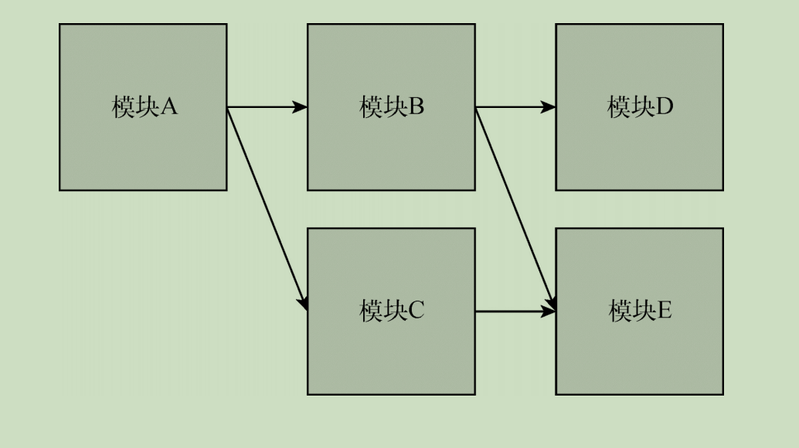
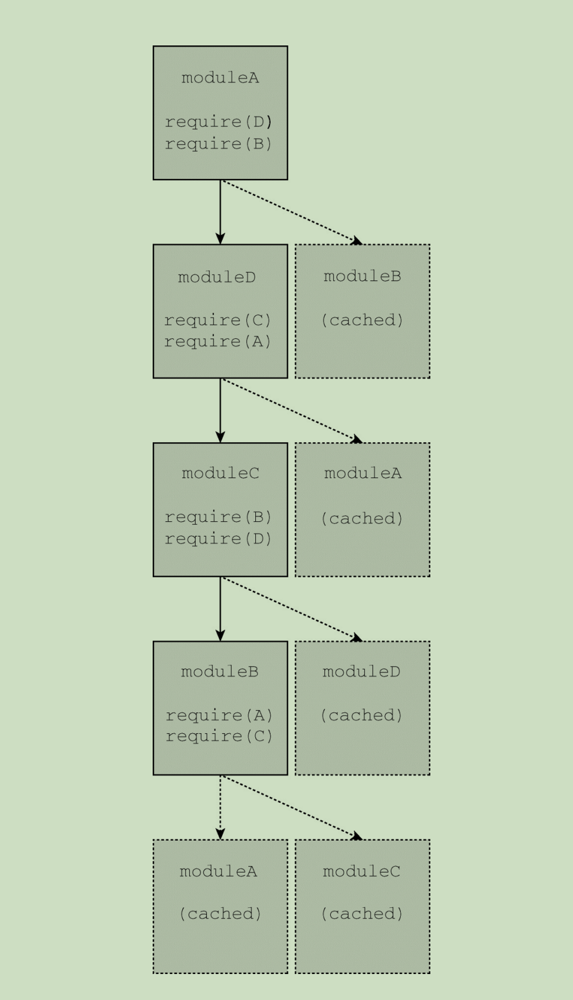
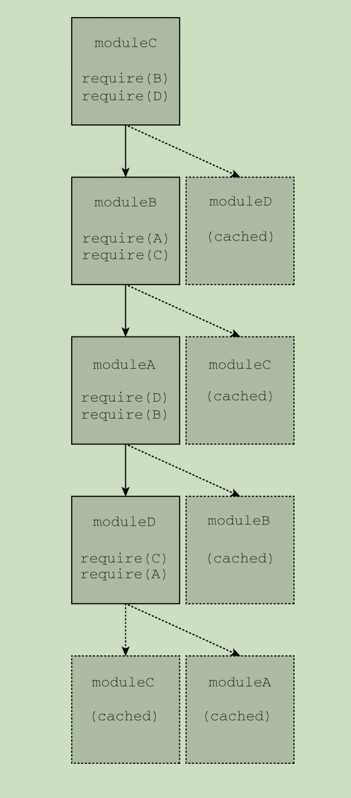

# 第 **26** 章 模块

- 本章内容

  - 理解模块模式 

  - 凑合的模块系统 

  - 使用前ES6模块加载器 

  - 使用ES6模块 

## **26.1** 理解模块模式 

### **26.1.1** 模块标识符 

- 模块系统本质上是
  - 键/值实体，
- 每个模块都有个
  - 可用于引用它的标识符。
- 完善的模块系统
  - 一定不会存在模块标识冲突的问题，
  - 且系统中的任何模块都应该能够
    - 无歧义地引用其他模块。

- 原生浏览器模块标识符
  - 必须提供实际JavaScript文件的路径。
  - 除了文件路径，
    - Node.js还会搜索node_modules目录，
      - 用标识符去匹配包含index.js的目录

### **26.1.2** 模块依赖 

- 模块系统的核心是
  - 管理依赖。
- 本地模块向模块系统声明一组外部模块（依赖），
  - 这些外部模块对于当前模块正常运行是必需的。
  - 模块系统检视这些依赖，
    - 进而保证这些外部模块能够被加载
    - 并在本地模块运行时初始化所有依赖。 

- 每个模块都会与某个唯一的标识符关联，
  - 该标识符可用于检索模块。
  - 这个标识符通常是JavaScript文件的路径，
  - 但在某些模块系统中，
    - 这个标识符也可以是
      - 在模块本身内部声明的命名空间路径字符串

### **26.1.3** 模块加载 

- 当一个外部模块被指定为依赖时，
  - 本地模块期望在执行它时，
    - 依赖已准备好并已初始化。 

- 加载模块涉及执行其中的代码， 
  - 但必须是在所有依赖都加载并执行之后。
- 如果浏览器没有收到依赖模块的代码，
  - 则必须发送请求
  - 并等待网络返回。
- 收到模块代码之后，
  - 浏览器必须确定刚收到的模块是否也有依赖。
  - 然后递归地评估并加载所有依赖，
  - 直到所有依赖模块都加载完成。
- 只有整个依赖图都加载完成，
  - 才可以执行入口模块。 

### **26.1.4** 入口

- 相互依赖的模块必须指定一个模块作为入口（entry point），
  - 这也是代码执行的起点。
- 因为JavaScript是顺序执行的，并且是单线程的，
  - 所以代码必须有执行的起点。
- 入口模块也可能依赖其他模块，
  - 其他模块同样可能有自己的依赖。
- 于是模块化JavaScript应用程序的所有模块
  - 会构成依赖图。 

- 可以通过有向图来表示
  - 应用程序中各模块的依赖关系。
- 应用程序的模块依赖关系图。



- 因为模块是
  - 作为包含将立即执行的JavaScript代码的文件实现的，
  - 所以一种可能是按照依赖图的要求依次请求各个脚本。
- 对于前面的应用程序来说，
  - 下面的脚本请求顺序能够满足依赖图的要求： 

```
<script src="moduleE.js"></script>
<script src="moduleD.js"></script>
<script src="moduleC.js"></script>
<script src="moduleB.js"></script>
<script src="moduleA.js"></script>

```

- 模块加载是“阻塞的”，
  - 这意味着前置操作必须完成才能执行后续操作。 

- 每个模块在自己的代码到达浏览器之后完成加载，
  - 此时其依赖已经加载并初始化。
- 为一个应用程序而按顺序加载五个JavaScript文件并不理想，
  - 并且手动管理正确的加载顺序也颇为棘手。 

### **26.1.5** 异步依赖

- 因为JavaScript可以异步执行，
  - 所以如果能按需加载就好了。
- 可以让JavaScript通知模块系统在必要时加载新模块，
  - 并在模块加载完成后提供回调。
  - 在代码层面，可以通过下面的伪代码来实现：

```
// 在模块A里面 
load('moduleB').then(function (moduleB) {
    moduleB.doStuff();
});
```

- 模块A的代码使用了moduleB标识符
  - 向模块系统请求加载模块B，
  - 并以模块B作为参数调用回调。
- 模块B可能已加载完成，也可能必须重新请求和初始化，
  - 但这里的代码并不关心。
  - 这些事情都交给了模块加载器去负责。

- 如果重写前面的应用程序，只使用动态模块加载，
  - 那么使用一个\<script>标签即可完成模块A的加载。
  - 模块A会按需请求模块文件，
    - 而不会生成必需的依赖列表。
  - 这样有几个好处，其中之一就是性能，
    - 因为在页面加载时只需同步加载一个文件。

- 这些脚本也可以分离出来，
  - 比如给\<script>标签应用defer或async属性，
  - 再加上能够识别异步脚本何时加载和初始化的逻辑。
    - 此行为将模拟在ES6模块规范中实现的行为

### **26.1.6** 动态依赖 

- 有些模块系统要求开发者在模块开始列出所有依赖，
- 而有些模块系统则允许开发者在程序结构中动态添加依赖。
- 动态添加的依赖有别于模块开头列出的常规依赖，
  - 这些依赖必须在模块执行前加载完毕。 

- 下面是动态依赖加载的例子：

```
if (loadCondition) {
    require('./moduleA');
}
```

- 在这个模块中，是否加载moduleA
  - 是运行时确定的。
- 加载moduleA时
  - 可能是阻塞的，
  - 也可能导致执行，
    - 且只有模块加载后才会继续。

- 模块内部的代码在moduleA加载前都不能执行，
  - 因为moduleA的存在是后续模块行为正确的关键。 

- 动态依赖可以支持更复杂的依赖关系，
  - 但代价是增加了对模块进行静态分析的难度。 

### **26.1.7** 静态分析 

- 分析工具会检查代码结构
  - 并在不实际执行代码的情况下
    - 推断其行为。
- 对静态分析友好的模块系统
  - 可以让模块打包系统
    - 更容易将代码处理为较少的文件。

### **26.1.8** 循环依赖 

- 包括CommonJS、AMD和ES6在内的所有模块系统
  - 都支持循环依赖。
- 在包含循环依赖的应用程序中，
  - 模块加载顺序可能会出人意料。
- 在下面的模块代码中（其中使用了模块中立的伪代码），
  - 任何模块都可以作为入口模块
    - 即使依赖图中存在循环依赖： 

```
require('./moduleD');
require('./moduleB');
console.log('moduleA');

require('./moduleA');
require('./moduleC');
console.log('moduleB');

require('./moduleB');
require('./moduleD');
console.log('moduleC');

require('./moduleA');
require('./moduleC');
console.log('moduleD');
```

- 修改主模块中用到的模块
  - 会改变依赖加载顺序。
- 如果moduleA最先加载，
  - 则会打印如下输出，
  - 这表示模块加载完成时的绝对顺序：

```
moduleB 
moduleC 
moduleD
moduleA
```

- 以上模块加载顺序可以用图26-2的依赖图来表示，
  - 其中加载器会执行深度优先的依赖加载



- 如果moduleC最先加载，则会打印如下输出，
  - 这表示模块加载的绝对顺序

```
moduleD 
moduleA 
moduleB 
moduleC
```



## **26.2** 凑合的模块系统

- 为按照模块模式提供必要的封装，
  - ES6之前的模块有时候会使用
    - 函数作用域和
    - 立即调用函数表达式（IIFE)
  - 将模块定义封装在匿名闭包中。
  - 模块定义是立即执行的， 

```
(function () {
    // 私有Foo模块的代码 
    console.log('bar');
})(); 
// bar
```

- 如果把这个模块的返回值赋给一个变量，
  - 那么实际上就为模块创建了命名空间： 

```
var Foo = (function () {
    console.log('bar');
})();
// 'bar'
```

- 为了暴露公共API，模块IIFE会返回一个对象，
  - 其属性就是模块命名空间中的公共成员

```
var Foo = (function () {
    return {
        bar: 'baz',
        baz: function () {
            console.log(this.bar);
        }
    };
})();
console.log(Foo.bar); // 'baz'
Foo.baz(); // 'baz'
```

- 还有一种模式叫作“泄露模块模式”
  - （revealing module pattern）。
  - 这种模式只返回一个对象，
    - 其属性是私有数据和成员的引用

```
var Foo = (function () {
    var bar = 'baz';
    var baz = function () {
        console.log(bar);
    };
    return {
        bar: bar,
        baz: baz
    };
})();
console.log(Foo.bar); // 'baz' 
Foo.baz(); // 'baz'
```

- 在模块内部也可以定义模块，
  - 这样可以实现命名空间嵌套： 

```
var Foo = (function () {
    return {
        bar: 'baz'
    };
})();
Foo.baz = (function () {
    return {
        qux: function () {
            console.log('baz');
        }
    };
})();
console.log(Foo.bar); // 'baz'
Foo.baz.qux(); // 'baz'
```

- 为了让模块正确使用外部的值，
  - 可以将它们作为参数传给IIFE：

```
var globalBar = 'baz';
var Foo = (function (bar) {
    return {
        bar: bar,
        baz: function () {
            console.log(bar);
        }
    };
})(globalBar);
console.log(Foo.bar); // 'baz'
Foo.baz(); // 'baz'
```

- 因为这里的模块实现其实就是在创建JavaScript对象的实例，
  - 所以完全可以在定义之后再扩展模块

```
// 原始的Foo
var Foo = (function (bar) {
    var bar = 'baz';
    return {
        bar: bar
    };
})();
// 扩展Foo 
var Foo = (function (FooModule) {
    FooModule.baz = function () {
        console.log(FooModule.bar);
    }
    return FooModule;
})(Foo);
console.log(Foo.bar); // 'baz'
Foo.baz(); // 'baz'
```

- 无论模块是否存在，
  - 配置模块扩展以执行扩展也很有用

```
// 扩展Foo以增加新方法 
var Foo = (function (FooModule) {
    FooModule.baz = function () {
        console.log(FooModule.bar);
    }
    return FooModule;
})(Foo || {});

// 扩展Foo以增加新数据 
var Foo = (function (FooModule) {
    FooModule.bar = 'baz';
    return FooModule;
})(Foo || {});

console.log(Foo.bar); // 'baz'
Foo.baz(); // 'baz'
```

## **26.3** 使用**ES6**之前的模块加载器 

### **26.3.1 CommonJS** 

- CommonJS规范概述了
  - 同步声明依赖的模块定义。
- 这个规范主要用于
  - 在服务器端实现模块化代码组织，
  - 但也可用于定义在浏览器中使用的模块依赖。
- CommonJS模块语法
  - 不能在浏览器中直接运行。 
- Node.js的模块系统使用了CommonJS规范，
  - 实际上并不完全正确。
  - Node.js使用了轻微修改版本的CommonJS，
- 因为Node.js主要在服务器环境下使用，
  - 所以不需要考虑网络延迟问题。 
- 本节使用Node.js风格的模块定义语法。 
- CommonJS模块
  - 定义需要使用require()指定依赖，
  - 而使用exports对象定义自己的公共API。
- 下面的代码展示了简单的模块定义：

```
var moduleB = require('./moduleB');
module.exports = {
    stuff: moduleB.doStuff();
};
```

- moduleA通过使用模块定义的相对路径
  - 来指定自己对moduleB的依赖。
- 请求模块
  - 会加载相应模块，
- 而把模块赋值给变量也非常常见，
  - 但赋值给变量不是必需的。
- 调用require()意味着
  - 模块会原封不动地加载进来：

```
console.log('moduleA');
require('./moduleA'); // "moduleA"
```

- 无论一个模块在require()中被引用多少次，
  - 模块永远是单例。
- 在下面的例子中，moduleA只会被打印一次。
  - 这是因为无论请求多少次，
    - moduleA只会被加载一次

```
console.log('moduleA');
var a1 = require('./moduleA');
var a2 = require('./moduleA');
console.log(a1 === a2); // true
```

- 模块第一次加载后会被缓存，
  - 后续加载会取得缓存的模块
  - （如下代码所示）。
- 模块加载顺序
  - 由依赖图决定

```
console.log('moduleA');
require('./moduleA');
require('./moduleB'); // "moduleA" 
require('./moduleA');
```

- 在CommonJS中，模块加载是模块系统执行的同步操作。
  - 因此require()可以以编程方式嵌入在模块中： 

```
console.log('moduleA');
if (loadCondition) {
    require('./moduleA');
}
```

- 模块系统是Node.js实现的，
  - 因此./moduleB是相对路径，
    - 指向与当前模块位于同一目录中的模块目标。
- Node.js会使用require()调用中的模块标识符字符串
  - 去解析模块引用。
- 在不同的CommonJS实现中
  - 模块字符串引用的含义可能不同。
- 所有CommonJS风格的实现共同之处是
  - 模块不会指定自己的标识符，
  - 它们的标识符由其在模块文件层级中的位置决定 

- 如果有模块想使用这个接口，可以像下面这样导入它： 

```
var moduleA = require('./moduleA'); console.log(moduleA.stuff);
```

- 注意，此模块不导出任何内容。
  - 即使它没有公共接口，
- 如果应用程序请求了这个模块，
  - 那也会在加载时执行这个模块体。 

- 如果只想导出一个实体，
  - 可以直接给module.exports赋值： 

```
module.exports = 'foo';
```

```
var moduleA = require('./moduleB'); console.log(moduleB); // 'foo'
```

- 导出多个值
  - 可以使用对象字面量赋值
  - 或每个属性赋一次值

```
// 等价操作： 
module.exports = { a: 'A', b: 'B' };
module.exports.a = 'A'; 
module.exports.b = 'B';
```

- 模块的一个主要用途是
  - 托管类定义

```
class A {} 
module.exports = A;
```

```
var A = require('./moduleA');
var a = new A();
```

- 将类实例作为导出值：

```
class A {} 
module.exports = new A();
```

- CommonJS支持动态依赖： 

```
if (condition) { var A = require('./moduleA'); }
```

### **26.3.2** 异步模块定义 

- CommonJS以服务器端为目标环境，
  - 能够一次性把所有模块都加载到内存，
- 异步模块定义
  - （AMD，Asynchronous Module Definition）的
  - 模块定义系统则以浏览器为目标执行环境，
  - 这需要考虑网络延迟的问题。 

- AMD的一般策略是
  - 让模块声明自己的依赖，
  - 而运行在浏览器中的模块系统会按需获取依赖，
  - 并在依赖加载完成后立即执行依赖它们的模块。 

- AMD模块实现的核心是
  - 用函数包装模块定义。
    - 这样可以防止声明全局变量，
    - 并允许加载器库控制何时加载模块。
    - 包装函数也便于模块代码的移植，
- 包装模块的函数是全局define的参数，
  - 它是由AMD加载器库的实现定义的。 

- AMD模块可以使用字符串标识符
  - 指定自己的依赖，
- AMD加载器会在所有依赖模块加载完毕后
  - 立即调用模块工厂函数。

- AMD支持可选地为模块
  - 指定字符串标识符

```
// ID为'moduleA'的模块定义。moduleA依赖moduleB，
// moduleB会异步加载 
define('moduleA', ['moduleB'], function (moduleB) {
    return {
        stuff: moduleB.doStuff();
    };
});
```

- MD也支持require和exports对象，
  - 通过它们可以在AMD模块工厂函数内部
    - 定义CommonJS风格的模块。
- AMD加载器会将它们识别为原生AMD结构，
  - 而不是模块定义：

```
define('moduleA', ['require', 'exports'], function (require, exports) {
    var moduleB = require('moduleB');
    exports.stuff = moduleB.doStuff();
});
```

- 动态依赖也是通过这种方式支持的

```
define('moduleA', ['require'], function (require) {
    if (condition) {
        var moduleB = require('moduleB');
    }
});
```

### **26.3.3** 通用模块定义 

- 为了统一CommonJS和AMD生态系统，
  - 通用模块定义（UMD， Universal Module Definition）
  - 规范应运而生。
- UMD可用于创建这两个系统都可以使用的模块代码。
- UMD定义的模块会在启动时
  - 检测要使用哪个模块系统，
  - 然后进行适当配置，
  - 并把所有逻辑包装在一个立即调用的函数表达式中。

- 只包含一个依赖的UMD模块定义的示例

```
(function (root, factory) {
    if (typeof define === 'function' && define.amd) {
        // AMD。注册为匿名模块 
        define(['moduleB'], factory);
    } else if (typeof module === 'object' && module.exports) {
        // Node。不支持严格CommonJS
        // 但可以在Node这样支持module.exports的
        // 类CommonJS环境下使用 
        module.exports = factory(require(' moduleB '));
    } else {
        // 浏览器全局上下文（root是window） 
        root.returnExports = factory(root.moduleB);
    }
}(this, function (moduleB) {
    // 以某种方式使用moduleB
    // 将返回值作为模块的导出 
    // 这个例子返回了一个对象
    // 但是模块也可以返回函数作为导出值
    return {};
}));
```

### **26.3.4** 模块加载器终将没落

## **26.4** 使用**ES6**模块 

- ES6最大的一个改进就是引入了模块规范。
- 这个规范全方位简化了之前出现的模块加载器，
  - 原生浏览器支持意味着
    - 加载器及其他预处理都不再必要。
- 从很多方面看，ES6模块系统是集AMD和CommonJS之大成者

### **26.4.1** 模块标签及定义 

- ECMAScript 6模块是作为一整块JavaScript代码而存在的。
- 带有type="module"属性的\<script>标签会告诉浏览器
  - 相关代码应该作为模块执行，
  - 而不是作为传统的脚本执行。
- 模块可以嵌入在网页中，
  - 也可以作为外部文件引入：

```
<script type="module">
  // 模块代码
</script>
<script type="module" src="path/to/myModule.js"></script>

```

- 即使与常规JavaScript文件处理方式不同，
  - JavaScript模块文件也没有专门的内容类型。 

- 所有模块都会像\<script defer>加载的脚本一样按顺序执行。

- 解析到\<script type="module">标签后

  - 会立即下载模块文件， 

  - 但执行会延迟到文档解析完成。

- \<script type="module">在页面中出现的顺序

  - 就是模块执行的顺序。

- 与\<script defer>一样，修改模块标签的位置， 

- 无论是在\<head>还是在\<body>中，
  - 只会影响文件什么时候加载，
  - 而不会影响模块什么时候加载。 

- 嵌入模块代码的执行顺序

```
<!-- 第二个执行 -->
<script type="module"></script>
<!-- 第三个执行 -->
<script type="module"></script>
<!-- 第一个执行 -->
<script></script>

```

- 加载外部JS模块定义：

```
<!-- 第二个执行 -->
<script type="module" src="module.js"></script>
<!-- 第三个执行 -->
<script type="module" src="module.js"></script>
<!-- 第一个执行 -->
<script></script>

```

- 也可以给模块标签添加async属性。
  - 这样影响就是双重的：
    - 模块执行顺序不与\<script>标签在页面中的顺序绑定，
    - 模块不会等待文档完成解析才执行。
      - 入口模块必须等待其依赖加载完成

- 与\<script type="module">标签关联的ES6模块
  - 被认为是模块图中的入口模块。
- 一个页面上有多少个入口模块没有限制，
  - 重复加载同一个模块也没有限制。
- 同一个模块无论在一个页面中被加载多少次，
  - 实际上都只会加载一次，
- 如下面的代码所示：

```
<!-- moduleA在这个页面上只会被加载一次 -->
<script type="module">
  import "./moduleA.js";
</script>
<script type="module">
  import "./moduleA.js";
</script>
<script type="module" src="./moduleA.js"></script>
<script type="module" src="./moduleA.js"></script>

```

- 嵌入的模块定义代码不能使用import加载到其他模块。
- 只有通过外部文件加载的模块才可以使用import加载。
- 因此，嵌入模块只适合作为入口模块

### **26.4.2** 模块加载 

- ECMAScript 6模块的独特之处在于，
  - 既可以通过浏览器原生加载，
  - 也可以与第三方加载器和构建工具一起加载。

- 完全支持ECMAScript 6模块的浏览器

  - 可以从顶级模块加载整个依赖图， 

  - 且是异步完成的。

- 这个过程与AMD风格的模块加载非常相似。

- 模块文件按需加载，

  - 且后续模块的请求会因为
    - 每个依赖模块的网络延迟而同步延迟。

- 如果moduleA依赖moduleB，

  - moduleB依赖moduleC。

- 浏览器在对moduleB的请求完成之前

  - 并不知道要请求moduleC。

### **26.4.3** 模块行为

- ECMAScript 6模块借用了CommonJS和AMD的很多优秀特性。

- 下面简单列举一些。

  - 模块代码只在加载后执行。 
  - 模块只能加载一次。 

  - 模块是单例。 

  - 模块可以定义公共接口，
    - 其他模块可以基于这个公共接口观察和交互。

  - 模块可以请求加载其他模块。 

  - 支持循环依赖。 

- ES6模块系统也增加了一些新行为。

  - ES6模块默认在严格模式下执行。 

  - ES6模块不共享全局命名空间。 

  - 模块顶级this的值是undefined
    - （常规脚本中是window）。 

  - 模块中的var声明不会添加到window对象。 

  - ES6模块是异步加载和执行的

- 与\<script type="module">关联
  - 或者通过import语句加载的JavaScript文件
    - 会被认定为模块。

### **26.4.4** 模块导出

- 控制模块的哪些部分对外部可见的是
  - export关键字。
- ES6模块支持两种导出：
  - 命名导出
  - 默认导出。
- export关键字用于声明一个值为命名导出。
- 导出语句必须在模块顶级， 
  - 不能嵌套在某个块中：

```
// 允许 
export ... 
// 不允许 
if (condition) { export ... }
```

- 导出值对模块内部JavaScript的执行没有直接影响，
  - 因此export语句与
    - 导出值的相对位置
    - 或者export关键字在模块中出现的顺序没有限制。
  - export语句甚至可以出现在它要导出的值之前

```
// 允许 
const foo = 'foo'; export { foo };
// 允许 
export const foo = 'foo'; 
// 允许，但应该避免
export { foo }; 
const foo = 'foo';
```

- 行内命名导出，
  - 可以在同一行执行变量声明。
- 下面展示了一个声明变量同时又导出变量的例子。
- 外部模块可以导入这个模块，
  - 而foo将成为这个导入模块的一个属性：

```
export const foo = 'foo';
```

- 变量声明跟导出可以不在一行。
- 可以在export子句中执行声明
  - 并将标识符导出到模块的其他地方： 

```
const foo = 'foo'; 
export { foo };
```

- 导出时也可以提供别名，
  - 别名必须在export子句的大括号语法中指定。

- 声明值、导出值和为导出值提供别名
  - 不能在一行完成。
- 在下面的例子中，
  - 导入这个模块的外部模块
    - 可以使用myFoo访问导出的值： 

```
const foo = 'foo'; 
export { foo as myFoo };
```

- 因为ES6命名导出可以将模块作为容器，
  - 所以可以在一个模块中声明多个命名导出。
- 导出的值
  - 可以在导出语句中声明，
  - 也可以在导出之前声明：

```
export const foo = 'foo';
export const bar = 'bar';
export const baz = 'baz';
```

- 考虑到导出多个值是常见的操作，
  - ES6模块也支持对导出声明分组，
  - 可以同时为部分或全部导出值指定别名：

```
const foo = 'foo';
const bar = 'bar';
const baz = 'baz';
export {
    foo,
    bar as myBar,
    baz
};
```

- 默认导出使用default关键字将一个值声明为默认导出，
  - 每个模块只能有一个默认导出。
- 重复的默认导出会导致SyntaxError。

- 下面的例子定义了一个默认导出，
  - 外部模块可以导入这个模块，
  - 而这个模块本身就是foo的值：

```
const foo = 'foo'; 
export default foo;
```

- ES6模块系统会识别作为别名提供的default关键字。
- 虽然对应的值是使用命名语法导出的，
  - 实际上则会成为默认导出： 

```
const foo = 'foo'; 
// 等同于 export default foo;
export { foo as default };
```

- 因为命名导出和默认导出不会冲突，
  - 所以ES6支持在一个模块中同时定义这两种导出

```
const foo = 'foo';
const bar = 'bar';
export {
    bar
};
export default foo;
```

- 这两个export语句可以组合为一行：

```
const foo = 'foo';
const bar = 'bar';
export {
    foo as default, bar
};
```

```

```

- 声明、赋值和导出标识符最好分开。
  - 同时也可以让export语句集中在一块。

### **26.4.5** 模块导入 

- 模块可以通过使用import关键字使用其他模块导出的值。
  - import必须出现在模块的顶级：

```
// 允许 
import...
// 不允许 
if (condition) {
    import...
}
```

- import语句被提升到模块顶部。
  - import语句与使用导入值的语句的相对位置并不重要。
    - 推荐把导入语句放在模块顶部。 

```
// 允许 
import { foo } from './fooModule.js'; console.log(foo); // 'foo' 
// 允许，但应该避免 
console.log(foo); // 'foo'
import { foo } from './fooModule.js';
```

- 模块标识符
  - 可以是相对于当前模块的相对路径，
  - 也可以是指向模块文件的绝对路径。
  - 它必须是纯字符串，
    - 不能是动态计算的结果。
- 例如，不能是拼接的字符串。 
- 如果在浏览器中通过标识符原生加载模块，
  - 则文件必须带有.js扩展名， 
    - 不然可能无法正确解析。
- 如果是通过构建工具或第三方模块加载器打包
  - 或解析的ES6模块，
    - 则可能不需要包含文件扩展名。 

```
// 解析为/components/bar.js 
import ... from './bar.js';
// 解析为/bar.js
 import ... from '../bar.js'; 
// 解析为/bar.js 
import ... from '/bar.js';
```

- 不是必须通过导出的成员才能导入模块。
  - 如果不需要模块的特定导出， 
    - 但仍想加载和执行模块以利用其副作用，
    - 可以只通过路径加载它： 

```
import './foo.js';
```

- 导入对模块而言是只读的，

  - 实际上相当于const声明的变量。

- 在使用*执行批量导入时，赋值给别名的命名导出

  - 直接修改导出的值是不可能的，
    - 但可以修改导出对象的属性。 

  - 也不能给导出的集合添加或删除导出的属性。

- 要修改导出的值， 

  - 必须使用有内部变量和属性访问权限的导出方法。

```
import foo, * as Foo './foo.js';
foo = 'foo'; // 错误
Foo.foo = 'foo'; // 错误
foo.bar = 'bar'; // 允许
```

- 命名导出可以使用*批量获取并赋值给保存导出集合的别名，
  - 而无须列出每个标识符： 

```
const foo = 'foo',
    bar = 'bar',
    baz = 'baz';
export {
    foo,
    bar,
    baz
}

```

```
import * as Foo from './foo.js';
console.log(Foo.foo); // foo 
console.log(Foo.bar); // bar
console.log(Foo.baz); // baz
```

- 要指名导入，
  - 需要把标识符放在import子句中。
- 使用import子句可以为导入的值
  - 指定别名： 

```
import {
    foo,
    bar,
    baz as myBaz
} from './foo.js';
console.log(foo); // foo 
console.log(bar); // bar
console.log(myBaz); // baz
```

- 默认导出
  - 可以使用default关键字并提供别名来导入。
  - 也可以不使用大括号，
    - 此时指定的标识符就是默认导出的别名：

```
// 等效 
import { default as foo } from './foo.js';
import foo from './foo.js';
```

- 如果模块同时导出了命名导出和默认导出，
  - 则可以在import语句中同时取得它们。
    - 可以依次列出特定导出的标识符来取得，
    - 也可以使用*来取得：

```
import foo, {
    bar,
    baz
} from './foo.js';

import {
    default as foo,
    bar,
    baz
} from './foo.js';

import foo, * as Foo from './foo.js';
```

### **26.4.6** 模块转移导出 

- 模块导入的值可以直接通过管道转移到导出。
- 可以将默认导出转换为命名导出，
  - 或者相反。
- 如果想把一个模块的所有命名导出集中在一块，
  - 可以像下面这样在bar.js中使用*导出：

```
export * from './foo.js';
```

- foo.js中的所有命名导出都会出现在导入bar.js的模块中。
- 如果foo.js有默认导出，
  - 则该语法会忽略它。
- 使用此语法也要注意导出名称是否冲突。
  - 如果foo.js导出baz，bar.js也导出baz，
    - 则最终导出的是bar.js 中的值。
    - 这个“重写”是静默发生的： 

**foo.js** 

```
export const baz = 'origin:foo';
```

**bar.js**

```
export * from './foo.js'; 
export const baz = 'origin:bar'
```

**main.js**

```
import { baz } from './bar.js'; 
console.log(baz); // origin:bar
```

- 可以明确列出要从外部模块转移本地导出的值。
  - 该语法支持使用别名： 

```
export { foo, bar as myBar } from './foo.js';
```


- 外部模块的默认导出可以重用为
  - 当前模块的默认导出：

```
export { default } from './foo.js';
```

- 这样不会复制导出的值，
  - 只是把导入的引用传给了原始模块。
- 在原始模块中，导入的值仍然是可用的，
- 在重新导出时，
  - 可以在导入模块修改命名或默认导出的角色。
- 比如，将命名导出指定为默认导出

```
export { foo as default } from './foo.js';
```

### **26.4.7** 工作者模块

- 跳过

### **26.4.8** 向后兼容 

- 利用脚本的type属性和nomodule属性。 

- 浏览器在遇到\<script>标签上无法识别的type属性时
  - 会拒绝执行其内容。
- 对于不支持模块的浏览器，
  - 这意味着\<script type="module">不会被执行。
- 因此，可以在\<script type="module">标签旁边
  - 添加一个回退\<script>标签： 

```
// 不支持模块的浏览器不会执行这里的代码
<script type="module" src="module.js"></script> 
// 不支持模块的浏览器会执行这里的代码
 <script src="script.js"></script>
```

- 支持模块的浏览器
  - 前面的代码会执行两次，
- 原生支持ECMAScript 6模块的浏览器
  - 也会识别nomodule属性。
    - 此属性通知支持ES6模块的浏览器不执行脚本。
  - 不支持模块的浏览器无法识别该属性， 
    - 从而忽略这个属性的存在。

- 下面代码会生成一个设置，在这个设置中，
  - 支持模块和不支持模块的浏览器都
    - 只会执行一段脚本：

```
// 支持模块的浏览器会执行这段脚本
 // 不支持模块的浏览器不会执行这段脚本 
<script type="module" src="module.js"></script>
 // 支持模块的浏览器不会执行这段脚本
  // 不支持模块的浏览器会执行这段脚本 
<script nomodule src="script.js"></script>
```

## **26.5** 小结

- 开发者可以通过模块创建逻辑彼此独立的代码段，
  - 在这些代码段之间声明依赖，
  - 并将它们连接在一起。

- CommonJS和AMD这两个分别针对
  - 服务器端环境和
    - 受延迟限制的客户端环境的模块系统
  - 这两个系统都没有在浏览器中实现。

- ECMAScript 6规范重新定义了浏览器模块，
  - 集之前两个系统之长于一身，
  - 并通过更简单的声明性语法暴露出来。