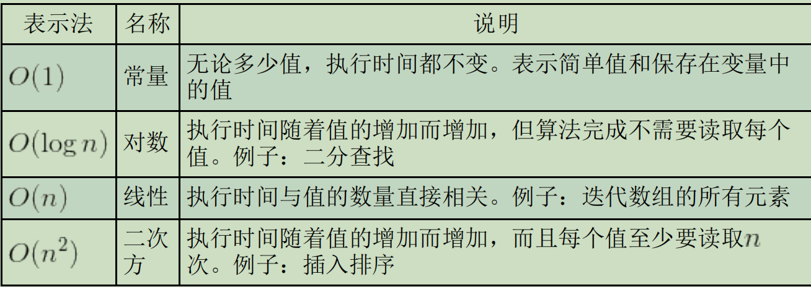

# 第 **28** 章 最佳实践 

- 本章内容

  - 编写可维护的代码 

  - 保证代码性能 

  - 部署代码到线上环境 

## **28.1** 可维护性 

### **28.1.1** 什么是可维护的代码 

- 代码“可维护”就意味着它具备如下特点

  - 容易理解：
    - 无须求助原始开发者，
    - 任何人一看代码就知道它是干什么的，
    - 以及它是怎么实现的。 

  - 符合常识：代码中的一切都显得顺理成章，
    - 无论操作有多么复杂。 

  - 容易适配：即使数据发生变化也不用完全重写。 

  - 容易扩展：代码架构经过认真设计，
    - 支持未来扩展核心功能。 

  - 容易调试：出问题时，代码可以给出明确的信息，
    - 通过它能直接定位问题。 

### **28.1.2** 编码规范 

#### \01. 可读性 

- 代码缩进
  - 一般来说，缩进是4个空格

- 代码注释

- 以下这些地方应该写注释

  - 函数和方法。
    - 有注释来描述其用途，
      - 以及完成任务所用的算法。
    - 写清使用这个函数或方法的前提（假设）、
      - 每个参数的含义，
      - 以及函数是否返回值

  - 大型代码块。
    - 多行代码但用于完成单一任务的，
      - 应该在前面给出注释，把要完成的任务写清楚。 

  - 复杂的算法。

    - 如果使用了独特的方法解决问题，
      - 要通过注释解释明白。
    - 这样不仅可以帮助别人查看代码，
      - 也可以帮助自己今后查看

  - 使用黑科技。

    - 由于浏览器之间的差异，
      - JavaScript代码中通常包含一些黑科技。

    - 如果某个浏览器不能使用正常方式达到目的，
      - 那要在注释里把黑科技的用途写出来。
      - 这样可以避免别人误以为黑科技没有用
        - 而把它“修复”掉

#### \02. 变量和函数命名 

- 以下是关于命名的通用规则。 

  - 变量名应该是名词，例如car或person。 
  - 函数名应该以动词开始，例如getName()。
    - 返回布尔值的函数通常以is开头，比如isEnabled()。 
  - 对变量和函数都使用符合逻辑的名称，
    - 不用担心长度。
    - 长名字的问题可以通过后处理和压缩解决
  - 变量、函数和方法应该以小写字母开头，
    - 使用驼峰大小写 （camelCase）形式，
      - 如getName()和isPerson。
    - 类名应该首字母大写，
      - 如Person、RequestFactory。
    - 常量值应该全部大写并以下划线相接，
      - 比如REQUEST_TIMEOUT。 
  - 名称要尽量用描述性和直观的词汇，
    - 但不要过于冗长。
      - getName()会返回名称，
      - PersonFactory会产生某个Person对象或实体
  
- 要完全避免没有用的变量名，
  - 如不能表示所包含数据的类型的变量名。

#### \03. 变量类型透明化

- 有三种方式可以标明变量的数据类型。
  - 通过初始化 
  - 使用匈牙利表示法。
  - 使用类型注释。

- 要保存布尔值的变量，
  - 可以将其初始化为true或false；
- 要保存数值的变量，
  - 可以将其初始化为一个数值

```
// 通过初始化标明变量类型 
let found = false; // 布尔值
let count = -1; // 数值
let name = ""; // 字符串 
let person = null; // 对象
```

- 匈牙利表示法指的是
  - 在变量名前面前缀一个或多个字符表示数据类型。
- 对于基本数据类型，JavaScript传统的匈牙利表示法
  - o表示对象，
  - s表示字符串，
  - i表示整数
  - f表示浮点数
  - b表示布尔值

```
// 使用匈牙利表示法标明数据类型 
let bFound; // 布尔值 
let iCount; // 整数
let sName; // 字符串 
let oPerson; // 对象
```

- 它的缺点是
  - 使代码可读性下降、不够直观，
  - 并破坏了类似句子的自然阅读流畅性。
- 因此，匈牙利表示法在开发者中失宠了

- 类型注释放在
  - 变量名后面、
  - 初始化表达式的前面。
- 基本思路是在变量旁边
  - 使用注释说明类型

```
// 使用类型注释表明数据类型
let found /*:Boolean*/ = false; 
let count /*:int*/ = 10;
let name /*:String*/ = "Nicholas";
let person /*:Object*/ = null;
```

- 类型注释的缺点是
  - 不能再使用多行注释把大型代码块注释掉了。
    - 因为类型注释也是多行注释，所以会造成干扰，

```
// 这样多行注释不会生效
 /*
 let found /*:Boolean*/ = false;
let count /*:int*/ = 10;
let name /*:String*/ = "Nicholas";
let person /*:Object*/ = null; 
* /
```

### **28.1.3** 松散耦合 

- 只要应用程序的某个部分对另一个部分依赖得过于紧密，
  - 代码就会变成紧密耦合，
  - 因而难以维护

- 典型的问题是在一个对象中直接引用另一个对象，
  - 修改其中一个，可能必须还得修改另一个

#### \01. 解耦**HTML/JavaScript** 

- 把JavaScript直接嵌入在HTML中，会造成紧密耦合。

  - 使用包含嵌入代码的 \<script>元素，

  - 使用HTML属性添加事件处理程序，

```
<!-- 使用<script>造成HTML/JavaScript紧密耦合 -->
<script>
  document.write("Hello world!");
</script>

<!-- 使用事件处理程序属性造成HTML/JavaScript紧密耦合 -->
<input type="button" value="Click Me" onclick="doSomething()" />

```

- 理想情况下， HTML和JavaScript应该完全分开，
  - 通过外部文件引入JavaScript，
  - 然后使用DOM添加行为

- 把HTML包含在JavaScript中。
  - HTML和JavaScript也会变得紧密耦合

```
// HTML紧密耦合到了JavaScript
function insertMessage(msg) {
    let container =
        document.getElementById("container");
    container.innerHTML = `
<div class="msg">
  <p>class="post">${msg}</p>
  <p><em>Latest message above.</em></p>
</div>
`;
}
```

- 应该避免在JavaScript中创建大量HTML
  - 在出错时更容易定位问题所在

- 标记可以包含并隐藏在页面中，
  - 在需要的时候JavaScript可以直接用它来显示，
  - 而不需要动态生成。
- 另一个办法是通过Ajax请求获取要显示的HTML，
  - 保证同一个渲染层（PHP、JSP、Ruby等）负责输出标记，
  - 而不是把标记嵌在JavaScript中。 

- 解耦HTML和JavaScript可以节省排错时间，

  - 因为更容易定位错误来源。

- 同样解耦也有助于保证可维护性。

  - 修改行为只涉及JavaScript， 

  - 修改标记只涉及要渲染的文件

#### \02. 解耦**CSS/JavaScript** 

- 使用JavaScript修改个别样式

```
// CSS紧耦合到了JavaScript
element.style.color = "red"; 
element.style.backgroundColor = "blue";
```

- 动态修改类名
  - 而不是样式 

```
// CSS与JavaScript松散耦合
element.className = "edit";
```

#### \03. 解耦应用程序逻辑**/**事件处理程序

```
function handleKeyPress(event) {
    if (event.keyCode == 13) {
        let target = event.target;
        let value = 5 * parseInt(target.value);
        if (value > 10) {
            document.getElementById("error-msg").style.display = "block";
        }
    }
}
```

- 事件处理程序应该专注于event对象的相关信息，
  - 然后把这些信息传给处理应用程序逻辑的某些方法。

```
function validateValue(value) {
    value = 5 * parseInt(value);
    if (value > 10) {
        document.getElementById("error-msg").style.display = "block";
    }
}

function handleKeyPress(event) {
    if (event.keyCode == 13) {
        let target = event.target;
        validateValue(target.value);
    }
}
```

- 好处

  - 可以让我们以最少的工作量修改触发某些流程的事件。

    - 如果原来是通过鼠标单击触发流程，
    - 而现在又想增加键盘操作来触发， 

    - 那么修改起来也很简单。

  - 可以在不用添加事件的情况下测试代码，

    - 这样创建单元测试或自动化应用程序流都会更简单。 

- 解耦应用程序逻辑和业务逻辑时应该注意的几点。

  - 不要把event对象传给其他方法，
    - 而是只传递event对象中必要的数据。 

  - 应用程序中每个可能的操作都应该
    - 无须事件处理程序就可以执行。

  - 事件处理程序应该处理事件，
    - 而把后续处理交给应用程序逻辑

### **28.1.4** 编码惯例 

#### \01. 尊重对象所有权 

- 如下惯例。

  - 不要给实例或原型添加属性。 

  - 不要给实例或原型添加方法。 

  - 不要重定义已有的方法。

- 按如下这样为对象添加新功能。 

  - 创建包含想要功能的新对象，
    - 通过它与别人的对象交互。 

  - 创建新自定义类型
    - 继承本来想要修改的类型，
    - 可以给自定义类型添加新功能。 

#### \02. 不声明全局变量

```
// 两个全局变量：不要！ 
var name = "Nicholas";

function sayName() {
    console.log(name);
}
```

- 以上代码声明了两个全局变量：name和sayName()。
  - 可以像下面这样把它们包含在一个对象中：

```
// 一个全局变量：推荐
var MyApplication = {
    name: "Nicholas",
    sayName: function () {
        console.log(this.name);
    }
};
```

- 可以避免之前版本的几个问题。

  - 变量name会覆盖window.name属性，
    - 而这可能会影响其他功能。 

  - 有助于分清功能都集中在哪里。
    - 调用MyApplication.sayName()从逻辑上会暗示，
    - 出现任何问题都可以在MyApplication的代码中找原因

- 命名空间涉及创建一个对象，
  - 然后通过这个对象来暴露能力

- 关于命名空间，最重要的确定

  - 一个所有人都同意的全局对象名称。 

  - 这个名称要足够独特，不可能与其他人的冲突。
  - 大多数情况下，可以使用开发者所在的公司名，

#### \03. 不要比较**null** 

- 因为类型检查不够而频繁引发错误

```
function sortArray(values) {
    if (values != null) {
        // 不要这样比较！
        values.sort(comparator);
    }
}
```

- 单纯比较null通常是不够的。
- 检查值的类型就要
  - 真的检查类型，
  - 而不是检查它不能是什么。
- 可以像下面这样重写那个函数：

```
function sortArray(values) {
    if (values instanceof Array) {
        // 推荐 values.sort(comparator); 
    }
}
```

- 如果看到比较null的代码，可以使用下列某种技术替换它

  - 如果值应该是引用类型，
    - 则使用instanceof操作符检查其构造函数。 

  - 如果值应该是原始类型，
    - 则使用typeof检查其类型。 

  - 如果希望值是有特定方法名的对象，
    - 则使用typeof操作符
      - 确保对象上存在给定名字的方法。 

#### \04. 使用常量

- 可以使用以下标准检查哪些数据需要提取。 

  - 重复出现的值：
    - 任何使用超过一次的值都应该提取到常量中，
    - 这样可以消除一个值改了
      - 而另一个值没改造成的错误。

  - 用户界面字符串：
    - 任何会显示给用户的字符串都应该提取出来，
    - 以方便实现国际化。 

  - **URL**：
    - Web应用程序中资源的地址经常会发生变化，
    - 因此建议把所有URL集中放在一个地方管理。 

  - 任何可能变化的值：
    - 只要在代码中使用字面值，
    - 这个值将来是否可能会变。
      - 如果答案是“是”，那么就应该把它提取到常量中

## **28.2** 性能 

### **28.2.1** 作用域意识

#### \01. 避免全局查找 

- 全局变量和函数相比于局部值始终是最费时间的，
  - 因为需要经历作用域链查找。

```
function updateUI() {
    let imgs = document.getElementsByTagName("img");
    for (let i = 0, len = imgs.length; i < len; i++) {
        imgs[i].title = '${document.title} image ${i}';
    }
    let msg = document.getElementById("msg");
    msg.innerHTML = "Update complete.";
}
```

- 如果页面的图片非常多，
  - 那么for循环中就需要引用document几十甚至上百次，
  - 每次都要遍历一次作用域链。

- 通过创建一个指向document对象的局部变量，
  - 将全局查找的数量限制为一个

```
function updateUI() {
    let doc = document;
    let imgs = doc.getElementsByTagName("img");
    for (let i = 0, len = imgs.length; i < len; i++) {
        imgs[i].title = '${doc.title} image ${i}';
    }
    let msg = doc.getElementById("msg");
    msg.innerHTML = "Update complete.";
}
```

- 只要函数中有引用超过两次的全局对象，
  - 就应该把这个对象保存为一个局部变量

#### \02. 不使用**with**语句 

- with语句会创建自己的作用域，
  - 因此也会加长其中代码的作用域链。 
- 在with语句中执行的代码一定比在它外部执行的代码慢，
  - 因为作用域链查找时多一步

- 使用局部变量可以实现同样的效果，
  - 无须增加新作用域

```
function updateBody() {
    with(document.body) {
        console.log(tagName);
        innerHTML = "Hello world!";
    }
}
```

- 使用局部变量可以实现同样的效果

```
function updateBody() {
    let body = document.body;
    console.log(body.tagName);
    body.innerHTML = "Hello world!";
}
```

### **28.2.2** 选择正确的方法

#### \01. 避免不必要的属性查找 

- 下表列出了JavaScript中常见算法的类型



```
let value = 5;
let sum = 10 + value;
console.log(sum);
```

- 在JavaScript中访问数组元素也是 O(1)操作，

```
let values = [5, 10];
let sum = values[0] + values[1];
console.log(sum);
```

- 查找的属性越多，执行时间就越长

```
let values = {
    first: 5,
    second: 10
};
let sum = values.first + values.second;
console.log(sum);
```

- 避免通过多次查找获取一个值。

```
let query = window.location.href.substring(window.location.href.indexOf("?"));
```

- 只要使用某个object属性超过一次，
  - 就应该将其保存在局部变量中。

```
let url = window.location.href;
let query = url.substring(url.indexOf("?"));
```

- 如果实现某个需求
  - 既可以使用数组的数值索引，
  - 又可以使用命名属性（比如NodeList对象），
    - 应该使用数值索引。 

#### \02. 优化循环

- 优化循环的基本步骤如下。

  - (1) 简化终止条件。
    - 避免属性查找或其他操作。 
  - (2) 简化循环体。
  
  - 不包含密集计算。 
  - (3) 使用后测试循环。

    - for和while循环
    - 属于先测试循环
  
  - do-while就是后测试循环
      - 避免了对终止条件初始评估 
    - 因此应该会更快

```
for (let i = 0; i < values.length; i++) {
    process(values[i]);
}
```

- 将循环变量改为递减的形式，

```
for (let i = values.length - 1; i >= 0; i--) {
    process(values[i]);
}
```

- 整个循环可修改为后测试循环： 

```
let i = values.length - 1;
if (i > -1) {
    do {
        process(values[i]);
    } while (--i >= 0);
}
```

- 使用后测试循环时要注意，
  - 至少有一个值需要处理一次。
  - 如果这里的数组是空的，
    - 那么会浪费一次循环，
    - 而先测试循环就可以避免这种情况。 

#### \03. 展开循环 

- 如果循环的次数是有限的，
  - 直接多次调用函数会更快。
- 如果数组长度始终一样，
  - 对每个元素都调用一次process()效率更高：

```
// 抛弃循环 
process(values[0]);
process(values[1]);
process(values[2]);
```

- 如果不能提前预知循环的次数，
  - 可以使用达夫设备（Duff's Device）技术。
- 达夫设备的基本思路是
  - 以8的倍数作为迭代次数
  - 从而将循环展开为一系列语句。

```
// 来源：Jeff Greenberg在JavaScript中实现的达夫设备
// 假设values.length > 0
let iterations = Math.ceil(values.length / 8);
let startAt = values.length % 8;
let i = 0;
do {
    switch (startAt) {
        case 0:
            process(values[i++]);
        case 7:
            process(values[i++]);
        case 6:
            process(values[i++]);
        case 5:
            process(values[i++]);
        case 4:
            process(values[i++]);
        case 3:
            process(values[i++]);
        case 2:
            process(values[i++]);
        case 1:
            process(values[i++]);
    }
    startAt = 0;
} while (--iterations > 0);
```

- 将do-while循环分成了两个单独的循环

```
// 来源：Speed Up Your Site（New Riders，2003）
let iterations = Math.floor(values.length / 8);
let leftover = values.length % 8;
let i = 0;
if (leftover > 0) {
    do {
        process(values[i++]);
    } while (--leftover > 0);
}
do {
    process(values[i++]);
    process(values[i++]);
    process(values[i++]);
    process(values[i++]);
    process(values[i++]);
    process(values[i++]);
    process(values[i++]);
    process(values[i++]);
} while (--iterations > 0);
```

#### \04. 避免重复解释

- 在使用eval()函数
  - 或Function构造函数，
  - 或者给setTimeout() 传入字符串参数时
  - 会出现这种情况。

```
// 对代码求值：不要 
eval("console.log('Hello world!')");
// 创建新函数：不要 
let sayHi = new Function("console.log('Hello world!')");
// 设置超时函数：不要
setTimeout("console.log('Hello world!')", 500);
```

```
// 直接写出来
console.log('Hello world!');

// 创建新函数：直接写出来 
let sayHi = function () { console.log('Hello world!'); };

// 设置超时函数：直接写出来
setTimeout(function () { console.log('Hello world!'); }, 500);
```

- 避免使用要当作JavaScript代码解释的字符串。 

#### \05. 其他性能优化注意事项

- 原生方法很快
  - 原生方法是使用C或C++等编译型语言写的，
    - 因此比JavaScript写的方法要快得多。
    - Math对象上数学运算的方法

- **switch**语句很快。
  - 如果代码中有复杂的if-else语句，
    - 将其转换成switch语句可以变得更快。
  - 通过重新组织分支，
    - 把最可能的放前面，
    - 不太可能的放后面

- 位操作很快。
  - 位操作一定比任何布尔值或数值计算更快。
    - 求模、逻辑AND与、逻辑OR或
      - 都很适合替代成位操作。 

### **28.2.3** 语句最少化

#### \01. 多个变量声明

```
// 有四条语句：浪费 
let count = 5;
let color = "blue";
let values = [1, 2, 3];
let now = new Date();
```

- 所有变量都可以使用一个let语句声明。

```
// 一条语句更好 
let count = 5,
    color = "blue",
    values = [1, 2, 3],
    now = new Date();
```

#### \02. 插入迭代性值 

- 只要使用迭代性值（即会递增或递减的值），
  - 使用组合语句。

```
let name = values[i];
i++;
```

- 将它们合并为一条语句： 

```
let name = values[i++];
```

#### \03. 使用数组和对象字面量

- 有两种使用数组和对象的方式
  - 构造函数
  - 字面量。
- 使用构造函数会产生更多的语句，
  - 字面量只需一条语句即可完成全部操作。

```
// 创建和初始化数组用了四条语句：浪费 
let values = new Array();
values[0] = 123;
values[1] = 456;
values[2] = 789;

// 创建和初始化对象用了四条语句：浪费 
let person = new Object();
person.name = "Nicholas";
person.age = 29;
person.sayName = function () {
    console.log(this.name);
}
```

- 这些语句很容易转换成字面量形式： 

```
// 一条语句创建并初始化数组 
let values = [123, 456, 789];

// 一条语句创建并初始化对象 
let person = {
    name: "Nicholas",
    age: 29,
    sayName() {
        console.log(this.name);
    }
};
```

### **28.2.4** 优化**DOM**交互

#### \01. 实时更新最小化

- 实时更新的次数越少，代码执行就越快。

```
let list = document.getElementById("myList"),
    item;
for (let i = 0; i < 10; i++) {
    item = document.createElement("li");
    list.appendChild(item);
    item.appendChild(document.createTextNode('Item ${i}');
    }
```

- 每添加1项，就会有两次实时更新：
  - 一次添加\<li>元素，
  - 一次为它添加文本节点。

- 减少实时更新的次数:

  - 使用文档片段构建DOM结构， 

  - 然后一次性将它添加到list元素。
    - 这个办法也可以避免页面闪烁

```
let list = document.getElementById("myList"),
    fragment = document.createDocumentFragment(),
    item;
for (let i = 0; i < 10; i++) {
    item = document.createElement("li");
    fragment.appendChild(item);
    item.appendChild(document.createTextNode("Item " + i));
}
list.appendChild(fragment);
```

- 这样修改之后，完成同样的操作
  - 只会触发一次实时更新。
- 在把文档片段传给appendChild() 时，
  - 会把片段的所有子元素添加到父元素，
  - 片段本身不会被添加。

- 只要是更新DOM，
  - 使用文档片段来预先构建DOM结构，
  - 然后再把构建好的DOM结构实时更新到文档中

#### \02. 使用**innerHTML** 

- 创建新DOM节点的方式
  - 使用DOM方法
  - 使用innerHTML

- 对于大量DOM更新，使用innerHTML要比

  - 使用标准DOM方法创建同样的结构快很多

  - 在给innerHTML赋值时，
    - 后台会创建HTML解析器，
  - 然后会使用原生DOM调用
    - 原生DOM方法速度更快，
      - 因为该方法是执行编译代码而非解释代码。

- 前面的例子如果使用innerHTML重写就是这样的：

```
let list = document.getElementById("myList"),
    html = "";
for (let i = 0; i < 10; i++) {
    html += '<li>Item ${i}</li>';
}
list.innerHTML = html;
```

- 使用innerHTML的关键在于
  - 最小化调用次数。

- 下面的代码使用innerHTML的次数就太多了：

```
let list = document.getElementById("myList");
for (let i = 0; i < 10; i++) {
    list.innerHTML += '<li>Item ${i}</li>'; // 不要
}
```

- 使用innerHTML会暴露巨大的XSS攻击面。

#### \03. 使用事件委托

- 事件委托利用了事件的冒泡。
  - 可以把事件处理程序添加到高层元素上。
- 应该在文档级添加事件处理程序，
  - 因为在文档级可以处理整个页面的事件。 

#### \04. 注意**HTMLCollection**

- 只要访问 HTMLCollection
  - 就会触发查询文档， 
    - 这个查询相当耗时。
- 减少访问HTMLCollection的次数
  - 把计算HTMLCollection长度的代码
    - 转移到for循环初始化的部分

```
let images = document.getElementsByTagName("img");

for (let i = 0, len = images.length; i < len; i++) {
    // 处理
}
```

- 在循环中使用HTMLCollection 时，
  - 首先取得对要使用的元素的引用

```
let images = document.getElementsByTagName("img"),
    image;
for (let i = 0, len = images.length; i < len; i++) {
    image = images[i];
    // 处理
}
```

- 只要返回HTMLCollection对象，
  - 就应该不访问它。

- 以下情形会返回HTMLCollection： 

  - 调用getElementsByTagName()； 

  - 读取元素的childNodes属性； 

  - 读取元素的attributes属性； 

  - 访问特殊集合，
    - 如document.form、document.images等。 

## **28.3** 部署

### **28.3.1** 构建流程

- 你写的代码不应该不做任何处理就直接交给浏览器，

- 原因如下。 

  - 知识产权问题：
    - 如果把满是注释的代码放到网上，
    - 其他人就很容易了解你在做什么，重用它，
    - 并可能发现安全漏洞。 

  - 文件大小：
    - 你写的代码可读性很好，容易维护，
    - 但性能不好。
    - 浏览器不会因为代码中多余的空格、缩进、冗余的函数和变量名而受益。

  - 代码组织：
    - 为保证可维护性而组织的代码
      - 不一定适合直接交付给浏览器

#### \01. 文件结构

- 最好不要在一个文件中包含所有JavaScript代码。

- 把对象和自定义类型保存到自己独立的文件中。

#### \02. 任务运行器

- 任务运行器可以完成
  - 代码检查、打包、转译、启动本地服务器、部署，
  - 以及其他可以脚本化的任务。

- 任务运行器要通过命令行界面来执行操作。

#### \03. 摇树优化

- 摇树优化（tree shaking）是减少冗余代码的策略。

- 摇树优化策略能够分析出选择性导入的代码，
  - 其余模块文件中的代码
    - 可以在最终打包得到的文件中完全省略。

```
import {
    foo
} from './utils.js';
console.log(foo);
export const foo = 'foo';
export const bar = 'bar'; // unused
```

- 在执行摇树优化时，
  - 构建工具会将bar导出完全排除在打包文件之外。

- 通过摇树优化，
  - 最终打包得到的文件可以瘦身很多

#### \04. 模块打包器 

- 由大量模块组成的JavaScript代码
  - 在构建时需要打包到一起，
  - 然后只交付一个或少数几个JavaScript文件。 

- 模块打包器的工作是
  - 识别应用程序中涉及的JavaScript依赖关系，
  - 将它们组合成一个大文件，
    - 完成对模块的串行组织和拼接，
  - 然后生成最终提供给浏览器的输出文件。 

- 能够实现模块打包的工具
  - Webpack、Rollupt和Browserify 
    - 将基于模块的代码转换为普遍兼容的网页脚本

### **28.3.2** 验证

- 有一些工具可以发现JavaScript代码中潜在的问题，
  - 最流行的是JSLint和ESLint。

- 下面是它们会报告的一些问题：

  - 使用eval()； 

  - 使用未声明的变量； 

  - 遗漏了分号；

  - 不适当地换行； 

    不正确地使用逗号； 

    遗漏了包含语句的括号； 

    遗漏了switch分支中的break； 

    重复声明变量； 

    使用了with； 

    错误地使用等号（应该是两个或三个等号）； 

    执行不到的代码。 

### **28.3.3** 压缩 

- JavaScript文件压缩，实际上主要是两件事：

  - 代码大小
    - 浏览器需要解析的字节数

  - 传输负载
    - 服务器实际发送给浏览器的字节数。

#### \01. 代码压缩 

- JavaScript不是编译成字节码，而是作为源代码传输的，
  - 源代码文件通常包含对浏览器的JavaScript解释器
  - 没有用的额外信息和格式。
- JavaScript压缩工具可以把源代码文件中的这些信息删除，
  - 并在保证程序逻辑不变的前提下
    - 缩小文件大小。

- 注释、额外的空格、长变量或函数名

  - 对浏览器而言这些都是多余的字节。

- 压缩工具可以通过如下操作减少代码大小： 

  - 删除空格（包括换行）； 

  - 删除注释； 

  - 缩短变量名、函数名和其他标识符。

- 最小化是指
  - 把文件大小减少到比原始大小还要小
    - 结果文件包含的仍是语法正确的代码

- 压缩与最小化的区别在于
  - 前者得到的文件不再包含语法正确的代码

- 压缩后的文件必须通过解压缩
  - 才能恢复为代码可读的格式。
- 压缩通常能得到比最小化更小的文件，
- 压缩算法不用考虑保留语法结构，
  - 因此自由度更高。 

#### \02. **JavaScript**编译 

- JavaScript代码编译指的是
  - 把源代码转换为一种逻辑相同但字节更少的形式。
- 与最小化的不同之处在于，
  - 编译后代码的结构可能不同，
  - 但仍然具备与原始代码相同的行为。
- 编译器通过输入全部JavaScript代码
  - 可以对程序流执行分析。 

- 编译可能会执行如下操作： 

  - 删除未使用的代码； 

  - 将某些代码转换为更简洁的语法； 

  - 全局函数调用、常量和变量行内化。 

#### \03. **JavaScript**转译 

- 转译可以将现代的代码转换成更早的ECMAScript版本，
  - 通常是ES3或ES5，
    - 这样可以确保代码能够跨浏览器兼容

- 编译是将源代码从一种语言转换为另一种语言。
- 转译只是目标语言与源语言
  - 是一种语言的不同级别的抽象。

#### \04. **HTTP**压缩

- 传输负载是
  - 从服务器发送给浏览器的实际字节数

- 服务器和浏览器都具有压缩能力。
- 所有当前主流的浏览器
  - 都支持客户端解压缩收到的资源。
- 服务器根据浏览器通过请求头部（Accept-Encoding）
  - 标明自己支持的格式，
  - 选择一种用来压缩 JavaScript文件。

- 在传输压缩后的文件时，
  - 服务器响应的头部会有字段（Content-Encoding）
    - 标明使用了哪种压缩格式。
- 浏览器看到这个头部字段后，
  - 就会根据这个压缩格式进行解压缩。
- 结果是通过网络传输的字节数
  - 明显小于原始代码大小。

## **28.4** 小结

- 为保证JavaScript代码的可维护性，可以参考如下编码惯例

  - 由于JavaScript必须与HTML和CSS共存
    - JavaScript负责定义行为，
    - HTML负责定义内容，
    - CSS负责定义外观。

  - 如果三者职责混淆，
    - 则可能导致难以调试的错误和可维护性问题

- 性能，因此应该牢记如下这些事项。 
  - 循环展开
  - 使用switch语句
    - 而不是if语句。 
  - 限制DOM操作的数量。

- 上线部署。以下是本章讨论的相关要点。

  - 应该建立构建流程，
    - 将JavaScript文件合并为较少的文件。 

  - 构建流程可以实现很多源代码处理任务的自动化。
    - 可以运行JavaScript验证程序，
      - 确保没有语法错误和潜在的问题。 

  - 压缩可以让文件在部署之前变得尽量小。 
  - 启用HTTP压缩
    - 可以让网络传输的JavaScript文件尽可能小，