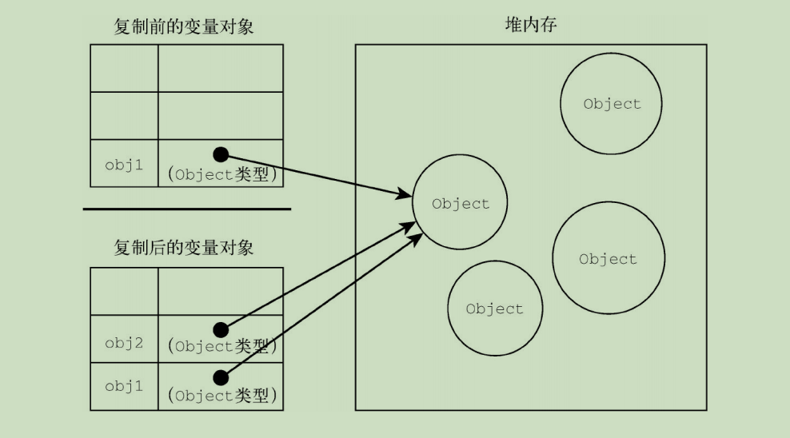

# 第 **4** 章 变量、作用域与内存

## 本章内容

- 通过变量使用原始值与引用值 

- 理解执行上下文 

- 理解垃圾回收 

## **4.1** 原始值与引用值 

- 原始值是什么？

  - 简单的数据
- 引用值是什么？

  - 对象 
- 在把一个值赋给变量时，JS 引擎必须确定什么？
  - 这个值是原始值还是引用值。
- 原始值有哪六种？

  - Undefined、
  - Null、
  - Boolean、
  - Number、
  - String
  - Symbol。
- 保存原始值的变量是按什么访问的？为什么？
  - 按值访问
  - 因为操作的是存储在变量中的实际值

- 保存引用值的变量是按什么访问的？为什么？
  - 按引用访问
    - 因为JavaScript不允许直接访问内存位置

- 对象保存在哪里？
  - 内存中

- 能否直接操作对象所在的内存空间？为什么？
  - 不能
    - 因为JavaScript不允许直接访问内存位置

- 在操作对象时，实际上操作的是什么？

  - 对该对象的引用

    - 而非实际的对象本身。

### **4.1.1** 动态属性

- 引用值可以随时怎么操作对象的属性和方法 ？
  - 添加
  - 修改
  - 删除


```
let person = new Object();
person.name = 'Nicholas';
console.log(person.name); // "Nicholas"
```

- 原始值不能有属性，给原始值添加属性是否会报错？
  - 不会


```
let name = "Nicholas"; 
name.age = 27; 
console.log(name.age); // undefined
```

- 记住，只有什么值可以动态添加属性？
  - 引用值

- 注意，原始类型的初始化可以只使用什么形式？
  - 原始字面量形式（如'Nicholas'）

- 如果原始类型的初始化使用的是new关键字，则会创建一个什么？

  - 会创建一个Object类型的实例，

    - 但其行为类似原始值。


- 两种原始类型初始化方式的差异：

```
let name1 = 'Nicholas';
let name2 = new String('Matt');
name1.age = 27;
name2.age = 26;
console.log(name1.age); // undefined
console.log(name2.age); // 26
console.log(typeof name1); // string
console.log(typeof name2); // object
```

### **4.1.2** 复制值

```
let num1 = 5; 
let num2 = num1;
```

- num1 和 num2 变量是否可以独立使用，互不干扰
  - 是


- 把引用值从一个变量赋给另一个变量时，复制的是什么？

  - 一个指针

- 复制的指针指向什么？

  - 指向存储在堆内存中的对象。

- 复制操作完成后，结果是什么？

  - 两个对象指向同一个对象

- 一个对象上面的变化是否会在另一个对象上反映出来？

  - 会

  ```
  let obj1 = new Object();
  let obj2 = obj1;
  obj1.name = 'Nicholas';
  console.log(obj2.name); // "Nicholas"
  ```

- 变量与堆内存中对象之间有什么关系？
  - 

### **4.1.3** 传递参数

- ECMAScript中所有函数的参数都是怎么传递的？

  - 按值传递

- 函数参数按值传递意味着什么？

  - 这意味着函数外的值

    会被复制到函数内部的参数中，


- 如果函数参数是原始值，怎么传递？
  - 跟原始值变量的复制一样

- 如果函数参数是引用值，怎么传递？
  - 跟引用值变量的复制一样。
- 变量有按值和按引用访问，传参也是这样吗？
  - 不是
    - 传参则只有按值传递。 
- 在按值传递参数时，值会被复制到哪里？
  - 一个局部变量
    - （即一个命名参数，arguments对象中的一个槽位）

```
function addTen(num) {
	num += 10;
	return num;
}
let count = 20;
let result = addTen(count);
console.log(count); // 20，没有变化
console.log(result); // 30
```

```
function setName(obj) {
	obj.name = 'Nicholas';
}
let person = new Object();
setName(person);
console.log(person.name); // "Nicholas"
```

- 对象是按值传进函数的，obj能否通过引用访问对象？

  - 能

- 当函数内部给obj设置了name属性时，

  函数外部的对象是否也会反映这个变化？为什么？

  - 是

  - 因为obj指向的对象保存在全局作用域的堆内存上。

- 如何证明对象是按值传递的？

  - 如下代码


```
function setName(obj) {
	obj.name = 'Nicholas';
	obj = new Object();
	obj.name = 'Greg';
}
let person = new Object();
setName(person);
console.log(person.name); // "Nicholas"
```

- 上述代码中，如果person是按引用传递的，那么person应该指向哪个对象？
  - name为"Greg"的对象。

- 注意 ECMAScript中函数的参数是局部还是全局变量？
  - 局部变量 


### **4.1.4** 确定类型 

- typeof操作符最适合用来判断什么？
  - 它是判断一个变量是否为字符串、数值、布尔值 、undefined

- 如果值是对象或null，那么typeof 返回什么？
  - 返回"object"

```
let s = "Nicholas";
let b = true;
let i = 22;
let u;
let n = null;
let o = new Object();
console.log(typeof s); // string 
console.log(typeof i); // number 
console.log(typeof b); // boolean 
console.log(typeof u); // undefined 
console.log(typeof n); // object
console.log(typeof o); // object
```

- typeof对什么值的用处不大，为什么？
  - 引用值
  - 我们通常不关心一个值是不是对象，而是想知道它是什么类型的对象
- 如何确定一个对象是什么类型的实例？
  - 使用instanceof操作符

```
result = variable instanceof constructor
```

- 如果变量是给定引用类型的实例，则instanceof操作符返回什么？
  - true

```
console.log(person instanceof Object); // 变量person是Object吗？ 
console.log(colors instanceof Array); // 变量colors是Array吗？
console.log(pattern instanceof RegExp); // 变量pattern是RegExp吗？
```

- 按照定义，所有引用值都是谁的实例？

  - Object

- 此通过instanceof操作符检测任何引用值和Object构造函数都会返回什么？

  - true

- 用instanceof检测原始值，则始终会返回什么？为什么？

  - false
  - 因为原始值不是对象

- 注意 typeof操作符在用于检测函数时会返回什么？

  - "function"

- ECMA-262规定，任何实现什么方法的对象

  都应该在typeof检测时返回"function"？

  - 内部 call 方法

- 两个操作符 typeof 与 instanceof 有哪些区别？

  - (1) 用途不同
    - typeof 用于检测数据类型，
    - instanceof 用于检测对象之间的关联性。

  - (2) 返回值不同
    - typeof 会返回一个小写字母组成的的类型字符串，
    - instanceof 会返回一个布尔值

  - (3) 所需操作数个数不同
    - typeof 只需一个操作数，
      - 操作数可以是基本类型、函数，

    - instanceof 需要两个操作数，
      - 左操作数不能是基本类型
      - 右操作数必须是函数


## **4.2** 执行上下文与作用域 

- 变量或函数的上下文决定了什么？

  - 它们可以访问哪些数据
  - 它们的生命周期

- 每个上下文都有一个什么对象？

  - 变量对象（ variable object）

- 变量对象是用来存储什么的？

  - 这个上下文中定义的所有变量和函数

- 能否通过代码访问变量对象？

  - 不能

- 哪里会用到变量对象？

  - 后台处理数据会用到

- 什么是最外层的上下文？

  - 全局上下文

- 根据ECMAScript实现的宿主环境，表示全局上下文的对象是否一样？

  - 可能不一样

- 在浏览器中，全局上下文就是什么？

  - window对象

- 所有通过什么定义的全局变量和函数

  都会成为window对象的属性和方法？

  - var

- 使用let和const的顶级声明是否会定义在全局上下文中？

  - 不会

- 上 下文在其所有代码都执行完毕后会发生什么？

  - 会被销毁，
    - 包括定义在它上面的所有变量和函数

- 全局上下文在什么时候被销毁？

  - 应用程序退出前才会被销毁，
    - 关闭网页
    - 退出浏览器

- 每个函数调用是否都有自己的上下文？

  - 是

- 当代码执行流进入函数时，函数的上下文会被推到哪里？

  - 一个上下文栈

- 在函数执行完之后，上下文栈会做什么？

  - 会弹出该函数上下文
  - 将控制权返还给之前的执行上下文

- ECMAScript程序的执行流是通过什么进行控制的？

  - 这个上下文栈

- 上下文中的代码在执行的时候，会创建什么？

  - 创建变量对象的一个作用域链

- 这个作用域链决定了什么？

  - 各级上下文中的代码在访问变量和函数时的顺序。

- 代码正在执行的上下文的变量对象在作用域链的哪个位置？

  - 最前端

- 如果上下文是函数，则其什么对象用作变量对象？

  - 活动对象（ activation object）

- 活动对象最初有哪几个定义变量？

  - 只有一个定义变量 arguments。

- 全局上下文中是否存在定义变量？

  - 不存在

- 作用域链中的下一个变量对象来自哪里？

  - 包含上下文

- 全局上下文的变量对象始终是作用域链的第几个变量对象？

  - 最后一个

- 代码执行时的标识符解析是通过什么完成的？

  - 沿作用域链

    逐级搜索标识符名称

- 搜索过程始终哪里开始，然后往哪里找，直到找到标识符？

  - 从作用域链的最前端开始
  - 然后逐级往后

- 如果没有找到标识符，那么会发生什么？

  - 报错

```
var color = "blue";

function changeColor() {
    if (color === "blue") {
        color = "red";
    } else {
        color = "blue";
    }
}
changeColor();
```

- 函数changeColor()的作用域链包含哪几个对象？
  - 一个是它自己的变量对象（就是定义arguments对象的那个），
  - 另一个是全局上下文的变量对象。
- 这个函数内部为什么能够访问变量color？
  - 因为可以在作用域链中找到变量color
- 局部作用域中定义的变量可用于什么？
  - 在局部上下文中替换全局变量

```
var color = "blue";

function changeColor() {
    let anotherColor = "red";

    function swapColors() {
        let tempColor = anotherColor;
        anotherColor = color;
        color = tempColor; // 这里可以访问color、anotherColor和tempColor 
    }
    // 这里可以访问color和anotherColor，但访问不到tempColor 
    swapColors();
} // 这里只能访问color changeColor();
```

- 以上代码涉及哪几个上下文？
  - 全局上下文、
  - changeColor()的局部上下文
  - swapColors()的局部上下文。
- 全局上下文中有什么？
  - 一个变量color
  - 一个函 数changeColor()。
- changeColor()的局部上下文中有什么？
  - 一个变量 anotherColor
  - 一个函数swapColors()，
- swapColors()的局部上下文中有什么？
  - 一个变量tempColor， 
    - 只能在这个上下文中访问到。


- 内部上下文是否可以访问外部上下文中的一切？怎么实现？
  - 可以
  - 通过作用域链

- 但外部上下文是否可以访问内部上下文的东西？
  - 无法访问
- 注意 函数参数被认为是哪个上下文中的变量？
  - 当前上下文

### **4.2.1** 作用域链增强 

- 执行上下文主要有哪几种？
  - 全局上下文
  - 函数上下文
  - 块级上下文。
- 哪些语句会导致在作用域链前端临时添加一个上下文？
  - try/catch语句的catch块 
  - with语句
- 对with语句来说，会添加什么对象？
  - 指定对象
- 对catch语句而言，则会添加什么对象？
  - 创建 一个新的变量对象

- catch语句创建的变量对象包含什么？
  -  会包含要抛出的错误对象的声明。

```
function buildUrl() {
    let qs = "?debug=true";
    with(location) {
        let url = href + qs;
    }
    return url;
}
```

- 上述代码with语句将什么对象作为上下文？
  - location对象
- 在with语句中使用var声明的变量url会成为哪个上下文的一部分？
  - 函数上下文
- 使用var声明的变量url 是否可以作为函数的值被返回？
  - 是
- 使用let声明的变量url，在with块之外是否有定义？为什么?
  - 没有定义
    - 因为被限制在块级作用域中

### **4.2.2** 变量声明

#### 1. 使用**var**的函数作用域声明

- 在使用var声明变量时，变量会被自动添加到哪个上下文？
  - 最接近的上下文
- 在函数中，最接近的上下文就是什么？
  - 函数上下文
- 在with语句中，最接近的上下文是什么？
  - 函数上下文

- 如果变量未经声明就被初始化了，那么它就会自动被添加到什么上下文？
  - 全局上下文

```
function add(num1, num2) {
    var sum = num1 + num2;
    return sum;
}
let result = add(10, 20); // 30 
console.log(sum); // 报错：sum在这里不是有效变量
```

- 上述代码的变量sum在函数外部是否访问得到？
  - 不能
- 如何让变量sum在add()被调用之后就变成可以访问的？
  - 省略关键字var

```
function add(num1, num2) {
    sum = num1 + num2;
    return sum;
}
let result = add(10, 20); // 30 
console.log(sum); // 30
```

- 在调用add()之后，sum被添加到了什么上下文？

  - 全局上下文

- sum在函数退出之后是否依然存在？在后面是否可以访问到？

  - 存在
  - 因此在后面可以访问到

-  在严格模式下，未经声明就初始化变量是否会报错？

  - 会

- 为什么在初始化变量之前一定要先声明变量？

  - 因为未经声明就初始化的变量会导致很多问题

- 提升是一种什么现象？

  - var声明被拿到函数或全局作用域的顶部，
    - 位于作用域中所有代码之前。

- 提升的作用是什么？

  - 让同一作用域中的代码

    不必考虑变量是否已经声明

    就可以直接使用

```
var name = "Jake";
```

```
// 等价于： 
var name;
name = 'Jake';
```

```
function fn1() {
    var name = 'Jake';
}
```

```
// 等价于：
function fn2() {
    var name;
    name = 'Jake';
}
```

```
console.log(name); // undefined 
var name = 'Jake';
function() {
    console.log(name); // undefined 
    var name = 'Jake';
}
```

#### 2. 使用**let**的块级作用域声明

- let的作用域有什么特点？
  - let作用域是块级的，
- 块级作用域是由什么界定的？
  - 由最近的一对包含花括号{}界定。
- 块级作用域有哪些例子？
  - if块、
  - while块、
  - function块，
  - 单独的块

```
if (true) {
    let a;
}
console.log(a); // ReferenceError: a没有定义 
while (true) {
    let b;
}
console.log(b); // ReferenceError: b没有定义
function foo() {
    let c;
}
console.log(c); // ReferenceError: c没有定义
// 这没什么可奇怪的
// var声明也会导致报错

// 这不是对象字面量，而是一个独立的块
// JavaScript解释器会根据其中内容识别出它来
{
    let d;
}
console.log(d); // ReferenceError: d没有定义
```

- let是在同一作用域内能否声明两次？
  - 不能
- 重复 的var声明会发生什么？
  - 会被忽略
- 重复的let声明会发生什么？
  - 抛出SyntaxError。

```
var a;
var a; // 不会报错 
{
    let b;
    let b;
}
// SyntaxError: 标识符b已经声明过了
```

- let的行为非常适合在什么中声明变量？
  - 在循环中声明迭代变量
- 使用var声明的迭代变量会有什么问题？
  - 迭代变量会泄漏到循环外部

```
for (var i = 0; i < 10; ++i) {}
console.log(i); // 10 
for (let j = 0; j < 10; ++j) {}
console.log(j); // ReferenceError: j没有定义
```

- 为什么不能在声明之前使用let 变量？
  - 因为存在“暂时性死区”

#### 3. 使用**const**的常量声明

- 使用const声明的变量必须同时做什么？
  - 初始化为某个值。
- 一经声明，在其生命周期的能不能再重新赋予新值？
  - 不能

```
const a; // SyntaxError: 常量声明时没有初始化 
const b = 3;
console.log(b); // 3
b = 4; // TypeError: 给常量赋值
```

- const除了要遵循以上规则，其他方面与let声明是一样的

```
if (true) {
    const a = 0;
}
console.log(a); // ReferenceError: a没有定义
while (true) {
    const b = 1;
}
console.log(b); // ReferenceError: b没有定义 
function foo() {
    const c = 2;
}
console.log(c); // ReferenceError: c没有定义 
{
    const d = 3;
}
console.log(d); // ReferenceError: d没有定义
```

- const声明只应用到哪里？
  - 顶级原语
  - 对象
- 赋值为对象的const变量能否再被重新赋值为其他引用值，
  - 不能
- const对象的键是否受限制？
  - 不受限制

```
const o1 = {};
o1 = {}; // TypeError: 给常量赋值 
const o2 = {};
o2.name = 'Jake'; 
console.log(o2.name); // 'Jake'
```

- 如何让整个对象都不能修改？
  - 使用Object.freeze()
    - 给属性赋值时虽然不会报错，
    - 但会静默失败

```
const o3 = Object.freeze({});
o3.name = 'Jake';
console.log(o3.name); // undefined
```

- const声明时，编译器做了什么？
  - 将其所有实例都替换成实际的值，
    - 这样就不会通过查询表进行变量查找。

- 为什么要尽可能地多使用const声明？
  - 因为保证提前发现重新赋值导致的bug

#### 4. 标识符查找

- 当在特定上下文中为读取或写入而引用一个标识符时，必须做什么？
  - 必须通过搜索确定这个标识符表示什么。
- 搜索开始于作用域链哪里？
  - 作用域链前端
- 以什么搜索对应的标识符？
  - 给定的名称


```
var color = 'blue';

function getColor() {
    return color;
}
console.log(getColor()); // 'blue'
```

- 在这个例子中，为确定color的值会进行哪几步搜索？

  - 第一步，搜索getColor()的变量对象， 查找名为color的标识符，未找到
  - 第二步，搜索下一个变量对象（来自全局上下文），找到，搜索结束

- 引用局部变量会让搜索怎么进行？

  - 自动停止，
    - 不继续搜索下一级变量对象。

- 如果局部上下文中有一个同名的标识符，

  能不能在该上下文中

  引用父上下文中的同名标识符？

  - 不能

```
var color = 'blue';

function getColor() {
    let color = 'red';
    return color;
}
console.log(getColor()); // 'red'
```

- 使用块级作用域声明是否会改变搜索流程？
  - 不会

```
var color = 'blue';

function getColor() {
    let color = 'red'; {
        let color = 'green';
        return color;
    }
}
console.log(getColor()); // 'green'
```

## **4.3** 垃圾回收

- 垃圾回收基本思路是什么？
  - 确定哪个变量不会再使用，
  - 然后释放它占用的内存。
- 垃圾回收的周期性是什么意思？
  - 每隔一定时间就会自动运行。
- 垃圾回收有哪两种主要的标记策略？
  - 标记清理
  - 引用计数

### **4.3.1** 标记清理

- 最常用的垃圾回收策略是什么？

  - 标记清理

- 标记清理首先会做什么？

  - 会标记内存中所有变量

- 标记所有变量之后，会做什么？

  - 它会将所有

    - 在上下文中的变量，
    - 被在上下文中的变量引用的变量

    的标记去掉。

- 去掉标记之后，还被标记的变量是哪些？

  - 待删除的变量

- 垃圾回收程序做一次内存清理，会做什么？
  - 销毁带标记的所有值
  - 收回它们的内存

### **4.3.2** 引用计数

- 引用计数思路是什么？
  - 对每个值都记录它被引用的次数。
- 声明变量并给它赋一个引用值时，这个值的引用数为多少？
  - 1
- 如果同一个值又被赋给另一个变量，那么引用数会怎么变化？
  - 加 1
- 如果保存对该值引用的变量被其他值给覆盖了， 那么引用数怎么变化？
  - 减1。
- 当一个值的引用数为0时，就说明什么？
  - 没办法再访问到这个值了，
    - 因此可以安全地收回其内存了
- 垃圾回收程序下次运行的时候会释放什么值的内存？
  - 引用数为0的值
- 引用计数有什么严重的问题？
  - 循环引用
- 循环引用是什么意思？
  - 对象A有一个指针指向对象B，
  - 而对象B也引用了对象A。

```
function problem() {
    let objectA = new Object();
    let objectB = new Object();
    objectA.someOtherObject = objectB;
    objectB.anotherObject = objectA;
}
```

- 在这个例子中，objectA和objectB的引用数是多少？
  - 都是 2
- 在标记清理策略下，objectA和objectB是否会被清理？为什么？
  - 会被清理
  - 因为在函数结束后，这两个对象都不在作用域中。
- 而在引用计数策略下，objectA和 objectB是否会被清理？为什么？
  - 不会被清理
  - 因为它们的引用数不为 0
- 如果函数被多次调用，则会导致什么问题？
  - 大量内存不会被释放
- 在IE8及更早版本的IE中，BOM 和DOM中的对象属于什么对象模型？
  - 组件对象模型COM
    - （COM，Component Object Model）
- COM对象使用什么策略实现垃圾回收？
  - 引用计数
- 只要涉及COM对象，无法避免什么问题？
  - 循环引用

```
let element = document.getElementById("some_element");
let myObject = new Object();
myObject.element = element;
element.someObject = myObject;
```

- 如何避免涉及COM对象的循环引用问题？

  - 在确保不使用的情况下

    切断原生 JavaScript对象与DOM元素之间的连接。

```
myObject.element = null; 
element.someObject = null;
```

- 把变量设置为null实际上会发生什么？
  - 切断变量与其之前引用值之间的关系
  - 当下次垃圾回收程序运行时，这些值就会被删除，内存也会被回收。 
- IE9把BOM和DOM对象都改成了什么对象？有什么好处？
  - JavaScript 对象
  - 好处：
    - 避免了由于存在两套垃圾回收算法而导致的问题，
    - 消除了常见的内存泄漏现象。

### **4.3.3** 性能 

- 如果内存中分配了很多变量，则可能造成什么问题？
  - 性能损失
- 因此在垃圾回收时最好的办法是什么？
  - 无论什么时候开始收集垃圾，都能让它尽快结束工作。

### **4.3.4** 内存管理

- 为什么分配给浏览器的内存通常比分配给桌面软件的要少很多？

  - 为了避免运行大量 JavaScript的网页

    耗尽系统内存

    而导致操作系统崩溃

- 这个内存限制影响了什么？

  - 影响变量分配
  - 影响调用栈
  - 影响能够同时在一个线程中执行的语句数量。

- 将内存占用量保持在一个较小的值有什么好处？

  - 可以让页面性能更好。

- 优化内存占用 的最佳手段是什么？

  - 保证在执行代码时

    只保存必要的数据。

- 如果数据不再必要，那么要怎么处理它？
  - 设置为null，从而释放其引用。
    - 这也可以叫作解除引用。
- 解除引用最适合谁？
  - 全局变量
  - 全局对象的属性
- 局部变量在超出作用域后，会发生什么？
  - 会被自动解除引用

```
function createPerson(name) {
    let localPerson = new Object();
    localPerson.name = name;
    return localPerson;
}
let globalPerson = createPerson("Nicholas"); 
// 解除globalPerson对值的引用 
globalPerson = null;
```

- localPerson在createPerson()执行完成后，会发生什么？
  - 超出上下文后会自动被解除引用，不需要显式处理。
- 为什么需要手动解除globalPerson引用
  - 因为 globalPerson 是全局变量，所以在不需要时手动解除其引用
- 解除对一个值的引用是否会自动导致相关内存被回收？
  - 不会
- 解除引用的关键在于什么？
  - 确保相关的值已经不在上下文里了
- 下次垃圾回收时，会回收哪些值的内存？
  - 不在上下文里的值

#### 1. 通过**const**和**let**声明提升性能 

- 为什么**const**和**let**有助于改进垃圾回收的过程？
  - 因为const和let都以块为作用域，
  - 所以相比于使用var，
    - 会更早地让垃圾回收程序介入，
    - 尽早回收应该回收的内存。

#### 2. 隐藏类和删除操作

- 运行期间，V8会将创建的对象与什么关联起来？
  - 隐藏类
- 隐藏类用来做什么？
  - 用来跟踪对象的属性特征。
- 能够什么样的对象性能会更好？
  - 共享相同隐藏类的对象

```
function Article() {
    this.title = 'Inauguration Ceremony Features Kazoo Band';
}
let a1 = new Article();
let a2 = new Article();
```

- V8会在后台配置，让这两个类实例执行什么操作？
  - 共享相同的隐藏类，
    - 因为这两 个实例共享同一个构造函数和原型

```
a2.author = 'Jake';
```

- 此时两个Article实例就会有什么变化？
  - 对应两个不同的隐藏类。
- 根据这种操作的频率和隐藏类的大小，这有可能产生什么影响？
  - 对性能产生明显影响。
- 解决方案是什么？
  - 避免JavaScript的“先创建再补充”式的动态属性赋值，
  - 并在构造函数中一次性声明所有属性，

```
function Article(opt_author) {
    this.title = 'Inauguration Ceremony Features Kazoo Band';
    this.author = opt_author;
}
let a1 = new Article();
let a2 = new Article('Jake');
```

- 上述代码两个实例是否共享一个隐藏类？
  - 是
- 要记住，使用delete关键字会导致什么？
  - 生成相同的隐藏类片段

```
function Article() {
    this.title = 'Inauguration Ceremony Features Kazoo Band';
    this.author = 'Jake';
}
let a1 = new Article();
let a2 = new Article();
delete a1.author;
```

- 在代码结束后，两个实例是否共享一个隐藏类？

  - 不共享
    - 动态删除属性与动态添加属性导致的后果一样。

- 最佳实践是什么？

  - 把不想要的属性设置为null。

- 把不想要的属性设置为null的好处有哪些？

  - 保持隐藏类不变，继续共享，

  - 达到删除引用值

    供垃圾回收程序回收的效果。

```
function Article() {
    this.title = 'Inauguration Ceremony Features Kazoo Band';
    this.author = 'Jake';
}
let a1 = new Article();
let a2 = new Article();
a1.author = null;
```

#### 3. 内存泄漏

- JavaScript中的内存泄漏大部分是由什么导致的？
  - 不合理的引用

```
function setName() {
    name = 'Jake';
}
```

- 此时，解释器会对变量name执行什么操作？
  - window的属性
  - 相当于 window.name = 'Jake'
- 在window对象上创建的属性，什么情况下就不会消失？
  - window本身不被清理

- 定时器是否可能会导致内存泄漏？
  - 是
- 定时器的回调通过闭包引用了外部变量：

```
let name = 'Jake';
setInterval(() => {
    console.log(name);
}, 100);
```

- 为什么垃圾回收程序不会清理外部变量name？
  - 只要定时器一直运行，回调函数中引用的name就会一直占用内存。
- 使用JavaScript闭包造成内存泄漏。 

```
let outer = function () {
    let name = 'Jake';
    return function () {
        return name;
    };
};
```

- 调用outer()会导致分配给name的内存出现什么问题？
  - name的内存被泄漏

- 以上代码执行后创建了什么？
  - 创建了一个内部闭包，
- 为什么只要返回的函数存在就不能清理name？
  - 因为闭包一直在引用着它。

#### 4. 静态分配与对象池

- 为了提升JavaScript性能压榨浏览器的一个关键问题是什么？

  - 如何减少浏览器执行垃圾回收的次数。

- 开发者能否直接控制什么时候开始收集垃圾？

  - 不能直接控制

- 开发者能否间接控制 触发垃圾回收的条件？

  - 可以间接控制

- 如何保住因释放内存而损失的性能？

  - 合理使用分配的内存，
  - 避免多余的垃圾回收，

- 浏览器决定何时运行垃圾回收程序的一个标准是什么？

  - 对象更替的速度。

- 如果有很多对象被初始化，然后一下子又都超出了作用域，

  浏览器会采取什么措施？是否会影响性能？

  - 那么浏览器就会采用更激进的方式调度垃圾回收程序运行，
  -  会影响性能。


```
function addVector(a, b) {
    let resultant = new Vector();
    resultant.x = a.x + b.x;
    resultant.y = a.y + b.y;
    return resultant;
}
```

- 如果这个resultant对象的生命周期很短，那么会发生什么？
  - 它会很快失去对它的引用，成为可以被回收的值。

- 假如这个addVector函数频繁被调用，垃圾回收调度程序会怎么运行？为什么？
  - 会更频繁地安排垃圾回收
  - 因为这里对象更替的速度很快，

- 该问题的解决方案是什么？
  - 不要动态创建对象

```
function addVector(a, b, resultant) {
    resultant.x = a.x + b.x;
    resultant.y = a.y + b.y;
    return resultant;
}
```

- 那么在哪里创建对象可以不让垃圾回收调度程序盯上呢？
  - 使用对象池。
    - 在初始化的某一时刻，可以创建一个对象池，
- 对象池是用来做什么的？
  - 用来管理一组可回收的对象。
- 应用程序可以向这个对象池做什么？
  - 请求一个对象、
  - 设置对象属性、
  - 使用该对象，
  - 在操作完成后把对象还给对象池。
- 为什么使用对象池可以防止垃圾回收程序频繁地运行？
  - 因为没发生对象初始化，垃圾回收探测就不会发现有对象更替
- 是一个对象池的伪实现：

```
// vectorPool是已有的对象池 
let v1 = vectorPool.allocate();
let v2 = vectorPool.allocate();
let v3 = vectorPool.allocate();
v1.x = 10;
v1.y = 5;
v2.x = -3;
v2.y = -6;
addVector(v1, v2, v3);
console.log([v3.x, v3.y]); // [7, -1]
vectorPool.free(v1);
vectorPool.free(v2);
vectorPool.free(v3); 
// 如果对象有属性引用了其他对象 
// 则这里也需要把这些属性设置为null 
v1 = null;
v2 = null;
v3 = null;
```

- 对象池的按需分配是怎样的？
  - 在对象不存在时创建新的，
  - 在对象存在时则复用存在的
- 按需分配本质上是一种什么算法？
  - 贪婪算法
- 按需分配的特点有哪些？
  - 单调增长
  - 静态的内存
- 这个对象池用什么数据结构维护所有对象比较好？
  - 数组
- 用数组实现对象池要注意什么？
  - 不要招致额外的垃圾回收。

```
let vectorList = new Array(100);
let vector = new Vector();
vectorList.push(vector);
```

- 上述代码，引擎会怎么操作数组？
  - 删除大小为100的 数组，
  - 再创建一个新的大小为200的数组。
- 垃圾回收程序会看到这 个删除操作，有可能会做什么？
  - 跑来收一次垃圾。
- 如何避免这种动态分配操作？
  - 可以在初始化时就创建一个大小够用的数组，
    - 事先想好这个数组有多大。
- 注意 静态分配是优化的一种什么形式。
  - 极端形式
- 大多数情况下，静态分配属于什么优化？
  - 过早优化，
    - 因此不用考虑。

## **4.4** 小结

- JavaScript变量可以保存哪些类型的值？
  - 原始值
  - 引用值
- 原始值可能是哪些原始数据类型之 一？
  - Undefined、
  - Null、
  - Boolean、
  - Number、
  - String
  - Symbol。
- 原始值大小固定，因此保存在什么内存上？
  - 栈内存

- 从一个变量到另一个变量复制原始值会执行什么操作？
  - 创建该原始值的第二个副本。
- 引用值是什么，存储在什么内存上？
  - 是对象
  - 堆内存
- 包含引用值的变量实际上只包含什么?
  - 指向相应对象的一个指针
  - 而不是对象本身
- 从一个变量到另一个变量复制引用值会复制什么？结果是什么？
  - 只复制指针
  - 结果是两 个变量都指向同一个对象
-  typeof操作符可以用来做什么？
  - 确定值的原始类
- instanceof操作符用来做什么？
  - 确定值的引用类型。
- 任何变量都存在于执行上下文（作用域）
- 这个上下文（作用域）决定了什么？
  - 变量的生命周期
  - 它们可以访问代码的哪些部分。
- 执行上下文分为哪几种？
  - 全局上下文、
  - 函数上下文
  - 块级上下文。
- 代码执行流每进入一个新上下文，都会创建一个什么？
  - 作用域链
- 作用域链用来做什么？
  - 用于搜索变量和函数
- 函数或块的局部上下文可以访问哪些变量？
  - 自己作用域内的变量
  - 任何包含上下文乃至全局上下文中的变量。
- 全局上下文可以访问哪些变量？
  - 全局上下文中的变量和函数，
- 全局上下文能否直接访问局部上下文中的数据？
  - 不能
- 对于垃圾回收，执行上下文用来做什么？
  - 用来确定什么时候释放内存
- 离开作用域的值会被进行什么操作？
  - 被自动标记为可回收，

- 被标记的值在什么期间会被删除？
  -  垃圾回收期间
- 主流的垃圾回收算法是什么？
  - 标记清理
- 标记清理会执行什么操作？
  - 先给当前不使用的值加上标记，
  - 再回收它们的内存。
- 另一种垃圾回收策略是什么？
  - 引用计数
- 引用计数会执行什么操作？
  - 记录值被引用了多少次。
- 为什么某些旧版本的IE仍然会受引用计数算法的影响？
  - 原因是JavaScript会访问非原生JavaScript对象（如 DOM元素）。
- 引用计数在代码中存在什么问题？
  - 循环引用
- 解除变量的引用的好处是什么？
  - 消除循环引用
  - 有助于垃圾回收
- 为促进内存回收，什么都应该在不需要时解除引用？
  -  全局对象
  - 全局对象的属性
  - 循环引用
