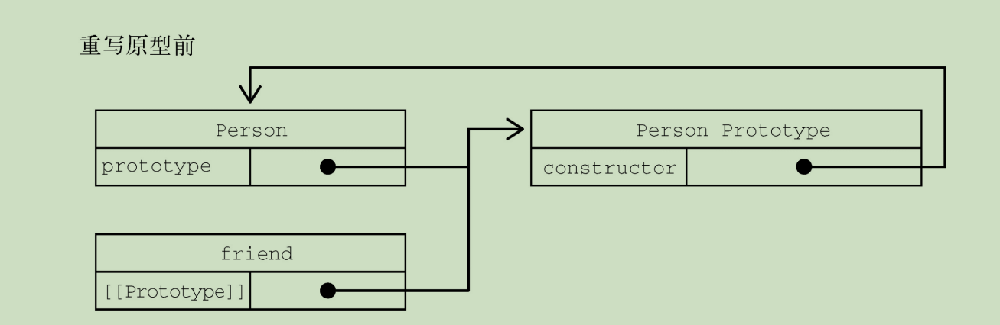
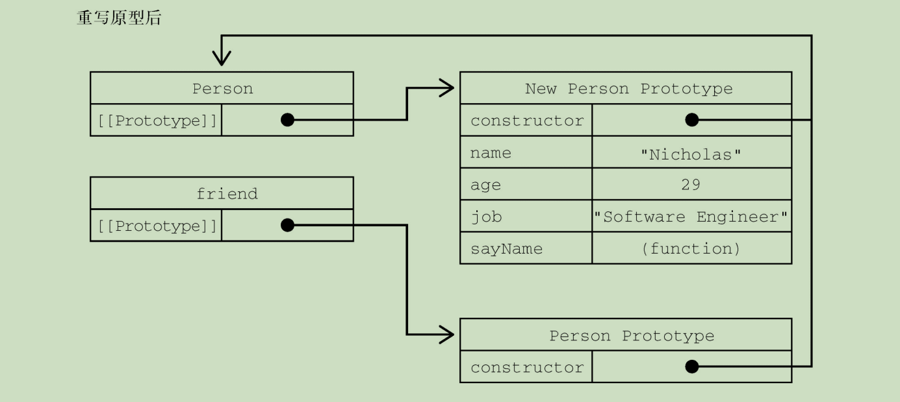

# 第 8 章 对象、类与面向对象编程

## 8.1 理解对象

- 创建自定义对象的通常方式是什么？
  - 创建Object的一个新实例，
  - 然后再给它添加属性和方法

```
let person = new Object(); 
person.name = "Nicholas"; 
person.age = 29; 
person.job = "Software Engineer"; 
person.sayName = function() { 			
	console.log(this.name); 
};
```

- 前面的例子如果使用对象字面量则可以这样写：

```
let person = { 
	name: "Nicholas", 
	age: 29, 
	job: "Software Engineer", 
	sayName() { 
		console.log(this.name); 
	} 
};
```


### 8.1.1 属性的类型

- 属性分哪两种？
  - 数据属性和访问器属性。

#### \01. 数据属性 

- 数据属性有哪4个特性描述它们的行为？

  - [[Configurable]]：表示属性

    - 是否可以通过delete删除并重新定义，

    - 是否可以修改它的特性，

    - 是否可以把它改为访问器属性。

    - 默认情况下是true

  - [[Enumerable]]：表示属性
    - 是否可以通过for-in循环返回。
    
    - 默认情况下是true 
    
  - [[Writable]]：表示属性的值
  
    - 是否可以被修改。
  
    - 默认情况下 是true
  
  - [[Value]]：包含属性实际的值。
    - 读取和写入属性值的位置。
    - 默认值为undefined。
  
- 样将属性显式添加到对象之后，[[Configurable]]、[[Enumerable]]和[[Writable]]、[[Value]]特性会被设置为什么值？

  - [[Configurable]]、[[Enumerable]]和[[Writable]]都会被设置为true
  - [[Value]]特性会被设置为指定的值。

```
let person = { name: "Nicholas" };
```

- [[Value]]特性会被设置为什么？
  - "Nicholas"
- 之后对这个值的任何修改都会保存在哪？
  - [[Value]]特性
- 要修改属性的默认特性，就必须使用什么方法？
  - Object.defineProperty()
- Object.defineProperty()方法接收哪3个参数？
  - 要给其添加属性的对象、
  - 属性的名称 
  - 一个描述符对象
- 描述符对象上的属性可以包含什么？
  - configurable、
  - enumerable、
  - writable
  - value，
  - 跟相关特性的名称一一对应
  - 根据要修改的特性，可以设置其中一个或多个值。 

```
let person = {}; 
Object.defineProperty(person, "name", {
	writable: false,
	value: "Nicholas" 
}); 
console.log(person.name); // "Nicholas" person.name = "Greg"; 
console.log(person.name); // "Nicholas"
```

- name属性的值是否能再修改？
  - 不能
- 在非严格模式下尝试给这个属性重新赋值会执行什么操作？
  - 会被忽略。
- 在严格模式下，尝试修改只读属性的值会执行什么操作？
  - 抛出错误
- 创建不可配置的属性

```
let person = {}; 
Object.defineProperty(person, "name", { 	
	configurable: false,
	value: "Nicholas" 
}); 
console.log(person.name); // "Nicholas" 
delete person.name;
console.log(person.name); // "Nicholas"
```

- 把configurable设置为false，意味着什么？
  - 这个属性不能从对象上删除
  - 非严格模式下对这个属性调用delete没有效果，
  - 严格模式下会抛出错误
- 一个属性被定义为不可配置之后，是否能再变回可配置的？
  - 不能
- 再次调用Object.defineProperty()并修改任何非writable属性会发生什么？
  - 导致错误

```
let person = {}; 
Object.defineProperty(person, "name", {
	configurable: false, 
	value: "Nicholas" 
});
// 抛出错误 
Object.defineProperty(person, "name", { 
	configurable: true, 
	value: "Nicholas"
});
```

- 虽然可以对同一个属性多次调用Object.defineProperty()， 

  但在把configurable设置为false之后就会受限制了

- 在调用Object.defineProperty()时，

  configurable、enumerable和 writable的值如果不指定，则都默认为什么？

  - false

#### \02. 访问器属性

- 访问器属性是否包含数据值？

  - 不包含

- 它们包含什么？

  - 一个获取（getter）函数
  - 一个设置（setter）函数，

- 这两个函数是否必需的？

  - 不是

- 在什么时候会调用获取函数？

  - 读取访问器属性时

- 获取函数的责任就是什么？

  - 返回一个有效的值。

- 在写入访问器属性时，会执行什么操作？

  - 调用设置函数并传入新值，

- 设置函数决定什么？

  - 对数据做出什么修改。

- 访问器属性有哪4个特性描述它们的行为？

  - [[Configurable]]：表示属性
    - 是否可以通过delete删除并重新定义，
    - 是否可以修改它的特性
    - 是否可以把它改为数据属性。
    - 默认情况下是true。 
  - [[Enumerable]]：表示属性
    - 是否可以通过for-in循环返回。
    - 默认情况下，是true。 

  - [[Get]]：获取函数，在读取属性时调用。
    - 默认值为undefined。 

  - [[Set]]：设置函数，在写入属性时调用。
    - 默认值为undefined。 

- 访问器属性是否能直接定义？

  - 不能
  - 必须使用Object.defineProperty()。

```
// 定义一个对象，包含伪私有成员year_和公共成员edition let book = { 
	year_: 2017, 
	edition: 1 
};
Object.defineProperty(book, "year", { 
	get() { 
		return this.year_; 
	},
	set(newValue) { 
		if (newValue > 2017) {
			this.year_ = newValue; 
			this.edition += newValue - 2017; 
		} 
	} 
});
book.year = 2018;
console.log(book.edition); // 2
```

- year_ 中的下划线常用来表示什么？
  - 该属性并不希望在对象方法的外部被访问。
- 另一个属性year被定义为一个什么属性？
  - 访问器属性，
- 其中获取函数会执行什么操作？
  - 简单地返回year_的值，
- 设置函数会执行什么操作？
  - 做一些计算以决定正确的版本（edition）。
- 获取函数和设置函数是否都要定义？
  - 不一定
- 只定义获取函数意味着什么？
  - 属性是只读的，尝试修改属性会被忽略。
  - 在严格模式下，
    - 尝试写入只定义了获取函数的属性会抛出错误。
- 只有一个设置函数的属性是否可以读取？
  - 不能读取的，
    - 非严格模式下读取会返回undefined，
    - 严格模式下会抛出错误。
- 在不支持Object.defineProperty()的浏览器中是否可以修改[[Configurable]]或[[Enumerable]]？
  - 不能 

### 8.1.2 定义多个属性

- 如何在一个对象上同时定义多个属性？
  - 使用Object.defineProperties()方法
- Object.defineProperties()接收哪两个参数？
  - 要为之添加或修改属性的对象
  - 另一个描述符对象，
    - 其属性与要添加或修改的属性一一 对应。

```
let book = {}; 
Object.defineProperties(book, {
	year_: { value: 2017 },
	edition: { value: 1 },
	year: { 
		get() { return this.year_; },
		set(newValue) { 
			if (newValue > 2017) { 
				this.year_ = newValue; 
				this.edition += newValue - 2017; 
			}
		} 
	} 
});
```

- 上述代码中数据属性的configurable、enumerable和writable特性值是什么？
  - false

### 8.1.3 读取属性的特性

- 如何取得指定属性的属性描述符？
  - 使用Object.getOwnPropertyDescriptor()方法
- 这个方法接收哪两个参数？
  - 属性所在的对象
  - 要取得其描述符的属性名
- 返回值是什么？
  - 一个对象
- 对于访问器属性包含什么？
  - configurable、enumerable、get和set属性
- 对于数据属性包含什么？
  - configurable、enumerable、writable和value属性。

```
let book = {}; 
Object.defineProperties(book, {
	year_: { value: 2017 },
	edition: { value: 1 },
	year: { 
		get: function() { return this.year_; },
		set: function(newValue){ 
			if (newValue > 2017) { 
				this.year_ = newValue; 
				this.edition += newValue - 2017; 
			} 
		} 
	} 
}); 
let descriptor = Object.getOwnPropertyDescriptor(book, "year_");
console.log(descriptor.value); // 2017 console.log(descriptor.configurable); // false console.log(typeof descriptor.get); // "undefined" 
let descriptor = Object.getOwnPropertyDescriptor(book, "year"); console.log(descriptor.value); // undefined console.log(descriptor.enumerable); // false console.log(typeof descriptor.get); // "function"
```

- Object.getOwnPropertyDescriptors()静态方法会执行什么操作？
  - 会在每个自有属性上调用Object.getOwnPropertyDescriptor()
  - 并在一个新对象中返回它们。

```
let book = {}; 
Object.defineProperties(book, { 
	year_: { value: 2017 },
	edition: { value: 1 },
	year: { 
		get: function() { 
		return this.year_; 
	},
		set: function(newValue){ 
			if (newValue > 2017) { 
				this.year_ = newValue; 
				this.edition += newValue - 2017;
			} 
		} 
    } 
}); console.log(Object.getOwnPropertyDescriptors(book)); 
// { 
// 	edition: { 
// 		configurable: false, 
// 		enumerable: false,
// 		value: 1, 
// 		writable: false 
// 	}, 
// 	year: { 
// 		configurable: false, 
// 		enumerable: false,
// 		get: f(), 
// 		set: f(newValue), 
// 	},
// 	year_: { 
// 		configurable: false, 
// 		enumerable: false, 
// 		value: 2017, 
// 		writable: false 
// 	}
// }
```

### 8.1.4 合并对象

- 把源对象所有的本地属性一起复制到目标对象上。这种 

  操作也被称为什么？

  - “混入”（mixin）

- Object.assign()方法接收什么参数？

  - 一个目标对象
  - 一个或多个源对象

- Object.assign()执行什么操作？

  - 将每个源对象中可枚举属性和自有属性复制到目标对象

- Object.assign()什么样的属性会被复制？

  - 以字符串和符号为键的

- 对每个符合条件的属性，这个方法会执行什么操作？

  - 使用源对象上的[[Get]]取得属性的值，
  - 然后使用目标对象上的[[Set]]设置属性的值

```
let dest, src, result;
/*** 简单复制 */
dest = {}; 
src = { id: 'src' }; 
result = Object.assign(dest, src); 
// Object.assign修改目标对象 
// 也会返回修改后的目标对象 
console.log(dest === result); // true console.log(dest !== src); // true console.log(result); // { id: src } console.log(dest); // { id: src } 
/*** 多个源对象 */
dest = {}; 
result = Object.assign(dest, { a: 'foo' }, 
{ b: 'bar' }); 
console.log(result); // { a: foo, b: bar }
/*** 获取函数与设置函数 */
dest = { 
	set a(val) { 
		console.log(`Invoked dest setter with param ${val}`); 
	} 
};
src = { 
	get a() { 
		console.log('Invoked src getter'); 
		return 'foo';
    } 
};
Object.assign(dest, src); // 调用src的获取方法
// 调用dest的设置方法并传入参数"foo"
// 因为这里的设置函数不执行赋值操作 
// 所以实际上并没有把值转移过来
console.log(dest); // { set a(val) {...} }
```

- Object.assign()实际上对每个源对象执行的是什么？

  - 浅复制。

- 浅复制意味着什么？

  - 只会复制对象的引用 

- 如果多个源对象都有相同的属性，则使用哪个值？

  - 最后一个复制的值。

- 从源对象访问器属性取得的值，比如获取函数，

  会作为什么值赋给目标对象？

  - 一个静态值

- 能否在两个对象间转移获取函数和设置函数？

  - 不能 

```
let dest, src, result; 
/*** 覆盖属性 */ 
dest = { id: 'dest' };
result = Object.assign(dest, 
	{ 
		id: 'src1',
   		a: 'foo' 
   	}, 
    { 
    	id: 'src2', 
    	b: 'bar' 
    }); 
// Object.assign会覆盖重复的属性 console.log(result); 
// { id: src2, a: foo, b: bar } 
// 可以通过目标对象上的设置函数观察到覆盖的过程： 
dest = { 
	set id(x) { 
		console.log(x); 
	} 
};
Object.assign(dest, 
	{ id: 'first' }, 
	{ id: 'second' }, 
	{ id: 'third' }
); 
// first
// second 
// third 
/*** 对象引用 */ 
dest = {}
src = { a: {} }; 
Object.assign(dest, src); 
// 浅复制意味着只会复制对象的引用 
console.log(dest); // { a :{} } console.log(dest.a === src.a); // true
```

- 如果赋值期间出错，则会发生什么？
  - 操作会中止并退出，
  - 同时抛出错误。
- Object.assign()没有“回滚”之前赋值的概念，因此它是一个尽力而为、可能只会完成什么的方法？
  - 部分复制

```
let dest, src, result; 
/*** 错误处理 */ 
dest = {}; 
src = { 
	a: 'foo', 
	get b() { 
		// Object.assign()在调用这个获取函数时会抛出错误
		throw new Error(); 
	},
	c: 'bar' 
};
try { 
	Object.assign(dest, src); 
} catch(e) {} 
// Object.assign()没办法回滚已经完成的修改 
// 因此在抛出错误之前，目标对象上已经完成的修改会继续存在：
console.log(dest); // { a: foo }
```


### 8.1.5 对象标识及相等判定

- 在ECMAScript 6之前，有些特殊情况即使是===操作符也无能为力： 

```
// 这些是===符合预期的情况 
console.log(true === 1); // false 
console.log({} === {}); // false
console.log("2" === 2); // false 
// 这些情况在不同JavaScript引擎中表现不同，但仍被认为相等 
console.log(+0 === -0); // true 
console.log(+0 === 0); // true 
console.log(-0 === 0); // true 
// 要确定NaN的相等性，必须使用极为讨厌的isNaN() console.log(NaN === NaN); // false console.log(isNaN(NaN)); // true
```

- Object.is()必须接收几个参数？
  - 两个参数

```
console.log(Object.is(true, 1)); // false console.log(Object.is({}, {})); // false console.log(Object.is("2", 2)); // false 
// 正确的0、-0、+0相等/不等判定 console.log(Object.is(+0, -0)); // false console.log(Object.is(+0, 0)); // true console.log(Object.is(-0, 0)); // false 
// 正确的NaN相等判定 
console.log(Object.is(NaN, NaN)); // true
```

- 如何检查超过两个值？
  - 递归地利用相等性传递

```
function recursivelyCheckEqual(x, ...rest) { 	
	return Object.is(x, rest[0]) && 
		(rest.length < 2 || 	
		recursivelyCheckEqual(...rest)); 
}
```


### 8.1.6 增强的对象语法 

#### \01. 属性值简写 

- 属性名和变量名是一样的

```
let name = 'Matt'; 
let person = { name: name };
console.log(person); // { name: 'Matt' }
```

- 简写属性名是什么？
  - 只要使用变量名（不用再写冒号）
    - 就会自动被解释为同名的属性键
- 如果没有找到同名变量，则会发生什么？
  - 抛出ReferenceError。 

```
let name = 'Matt'; 
let person = { name };
console.log(person); // { name: 'Matt' }
```

- 代码压缩程序会在不同作用域间做什么，

  以防止找不到引用？

  - 保留属性名

```
function makePerson(name) { 
	return { name }; 
}
let person = makePerson('Matt'); console.log(person.name); // Matt
```

- 在这里，参数标识符只限定于函数作用域，

  编译器会做什么？

  - 保留初始的name标识符

- 如果使用Google Closure编译器压缩，会执行什么操作？
  - 那么函数参数会被缩短，而属性名不变：

```
function makePerson(a) { 
	return { name: a }; 
}
var person = makePerson("Matt"); console.log(person.name); // Matt
```

#### \02. 可计算属性

- 在引入可计算属性之前，

  如果想使用变量的值作为属性，那么必须做什么？

  - 先声明对象，
  - 然后使用中括号语法来添加属性

- 能否在对象字面量中直接动态命名属性？

  - 不能

```
const nameKey = 'name'; 
const ageKey = 'age'; 
const jobKey = 'job'; 
let person = {}; 
person[nameKey] = 'Matt'; 
person[ageKey] = 27; 
person[jobKey] = 'Software engineer'; console.log(person); 
// { name: 'Matt', age: 27, job: 'Software engineer' }
```

- 中括号包围的对象属性键运行时将其作为什么来求值？
  - JavaScript表达式

```
const nameKey = 'name'; 
const ageKey = 'age'; 
const jobKey = 'job'; 
let person = { 
	[nameKey]: 'Matt', 
	[ageKey]: 27, 
	[jobKey]: 'Software engineer' 
};
console.log(person); 
// { name: 'Matt', age: 27, job: 'Software engineer' }
```

- 可计算属性本身是否可以是复杂的表达式，

  在实例化时再求值？

  - 可以
    - 因为被当作JavaScript表达式求值

```
const nameKey = 'name'; 
const ageKey = 'age'; 
const jobKey = 'job'; 
let uniqueToken = 0; 

function getUniqueKey(key) { 
	return `${key}_${uniqueToken++}`; 
}
let person = { 
	[getUniqueKey(nameKey)]: 'Matt', 	
	[getUniqueKey(ageKey)]: 27, 
	[getUniqueKey(jobKey)]: 'Software engineer' };
	
console.log(person); 
// { name_0: 'Matt', age_1: 27, job_2: 'Software engineer'
```

- 可计算属性表达式中抛出任何错误是否会中断对象创建？
  - 是
- 如果表达式抛出错误，之前完成的计算是否能回滚？
  - 不能

#### \03. 简写方法名

- 在给对象定义方法时，通常都要怎么做？
  - 写一个方法名、冒号，
  - 然后再引用一个匿名函数表达式，

```
let person = { 
	sayName: function(name) { 
		console.log(`My name is ${name}`); 
	} 
};
person.sayName('Matt'); // My name is Matt
```

- 缩短方法声明：

```
let person = { 
	sayName(name) { 
		console.log(`My name is ${name}`); 
	}
};
person.sayName('Matt'); // My name is Matt
```

- 简写方法名对获取函数和设置函数是否适用？
  - 是

```
let person = { 
	name_: '', 
	get name() { 
		return this.name_; 
	},
	set name(name) { 
		this.name_ = name; 
	},
	sayName() { 
		console.log(`My name is ${this.name_}`);
	} 
};
person.name = 'Matt'; 
person.sayName(); // My name is Matt
```

- 简写方法名与可计算属性键是否相互兼容？
  - 是

```
const methodKey = 'sayName'; 
let person = { 
	[methodKey](name) { 
		console.log(`My name is ${name}`); 
	} 
}
person.sayName('Matt'); // My name is Matt
```

 

### 8.1.7 对象解构 

- 对象解构语法，可以做什么？

  - 实现一个或多个赋值操作

- 对象解构是什么？

  - 使用与对象匹配的结构

    来实现对象属性赋值。 

- 是不使用对象解构的：

```
// 不使用对象解构 
let person = { 
	name: 'Matt', 
	age: 27 
};
let personName = person.name, 
personAge = person.age; 
console.log(personName); // Matt console.log(personAge); // 27
```

- 使用对象解构的：

```
// 使用对象解构 
let person = { 
	name: 'Matt', 
	age: 27 
};
let { 
	name: personName, 
	age: personAge 
} = person; 
console.log(personName); // Matt
console.log(personAge); // 27
```

- 使用解构，可以在一个类似对象字面量的结构中，做什么？
  - 声明多个变量，
  - 同时执行多个赋值操作。
- 如果想让变量直接使用属性的名称，那么应该怎么做？
  - 使用简写语法

```
let person = { 
	name: 'Matt', 
	age: 27 
};
let { name, age } = person; 
console.log(name); // Matt 
console.log(age); // 27
```

- 解构赋值是否一定与对象的属性匹配？
  - 不一定
- 赋值的时候是否可以忽略某些属性？
  - 可以
- 如果引用的属性不存在，则该变量的值就是？
  - undefined

```
let person = { 
	name: 'Matt', 
	age: 27 
};
let { name, job } = person; 
console.log(name); // Matt 
console.log(job); // undefined
```

- 是否可以在解构赋值的同时定义默认值？
  - 可以
  - 这适用于引用的属性不存在于源对象中的情况

```
let person = { 
	name: 'Matt', 
	age: 27 
};
let { 
	name, 
	job='Software engineer' 
} = person; 
console.log(name); // Matt 
console.log(job); // Software engineer
```

- 解构在内部执行什么操作？
  - 使用函数ToObject()（不能在运行时环境中直接访问）
  - 把源数据结构转换为对象。
- 在对象解构的上下文中，原始值会被当成什么？
  - 对象。
- null和undefined是否能被解构？
  - 不能
    - 否则会抛出错误

```
let { length } = 'foobar';
console.log(length); // 6 
let { constructor: c } = 4; 
console.log(c === Number); // true 
let { _ } = null; // TypeError 
let { _ } = undefined; // TypeError
```

- 解构是否要求变量必须在解构表达式中声明？
  - 不要求
- 如果是给事先声明的变量赋值，则赋值表达式必须做什么？
  - 包含在一对括号中

```
let personName, personAge; 
let person = { name: 'Matt', age: 27 };
({name: personName, age: personAge} = person); console.log(personName, personAge); // Matt, 27
```

#### \01. 嵌套解构

- 解构对于引用嵌套的属性或赋值目标是否有限制？
  - 没有
- 如何复制对象属性？
  - 通过解构

```
let person = { 
	name: 'Matt', 
	age: 27, 
	job: { title: 'Software engineer' } 
};
let personCopy = {}; 
({
	name: personCopy.name, 
	age: personCopy.age, 
	job: personCopy.job 
} = person); 
// 因为一个对象的引用被赋值给personCopy，所以修改 
// person.job对象的属性也会影响personCopy 
person.job.title = 'Hacker';
console.log(person); 
// { 
//		name: 'Matt', 
//		age: 27, 
//		job: { title: 'Hacker' } 
// } 
console.log(personCopy); 
// { 
//		name: 'Matt', 
//		age: 27, 
//		job: { title: 'Hacker' } 
// } 
```

- 解构赋值如何实现匹配嵌套的属性？
  - 使用嵌套结构

```
let person = { 
	name: 'Matt', 
	age: 27, 
	job: { title: 'Software engineer' } 
};
// 声明title变量并将person.job.title的值赋给它 
let { job: { title } } = person; console.log(title); // Software engineer
```

- 在什么情况下不能使用嵌套解构？
  - 在外层属性没有定义的情况下
    - 无论源对象还是目标对象都一样

```
let person = { 
	job: {
    	title: 'Software engineer' 
    } 
};
let personCopy = {}; // foo在源对象上是undefined 
({
	foo: { 
		bar: personCopy.bar 
	} 
} = person); 
// TypeError: Cannot destructure property 'bar' of 'undefined' or 'null'. 
// job在目标对象上是undefined 
({
	job: { 
		title: personCopy.job.title 
	} 
} = person); 
// TypeError: Cannot set property 'title' of undefined
```

#### \02. 部分解构 

- 需要注意的是，涉及多个属性的解构赋值是一个什么操作？

  - 输出无关的顺序化操作

- 如果一个解构表达式涉及多个赋值，开始的赋值成功而后面 

  的赋值出错，则整个解构赋值会发生什么？

  - 只会完成一部分

```
let person = { 
	name: 'Matt',
	age: 27 
};
let personName, personBar, personAge; 
try { 
// person.foo是undefined，因此会抛出错误 
({
	name: personName, 
	foo: { bar: personBar }, 
	age: personAge} = person); 
} catch(e) {}
console.log(personName, personBar, personAge);
// Matt, undefined, undefined
```

#### \03. 参数上下文匹配

- 在函数参数列表中是否可以进行解构赋值？
  - 可以
- 对参数的解构赋值是否会影响arguments对象？
  - 不会
- 可以在什么中声明在函数体内使用局部变量？
  - 函数签名

```
let person = { 
	name: 'Matt', 
	age: 27 
};
function printPerson(foo, {name, age}, bar) {
	console.log(arguments); 
	console.log(name, age); 
}
function printPerson2(foo, {name: personName, age: personAge}, bar) {
	console.log(arguments); 
	console.log(personName, personAge); 
}
printPerson('1st', person, '2nd'); 
// ['1st', { name: 'Matt', age: 27 }, '2nd']
// 'Matt', 27 
printPerson2('1st', person, '2nd'); 
// ['1st', { name: 'Matt', age: 27 }, '2nd']
// 'Matt', 27
```

## **8.2** 创建对象

- 虽然使用Object构造函数或对象字面量可以方便地创建对象，但这些方式有什么明显不足？

  - 创建具有同样接口的多个对象

    需要重复编写很多代码

### 8.2.1 概述 

### 8.2.2 工厂模式 

- 工厂模式用于什么？
  - 抽象创建特定对象的过程

```
function createPerson(name, age, job) { 
	let o = new Object(); 
	o.name = name;
    o.age = age; 
    o.job = job; 
    o.sayName = function() { 		
    	console.log(this.name); 
    };
    return o;
}
let person1 = createPerson("Nicholas", 29, "Software Engineer"); 
let person2 = createPerson("Greg", 27, "Doctor");
```

- 工厂模式没有解决什么问题？

  - 对象标识问题

    （即新创建的对象是什么类型）。 

### 8.2.3 构造函数模式 

- ECMAScript中的构造函数是用于什么？
  - 创建特定类型对象
- 如何自定义构造函数？
  - 以函数的形式为自己的对象类型定义属性和方法

```
function Person(name, age, job){ 
	this.name = name; 
	this.age = age; 
	this.job = job; 
	this.sayName = function() { 
		console.log(this.name); 
	}; 
}let person1 = new Person("Nicholas", 29, "Software Engineer"); 
let person2 = new Person("Greg", 27, "Doctor"); person1.sayName(); // Nicholas 
person2.sayName(); // Greg
```

- 构造函数模式和工程模式的区别？

  - 没有显式地创建对象。 

  - 属性和方法直接赋值给了this。 

  - 没有return。 

- 按照惯例，构造函数名称有什么规定？

  - 首字母都是要大写的，
    - 非构造函数则以小写字母开头。

- 要创建Person的实例，应使用什么操作符？

  - new操作符。

- 以这种方式调用构造函数会执行哪些操作？

  - (1) 在内存中创建一个新对象。 

  - (2) 这个新对象内部的[[Prototype]]特性

    被赋值为构造函数的prototype属性。 

  - (3) 构造函数内部的this

    被赋值为这个新对象（即this指向新对象）。 

  - (4) 执行构造函数内部的代码（给新对象添加属性）。 

  - (5) 如果构造函数返回非空对象，
    - 则返回该对象；
    - 否则，返回刚创建的新对象

- person1和person2分别保存着Person的不同实例。 

  这两个对象都有一个什么属性指向Person？

  - constructor属性

- constructor本来是用于什么？

  - 标识对象类型的

- 一般认为什么操作符是确定对象类型更可靠的方式？

  - instanceOf操作符

- 前面例子中的每个对象都是谁的实例？

  - Object的实例，
  - 同时也是Person的实例

```
console.log(person1 instanceof Object); // true console.log(person1 instanceof Person); // true console.log(person2 instanceof Object); // true console.log(person2 instanceof Person); // true
```

- 定义自定义构造函数可以确保什么？
  - 实例被标识为特定类型，
- person1和person2为什么被认为是Object的实例？
  - 因为所有自定义对象都继承自Object
- 构造函数是否一定要写成函数声明的形式？还有哪些形式?
  - 不一定
  - 赋值给变量的函数表达式也可以表示构造函数

```
let Person = function(name, age, job) {
	this.name = name; 
	this.age = age; 
	this.job = job;
    this.sayName = function() { 	
    	console.log(this.name); 
    }; 
}
let person1 = new Person("Nicholas", 29, "Software Engineer"); 
let person2 = new Person("Greg", 27, "Doctor"); person1.sayName(); // Nicholas 
person2.sayName(); // Greg 
console.log(person1 instanceof Object); // true console.log(person1 instanceof Person); // true console.log(person2 instanceof Object); // true console.log(person2 instanceof Person); // true
```

- 在实例化时，如果不想传参数，那么可以怎么做？
  - 构造函数后面的括号可加可不加。 

- 只要有什么操作符，就可以调用相应的构造函数？
  - new操作符

```
function Person() {
	this.name = "Jake"; 
	this.sayName = function() { 
		console.log(this.name); 
	}; 
}
let person1 = new Person(); 
let person2 = new Person; 
person1.sayName(); // Jake 
person2.sayName(); // Jake 
console.log(person1 instanceof Object); // true console.log(person1 instanceof Person); // true console.log(person2 instanceof Object); // true console.log(person2 instanceof Person); // true
```

#### \01. 构造函数也是函数 

- 构造函数与普通函数唯一的区别就是什么？
  - 调用方式不同
- 构造函数是否是函数？
  - 是
- 任何函数只要怎么调用就是构造函数？
  - 使用new操作符调用
- 不使用new操作符调用的函数就是什么函数？
  - 普通函数

```
// 作为构造函数 
let person = new Person("Nicholas", 29, "Software Engineer"); 
person.sayName(); // "Nicholas" 
// 作为函数调用 
Person("Greg", 27, "Doctor"); // 添加到window对象 window.sayName(); // "Greg"
// 在另一个对象的作用域中调用 
let o = new Object(); 
Person.call(o, "Kristen", 25, "Nurse"); o.sayName(); // "Kristen"
```

- 没有使用new操作符调用Person()，结果会发生什么？

  - 会将属性和方法添加到window对象。

- 为什么window对象上有了一个sayName()方法？

  -  因为在调用一个函数而没有明确设置this值的情况下 

    （即没有作为对象的方法调用，

    或者没有使用call()/apply()调用），

    - this始终指向Global对象

    - （在浏览器中就是window对象）。

- 最后展示的调用方式是通过call() （或apply()）调用函数，同时执行什么操作？
  - 将特定对象指定为作用域。
- 为什么所有属性和sayName()方法都会添加到对象o上面。
  - 因为这里的调用将o对象指定为Person()内部的this值

#### \02. 构造函数的问题 

- 构造函数的主要问题在于什么？

  - 其定义的方法会在每个实例上都创建一遍。

- person1和person2都有名为sayName()的方法，

  但这两个方法是否同一个Function实例？

  - 不是

- ECMAScript中的函数是什么类型？
  - 对象类型
- 每次定义函数时，都会做什么？
  - 初始化一个对象。

```
function Person(name, age, job){ 
	this.name = name; 
	this.age = age; 
	this.job = job;
	this.sayName = new Function("console.log(this.name)");// 逻辑等价 
}
```

- 为什么不同实例上的函数虽然同名却不相等
  - 函数会带来不同的作用域链和标识符解析。

```
console.log(person1.sayName == person2.sayName); // false
```

- 为什么没必要定义两个不同的Function实例？
  - 因为都是做一样的事

- this对象可以把函数与对象的绑定推迟到什么时候？
  - 运行时

- 如何解决两个不同的Function实例的问题？
  - 可以把函数定义转移到构造函数外部

```
function Person(name, age, job){ 
	this.name = name; 
	this.age = age;
    this.job = job; 
    this.sayName = sayName; 
}
function sayName() { 
	console.log(this.name); 
}
let person1 = new Person("Nicholas", 29, "Software Engineer"); 
let person2 = new Person("Greg", 27, "Doctor"); person1.sayName(); // Nicholas person2.sayName(); // Greg
```

- 如果这个对象需要多个方法，

  那么就要在全局作用域中定义多个函数。

  这会导致什么？

  - 自定义类型引用的代码不能很好地聚集一起。

- 这个新问题可以通过什么模式来解决？
  - 原型模式

### 8.2.4 原型模式 

- 每个函数都会创建一个什么属性？

  - prototype

- prototype属性是一个什么？

  - 对象

- prototype包含什么？

  - 应该由特定引用类型的实例共享的属性和方法。

- prototype对象就是什么？

  - 通过调用构造函数

    创建的对象的原型。

- 使用原型对象的好处是什么？

  - 在它上面定义的属性和方法

    可以被对象实例共享。

- 原来在构造函数中

  直接赋给对象实例的值，

  可以直接赋值给谁？

  - 它们的原型，

```
function Person() {} 
Person.prototype.name = "Nicholas"; Person.prototype.age = 29; 
Person.prototype.job = "Software Engineer"; Person.prototype.sayName = function() {
console.log(this.name);
};
let person1 = new Person(); 
person1.sayName(); // "Nicholas" 
let person2 = new Person(); 
person2.sayName(); // "Nicholas" console.log(person1.sayName == person2.sayName); // true
```

- 使用函数表达式也可以： 

```
let Person = function() {}; 
Person.prototype.name = "Nicholas"; Person.prototype.age = 29; 
Person.prototype.job = "Software Engineer"; Person.prototype.sayName = function() { console.log(this.name); };
let person1 = new Person(); 
person1.sayName(); // "Nicholas" 
let person2 = new Person();
person2.sayName(); // "Nicholas" console.log(person1.sayName == person2.sayName); // true
```

#### \01. 理解原型 

- 只要创建一个函数，就会按照特定的规则为这个函数创 

  建一个什么属性？

  - prototype属性（指向原型对象）。

- 默认情况下，所有原型对象自动获得一个名为什么的属性？

  - constructor
    - 指回与之关联的构造函数。

- 在自定义构造函数时，原型对象默认只会获得什么属性？

  - constructor

- 原型对象其他的所有方法都继承自谁？

  - Object

- 每次调用构造函数创建一个新实例，

  这个实例的内部什么指针就会被赋值为

  构造函数的原型对象？

  - [[Prototype]]指针。

- 脚本中是否有访问这个[[Prototype]]特性的标准方式？

  - 没有

- 通过什么属性可以访问对象的原型？
  - \__proto__属性，
- 实例与构造函数原型之间是否有直接的联系？
  - 有
- 实例与构造函数之间是否有直接的联系？
  - 没有

```
/*** 构造函数可以是函数表达式 
* 也可以是函数声明，因此以下两种形式都可以：
* function Person() {} 
* let Person = function() {}
*/ 
function Person() {} 
/**
* 声明之后，构造函数就有了一个
* 与之关联的原型对象： 
*/ 
console.log(typeof Person.prototype); console.log(Person.prototype); 
// {
// 		constructor: f Person(),
// 		__proto__: Object 
// } 
/**
* 如前所述，构造函数有一个prototype属性 
* 引用其原型对象，而这个原型对象也有一个 
* constructor属性，引用这个构造函数
* 换句话说，两者循环引用： 
*/ 
console.log(Person.prototype.constructor === Person); // true
/**
* 正常的原型链都会终止于Object的原型对象 
* Object原型的原型是null */ console.log(Person.prototype.__proto__ === Object.prototype); // true console.log(Person.prototype.__proto__.constructor === Object); // true console.log(Person.prototype.__proto__.__proto__ === null); // true console.log(Person.prototype.__proto__); 
// {
// 		constructor: f Object(),
// 		toString: ... 
// 		hasOwnProperty: ...
// 		isPrototypeOf: ... 
// 		... 
// } 
let person1 = new Person(), 
person2 = new Person(); 
/**
* 构造函数、原型对象和实例 
* 是3个完全不同的对象： 
*/ 
console.log(person1 !== Person); // true console.log(person1 !== Person.prototype); // true console.log(Person.prototype !== Person); // true 
/**
* 实例通过__proto__链接到原型对象， 
* 它实际上指向隐藏特性[[Prototype]] 
*
* 构造函数通过prototype属性链接到原型对象 
*
* 实例与构造函数没有直接联系，与原型对象有直接联系
*/ 
console.log(person1.__proto__ === Person.prototype); // true conosle.log(person1.__proto__.constructor === Person); // true 
/**
* 同一个构造函数创建的两个实例 
* 共享同一个原型对象： 
*/ 
console.log(person1.__proto__ === person2.__proto__); // true 
/**
* instanceof检查实例的原型链中 
* 是否包含指定构造函数的原型： 
*/
console.log(person1 instanceof Person); // true console.log(person1 instanceof Object); // true console.log(Person.prototype instanceof Object); // true
```


- 为什么这两个实例都没有属性和方法，

  但person1.sayName()可以正常调用。

  - 这是由于对象属性查找机制的原因

- 可以使用什么方法确定两个对象之间的原型关系？

  - isPrototypeOf()

- isPrototypeOf()会在什么情况下返回true？

  - 传入参数的[[Prototype]]指向调用它的对象时

```
console.log(Person.prototype.isPrototypeOf(person1)); // true console.log(Person.prototype.isPrototypeOf(person2)); // true
```

- Object.getPrototypeOf()返回什么？
  - 返回参数的内部特性[[Prototype]]的值

```
console.log(Object.getPrototypeOf(person1) == Person.prototype); // true console.log(Object.getPrototypeOf(person1).name); // "Nicholas"
```

- 使用Object.getPrototypeOf()可以方便地取得什么？
  - 一个对象的原型，
- setPrototypeOf()方法，可以做什么？
  - 向实例的私有特性[[Prototype]]写入一个新值。
    - 可以重写一个对象的原型继承关系

```
let biped = {
	numLegs: 2 
};
let person = { 
	name: 'Matt' 
};
Object.setPrototypeOf(person, biped); console.log(person.name); // Matt console.log(person.numLegs); // 2 console.log(Object.getPrototypeOf(person) === biped); // true
```

-  Object.setPrototypeOf()可能会有什么问题？
  - 严重影响代码性能。 

- 为避免使用Object.setPrototypeOf()可能造成的性能下降，可以做什么？
  - 通过Object.create()来创建一个新对象，
  - 同时为其指定原型：

```
let biped = { numLegs: 2 };
let person = Object.create(biped); 
person.name = 'Matt'; 
console.log(person.name); // Matt console.log(person.numLegs); // 2 console.log(Object.getPrototypeOf(person) === biped); // true
```

#### \02. 原型层级

- 在通过对象访问属性时，会按照这个属性的名称开始搜索。搜索开始于对象实例本身。
- 如果在这个实例上发现了给定的名称，
  - 则返回该名称对应的值。

- 如果没有找到这个属性，
  - 则搜索会沿着指针进入原型对象，
    - 然后在原型对象上找到属性后，再返回对应的值。
- 前面提到的constructor属性只存在于哪里？
  - 原型对象，
  - 因此通过实例对象也是可以访问到的。 
- 虽然可以通过实例读取原型对象上的值，
  - 但不可能通过实例重写这些值。
- 如果在实例上添加了一个与原型对象中同名的属性，
  - 那就会在实例上创建这个属性，
    - 这个属性会遮住原型对象上的属性。

```
function Person() {} 
Person.prototype.name = "Nicholas"; 
Person.prototype.age = 29; 
Person.prototype.job = "Software Engineer"; 
Person.prototype.sayName = function() { 
	console.log(this.name);
};
let person1 = new Person();
let person2 = new Person();
person1.name = "Greg"; 
console.log(person1.name); // "Greg"，来自实例 console.log(person2.name); // "Nicholas"，来自原型
```

- 只要给对象实例添加一个属性，
  - 这个属性就会遮蔽（shadow）原型 

- 对象上的同名属性，会屏蔽对它的访问。
- 即使在实例上把这个属性设置为null，
  - 也不会恢复它和原型的联系。
- 不过，使用delete操作符可以完全删除实例上的这个属性， 
  - 从而让标识符解析过程能够继续搜索原型对象。 

```
function Person() {} 
Person.prototype.name = "Nicholas"; Person.prototype.age = 29; 
Person.prototype.job = "Software Engineer"; Person.prototype.sayName = function() { 		
	console.log(this.name); 
};
let person1 = new Person();
let person2 = new Person(); 
person1.name = "Greg"; 
console.log(person1.name); // "Greg"，来自实例 console.log(person2.name); // "Nicholas"，来自原型 delete person1.name; 
console.log(person1.name); // "Nicholas"，来自原型
```

- hasOwnProperty()方法用于

  - 确定某个属性是在实例上

    还是在原型对象上。

- 这个方法是继承自Object的，

  - 会在属性存在于调用它的对象实例上时返回true

```
function Person() {} 
Person.prototype.name = "Nicholas"; Person.prototype.age = 29; 
Person.prototype.job = "Software Engineer"; Person.prototype.sayName = function() { 		
	console.log(this.name);
};
let person1 = new Person();
let person2 = new Person(); console.log(person1.hasOwnProperty("name")); 
// false

person1.name = "Greg"; 
console.log(person1.name); // "Greg"，来自实例 console.log(person1.hasOwnProperty("name")); // true 
console.log(person2.name); // "Nicholas"，来自原型 console.log(person2.hasOwnProperty("name")); // false 

delete person1.name; 
console.log(person1.name); // "Nicholas"，来自原型 console.log(person1.hasOwnProperty("name")); // false
```

- 注意 ECMAScript的

  Object.getOwnPropertyDescriptor()方法 

  - 只对实例属性有效。

- 要取得原型属性的描述符，

  - 在原型对象上调用Object.getOwnPropertyDescriptor()。 


#### \03. 原型和**in**操作符

- 有两种方式使用in操作符：

  - 单独使用
  - 在for-in循环中使用。

- 在单独使用时，

  - in操作符会在

    可以通过对象访问指定属性时

    返回true， 

  - 无论该属性是在实例上还是在原型上。

```
function Person() {} 
Person.prototype.name = "Nicholas"; Person.prototype.age = 29;
Person.prototype.job = "Software Engineer"; Person.prototype.sayName = function() { console.log(this.name); 
};
let person1 = new Person(); 
let person2 = new Person(); console.log(person1.hasOwnProperty("name"));
// false 
console.log("name" in person1); // true 
person1.name = "Greg"; 
console.log(person1.name); // "Greg"，来自实例 console.log(person1.hasOwnProperty("name")); // true 
console.log("name" in person1); // true console.log(person2.name); // "Nicholas"，来自原型 console.log(person2.hasOwnProperty("name")); // false 
console.log("name" in person2); // true 
delete person1.name;
console.log(person1.name); // "Nicholas"，来自原型 console.log(person1.hasOwnProperty("name")); // false 
console.log("name" in person1); // true
```

- 如果要确定某个属性是否存在于原型上

  - 同时使用hasOwnProperty()

    和 in操作符：

```
function hasPrototypeProperty(object, name){
	return !object.hasOwnProperty(name)
    && (name in object);
}
```

- 只要通过对象可以访问，

  - in操作符就返回true， 

- hasOwnProperty()只有属性存在于实例上时
  - 才返回true。

-  只要in操作符返回true

  且hasOwnProperty()返回false，

  - 就说明该属性是一个原型属性。

```
function Person() {} 
Person.prototype.name = "Nicholas"; Person.prototype.age = 29; 
Person.prototype.job = "Software Engineer"; Person.prototype.sayName = function() { 
	console.log(this.name); 
};
let person = new Person(); console.log(hasPrototypeProperty(person, "name")); // true 
person.name = "Greg"; console.log(hasPrototypeProperty(person, "name")); // false
```

- 在for-in循环中使用in操作符时，

  - 可以通过对象访问

  - 且可以被枚举的属性都会返回，

    包括实例属性和原型属性。

- 遮蔽原型中不可枚举

   （[[Enumerable]]特性被设置为false）

  属性的实例属性

  也会在for- in循环中返回，

  - 因为默认情况下

    开发者定义的属性

    都是可枚举的。

- 要获得对象上所有可枚举的实例属性，
  - 可以使用Object.keys()方法。
- Object.keys()方法
  - 接收一个对象作为参数，
  - 返回包含该对象所有可枚举属性名称的字符串数组。

```
function Person() {} 
Person.prototype.name = "Nicholas"; Person.prototype.age = 29; 
Person.prototype.job = "Software Engineer"; Person.prototype.sayName = function() { 
	console.log(this.name); 
}
let keys = Object.keys(Person.prototype); console.log(keys); // "name,age,job,sayName" 
let p1 = new Person(); 
p1.name = "Rob";
p1.age = 31; 
let p1keys = Object.keys(p1); 
console.log(p1keys); // "[name,age]
```

- keys变量保存的数组中

  包含"name"、"age"、"job"、"sayName"

  - 这是正常情况下通过for-in 返回的顺序。

- 而在Person的实例上调用时，

  - Object.keys()返回的数组中

    只包含"name"和"age"两个属性。

- 如果想列出所有实例属性，无论是否可以枚举，

  - 都可以使用Object.getOwnPropertyNames()：

```
let keys = Object.getOwnPropertyNames(Person.prototype); console.log(keys); 
// "[constructor,name,age,job,sayName]"
```

- 注意，返回的结果中包含了一个不可枚举的属性constructor。

- Object.keys()和Object.getOwnPropertyNames()

  在适当的时候都可用来代替for-in循环。 

- Object.getOwnPropertySymbols()方法 

  与Object.getOwnPropertyNames()类似，

  只是针对符号而已： 

```
let k1 = Symbol('k1'), 
k2 = Symbol('k2'); 
let o = { 
	[k1]: 'k1', 
	[k2]: 'k2' 
};
console.log(Object.getOwnPropertySymbols(o)); 
// [Symbol(k1), Symbol(k2)]
```

#### \04. 属性枚举顺序

- for-in循环、

  Object.keys()、

  Object.getOwnPropertyNames()、Object.getOwnPropertySymbols() 

  Object.assign()

  在属性枚举顺序方面有很大区别。

- for-in和Object.keys()的枚举顺序是不确定的，

  - 取决于JavaScript引擎， 
  - 可能因浏览器而异。

- Object.getOwnPropertyNames()、Object.getOwnPropertySymbols() 

  Object.assign()

  的枚举顺序是确定性的。

  - 先以升序枚举数值键， 
  - 然后以插入顺序枚举字符串和符号键。
  - 在对象字面量中定义的键以它们逗号分隔的顺序插入。

```
let k1 = Symbol('k1'), 
k2 = Symbol('k2'); 
let o = { 
	1: 1, 
	first: 'first', 
	[k1]: 'sym2', 
	second: 'second', 
	0: 0 
};
o[k2] = 'sym2'; 
o[3] = 3; 
o.third = 'third'; 
o[2] = 2; console.log(Object.getOwnPropertyNames(o)); 
// ["0", "1", "2", "3", "first", "second", "third"] console.log(Object.getOwnPropertySymbols(o)); 
// [Symbol(k1), Symbol(k2)]
```

 

### 8.2.5 对象迭代

- 这两个静态方法Object.values() 和Object.entries()
  - 接收一个对象，
  - 返回它们内容的数组。
- Object.values()返回对象值的数组，
- Object.entries()返回键/值对 的数组。

```
const o = { 
	foo: 'bar', 
	baz: 1,
	qux: {}
};
console.log(Object.values(o)); 
// ["bar", 1, {}]
console.log(Object.entries((o))); 
// [["foo", "bar"], ["baz", 1], ["qux", {}]]
```

- 注意，非字符串属性会被转换为字符串输出。
- 这两个方法执行对象的浅复制：

```
const o = { qux: {} };
console.log(Object.values(o)[0] === o.qux); // true console.log(Object.entries(o)[0][1] === o.qux); // true
```

- 符号属性会被忽略： 

```
const sym = Symbol(); 
const o = { 
	[sym]: 'foo' 
};
console.log(Object.values(o)); // [] console.log(Object.entries((o))); // []
```

#### \01. 其他原型语法

- 每次定义一个属性或方法，

  都会把Person.prototype重写一遍。

- 为了减少代码冗余，

  也为了从视觉上更好地封装原型功能，

  - 直接通过一个包含所有属性和方法的对象字面量

    来重写原型

    成为了一种常见的做法，

```
function Person() {} 
Person.prototype = { 
	name: "Nicholas", 
	age: 29, 
	job: "Software Engineer", 
	sayName() { 
		console.log(this.name);
	} 
};
```

- 在这个例子中，Person.prototype被设置为等于

  一个通过对象字面量创建的新对象。

- 只有一个问题：

  - Person.prototype的constructor属性

    就不指向Person了。

- 在创建函数时，

  - 会创建它的prototype对象

  - 给这个原型的constructor属性赋值

- 重写了默认的prototype对象，

  - 因此其constructor属性也指向了

    完全不同的新对象（Object构造函数）

    不再指向原来的构造函数。

- 虽然instanceof操作符还能可靠地返回值，
  - 不能靠constructor属性来识别类型了

```
let friend = new Person(); 
console.log(friend instanceof Object); // true console.log(friend instanceof Person); // true console.log(friend.constructor == Person); // false console.log(friend.constructor == Object); // true
```

- instanceof仍然对Object和Person都返回true。 

- constructor属性现在等于Object而不是Person了。
- 如果constructor的值很重要，
  - 则在重写原型对象时专门设置一下它的值：

```
function Person() { }
Person.prototype = {
	constructor: Person, 
	name: "Nicholas", 
	age: 29, 
	job: "Software Engineer", 
	sayName() { 
		console.log(this.name); 
	}
};
```

- 以这种方式恢复constructor属性

  会创建一个[[Enumerable]]为true的属性。

  - 而原生constructor属性默认是不可枚举的。

- 因此，

  如果你使用的是兼容ECMAScript的JavaScript引擎，

  - 那改为使用Object.defineProperty()方法

    来定义constructor属性： 

```
function Person() {}
Person.prototype = {
	name: "Nicholas", 
	age: 29, 
	job: "Software Engineer", 
	sayName() { 
		console.log(this.name); 
	} 
};
// 恢复constructor属性 
Object.defineProperty(Person.prototype,
"constructor", { 
	enumerable: false, 
	value: Person 
});
```

#### \02. 原型的动态性

- 因为从原型上搜索值的过程是动态的，

  - 所以即使实例在修改原型之前已经存在，

    任何时候对原型对象所做的修改

    也会在实例上反映出来。

```
let friend = new Person(); 
Person.prototype.sayHi = function() {
	console.log("hi"); 
};
friend.sayHi(); // "hi"，没问题！
```

- 之所以会这样

  实例与原型之间松散的联系。

- 在调用friend.sayHi()时，

  - 首先会从这个实例中搜索名为sayHi的属性。 

  - 在没有找到的情况下，会继续搜索原型对象。

  - 因为实例和原型之间的链接是指针
    - 所以会在原型上找到sayHi属性 

- 但这跟重写整个原型是两回事。

  - 实例的[[Prototype]]指针是

    在调用构造函数时

    自动赋值的，

  - 这个指针

    即使把原型修改为不同的对象

    也不会变。

- 重写整个原型会切断

  最初原型与构造函数的联系，

  - 但实例引用的仍然是最初的原型。

- 实例只有指向原型的指针，

  没有指向构造函数的指针。

```
function Person() {} 
let friend = new Person(); 
Person.prototype = { 
	constructor: Person, 
	name: "Nicholas", 
	age: 29, 
	job: "Software Engineer", 
	sayName() { console.log(this.name); }
};
friend.sayName(); // 错误
```

- Person的新实例是

  在重写原型对象之前

  创建的。

- 在调用friend.sayName()的时候，会导致错误。
  - 这是因为firend指向的原型还是最初的原型，
  - 而这个原型上并没有sayName属性。





- 重写构造函数上的原型之后

  再创建的实例才会引用新的原型。

  - 而在此之前创建的实例

    仍然会引用最初的原型。

#### \03. 原生对象原型

- 所有原生引用类型的构造函数 

  （包括Object、Array、String等）

  都在原型上定义了实例方法。

  - 数组实例的sort()方法
    - Array.prototype上定义的，
  - 字符串包装对象的substring()方法
    - String.prototype上定义的 

```
console.log(typeof Array.prototype.sort); // "function"
console.log(typeof String.prototype.substring); // "function"
```

- 通过原生对象的原型

  - 可以取得所有默认方法的引用，

  - 也可以给原生类型的实例定义新的方法。

- 可以修改原生对象原型，

  - 因此可以添加方法。

- 给String原始值包装类型的实例添加了一个startsWith()方法： 

```
String.prototype.startsWith = function (text) { 	
	return this.indexOf(text) === 0;
};
let msg = "Hello world!"; console.log(msg.startsWith("Hello")); // true
```

- 在读取msg的属性时，

  - 后台会自动创建String的包装实例， 

    从而找到并调用startsWith()方法。 

- 不推荐在产品环境中修改原生对象原型。

  - 可能造成误会，

  - 可能引发命名冲突

    （比如一个名称在某个浏览器实现中不存在，

    在另一个实现中却存在）。

  - 可能意外重写原生的方法。

- 推荐的做法是

  - 创建一个自定义的类，

    继承原生类型

#### \04. 原型的问题

- 原型模式弱化了向构造函数传递初始化参数的能力，
  - 导致所有实例默认都取得相同的属性值。
- 原型的最主要问题源自它的共享特性。 

- 原型上的所有属性是

  在实例间共享的，

  - 这对函数来说比较合适。

- 可以通过在实例上添加同名属性

  - 来遮蔽原型上的属性。

- 真正的问题来自

  - 包含引用值的属性

```
function Person() {} 
Person.prototype = {
	constructor: Person, 
	name: "Nicholas", 
	age: 29, 
	job: "Software Engineer", 
	friends: ["Shelby", "Court"], 
	sayName() { console.log(this.name); } 
};
let person1 = new Person(); 
let person2 = new Person(); person1.friends.push("Van"); console.log(person1.friends); // "Shelby,Court,Van" console.log(person2.friends); // "Shelby,Court,Van" console.log(person1.friends === person2.friends); // true
```

- 由于这个friends属性

  存在于Person.prototype

  而非person1上

  - 新加的这个字符串也会在（指向同一个数组的）

    person2.friends上反映出来。

- 不同的实例应该有属于自己的属性副本。
  - 这就是实际开发中不单独使用原型模式的原因

## 8.3 继承

- 继承是ECMAScript唯一支持的继承方式，
  - 通过原型链实现 

### **8.3.1** 原型链

- 原型链基本思想是

  - 通过原型

    继承多个引用类型的属性和方法。

- 构造函数、原型和实例的关系：

  - 构造函数有一个原型，
  - 原型有一个属性指回构造函数，
  - 实例有一个内部指针指向原型。

- 如果原型是另一个类型的实例呢？

  - 这个原型本身有一个内部指针指向另一个原型，
  - 另一个原型也有一个指针指向另一个构造函数。

- 在实例和原型之间构造了一条原型链。

- 实现原型链涉及如下代码模式：

```
function SuperType() { 
	this.property = true; 
}
SuperType.prototype.getSuperValue = function() { 
	return this.property;
};
function SubType() { 
	this.subproperty = false;
}
// 继承SuperType 
SubType.prototype = new SuperType(); SubType.prototype.getSubValue = function () { 
	return this.subproperty; 
};
let instance = new SubType(); console.log(instance.getSuperValue()); // true
```


- 这个例子中实现继承的关键是
  - SubType没有使用默认原型，
  - 而是替换成了一个新的对象。
- 原型链扩展了前面描述的原型搜索机制。
- 在读取实例上的属性时，
  - 首先会在实例上搜索这个属性。
  - 如果没找到，则会继承搜索实例的原型。
  - 在通过原型链实现继承之后，
    - 搜索就可以继承向上，搜索原型的原型。
  - 对属性和方法的搜索会一直持续到原型链的末端

#### \01. 默认原型

- 默认情况下，所有引用类型都继承自Object，

  - 这也是通过原型链实现的。

- 任何函数的默认原型都是一个Object的实例，

  - 实例有一个内部指针指向Object.prototype。

  - 这也是为什么自定义类型能够继承包括

    toString()、valueOf()在内的所有默认方法的原因。

- 因此前面的例子还有额外一层继承关系。


#### \02. 原型与继承关系 

- 原型与实例的关系可以通过两种方式来确定。

  - 第一种方式是使用instanceof操作符，

    - 如果一个实例的原型链中

      出现过相应的构造函数，

      - 则instanceof返回true。

  - 第二种方式是使用isPrototypeOf()方法

    - 只要原型链中包含这个原型，
      - 这个方法就返回true： 

```
console.log(instance instanceof Object); // true console.log(instance instanceof SuperType); // true 
console.log(instance instanceof SubType); // true
```

```
console.log(Object.prototype.isPrototypeOf(instance)); // true console.log(SuperType.prototype.isPrototypeOf(instance)); // true console.log(SubType.prototype.isPrototypeOf(instance)); // true
```

#### \03. 关于方法

- 子类有时候需要覆盖父类的方法，

  或者增加父类没有的方法。

  - 这些方法必须在原型赋值之后

    再添加到原型上。

```
function SuperType() { 
	this.property = true;
}
SuperType.prototype.getSuperValue = function() {
	return this.property; 
};
function SubType() { 
	this.subproperty = false;
}
// 继承SuperType 
SubType.prototype = new SuperType(); 
// 新方法 
SubType.prototype.getSubValue = function () {
	return this.subproperty; 
};
// 覆盖已有的方法 
SubType.prototype.getSuperValue = function () {
	return false; 
};
let instance = new SubType(); console.log(instance.getSuperValue()); // false
```

- 另一个要理解的重点是，

  - 以对象字面量方式

    创建原型方法

    会破坏之前的原型链，

    - 因为这相当于重写了原型链。

```
function SuperType() { 
	this.property = true; 
}
SuperType.prototype.getSuperValue = function() {
	return this.property;
};
function SubType() { 
	this.subproperty = false;
}
// 继承SuperType 
SubType.prototype = new SuperType(); 
// 通过对象字面量添加新方法，这会导致上一行无效 SubType.prototype = { 
	getSubValue() { 
		return this.subproperty; 
	},
	someOtherMethod() { 
		return false; 
	} 
};
let instance = new SubType(); console.log(instance.getSuperValue()); // 出错！
```

#### \04. 原型链的问题 

- 主要问题出现在
  - 原型中包含引用值的时候。

- 原型中包含的引用值会在所有实例间共享，

  - 这也是为什么

    属性会在构造函数中定义

    而不会定义在原型上的原因。

- 在使用原型实现继承时，

  - 原型变成了另一个类型的实例。
  - 原先的实例属性成为了原型属性。

```
function SuperType() { 
	this.colors = ["red", "blue", "green"]; 
}
function SubType() {} // 继承SuperType SubType.prototype = new SuperType(); 
let instance1 = new SubType(); 
instance1.colors.push("black");
console.log(instance1.colors); 
// "red,blue,green,black" 
let instance2 = new SubType(); 
console.log(instance2.colors); 
// "red,blue,green,black"
```

- 原型链的第二个问题是，

  - 子类型在实例化时不能给父类型的构造函数传参。

- 我们无法在不影响所有对象实例的情况下

  把参数传进父类的构造函数。

- 原型链基本不会被单独使用。

### 8.3.2 盗用构造函数 

- 基本思路：

  - 在子类构造函数中

    调用父类构造函数。

- 函数就是在特定上下文中执行代码的简单对象，

  - 所以可以使用apply()和call()方法

    以新创建的对象为上下文

    执行构造函数。

```
function SuperType() { 
	this.colors = ["red", "blue", "green"];
}
function SubType() { 
	// 继承SuperType 
	SuperType.call(this);
}
let instance1 = new SubType(); instance1.colors.push("black"); 
console.log(instance1.colors);
// "red,blue,green,black"
let instance2 = new SubType(); console.log(instance2.colors); 
// "red,blue,green"
```

- 结果就是每个实例都会有自己的colors属性

#### \01. 传递参数

- 盗用构造函数的一个优点就是
  - 可以在子类构造函数中向父类构造函数传参

```
function SuperType(name){ 
	this.name = name; 
}
function SubType() { 
	// 继承SuperType并传参 
	SuperType.call(this, "Nicholas");
    // 实例属性
    this.age = 29; 
}
let instance = new SubType(); console.log(instance.name); // "Nicholas"; console.log(instance.age); // 29
```

#### \02. 盗用构造函数的问题 

- 盗用构造函数的主要缺点，
  - 必须在构造函数中定义方法，
    - 因此函数不能重用。
  - 子类不能访问父类原型上定义的方法，
    - 因此所有类型只能使用构造函数模式。
- 盗用构造函数基本上也不能单独使用。 

### 8.3.3 组合继承

- 组合继承综合了什么？
  - 原型链和盗用构造函数，
- 基本的思路是什么？
  - 通过原型链
    - 继承原型上的属性和方法，
  - 通过盗用构造函数
    - 继承实例属性。
- 组合继承是否可以把方法定义在原型上以实现重用？
  - 可以
- 组合继承是否可以让每个实例都有自己的属性？
  - 可以

```
function SuperType(name){ 
	this.name = name; 
	this.colors = ["red", "blue", "green"]; 
}
SuperType.prototype.sayName = function() { 	
	console.log(this.name);
};
function SubType(name, age){ 
	// 继承属性 
	SuperType.call(this, name); 
	this.age = age; 
}
// 继承方法 
SubType.prototype = new SuperType(); SubType.prototype.sayAge = function() {
	console.log(this.age); 
};
let instance1 = new SubType("Nicholas", 29); 
instance1.colors.push("black"); console.log(instance1.colors); 
// "red,blue,green,black" 
instance1.sayName(); // "Nicholas"; instance1.sayAge(); // 29

let instance2 = new SubType("Greg", 27); console.log(instance2.colors); 
// "red,blue,green" 
instance2.sayName(); // "Greg"; instance2.sayAge(); // 27
```

- 哪种继承是JavaScript中使用最多的继承模式？

  - 组合继承

- 组合继承也保留了什么能力？

  - instanceof操作符和 isPrototypeOf()方法

    识别合成对象的能力。

### 8.3.4 原型式继承 

- 原型式继承的出发点是什么？

  - 即使不自定义类型 

    也可以通过原型

    实现对象之间的信息共享。

```
function object(o) { 
	function F() {}
	F.prototype = o; 
	return new F(); 
}
```

- 这个object()函数会执行什么操作？

  - 创建一个临时构造函数，

  - 将传入的对象

    赋值给临时构造函数的原型，

  - 返回临时类型的一个实例

- 本质上，object()是对传入的对象执行了一次什么？

  - 一次浅复制。

```
let person = { 
	name: "Nicholas", 
	friends: ["Shelby", "Court", "Van"] 
};
let anotherPerson = object(person); anotherPerson.name = "Greg"; anotherPerson.friends.push("Rob");

let yetAnotherPerson = object(person); yetAnotherPerson.name = "Linda"; yetAnotherPerson.friends.push("Barbie"); 

console.log(person.friends); 
// "Shelby,Court,Van,Rob,Barbie"
```

- 原型式继承适用于哪种情况？
  - 有一个对象，
  - 想在该对象的基础上再创建一个新对象。
- 原型式继承怎么用？
  - 把这个对象传给object()
  - 对返回的对象进行适当修改。

- ECMAScript 5通过增加什么方法

  将原型式继承的概念规范化了？

  - Object.create()

- Object.create()方法接收哪两个参数？

  - 作为新对象原型的对象，
  - 给新对象定义额外属性的对象（可选

- 在只有一个参数时，

  Object.create()与object()方法效果有何区别？

  - 效果相同

```
let person = { 
	name: "Nicholas", 
	friends: ["Shelby", "Court", "Van"]
};
let anotherPerson = Object.create(person); anotherPerson.name = "Greg"; anotherPerson.friends.push("Rob"); 
let yetAnotherPerson = Object.create(person); yetAnotherPerson.name = "Linda";
yetAnotherPerson.friends.push("Barbie"); console.log(person.friends); 
// "Shelby,Court,Van,Rob,Barbie"
```

-  Object.create()的第二个参数与

  什么方法的第二个参数一样？

  - Object.defineProperties()
  - 每个新增属性都通过各自的描述符来描述。

- 以这种方式添加的属性是否会遮蔽原型对象上的同名属性？

  - 是

```
let person = { 
	name: "Nicholas", 
	friends: ["Shelby", "Court", "Van"] 
};
let anotherPerson = Object.create(person, { 
	name: {
		value: "Greg" 
	}
});
console.log(anotherPerson.name); // "Greg"
```

- 原型式继承非常适合什么情况？
  - 不需要单独创建构造函数
- 属性中包含的引用值始终会在相关对象间做什么？
  - 共享
    - 跟使用原型模式是一样的

### 8.3.5 寄生式继承

- 寄生式继承背后的思路是什么？
  - 创建一个实现继承的函数，
  - 以某种方式增强对象
  - 返回这个对象。
- 基本的寄生继承模式如下

```
function createAnother(original){
	let clone = object(original); 
	// 通过调用函数创建一个新对象 
	clone.sayHi = function() { 
		// 以某种方式增强这个对象 
		console.log("hi"); 
	};
	return clone; // 返回这个对象 
}
```

- 如何使用createAnother()函数？

```
let person = { 
	name: "Nicholas",
	friends: ["Shelby", "Court", "Van"] 
};
let anotherPerson = createAnother(person); anotherPerson.sayHi(); // "hi"
```

- 寄生式继承同样适合什么场景？
  - 主要关注对象且不在乎类型和构造函数的场景
- object()函数是否是寄生式继承所必需的？
  - 不是
  - 任何返回新对象的函数都可以在这里使用。 
- 通过寄生式继承给对象添加函数会导致什么问题？
  - 函数难以重用，
    - 与构造函数模式类似。 

### 8.3.6 寄生式组合继承

- 组合继承其实也存在什么问题？
  - 效率问题
- 最主要的效率问题是什么？
  - 父类构造函数会被调用两次：
    - 一次在创建子类原型时调用，
    - 一次在子类构造函数中调用。
- 本质上，子类原型最终要包含父类对象的什么？
  - 所有实例属性
- 如何优化效率？
  - 寄生式组合继承

```
function SuperType(name) { 
	this.name = name; 
	this.colors = ["red", "blue", "green"]; 
}
SuperType.prototype.sayName = function() { 
	console.log(this.name);
};
function SubType(name, age){ 
	// 第二次调用SuperType() 
	SuperType.call(this, name); 
	this.age = age;
}
// 第一次调用SuperType() 
SubType.prototype = new SuperType(); 
SubType.prototype.constructor = SubType; SubType.prototype.sayAge = function() { 
	console.log(this.age);
};
```


- 寄生式组合继承基本思路是什么？

  - 使用寄生式继承来继承父类原型

  - 将返回的新对象

    赋值给子类原型。

- 寄生式组合继承的基本模式是什么？

```
function inheritPrototype(subType, superType) {
	// 创建对象
	let prototype = object(superType.prototype);
    prototype.constructor = subType; // 增强对象
 	subType.prototype = prototype; // 赋值对象
}
```

- inheritPrototype()函数接收哪两个参数？
  - 子类构造函数
  - 父类构造函数。
- 在inheritPrototype()函数内部，执行了什么操作？

- 创建父类原型的一个副本
- 给返回的prototype对象设置constructor属性，
  - 解决由于重写原型导致默认constructor丢失的问题。
- 将新对象赋值给子类型的原型。

```
function SuperType(name) {
 	this.name = name;
 	this.colors = ["red", "blue", "green"];
}
SuperType.prototype.sayName = function() {
 	console.log(this.name);
};
function SubType(name, age) {
 	SuperType.call(this, name);
 	this.age = age;
}
inheritPrototype(SubType, SuperType);
SubType.prototype.sayAge = function() {
	console.log(this.age);
};
```

- 这里调用了几次SuperType构造函数？

  - 一次

- instanceof操作符和isPrototypeOf()方法是否正常有效？

  - 是
  - 因为原型链保持不变

- 哪种继承可以算是引用类型继承的最佳模式？

  - 寄生式组合继承

  

## 8.4 类

### 8.4.1 类定义 

### 8.4.2 类构造函数 

### 8.4.3 实例、原型和类成员 

### 8.4.4 继承

## 8.5 小结 

 

